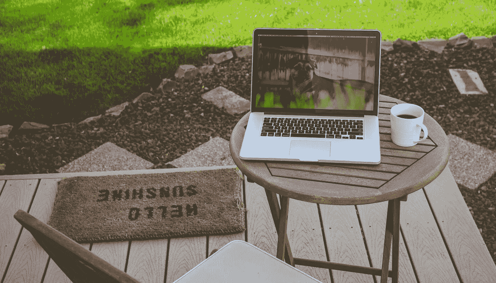

# 如何让生产力成为你唯一的选择(并作为副作用改善你的心理健康)

> 原文：<https://medium.com/swlh/how-to-make-productivity-your-only-option-and-improve-your-mental-health-as-a-side-effect-dd904c9ae870>

Photo by [Dallas Reedy](https://unsplash.com/photos/seCcLCPJQ8o?utm_source=unsplash&utm_medium=referral&utm_content=creditCopyText) on [Unsplash](https://unsplash.com/search/photos/computer-outside?utm_source=unsplash&utm_medium=referral&utm_content=creditCopyText)

互联网上有很多提高生产力的窍门，Medium 也不例外。

然而，要让这些技巧发挥作用，你需要有一定的意志力。你需要改变你的生活，改变习惯，学习新的东西等等。

“黑客”太多了，也没有摆脱主要问题；纪律。

然而，有一种方法可以让每一个生产力黑客变得无关紧要(至少是次要的):**你需要让生产力成为你唯一的选择。**

> “生产力从来都不是偶然的。它始终是追求卓越、明智规划和专注努力的结果。”保罗·j·迈耶

本周早些时候，在糟糕的一天工作后，我感觉糟透了。我昏昏欲睡，感到不安和沮丧。

然而，这些不愉快的感觉促使我去改变。我需要减少废话——限制我的社交媒体和其他浪费时间的事情。我需要去冷火鸡。

所以我找到了这款名为“[屏蔽应用——更高效&专注](https://play.google.com/store/apps/details?id=com.wverlaek.block)”的应用，它可以让我屏蔽手机上的干扰。我可以轻松设置屏蔽哪些应用，以及屏蔽多长时间。再见了 Instagram，Snap 和脸书。

它在 Google play 商店上，但我确定 App store 上有类似的应用程序。

我的电脑上也安装了一个名为“[冷火鸡拦截器](https://getcoldturkey.com)”的程序，它的工作方式类似。

有了这些机制，我别无选择，只能有效地利用我的时间。我完全可以高效工作。要么那样，要么根本没有技术(这也是一件好事)。

自从我下载了这些应用程序，我变得非常有效率。我一天能做的工作比以前三天能做的还要多。更重要的是，总的来说我更有活力和动力。不用一直被社交媒体狂轰滥炸，我能感觉到自己的心理健康有所改善。

我鼓励你尝试一下，结束对生产力黑客的追逐。化繁为简；让它成为你唯一的选择。

# 想要成长？

注册我的[时事通讯](http://eepurl.com/dAtfdv)并获得一套免费的成长型工具！

## 这篇文章发表在 [The Startup](https://medium.com/swlh) 上，这是 Medium 最大的创业刊物，拥有+ 379，938 名读者。

## 在这里订阅接收[我们的头条新闻](http://growthsupply.com/the-startup-newsletter/)。

