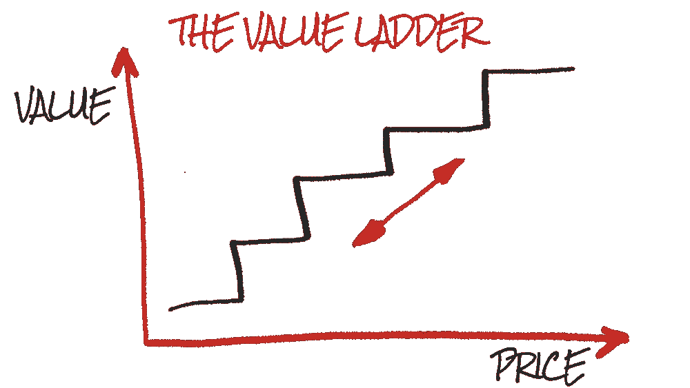

# 如何作为自由职业者获得经常性收入

> 原文：<https://medium.com/swlh/how-to-make-recurring-revenue-as-a-freelancer-7c6112229789>

作为一名自由职业者，你面临的最大问题之一是保持你的收入来源的一致性。你总是在寻找下一份工作来支付账单，而这段时间你什么都没有安排，这是非常令人紧张的。提供订阅服务解决了这个问题，也打开了更有利可图的商业机会的大门。

在这篇文章中，我们将探讨是什么让订阅变得伟大，以及自由职业者如何能够利用这种商业模式。

# 为什么订阅？

> 订阅计划是将一次性购买者转化为忠诚客户并使客户终身价值增加 200–400%
> —[订购服务](https://nrf.com/resources/retail-library/unleashing-the-power-of-subscription-commerce-industry-overview-insights)

订阅业务模式有许多吸引人的地方。专注于订阅服务的自由职业者体验到更可预测的收入流，更多的客户，并因此赚更多的钱。

## 增加客户终身价值📈

Repeat customers are worth a lot more to your business over time

根据 [Adobe 数字指数](https://success.adobe.com/assets/en/downloads/whitepaper/13926.digital_index_loyal_shoppers_report.pdf)， **40%的收入**来自回头客或回头客，他们只占所有访客的**。对一个公司来说，回头客比一次性顾客更有价值，获得回头客的最好方法之一就是向他们出售订阅。**

能够在很长一段时间内拥有客户，会让你有更多的机会在你的其他服务上销售他们，并随着他们与你一起成长而追加销售他们。

## 可预测的收入🔮

作为自由职业者，收入的不可预测性是最难的部分之一。

当你开始以订阅的形式销售服务时，你的收入会变得更加稳定，因为你每个月都会得到一定的收入。这可以让您安心，并洞察您的工作负载在任何给定时间的情况，让您在提供服务和寻找新客户之间有效地管理时间。

## 更多顾客👨‍👩‍👧‍👧

客户喜欢订阅模式；他们在与企业的互动中获得了更多的控制权，并自动获得账单，而作为企业主的你也从稳定的收入中受益。

> “2017 年 4 月，订阅公司网站的访问量约为 3700 万。自 2014 年以来，这一数字增长了 800%以上。”— [福布斯](https://www.forbes.com/sites/richardkestenbaum/2017/08/10/subscription-businesses-are-exploding-with-growth/#4aab5f486678)

与提供报价的传统自由职业者商业模式相比，能够利用新的营销工具，如免费试用和分级定价，可以降低进入门槛。

# 如何销售订阅服务

## 将你的服务产品化📦

订阅服务的一个关键点是“可交付物”；顾客每个月会得到什么。例如，作为服务的一部分，一个自由博客作者可能每月为 3 个博客收取 100 美元，或者一个成长黑客可能会提供一定数量的视频和社交媒体帖子。

Selling services as easy to consume “boxes” is important when selling subscriptions

增加经常性收入的第一步是将你的服务产品设计成可以分成不同定价级别的产品。如果客户有不同的“套餐”可供选择，这对他们来说是很有用的，这样他们就不会为他们不想要的功能支付额外的费用。请具体说明您的产品，以确保客户确切了解将向他们提供什么。

## 免费试用🎁

免费试用是向潜在客户展示你所能提供的价值的好方法。最好的 SaaS 企业有望看到超过 60%的试用用户从****转变为付费用户**。**

**那些无力向所有人提供免费试用的企业应该考虑向现有客户提供更高层次服务的免费试用。向他们展示，如果他们付给你更多的钱，他们能得到什么，你已经建立的信任通常会很容易达成。**

## **提供不同的定价等级📶**

****

**Customers enter the ladder through cheap services and spend more as they trust you to provide value**

**能够获得任何人都能承受的价格是销售订阅的最佳理由之一。以不同的价格销售不同的服务可以让你建立一个“价值阶梯”。价值阶梯是一种经典的营销策略，客户通过免费或非常便宜的服务被吸引到你的企业，随着他们从中获得价值，他们更愿意在承诺更高价值的服务上花更多的钱。提供各种定价服务可以让您赢得信任，并在以后追加销售更高价值的服务。**

# **你需要从什么开始？**

**销售订阅的唯一主要障碍是你使用的平台。确保您可以支持免费试用和自动计费等功能，以充分利用订阅模式。**

# **[ServiceBot](http://bit.ly/2E9BmpE) 为您提供销售订阅所需的所有工具，[免费试用](http://bit.ly/2E9BmpE)**

********

## **这篇文章发表在 [The Startup](https://medium.com/swlh) 上，这是 Medium 最大的创业刊物，拥有 297，332+人关注。**

## **在这里订阅接收[我们的头条新闻](http://growthsupply.com/the-startup-newsletter/)。**

****