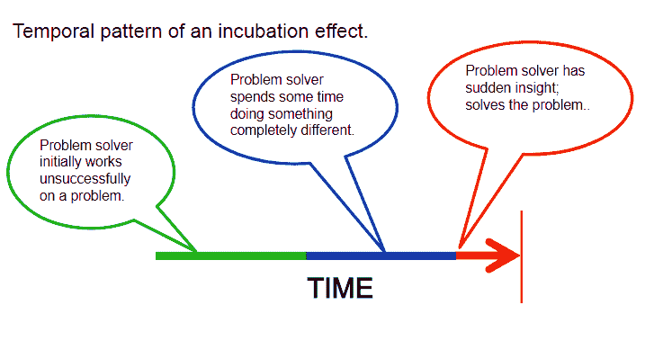
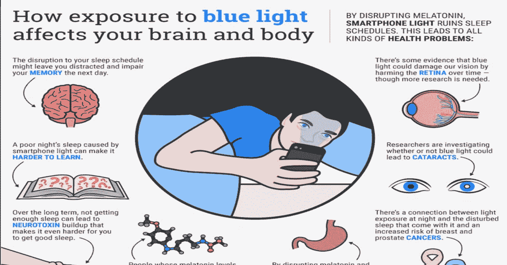

# 如何让睡眠成为你的秘密武器(有科学依据)

> 原文：<https://medium.com/swlh/how-to-make-sleep-your-secret-weapon-backed-by-science-abc6237fe868>

## 我们大多数人都不知道如何正确评价我们的睡眠。睡眠是提升你能量水平的秘密武器。

Image Credits: [Pixabay](https://pixabay.com/en/woman-girl-bella-read-sleep-2197947/)

就在几天前，我和我的一个同事聊天。我们在讨论工作和生产率。他说睡眠是生产力的敌人，如果我们睡得少，我们就能有更多的时间工作。

他发誓说他只需要一点点睡眠就能感觉很好。你认识像他这样的人会吃醋吗？

暂时不要嫉妒。让我告诉你真相。根据[国家睡眠基金会的研究](https://www.self.com/story/the-truth-about-people-who-say-they-only-need-a-few-hours-of-sleep)，90%的人没有得到推荐的 7 到 9 个小时的睡眠。

事实是，如果没有适当的睡眠，我们就不可能有出色的表现。在这个所谓忙碌的世界里，我们大多数人都不重视睡眠。你认为睡觉是一件可以偷工减料的事情吗？

让我告诉你一件事:睡眠不足会降低你的健康和生产力。如果你以正确的方式使用睡眠，它可以成为一个强大的工具来提高你的能量水平，让你对工作充满热情。

我仍然记得那些我睡眠不足的日子，我发现我的工作效率大幅下降。就在四年前(当时我 21 岁)，我没有一个睡眠模式，晚上很晚都保持清醒。我几乎没睡 5 个小时。结果呢？我的心思没有完全集中在工作上，所以我没能发挥出最好的水平。我曾经以为我会在周末恢复失去的睡眠。

但很快我意识到我无法恢复失去的睡眠。这不是我的信用卡到期，我可以稍后支付。我们的身体和大脑只有在我们有睡眠时间表的时候才会配合我们。

在她的书《睡眠革命[中，Ariana Huffington 说道:](https://www.goodreads.com/book/show/25893700-the-sleep-revolution)

> “通过帮助我们保持对世界的正确认识，睡眠让我们有机会重新关注我们是谁的本质。在这个联系的地方，世界的恐惧和担忧更容易消失。”

你知道睡眠是解决特定问题的非常有效的工具吗？你只需要给你的大脑适当的休息。就在两个月前，我在做一个营销活动，我们需要一个吸引人的宣传口号。我开始思考，却想不出答案。我感到被卡住了，很沮丧。感觉好像有什么东西挡住了我的思维。我无法思考(也许我给自己的思想施加了巨大的压力)。

晚上不再多想，而是退一步，让自己好好睡一觉。当我早上醒来的时候，我脑子里有一句口号。神奇！

你经历过这种情况吗？你正在解决一个问题，但无法得到答案。当你睡觉的时候，答案或想法会在半夜或早上出现在你的脑海里。

这背后是有科学依据的。这叫做**“孵化效应”**

# [孵化效果](https://www.spring.org.uk/2012/07/the-incubation-effect-how-to-break-through-a-mental-block.php)

这一心理学概念由英国心理学家格雷厄姆·沃拉斯于 1926 年提出。这个概念表明，当我们的大脑有时间休息时，它在克服障碍方面更有效。

一组心理学家说，这是因为大脑不太分心时休息的影响。当你睡觉或从一个特定的问题中休息时，你的意识在休息，但你的潜意识在继续工作。当你精神饱满地回来时，你会做得更好。睡眠可以成为解决你问题的有效工具。

Image Credits: [SlidePlayer](http://slideplayer.com/slide/10947381/)

停止思考问题，休息一下。你会惊讶于你的思维能力。我们应该有一个好的睡眠来变得更有效率、更专注和更健康。

这里有 5 个简单的睡眠技巧来教你如何做到这一点(我已经测试了这些技巧)。

# 1.将睡眠作为日常计划的一部分

你们中有多少人制定了每日计划或时间表？你曾经在你的日常计划中包括睡眠吗？

不多，对吧？

我们知道我们的大脑需要适当的睡眠来有效地运作。但是我们总是低估睡眠的力量。经过艰苦的体力劳动后，你的身体需要休息来恢复精力。你的大脑也需要适当的休息来充电。

我们认为睡眠是我们在晚上进行的一项独立活动。改变你的行为。也许你从来没有注意到，但是睡眠受到你在睡觉前一天所做的一切的影响。

记住，这不仅仅是你晚上睡觉的确切时间。它是关于你一天中所做的每一项活动。不良的饮食习惯，在错误的时间打盹。在错误的时间吃饭，以及其他坏习惯会影响你的日常睡眠。

养成一些好习惯，建立良好的睡眠周期。正如我已经说过的，如果你睡眠不好，你就不能在工作中做到最好。

[在一项研究中，Medisys 发现](http://www.dailymail.co.uk/health/article-4768074/Less-six-hours-sleep-night-like-BINGE-drinking.html)每晚睡眠时间经常少于 6 小时的人表现得像喝了几杯酒一样。

# 2.养成睡前习惯并坚持下去

你正在努力入睡吗？你在深夜保持清醒，你在早上 6 或 7 点醒来，因为你必须去工作，但你筋疲力尽。听起来很熟悉？你能做什么？

养成睡前习惯将有助于你形成一个高效的睡眠周期。同时上床睡觉。不管你在做什么，睡眠应该是你的首要任务。睡觉前读一本书来平静你的头脑。做冥想。洗澡(我比较喜欢睡前洗脸洗腿)。

试着坚持这个仪式，因为我们的大脑喜欢一致性。为什么设置仪式如此重要？它帮助你的大脑意识到是时候放松放松了，你会在几分钟内入睡。

[Brigham and Women's Hospital 团队追踪哈佛大学学生的睡眠模式](http://www.dailymail.co.uk/health/article-4597868/Why-bed-time-night.html)，发现每晚同一时间就寝的学生更成功、更健康。

对自己许下承诺；从今晚开始，你要养成睡觉的习惯。

# 3.关闭电子设备(无蓝光)

在电子产品成为我们生活一部分的今天，这可能是最好的睡眠技巧。睡前 30 分钟不要使用手机、平板电脑、电视或笔记本电脑。睡觉前千万不要查看社交媒体和电子邮件。

简而言之，卧室里不要有电子产品。远离蓝光，因为蓝光会影响你的睡眠，让你保持清醒。

把你的手机放在够不着的地方。因为如果你把它放在身边，它会敦促你查看脸书、WhatsApp 或电子邮件。

[研究](https://sleepfoundation.org/ask-the-expert/electronics-the-bedroom)发现卧室里电子设备的蓝光会进一步扰乱你睡眠-觉醒周期的自然模式。所以在睡觉前半小时关掉这些设备，让你的大脑得到适当的放松。我们需要控制电子设备，而不是让它们控制我们。

[Image Credits](http://thepowerofhealthyfood.com/how-smartphone-light-affects-your-brain-body-infographic/)

# 4.试试一杯热牛奶

当我还是个孩子的时候，我妈妈坚持让我在睡觉前喝一杯热牛奶(我不太喜欢喝牛奶)，这真的帮助我在几秒钟内入睡。Zzz 的。它可能觉得这是一条老掉牙的建议。但事实是，牛奶含有色氨酸(一种氨基酸)，有助于诱导睡眠。

对于想快速入睡的人来说，喝热牛奶是一种有益的睡眠方式。它让你的身体放松，让你像婴儿一样入睡。T4 的一项研究发现婴儿在喂食后会更快入睡。

你妈妈说的睡前喝牛奶是对的。所以，如果你想睡个好觉，试试一杯热牛奶，而不是咖啡因。

# 5.不要依赖你的闹钟

你是一个早上依赖闹钟起床的人吗？你可能认为这台机器帮助你准时起床。但事实恰恰相反！你必须控制你的身体和思想何时醒来，而不是一台机器。

西奈山综合睡眠中心的研究负责人大卫·拉波波特博士说，

> “闹钟是一种外部信号，当你的身体不想让你起床的时候，它会发出‘起床’的信号。”

多年来，我都没有用闹钟来叫醒我。我用生物，自然，时钟。这是我们被设计的方式。在晚上睡觉前，我命令我的潜意识大脑设定一个叫醒我的具体时间。

当你的生物钟管理你的睡眠时会发生什么？你感觉很好。更新鲜。而且神奇。

你只需要通过养成规律的睡眠习惯来训练你的大脑按时醒来。因为你的身体希望你同时睡觉和醒来。

睡眠可以成为你提升能量水平和生产力的秘密武器。我希望这些知识能帮助你做出一些积极的改变。

# 行动起来！

**谢谢**听了这个故事。如果你喜欢这个故事，点击👏按钮，并与他人分享！

## 你想从成功作家那里得到可操作的写作建议吗？[获取您的免费副本](https://mailchi.mp/d0442b655c31/get-your-ebook)。

*本文原载于*

**

## *这篇文章发表在 [The Startup](https://medium.com/swlh) 上，这是 Medium 最大的创业刊物，拥有 314，785+的读者。*

## *在此订阅接收[我们的头条新闻](http://growthsupply.com/the-startup-newsletter/)。*

**