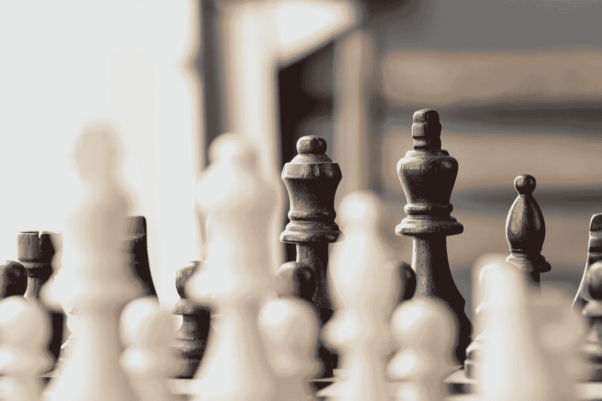

# 如何让成功成为你的默认选项

> 原文：<https://medium.com/swlh/how-to-make-success-your-default-option-9a6c4fd2da2>

Photo by [rawpixel.com](https://unsplash.com/photos/86qvlyDfMvo?utm_source=unsplash&utm_medium=referral&utm_content=creditCopyText) on [Unsplash](https://unsplash.com/search/photos/success?utm_source=unsplash&utm_medium=referral&utm_content=creditCopyText)

在生活中，我们经常面临选择—

> 冰淇淋或沙拉
> 
> 平庸的身体与健康的身体
> 
> 上午 5 点和下午 12 点

问题是，我们人类很难处理选择。

这一切都可以追溯到我们大脑决策机制的进化。人类在一个没有时间做决定的环境中进化。如果我们在那时浪费时间做决定，我们就会成为剑齿虎的食物。因此，决策被视为一种开销，从未知的时间。

虽然，那可能是当时*理想的*方法，但我们不再需要担心剑齿虎了。我们已经走了很长一段路，但是我们大脑的决策仍然是史前的。

大脑以迷人的方式避免决策。最常见的*就是选择默认选项。我们都是这种违约期权综合症的受害者。不相信我？—*

*   如果我们的冰箱里有巧克力和冰淇淋，并且我们有所有的材料来做一顿健康的饭，我们的大脑会选择默认的(不工作)选择狼吞虎咽地吃巧克力。
*   如果我们打开浏览器，YouTube 是我们的主页，我们的大脑会选择观看狗视频的默认选项，而不是完成重要的工作。
*   如果我们和朋友出去吃午饭，我们所有的朋友都点了不健康的食物，我们的大脑会选择点*不健康*食物的默认选项。

简单来说，大脑大部分时间并不决定，它只是默认眼前的选项。问题是摆在我们面前的东西要么是不健康的，令人不快的，要么是无益的。

这个问题看起来很困难，但解决方案却简单得难以想象。

> 如果我们把成功作为默认选项呢？

现在我们知道了我们的大脑是如何工作的，让我们为成功重新布线—

# 找出故障点

Photo by [Elijah Hiett](https://unsplash.com/photos/gO0byDPgxzI?utm_source=unsplash&utm_medium=referral&utm_content=creditCopyText) on [Unsplash](https://unsplash.com/search/photos/reflect?utm_source=unsplash&utm_medium=referral&utm_content=creditCopyText)

我们所做的每一项活动都由一个单一的生命活动所控制。行动的成败将决定结果。我们需要做的第一件事是记下这个故障点。

例如，我早上一醒来，最难的部分就是换上我的运动服。如果我说服自己改变，我会去健身房做适当的锻炼，如果我没有，我会带着错过锻炼的罪恶感回去睡觉。因此，我失败的地方在于*换上我的运动服*。

# 更改默认值

Photo by [Victor Freitas](https://unsplash.com/photos/WvDYdXDzkhs?utm_source=unsplash&utm_medium=referral&utm_content=creditCopyText) on [Unsplash](https://unsplash.com/search/photos/workout?utm_source=unsplash&utm_medium=referral&utm_content=creditCopyText)

我们已经知道，不是我们的大脑决定，而是默认。因此，我们最好的办法是设置我们的默认值，使其与我们的目标保持一致。

我不穿睡衣睡觉，而是穿运动服睡觉。当我起床时，我不必决定穿运动服，这是我的默认。新的默认设置确保我去健身房。

# 奖励自己

Photo by [Delaney Dawson](https://unsplash.com/photos/BXs8SjVelKs?utm_source=unsplash&utm_medium=referral&utm_content=creditCopyText) on [Unsplash](https://unsplash.com/search/photos/prize?utm_source=unsplash&utm_medium=referral&utm_content=creditCopyText)

我们的大脑运行在反馈回路上。如果一个行为带给我们快乐，我们会做得更多。如果没有，我们就停止做。我们大多数人坚持当前违约的主要原因是因为它会立即带来回报。

> 坐在沙发上切换频道会给我们带来短暂的兴奋。
> 
> 多睡半个小时会让我们睡得更香。
> 
> 吃甜点奖励我们多巴胺(快乐荷尔蒙。)

我们想要设置的新缺省值本身没有价值。)

> 健身不会立刻让你成为健身模特。
> 
> 写一篇中等水平的文章不会让你成为顶级作家。
> 
> 吃一顿健康的饭不会让你健康。

为了填补这个空白，我们可以为新的默认设置创建一个奖励系统。每次我们执行新的(也是首选的)默认设置时，我们都会奖励自己一些我们认为有价值的东西。

例如，每次我穿着运动服睡觉并最终去了健身房，我都会奖励自己一定数量的资金。一旦这些资金达到一定的价值，我就可以用它们来买任何我想买的东西。

# 概括起来

这是一些可操作的总结—

*   我们的大脑认为决策是一种开销。他们选择默认值。
*   我们可以通过更改默认值来利用这种行为。把你冰箱里所有的糖果换成蔬菜。不要穿着睡衣睡觉，而是穿着运动服睡觉。不要问自己是否有足够的睡眠，而是跳下床去跳舞。
*   帮助我们获得最大收益的过程是——找出失败点。更改您的默认值。奖励自己。
*   确保成功的唯一方法是把成功作为你的默认选项。

**感谢阅读！如果你喜欢这篇文章，请尽情鼓掌，并关注我的** [**中**](/@BITSianIam) **。请留下回复，告诉我如何改进。**

**联系我—**

[Quora](https://www.quora.com/profile/Abhishek-Rathan-Athreya) | [脸书](https://www.facebook.com/abhishek.athreya) | [LinkedIn](https://www.linkedin.com/in/abhishek-r-athreya-69a64688/)

## 这个故事发表在 [The Startup](https://medium.com/swlh) 上，这是 Medium 最大的创业刊物，拥有 308，471+人关注。

## 在这里订阅接收[我们的头条新闻](http://growthsupply.com/the-startup-newsletter/)。

