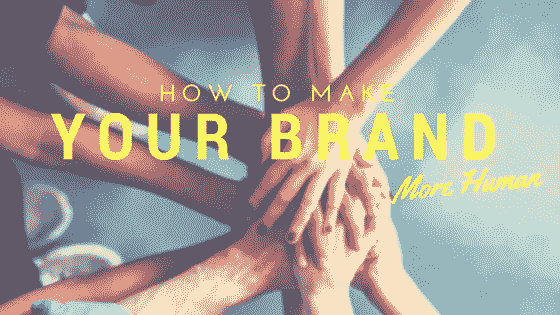
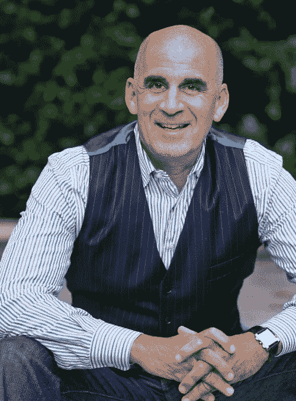

# 如何让你的品牌更人性化，更真实，更平易近人

> 原文：<https://medium.com/swlh/how-to-make-your-brand-more-human-more-real-more-approachable-615aa7e85768>

Branding

你知道很多企业主都很害怕吗？

是真的！他们害怕看起来不专业。他们害怕面对公众处理顾客的投诉。他们担心他们没有百万美元的营销预算，他们认为这是获得他们渴望的客户群所必需的。

从表面上看，这些担忧似乎完全合理。

然而，这些担心阻碍了企业主创建一个完全成功的公司。

这些恐惧使得创建一个有个性、平易近人的品牌几乎不可能。这种类型的品牌正是潜在客户正在寻找的。

要获得想要的客户，不需要庞大的营销预算。你不需要专业制作的视频。你需要的是一个人性化的、真实的、完全平易近人的品牌。

创建这种类型的商业品牌并不难。听听泰德·鲁宾(Ted Rubin)的话吧，他是推特(Twitter)上最受关注的首席营销官之一(T2)。

泰德是周围最有活力、最热情的人之一——我们一有机会聊天就聊得很开心。

今天，Ted 与我们分享了一些关于如何与潜在客户建立个人联系的技巧，特别是通过利用实时影响者。

# 如何提升自己的品牌，让顾客真正开心

许多专注于自己品牌的公司倾向于以一种昂贵且不那么强大的方式来专注于它。

如果你想让你的钱发挥更大的作用，那就专注于你最大的影响者之一:你的客户。

你怎么能这样做？有五种方法可以让[创建一个品牌](https://www.designcontest.com/logo-design/)，让客户真正开心，并准备好传播你的业务有多棒的消息。

# 1.给你的员工更多的回旋余地

除了你的客户，你的员工是你最大的影响力来源之一。因此，让他们参与进来至关重要。

如果你把你的品牌和营销努力都留给你自己，你会在两个重要的方面失败。

首先，你让你的工作太难了。虽然你是你的品牌及其对世界的影响不可或缺的一部分，但这并不意味着你必须做所有的事情。学会授权。

其次，你错过了利用各种视角的机会。每个员工都有自己的观点，如果你能利用的话。

一家这样做的公司是 Arby's。Arby's 并没有把所有事情都交给上级，而是对从所有员工那里获得观点感兴趣。正是这种态度帮助他们实现了 Arby 历史上最伟大的营销时刻之一。

一些艾比的员工在观看格莱美时，看到法瑞尔·威廉姆斯戴着一顶与艾比帽子商标非常相似的帽子。他们决定利用这一点(找点乐子)，创造一个“嗨，法瑞尔，把我们的帽子还给我们！”竞选。

# 2.确保你有适当的指导方针

然而，这并不是说你不应该有任何界限。正如 Ted 所说，如果你没有任何界限，那你就落伍了。

为员工设定界限和指导方针需要培训。但是训练不一定要广泛。

相反，创建一些每个人都可以遵循的简单指南。

例如，当涉及到客户服务时，每个员工都应该被训练说:

*   我怎么帮你？
*   让我找个人来帮你。

就是这样。这个简单的步骤会让你的客户觉得他们在被倾听，他们的问题和顾虑是合理的。

拥有更多经验或工作技能来帮助解决客户问题的人可以提供更多帮助。但至少，简单地问一下你能帮上什么忙，然后把顾客介绍给能帮助他们的人。

# 3.充分利用社交媒体

Ted 最讨厌的事情之一就是社交媒体上的公司只是为了销售。诚然，这是一个众所周知的营销策略。但这不是出现在[社交媒体](http://www.magnificent.com/magnificent-stuff/the-power-of-sales-and-social-media)上的唯一原因。

Twitter、和 Instagram 是获得客户反馈的绝佳平台。

Ted 建议在社交媒体上完全可见——无论是顺境还是逆境。例如，如果客户对你的产品或服务有意见，尽一切办法解决它。许多公司逃避这一点，而是选择关起门来解决问题。

不要这样。公开解决问题。这样做是回答其他客户可能提出的问题的一种方式。此外，这也向有问题的客户表明，你愿意倾听他们的意见，并尽一切可能帮助他们。

# 快乐、满意的客户可能是你最大的影响者

当大多数企业家想到影响者时，他们倾向于认为自己对客户有影响。

虽然这是一种影响，但这不是 Ted 认为对你的业务至关重要的影响。相反，影响者是那些影响他人如何看待你的品牌的人。

你和你的员工绝对是两大影响者，但是不要低估你的客户在影响其他人方面的作用。

当你拥有快乐、满意的顾客时，他们会帮助你宣传你的公司、你的产品和你的服务。

你如何获得快乐、满意的顾客？你这样做是因为你把他们当成了人，就像如果你是一个顾客，你希望被对待一样。你倾听，回答他们的问题，解决他们的顾虑。

通过这样做，你会创造一个让顾客感到被重视的环境。有这种经历的顾客会更愿意分享他们喜欢你的地方。而且他们不会只对身边的朋友和家人这样做。他们会在社交媒体上传播这个消息。

如果你想要这种重要的实时影响者在你身边，尽你所能改善客户体验。

***您想了解更多关于如何吸引观众并与之互动的信息吗？查看*** [***Ted 的网站***](http://tedrubin.com/) ***或社交媒体页面。还有别忘了和搭档约翰·安德鲁斯*** ***一起去他的*** [***新网站。***](http://prevailingpath.com/)

# 关于泰德·鲁宾

是领先的社交营销策略师、主题演讲人、品牌传播者、[品牌创新者](http://brand-innovators.com/)的代理 CMO、[盛行之路](http://www.prevailingpath.com/)的联合创始人。2009 年 3 月，他开始使用并推广 ROR 这个术语，[关系回报](http://www.returnonrelationship.com/about-return-on-relationship/)，标签#RonR。Ted 于 2013 年 8 月 31 日辞去了他作为 Collective Bias 首席社交营销官的职位。在 2016 年 11 月被 Inmar 收购之前，他一直是主要股东。

Magnificent Marketing — Austin, TX

## 这个故事发表在 [The Startup](https://medium.com/swlh) 上，这是 Medium 最大的企业家出版物，拥有 355，974+人。

## 在这里订阅接收[我们的头条新闻](http://growthsupply.com/the-startup-newsletter/)。

