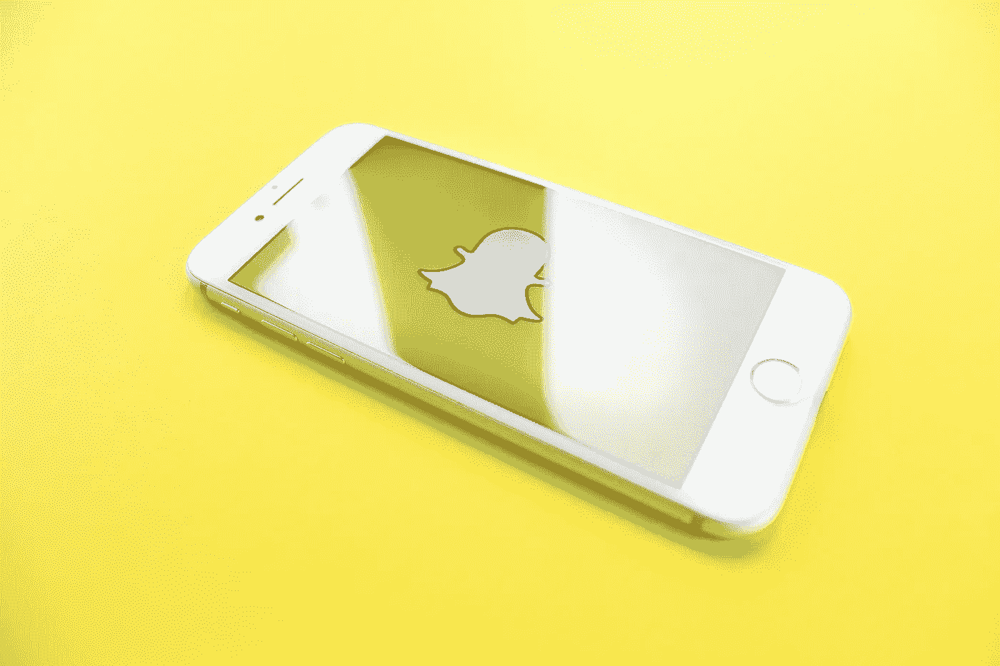

# 如何让你的品牌在 Snapchat 上有价值

> 原文：<https://medium.com/swlh/how-to-make-your-brand-snapchat-worthy-11c410706b68>

关于 Snapchat 消亡的报道被大大夸大了。无论你是否在关注股价、卡戴珊戏剧或高管精神错乱的传言，Snapchat 仍然拥有超过 1 . 88 亿的日活跃用户，他们消费了超过 T2 100 亿的视频。如果你对即将到期的垂直故事的原创者的营销热情已经减退，也许是时候忽略噪音，卷起袖子了。

根据最近的媒体科学调查，这些视频比脸书、Instagram、YouTube 和电视上的视频获得了更多的关注，并产生了更强烈的情感反应。但即便如此，这也只是 Snapchat 广告业务的一部分。

借助高级受众定位和 geofilters 等元素，您的品牌显然可以从强大的 Snapchat 战略中受益。是的，甚至在 Z 世代之外:根据 Statista，[25 岁至 34 岁的网民中有 60%和 35 岁至 44 岁的网民中有 45%仍然是 Snapchat 用户，这些数字不容小觑。尽管资源匮乏的品牌确实面临平台疲劳，但仍有大量抢购工作要做。](https://www.statista.com/statistics/814300/snapchat-users-in-the-united-states-by-age/)

**每次触摸都算数**

如果你已经在 Snapchat 上了，你就知道成功的广告是什么样子了。例如，如果你是一个足球迷，你可能是在超级碗 50 期间使用佳得乐过滤器的 1 . 6 亿人中的一员。

甚至网球明星塞雷娜·威廉姆斯也加入了#佳得乐灌篮的潮流，其影响范围不仅仅局限于足球迷。Snapchat 广告成功的秘诀就在于此:让你的产品成为故事的一部分，而不仅仅是故事的对象，这让你能够以新的、令人喜爱的方式接触到更广泛的受众。

然而，弄清楚怎么做可能很有挑战性。有了这五条建议，你就可以找出最适合你的品牌和受众的方法，以及如何持续提供高质量的内容，让一切都物有所值:

# **1。不要让你的故事过时**

两年前，你可以简单地通过发布你的故事来扩大你的 Snapchat 受众。根据我的经验，大约 80%看过你的人都会去看。现在，这个数字似乎接近 25%到 33 %,而且还在下降。

(我们以前在哪里见过这个？哦，对了。每一个已经发布的平台。)

答案是直接传递信息。移动通知是营销的财富，Snapchat 允许你一次给多达 200 个收件人发送 DM。虽然 DM 可能比一些大品牌习惯的(或习惯的)更具侵略性，但如果你没有什么相关的东西可以直接对你的观众说，也许你应该问问你为什么要上这个平台。

# **2。创建超级粉丝**

所以现在你要把时间和精力花在高质量的内容上，并直接交付给你的观众。你与之建立了有意义的联系的几十个忠实粉丝，比 1000 个随机关注者更有价值，这些人从来不会第一次看到你的故事。

无论你是走草根路线还是做大广告预算，你的目标都是向你的顾客展示更多的你，让他们喜欢你，让他们成为你品牌的拥护者。定期发布——每周同一天同一个时间来训练你的读者——并留意那些积极参与的追随者。只是偶尔更新一下你的故事不会有什么效果。

# **3。将 Snapchat 与您的其他社交媒体绑定。**

你的大多数忠实粉丝可能已经在脸书、Instagram 或 Twitter 上加了你。许多营销人员会告诉你交叉授粉的力量，所以确保你给出了跨平台连接的理由。不要羞于在其他知名地方分享你的 Snapchat 用户名，包括离线宣传片和文献。

Snap 非常适合将人们转移到其他地方。所以，如果你想去脸书直播，或者和公司创始人一起主持一场激动人心的 AMA，那就赶快行动起来，让观众去看看吧。不像某些其他平台(与 ninstagram 押韵)，没有追随者要求附加链接。

# **4。忠实于为什么用户喜欢你的其他平台**

如果人们来你的 Snapchat 是因为他们在另一个平台上喜欢的东西，那么你拍的任何东西都必须与该内容一致。如果你在 Instagram 上发起了一个幕后活动，那么在 Snapchat 上继续，通过现场采访和视频深入你的过程。

这都归结于策略。你不应该在没有战略的情况下推出任何平台，无论是赢得你当前客户的喜爱，创造你的品牌知名度，还是创造强大的客户服务体验。无论你分享什么，无论你如何把它联系在一起，都要和这个策略保持一致。

# **5。如果你有预算，买广告**

好消息:即使你没有广告预算，前面的四个建议也会起作用。如果你做到了，那太棒了！考虑将部分资金投入付费 Snapchat 广告。Snapchat 表示，平均而言，[参与度](https://blog.hootsuite.com/snapchat-for-business-guide/)是“可比社交媒体平台平均点击率的五倍”。

虽然这正是我所期待的公司所说的，但我们的体验是非常积极的。不仅如此，你的竞争对手也有同类的“另一个广告平台？!"我们其他人都有的惰性。Snapchat 努力使其广告更便于 DIY。

当垂直视频真实且没有过度制作时，它们会非常成功。每当有人在特定位置时，地理过滤器就会发挥作用。地理过滤器是一种有趣、自发和不引人注目的方式来产生参与，你可以在任何地方投资 5 美元到数十万美元，这取决于你的预算和策略。

一句话:Snap 没有死。黄鬼依然是直邮之王。你吸引观众和提高品牌知名度的机会只受到你想象力的限制。开心抓拍。

迈克·门罗是一名基督徒、丈夫、父亲、营销人员，也是一名想成为运动员的人。迈克于 2000 年开始在 Vector Marketing 工作，当时他是波士顿学院的一名学生。他想从人群中脱颖而出，在职业上发展自己。近 20 年后，这个目标没有改变。了解更多关于 TheVectorImpact.com**。**

**

## *这篇文章发表在 [The Startup](https://medium.com/swlh) 上，这是 Medium 最大的创业刊物，拥有+ 380，756 名读者。*

## *在这里订阅接收[我们的头条新闻](http://growthsupply.com/the-startup-newsletter/)。*

**