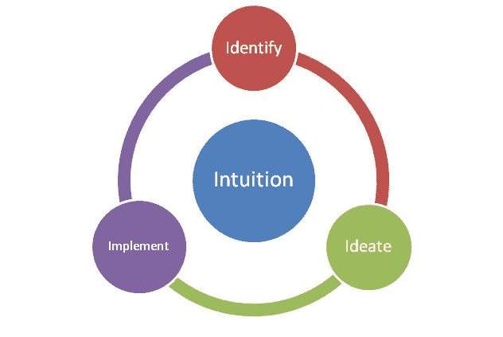

# 如何让你的直觉发挥作用

> 原文：<https://medium.com/swlh/how-to-make-your-intuition-work-112b5866f5f2>

实用的框架

> 唯一真正有价值的是直觉。
> 
> ——阿尔伯特·爱因斯坦

直觉。那种诱人的、诱人的、神秘的力量，似乎像一个忠诚的影子，跟随着我们时代所有的伟大成功。商业和其他领域充满了传奇，尽管普遍存在相反的意见，但被质疑的人从骨子里知道这是正确的行动方针，并最终被证明是正确的，获得了丰厚的回报。

从史蒂夫·乔布斯到阿尔伯特·爱因斯坦，直觉的粉丝俱乐部令人印象深刻，声名显赫。以至于直觉几乎是一种流行文化力量，在我们的生活中无处不在——从直觉型经理到直觉型设计，最终都归结于直觉。

> 直觉是一种非常强大的东西，在我看来比智力更强大。这对我的工作有很大的影响。
> 
> —史蒂夫·乔布斯

然而，对于这种强大的力量来说，直觉是一种所有人都可以自由获取的资源。我们所有人都拥有直觉，尽管直觉的效力因我们驾驭直觉的能力而异，但我们所拥有的直觉储备很少区分个人。假设我们所有人都有相同的直觉是有把握的。不同的是我们有效利用直觉的能力。“有效”是关键词。

因为直觉是一种可以免费获得的资源，它也是一种被高度误解的资源。直觉很容易与我们的假设和先入为主的观念混淆；带有一种固有的偏向于我们的想法和信仰的确认偏见；或者仅仅是简单、陈旧的模式化思维，我们在复制由于各种社会、系统和个人条件作用而在我们心中根深蒂固的思维模式。

仔细想想，除了那些罕见的情况，那种本能的感觉实际上强烈到足以在你的骨头里颤动和回响；很难将真正的直觉波与上述任何一种区分开来。

所以，问题是，你还想相信你的直觉吗？

答案是简单明了的。当然了。因为仅仅因为有几个陷阱就放弃像人类直觉这样强大的东西不仅是愚蠢的，而且在失去潜力方面几乎是灾难性的。

所以我们需要我们的直觉。我们需要避免陷阱。

> 当你为直觉腾出空间时，当你停止理性思维的喋喋不休时，你就找回了直觉。理性的头脑不会滋养你。你假设它给了你真相，因为理性的头脑是这种文化崇拜的金牛犊，但这不是真的。理性挤走了许多丰富、有趣和迷人的东西。
> 
> —安妮·拉莫特， ***一只鸟一只鸟:关于写作和生活的一些指示***

有很多关于直觉的研究，也有很多工具和技术，既有技术驱动的，也有其他的，承诺帮助你驾驭直觉，不让你的偏见干扰。

然而，我们大多数人不会也不会求助于人工智能驱动的模型，或者阅读大量策略期刊文章来利用我们的直觉。反正不是作为一个起点。我们需要的是简单明了、普遍适用的东西。一种简单实用的框架。

**进入 4I 框架**

4I 框架是我们在设计模块时想出来的。它本质上是一种过滤和集中所有可利用直觉的策略，并将它们提炼为一个简单、适用的模型的方法。

作为一个极度依赖直觉的人，很容易陷入陷阱并出错，这是一个令人担忧的想法。由于逻辑、计划和微观管理从来都不是我的强项，失去直觉这种资源的前景对我来说更是雪上加霜。我需要一种方法，一种简单的方法来充分利用我的直觉方法，同时避免缺点。因此，4I 框架是一个对我来说非常个人化和重要的问题的解决方案。

4I 框架，从所有的意图和目的来看，都不是一个现成的、前所未闻的决策/问题解决模型。本来就不应该这样。这只是在任何关键决策过程中检查自己的一种简化方式，以确保我们既不会陷入直觉陷阱，也不会完全忽视我们的直觉，去支持可行但最终死亡的数据和数字。

**那么，它是如何工作的呢？**

当一个想法来自直觉时，你用 4I 框架来运行它……或者更确切地说，是其余的 3i——识别、构思和实施。下面是 3Is 的工作原理:

***首先，你要确定想法背后的问题/议题/触发***

也就是说回答四个 w 和一个 h。

*什么问题？*

*为什么是问题？*

*这是什么问题？*

*问题出在哪里？*

*谁是利益相关者？*

如果你用 25-50 个单词写下你正试图解决的问题/议题/痛点，或者最初引发这个想法的问题/议题/痛点，会有所帮助。在这样做的时候，你被迫从不同的角度思考和重新思考这个问题，经常面对你和你的团队在第一次阅读/评估这个想法时可能错过的观点和陷阱。这是一种我们的大脑不习惯的精细蒸馏，它经常以抛出有趣的结果而告终。

***接下来，你构思出***

列出备选方案。

*头脑风暴。*

从影响和可行性的角度分析每一个备选方案。

说服或被说服。(在团队中工作时至关重要)

客观一点。选择最实用的选项。

***最后，你落实。***

重新检查障碍和资源可用性。如果需要，进行调整。

*列一份任务清单。*

*计划任务*

*分配任务(给你的队友，如果其团队；或者你自己的空闲时间，如果是独奏的话)*

*制定进度评估计划*

作为 4I 框架的一部分，这最后一步实际上是您进入最终执行阶段之前的一步；通常是预演，或者是测试阶段，这取决于你要处理的问题/想法的类型。

但是当然，您也可以直接进入主要的实现阶段。最终，这是一个非常主观的、基于情况的决定，取决于我们应用 4I 框架的想法/问题的类型。

**内翻还是外翻？**

这种模式从里到外都是最好的。这意味着你从一个直觉点开始，一种疯狂的想法，然后使用 3Is 系统地分解它——更清楚地了解这个想法的利弊以及优缺点。3 这也是为任何直觉想法创建执行策略的好方法，给你的幻想之旅一个具体可行的形状。

然而，该模型也将在室外工作。这是你从 3Is 开始，用最后一个 I，直觉作为最终标准的想法。因为最终，如果感觉不正确，任何计划都不可能成功，不管它与 3Is 的结合有多完美。这种主观评估可能看起来很无聊，但如果它与最后也是最重要的“我”——直觉——不一致，那么用新的眼光重新审视这个想法总是值得的。

您可能已经注意到了，这个框架是非常开放和灵活的。这是经过深思熟虑的设计，因为该模型应该尽可能简单和通用。因此，4I framework 可以用作从写博客到设计内容策略、创建产品开发模型、客户服务问题到任何创业/初创企业的所有事情的初步工具。

4I 框架看似简单易行。但就应用而言，它是一种有效的心理工具，可以确保你最大限度地利用直觉，同时消除各种偏见和观念。这也是一个很好的方式来过滤噪音，专注于实际的，深入骨髓的感觉，然后把它作为你计划的跳板。像任何工具一样，它既不是傻瓜也不是你所有问题的现成答案。它仅仅是一个框架，可以而且应该被用作一个思想构建工具，一个可以让你的想法步入正轨并让你开始计划的地图。因为它非常简单，4I 框架是一种精神工具，你可以掌握它并养成习惯，用它来为你的疯狂增加方法，并从高度混乱的想法中获得最大的输出，而不管正在讨论的想法或计划的最终命运。最终，通往真正成功的道路是由学习的意图铺成的，不管一个想法是成功还是失败，我们都应该为这个想法和我们自己确保在这个过程中获得最大的学习。

*   ***4I 框架是我们设计的，也就是我和我的联合创始人阿米特·夏尔马作为我们在*** [***创意过程***](https://www.facebook.com/creativeprocepts/) ***的领导力和快乐培训模块的一部分，这是印度同类领导力和快乐培训计划之一。如果你想更多地了解我们在创新过程中的工作，或者如果你对我们的研讨会/项目感兴趣，请给我们写信，地址是 creativeprocepts@gmail.com。***
*   ***如果你喜欢这个和/或觉得它有帮助，别忘了点击那个绿色的小❤！更多关于最新作品、未来播客和电子书的更新，请在下面订阅！***