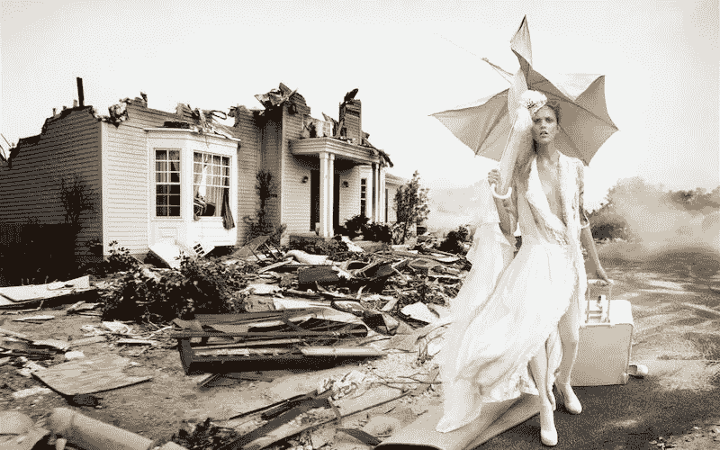

# 如何管理公关危机

> 原文：<https://medium.com/swlh/how-to-manage-a-pr-crisis-4e21647d09ed>

你的识别、管理和解决公关危机的完整指南，加上我们关于如何避免危机的顶级建议！

虽然我们被告知所有的宣传都是好的宣传，但当涉及到公共关系时，情况并非如此。想想 [*这个*](https://www.youtube.com/watch?v=73P9STckPLw) 百事广告，或者 [*这个*](https://www.youtube.com/watch?v=zkIrbVycAeM) 鸽派运动，两者都引发了愤怒、抵制和自己的趋势标签。当然，这些视频在全球获得了数百万次点击，但这种可见性损害了声誉，影响了销售。

在社交媒体的世界里，危机会迅速而猛烈地出现。虽然最大的丑闻通常只留给最大的品牌，但病毒式媒体的性质意味着事情可能会像雪球一样越滚越大，超出我们的想象。虽然不是所有的丑闻都是重大事件，但它们都有可能对企业产生负面影响。重要的是知道如何阻止事态的发展，避免公共关系危机。我们通过创建易于遵循的列表，让这一点变得简单，这些列表介绍了如何在公关危机发生时识别、转向和管理它们！

# 最好的防御是有效的进攻

公关危机可能是噩梦。虽然知道如何扑灭你的公关之火总是有好处的，但最好从一开始就避免引发任何问题。不幸的是，这说起来容易做起来难。公关危机往往会在你最意想不到的时候爆发，可能来自最无害的电子邮件、活动和推文。为了帮助你掌握主动权，我们整理了一份打击小企业最常见的公关危机清单。继续阅读，了解应该注意什么以及应该避免什么情况！

**让投诉得不到回应**

接受投诉对任何人来说都不好玩。我们都经历过当一个人卷进来时那种刺痛的感觉，尤其是如果它是没有根据的！虽然总是有让抱怨得不到回应的诱惑，但这是不可取的。不仅让你的客户开心和满意总是明智的，而且如果他们在社交媒体上分享或升级到监察员，投诉也可能会有自己的生活。

**变负**

当你回复投诉时，消极是不明智的。尽管客户可能很粗鲁、咄咄逼人或者只是很讨厌，但你的语气要积极并带有歉意。承认你犯了一个错误，解释为什么会这样，并采取相应的行动。

**社交媒体出了问题**

你知道五分之一的公关灾难发生在 Twitter 上吗？社交媒体的影响力和病毒式传播使其成为潜在危机的熔炉。发布一条不敏感的推文或一个有争议的 Instagram 会让你的品牌因为所有错误的原因而成为焦点。最好的应对方法是有一个清晰的社交媒体策略和一个具体的人来控制它。这样，你就有了一个一致的社交媒体方法，以及一个在情况开始失控时能够掌控全局的敬业的人。

**计时**

公关不存在于泡沫中。世界大事和趋势运动将始终影响产品、活动和服务被公众接受的方式。时刻关注世界上正在发生的事情，并知道如何相应地定位你的品牌。例如，在自然灾害、政治动荡和重大社会运动之后开展活动或宣传是不可取的！

**把头埋在沙子里**

小型公关危机每天都在发生。订单丢失，品牌被错误地记入贷方。不要忽视它们，希望它们会消失，从而把它们变成重大事件。正面面对每一个问题有助于阻止它，而不这样做可能意味着问题会自己出现。

# 缓解公关危机的六个步骤

因此，你已经经历了最常见的公关灾难，并尽了最大努力避免陷入任何坏习惯或犯任何错误。不幸的是，没有一个品牌或公司不受公关危机的影响，即使是最受关注的品牌也可能经历一个破坏性的局面。通过我们管理公关灾难的六步指南，知道如何解决问题和解决情况！

**1。按下暂停键**

就像任何危机一样，公关灾难需要冷静的头脑和清晰的计划。虽然我们很多人在面对压力时会下意识地做出反应，但这往往弊大于利。如果你感觉到一场危机正在开始，或者一个情况正在失控，按下暂停键，深呼吸。花时间向您的团队简要介绍发生的事情。确保他们知道对他们的期望，以及如何(如有必要)应对媒体的关注。这不仅能让你的房子井然有序，让你的团队高效工作，还能让你专注于灭火。

**2。收集您的情报**

在你开始解决问题之前，最好先坐下来总结一下哪里出了问题。做一些研究，找出到底什么是危机，它是如何发生的。这是一场错误的运动，还是你犯的一个错误？团队成员是否未经编辑就发布了故事，或者机密信息意外公开了？知道问题是什么将有助于找到解决问题的完美策略，并确保您在未来避免类似的情况。

**3。确定受害者**

每场危机都会有受害者。知道你得罪了谁以及如何联系到他们对于平息一切很重要。一些小规模的危机可以用一束鲜花和一项修正案来解决，而其他的危机则需要认真的缓解。弄清楚你的危机是否被媒体报道了，是否有一个流行标签或海啸般的投诉邮件滚滚而来？如果你的危机范围很广，想想什么渠道最适合接触到被冒犯的一方。一个 Instagram 帖子能完成这项工作吗？你需要一份新闻稿或者在你的网站上弹出一条消息吗？

**4。决定你的位置**

现在你知道哪里出了问题，谁受到了影响，是时候决定如何处理这个问题了。你和你的公司需要建立一个特定的危机立场，一个你的整个团队都可以支持的立场。这一立场将影响你所有的声明和对危机的反应，并将帮助你决定你的行动方针。

**5。把消息传出去**

当你的立场确定后，你就可以开始过滤你的信息了。瞄准你在第三步中确定的媒体渠道，坚持你和你的团队决定的立场。任命一名发言人来处理所有公开露面和媒体问题总是好的——这确保了一致性，并显示了统一战线。

如果你不确定你的信息应该是什么，诚实和承担责任总是有帮助的。通过公开问题所在、如何解决问题以及你的公司将如何从中吸取教训，提前应对危机并控制局面。

要了解更多关于该说什么的信息，请查看[这份](http://apps.prsa.org/Intelligence/Tactics/Articles/view/10042/1071/Preparing_leaders_to_communicate_during_a_crisis#.WeVeXGiCzIU)有用的指南！

**6。监视器**

现在，你的危机计划正在进行中，积极的信息正在传播，重要的是保持专注，避免自满。监控你的立场和信息是如何被接受的，并准备调整你的计划。有些危机甚至会在你扑灭它们的时候发展或改变:它们可能开始影响新的政党或接受额外的媒体报道。准备好适当地改变你的计划，以免你的缓解变成一场灾难！

//

想知道更多关于避免公关灾难？为什么不读一读我们关于[识别和预防几乎所有创意企业所犯错误的指南](https://www.flaunter.com/blog/how-to-identify-and-prevent-mistakes-made-by-almost-every-new-creative-business/)，或者和从[难相处的客户](https://www.flaunter.com/blog/key-dealing-difficult-clients/)到[实习生](https://www.flaunter.com/blog/make-sure-internship-isnt-one-everybody-complains/)的每个人一起了解如何让你的公司保持良好声誉？

*图片来源:大卫·拉切贝尔为《Vogue Italiana》拍摄的灾难系列(banner)；最好的防御是有效的进攻——简爱中的米娅·华希科沃斯卡·迈克尔·法斯宾德；管理你的危机——艾玛·萨默顿为《W》杂志撰稿*

## 这个故事发表在 [The Startup](https://medium.com/swlh) 上，这是 Medium 最大的企业家出版物，拥有 272，171+人。

## 在这里订阅接收[我们的头条新闻](http://growthsupply.com/the-startup-newsletter/)。

