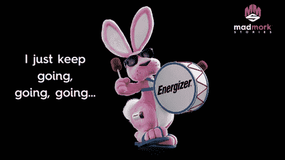

# 如何管理高绩效员工

> 原文：<https://medium.com/swlh/how-to-manage-high-performers-c51dbfca3e31>

Lamborghini is a Trademark of Automobile Lamborghini Holding S.p.A

高绩效者。这些男人和女人是任何组织的精英突击部队。研究表明，优秀员工的平均表现比他们所在公司的普通员工高出 400%以上。

那么我们如何定义什么是高绩效者呢？大多数情况下，高绩效员工是:

**积极:**我共事过的大多数高绩效员工都有积极的、能干的态度。他们相信通过努力工作、专注和坚持，没有什么是他们做不到的。这种观点不仅能帮助他们克服困难，还能激励人们团结在他们周围，支持他们的追求。

**有一个成长的心态:**高绩效者也总是在寻找如何学习新技能，提高现有技能，并从错误中学习。这种心态使他们能够为最具挑战性的问题找到创新的解决方案，也使他们具有高度的灵活性和适应性。他们是“终身学习者”

完成任务:原谅我的法语。这些人非常注重成就。他们活着就是为了完成事情，想要向自己和他人证明他们能够完成最具挑战性的任务和项目。任务列表越长，他们越开心(这可能会带来其他问题)。

自我驱动:完成并把事情做好的驱动力来自这些人的内心深处。它就像一场咆哮的大火，吞噬了沿途的一切。你不需要鼓励他们。他们有自己的议程，并准备向自己和他人证明，他们能够并将兑现承诺。

**是工作马:**一些高绩效员工完成工作的能力近乎传奇。事实上，一项研究表明，平均而言，高绩效员工比普通员工多取得 400%的成就。他们甚至没有注意到时间在流逝。你会看到他们发来的电子邮件、报告、问题和电子表格，直到工作日晚上 11 点，甚至周末和节假日也是如此。他们前进、改进和完成工作的动力总是让他们不断前进。

**像劲量兔子一样工作:**还记得以前的电视广告里，劲量兔子不停地跑来跑去吗？高绩效者也一样。他们不仅是工作马，但他们的精力和驱动器似乎永无止境，他们始终如一地提供了一天又一天。他们的表现不是零星的。是一致的。这些人是马拉松运动员。不是短跑运动员。

高绩效者就像精力充沛的兔子。他们只是不停地走啊走( [***点击推文***](https://ctt.ec/4nv13) *)*

The Energizer Bunny is a trademark of Energizer Brands LLC, all rights reserved

**渴望建设性的反馈:**高绩效员工总是寻求改进。获得持续的、建设性的反馈是这个过程的关键部分。他们通常更关注获得可操作的反馈，比如他们可以改进的地方和他们做得不好的地方，而不是听到为什么做得好。根据《哈佛商业评论》上的一篇文章，50%的高绩效员工表示他们期望至少每月与他们的经理坐下来谈一次，但只有 53%的人表示他们的经理满足了他们的反馈期望。

*只有 53%的高绩效员工表示他们的经理实现了他们的反馈期望(* [*点击发推*](https://ctt.ec/9VYP7) *)*

**寻求组织外的学习。他们不仅会从经理和同事那里寻求反馈，他们甚至会走出组织，从其他人那里获得建议和见解，看看他们可以利用和适应什么，以便在自己的工作中做得更好。前几天，我和一个我正在考虑辅导的女人聊天。当我建议她与不同公司中已经在做新工作的人交流时，她列举了 3-4 个她已经接触过的人的例子，并告诉我她已经在工作中运用的见解和建议。那是高水平表演者的标志。高水平的人不害怕寻求帮助，无论是从朋友、在线小组还是通过辅导或课程。**

在硅谷，我最常被问到的一个问题不仅是你如何找到并雇佣这些“独角兽”，更重要的是，你需要做些什么来让他们保持快乐、积极和高效？在我在科技创业公司以及在谷歌和百事可乐工作的过程中，我发现管理这些人的关键是:

1.就明确的目标达成一致，并调整期望。我在上一篇文章中谈到管理**暴君老板时谈到了这一点。**对于高绩效员工来说，在设定目标时保持清晰非常重要。这些目标应由双方同意，并尽可能可衡量。使用类似于 [SMART](http://hrweb.mit.edu/performance-development/goal-setting-developmental-planning/smart-goals) 框架的框架，这样你们双方都同意具体的、可衡量的、可问责的、相关的和有时限的目标。不要害怕设定挑战性的目标，因为高绩效者喜欢挑战，但要确保它们也是可行的，因为即使在这些精力充沛的人中间，无法实现的雄心勃勃的目标也会迅速削弱动力和自信。

2.给他们成功的工具。作为经理，你的职责是制定战略，提供方向，并为你的员工提供成功所需的资源。确保您的高绩效员工拥有他们需要的工具(人员、预算、培训等)，并消除他们前进道路上的任何障碍。

3.让开他们的路。我以前共事过的一位 30 多岁的 CEO 会坐在我的办公桌前，编辑一些我将要做的演示文稿和材料。他认为，既然他更了解这个行业，而我还在起步阶段，这将节省时间并帮助我。并没有(其实 4 个月后我就走了)。一旦你同意了目标，给了高绩效员工他们需要的工具:离开。别挡他们的路，让他们自己去做。高绩效者喜欢拥有他们的自由和自主权，以他们喜欢的方式完成事情。如果他们需要帮助，他们会开口的。如果你对他们进行微观管理，他们会感到沮丧，事情通常会从那里开始走下坡路。对于加入创业公司的公司高绩效员工来说尤其如此。他们中的许多人加入早期公司的主要原因之一，与其说是为了选择，不如说是为了以他们喜欢的方式做事情的自主权。干扰最小。

因此，如果你真的想成为高绩效员工的优秀经理，就不要挡他们的路，让他们自己去做吧！( [*点击推文*](https://ctt.ec/010P2) *)*

4.**利用你的“1-1”最大限度地发挥影响力。**高绩效者对无成效的会议极为反感。这包括他们与您的 1 对 1！因此，确保你为这些会议制定了清晰的议程，并把会议的重点放在你能为他们做些什么上。避免在这些会议上做报告，因为你可以通过电子邮件、休息时间或午餐时间做报告。你的 1-1 应该是找出他们需要你帮助的障碍，他们是否需要更多的资源，或者是否有可能影响他们优先事项的重要变化(见我在 [**管理黑仔 1-1 的**](https://www.madmork.com/single-post/2017/10/20/A-Managers-Guide-to-Awesome-1-1-Meetings) 上的帖子)。1-1 也是对他们的表现提供建设性反馈的好机会(见上文)。重要的是，你要确定这些会议的节奏，让它们成为你和他们日常生活的一部分。确保你准时，并在需要时随时准备取消它们(因为高绩效员工往往会非常忙)。这些会议也应该是一个机会，以确保高绩效者专注于“正确的”项目，因为他们可能会被其他请求或引起他们兴趣的闪亮、有趣的新项目分散注意力(见下文)。

5.给他们特别的项目。如果你目前的晋升结构不能为他们提供他们想要的职业道路(以他们想要的速度)，这些会特别有帮助。例如，我在谷歌团队中的一个人总是领先于他的计划，并被新的有趣的项目所诱惑。他曾在新兴市场工作，有着非常丰富的创业背景。因此，当我意识到我可能无法像我们希望的那样迅速提升他时，我给了他一个特殊的项目来启动并领导与我们的运营商合作伙伴(包括威瑞森和 Sprint)的营销合作计划。这为他提供了新的有趣的工作，给了他成长和建立人际网络的机会，并充当了一个释放阀，这样他就不会过多地考虑自己在哪里或在职业生涯中是否明智。只要确保这些项目不会让高绩效者分心太多，并且以一种有意义的方式为企业做出贡献。

给高绩效员工特殊项目特殊项目是保持他们成长、兴趣和动力的好方法，尤其是当你不能像他们希望的那样频繁地提拔他们的时候。( [***)点击推文*** *)*](https://ctt.ec/710yH)

6.**提供成长的机会。**如前所述，对于高绩效者来说，成长就像氧气，所以要确保你提供了大量的学习机会。在 Hero，我的增长主管对进入产品营销很感兴趣。虽然我们短期内无法满足她的要求，但我鼓励她在[大会](http://www.generalassembly.com/)上一门产品营销课程，并为此提供了预算。这让她能够继续专注于我需要她完成的一些核心项目，同时也让她对进入新角色的可能性保持动力。她还获得了新的技能，能够在她的下一个角色中加以利用。成长可以来自在线课程，跨其他团队的兼职项目，甚至在当地大学参加兼职课程。缺乏明确的增长机会对高绩效者来说尤其令人沮丧，这通常是他们在别处寻找机会的原因。

7.**一个玩家跟一个玩家玩。**我发现让我的顶尖人才保持积极性的最好方法之一是让他们周围都是其他顶尖球员。这是人们留在谷歌或亚马逊这样的公司的关键原因之一。高绩效者希望周围都是同样能力的人，这样他们就可以向他们学习，提高团队的整体成功。重要的是，在招聘和面试团队中其他优秀成员时，你可以通过争取他们的帮助来进一步激励你最优秀的员工。这不仅让他们对引进新人才感到兴奋，也让他们学习招聘中的基本技能，并使他们成为团队建设过程的一部分，这是建立关系的基础。这是一个双赢的局面。

8.**给他们“如何”工作的灵活性。在一些公司里，这有时很难。去年，雅虎！首席执行官玛丽莎·梅耶尔削减员工在家工作的能力，可以说是犯了一个灾难性的错误。不管我是不是梅耶尔的粉丝，你对高绩效员工的理念应该很简单:只要他们交付成果，而且他们交付成果的方式不会损害团队交付成果的能力，也不会滥用公司政策，你就应该允许。就我而言，我的团队中经常有人为一个半小时的通勤时间而奋斗。有些时候，他们希望节省 3 个小时的时间，在家工作。我对此一直很冷静，他们也从未滥用它。如果你不得不担心他们在家工作、完成任务或滥用规则，那也很简单:你管理的不是高绩效员工。给你的高绩效员工一些灵活性。你会得到好处的。**

9.**鼓励他们减压。**这些人就像高性能跑车。他们会尽可能长时间地以每分钟 12000 转的速度行驶，直到没油为止。问题是，他们中的一些人会经常因此而吹爆发动机(并烧毁)。作为一名经理，你需要了解他们在身体和心理上的感受。让其中一个人筋疲力尽对他们来说是不好的，但也会增加团队中其他人的工作量，他们必须收拾残局。重要的是给他们压力，让他们抽出时间，也做一些有助于他们发泄情绪和发泄的活动。你也可以尽自己的一份力量，避免在深夜、周末和假期给他们发邮件(如果你发了，他们会看的！).进行团队活动，如排球、野外旅行和其他有助于他们户外活动和锻炼的活动，也可以帮助他们保持健康和快乐。

*表现较好的人就像高性能跑车:他们会尽可能长时间地以每分钟 12000 转的速度行驶，直到耗尽汽油。(* [***点击推文*** *)*](https://ctt.ec/a2O80)

10.**努力规划职业发展道路。**这在工作时间长、工作强度大的初创公司和小公司尤为重要。高绩效者愿意投入比大多数人更多的时间和精力，但他们也往往要求更高，更有野心。在以前的职位上，我会一个月开 4 次一对一的会议，并将其中一次会议作为“边走边谈”的会议。在这些边走边谈的过程中，我会经常讨论发展问题和职业方向。对于高绩效员工来说，更经常地讨论这些话题是很重要的，但同时也要清楚地为他们规划一条路线，提供他们需要达到的切实、一致的衡量标准。但是，一定要确保这些指标和最终目标进展与您的人力资源政策完全一致，并且在晋升时得到内部支持。

*综上所述，作为经理，你可能觉得自己是高绩效员工的奴隶，而不是他们的奴隶。欢迎学习知识经济中的管理。最好习惯一下！(* [***点击推文*** *)*](http://bit.ly/2yOJ4CL)

人才争夺战从未像今天这样残酷。发现和雇佣优秀的人才很难，但留住这些人更难。为了你自己、你的公司和你的团队，你应该尽你所能让你最优秀的员工保持专注和快乐。希望上面的一些提示能让这个过程变得简单一点。我希望你喜欢这篇文章，并根据需要随意点赞、评论和分享。有没有对你很有效的技巧？在管理高绩效员工时，有没有让你觉得具有挑战性的情况？随意分享。

马德默克

营销主管蔻驰&首席说书人

## 这个故事发表在 [The Startup](https://medium.com/swlh) 上，这里有 263，100 多人聚集在一起阅读 Medium 关于创业的主要故事。

## 订阅接收[我们的头条新闻](http://growthsupply.com/the-startup-newsletter/)。

