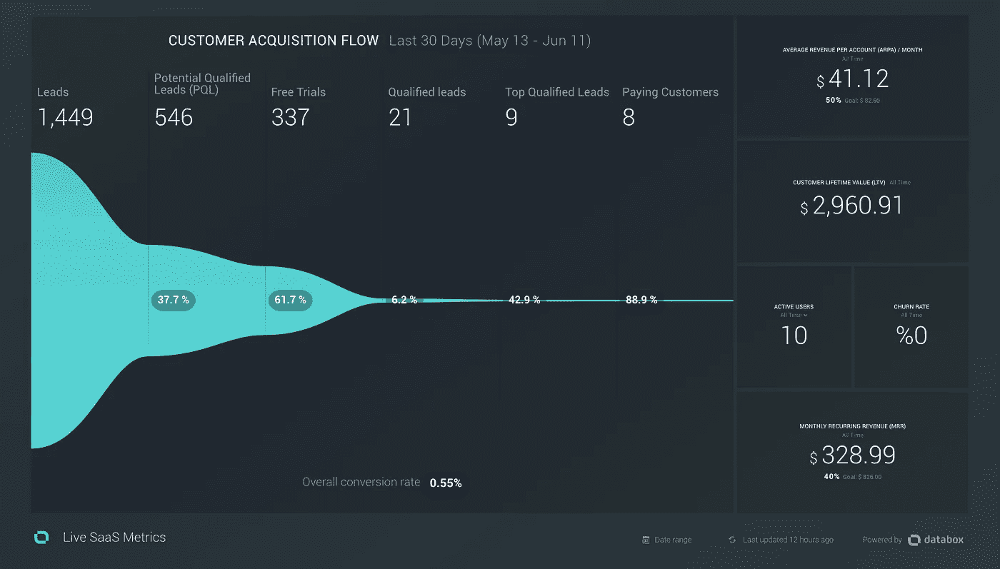

# 如何在 2018 年营销你的 SaaS 创业公司

> 原文：<https://medium.com/swlh/how-to-market-your-saas-startup-in-2018-5cd8f71f1181>

SaaS 营销是具有挑战性的。这比销售实物产品要复杂得多。这种关系不会随着向客户交付产品而结束；它随着时间的推移与客户一起发展。要成为一名高效的成长型黑客，你必须始终掌握市场上最新的技术。

那么你从哪里开始呢？应该学什么？你是如何开展你的第一次 SaaS 营销活动的？这里有 11 个步骤可以帮助你将任何软件作为服务公司进行营销。

Photo by [Matthew Ronder-Seid](https://unsplash.com/photos/7Iq37RQg0Z8?utm_source=unsplash&utm_medium=referral&utm_content=creditCopyText) on [Unsplash](https://unsplash.com/search/photos/funnel?utm_source=unsplash&utm_medium=referral&utm_content=creditCopyText)

# 1-#遗忘隧道

利用[乔治亚娜·劳迪](https://twitter.com/ggiiaa)和[克莱尔·苏伦特罗普](https://twitter.com/ClaireSuellen)的[忘记漏斗](https://forgetthefunnel.com/workshops/?ref=shar)研讨会。他们拥有出色的投资组合，并通过分享他们的经验来帮助社区。*忘记漏斗*每周三发布一个新的 30 分钟研讨会，它会把你变成一个专业的数据感知 SaaS 营销人员。

# 2-定义您的客户

了解你的客户是营销你的产品的最重要的一步。尝试回答一些关键问题:

*   你是卖给其他企业(B2B)还是个人(B2C)？
*   您的客户与哪些在线社区有联系？
*   他们想要完成的工作是什么？你的产品将如何帮助他们解决这个问题？
*   你的客户用什么术语来描述这个问题？他们会用什么术语来描述你的产品？
*   你能列出至少五个潜在客户吗？谁是你的理想客户？

回答这些问题将有助于您定义您的产品并验证您的开发路径。有些答案可能不明显，需要你提问、调查和测试。不要浪费时间去假设人们需要什么；寻找有数据支持的答案。

# 3-了解客户的旅程

在一个典型的 SaaS，旅程从访问你网站的访问者开始。然后，访问者可以通过提问、注册免费试用或免费增值账户来成为潜在客户。然后，她成为用户，最后成为付费客户，继续与你的产品一起发展。旅程永无止境，因此您越早理解它，就能越快优化旅程中每一步之间的客户流动。

根据你的产品不同，顾客流量可能完全不同。关键是定义您知道可以衡量的销售线索类型。你总是可以从四种基本的线索类型开始:访问者、线索、用户和付费客户。记下顾客从访客变成付费顾客的步骤。

# 4-将你所有的销售线索集中到一个单独的流程中

要有条理。混乱的营销活动会产生混乱的结果。您的销售线索可能会通过许多不同的渠道进入您的营销活动，例如您的邮件列表订阅、您网站上的聊天对话、联系页面表单，甚至是直接电子邮件。独立地管理来自每个渠道的这些销售线索将需要大量的人工工作，从而导致疏忽和潜在的有价值的销售线索的丢失。尝试将您的所有销售线索移到一个位置，以便于管理。

对讲机和[扎皮尔](https://zapier.com/)是两个可以很好帮助你做到这一点的工具。您可以使用 Intercom 来管理、联系和跟踪您的所有销售线索，并使用 Zapier 将您的所有销售线索从每个渠道移动到 Intercom。确保永远知道你的线索最初来自哪里！

# 5-密切关注你的谷歌分析数据

确保你在所有的网站版块、登陆页面和发布内容上都安装了谷歌分析。在你的分析中有多个属性设置总是一个好的做法，一个保存你的主要实时流量数据，另一个你可以到处玩，设定目标，标记访问者，并跟踪有趣的访问者的行为。如果你是一个更高级的 GA 用户，利用[谷歌标签管理器](https://developers.google.com/tag-manager/)和[自定义尺寸](https://support.google.com/analytics/answer/2709828?hl=en)。

# 6-尽可能多地学习和使用对讲机

对讲机是我最喜欢的 SaaS 公司之一。你已经在每个 SaaS 网站的右下角看到了那个著名的干净的小聊天按钮。是的，很可能是对讲机。

他们创造了最直观的工具，彻底改变了销售线索管理、客户关系和电子邮件营销。你可以用对讲机做一些很酷的事情:

*   **使用对讲机作为销售线索管理工具。**将所有渠道的所有销售线索同步到对讲机中。将您的网站联系人表单查询转发给 Intercom，使用 Intercom 网站聊天小工具，并在 Intercom 而不是电子邮件中进行所有对话。
*   **验证您的客户**使用对讲机淘汰低质量客户的每一步。你负担不起一个不合适的顾客。
*   **在对讲机中跟踪用户事件和使用报告。**通过将您的 SaaS 与内部通话事件集成，了解您的用户如何使用您的产品。
*   最后，**开展有意义的自动化营销活动。**不要告诉现有客户如何执行基本任务，也不要向新客户传授高级功能。通过观察对讲机中的客户行为来定制每封电子邮件。

如果你预算有限，刚刚开始你的 SaaS，申请[对讲机早期启动项目](https://www.intercom.com/early-stage)。

# 7-了解关键财务 SaaS 指标

财务指标是你所有营销努力的成果。他们帮助你衡量你的公司现在和将来的表现。您需要记住一些主要的关键指标:

*   **MRR 和 ARR** 。你每月和每年的经常性收入是多少？这是你每个月赚的总数，然后乘以 12 就是一年。
*   每个账户的平均收入，ARPA。客户平均每月付给你多少钱？这个数字与您的定价模型直接相关。
*   **流失率。**您的客户每月取消服务的比例是多少？了解是什么让人们保持参与。
*   **客户终身价值，LTV。**每位客户在使用 SaaS 的一生中平均会向您支付多少钱？

[Gasper Vidovic 写了一篇关于 SaaS 指标的精彩文章](https://databox.com/metrics-every-saas-company-should-track)。它解释了作为 SaaS 营销人员、创始人或经理你需要知道的所有必要指标。强烈推荐阅读。它将更详细地涵盖上述大多数财务指标。

# 8-熟悉 Stripe 和 Servicebot

如果没有正确的工具，收集上述财务指标可能会令人望而生畏。 [Stripe](https://stripe.com/) 是最大最强大的在线支付网关。它负责信用卡支付和 PCI 合规性。

Stripe 是一个面向开发人员的系统，因此它需要一些手工工作来与您的 SaaS 集成。这就是服务机器人派上用场的地方。

Serivcebot 是一个出售 SaaS 的平台，它与 Stripe 合作。你已经在每个 SaaS 网站上看到了典型的价格表。您可以定义您的定价等级或基于使用的定价，Servicebot 将自动生成您的定价表、客户计费管理门户和订阅管理 UI。然后，您可以将 Serivcebot 连接到 Intercom 和 Databox，以获得最高效率。

Pricing table auto generated by [Servicebot](https://servicebot.io)

# 9-用 Databox 构建您的梦想仪表板

在这么多的分析系统中找到最好的是非常困难的。好了，我来给大家介绍一下今年 SaaS 数据分析奖的得主， [Databox](https://databox.com/) (由我 btw 评分；)

Databox 可以连接到一长串应用程序，包括上面提到的那些，让你建立一个看起来最恶心的图表，你可以把它呈现给合伙人、老板甚至投资者。

您可以将每日记分卡发送给人们，在移动应用程序上查看您的所有图表，或者通过链接共享它。有一个现成的仪表盘列表，您可以从中挑选，或者您可以随心所欲地创建一个自定义图表，以最佳方式描述您的 SaaS。请看我用 Intercom、Servicebot 和 Databox 制作的自定义 SaaS 仪表板示例:

SaaS dream dashboard made by Databox, Intercom, and Servicebot

# 10-读取牵引力

"把你一半的努力放在获得牵引力上."理解获得市场验证和不被卷入开发漏洞有多重要是非常重要的。了解 19 个营销渠道，找到哪一个适合你，并用尽这个渠道。如果你没有读过加布里埃尔·温伯格的《T2 牵引》这本书，我强烈推荐。你也可以听有声读物或者读读[的外卖](/@yegg/78-takeaways-from-traction-book-1b44d2a03dda)。它将成为你营销活动的圣经。

# 11-设定有固定时间表的目标

确保你从一些真实的数据开始。不要猜测你的流量，每一步的线索数，或者你的合格线索。如果你没有这些数据，停止你正在做的一切，开始记录所有这些重要的信息。没有它你会盲目摸索。

准备就绪后，定义以下指标，并为其设定 3-6 个月的目标:

*   **销售线索转化率:**每种销售线索类型的转化率是多少？根据案例研究，你所在的 SaaS 行业的目标回报率是多少？这里有一篇[很棒的文章可以帮助你实现你的转化目标](https://sixteenventures.com/free-trial-conversion-rate)。
*   **SaaS 定价:**你们的定价模式是什么？您的客户中有百分之多少属于您的每个价格等级？
*   **流失率:**你目前的流失率是多少？你的目标利率是多少？[这篇文章可能会帮助你更好地理解流失率](https://sixteenventures.com/saas-churn-rate)。

一旦知道了这些数据，就应该自动计算所有其他指标。让你的 SaaS 仪表板每天向你展示这一点。

# 运行您的活动

现在，您可以开始营销活动了。跟踪你的数据，不断学习。通过与人交流来最大化你的学习过程。你不是唯一一个。跟随[罗斯·西蒙兹](https://twitter.com/TheCoolestCool)，他有很多话要说，你会喜欢他的 SaaS 营销内容。加入 [SaaS 成长黑客](https://www.facebook.com/groups/SaaSgrowthhacking/?ref=group_header)脸书集团。人们通常非常乐于助人，而且知识渊博。

让我知道你的进展，因为你开始你的营销之旅。[在推特上给我打电话](https://twitter.com/DarafshehShar)。

## 这篇文章发表在 [The Startup](https://medium.com/swlh) 上，这是 Medium 最大的创业刊物，拥有+367，690 名读者。

## 订阅接收[我们的头条新闻](http://growthsupply.com/the-startup-newsletter/)。

