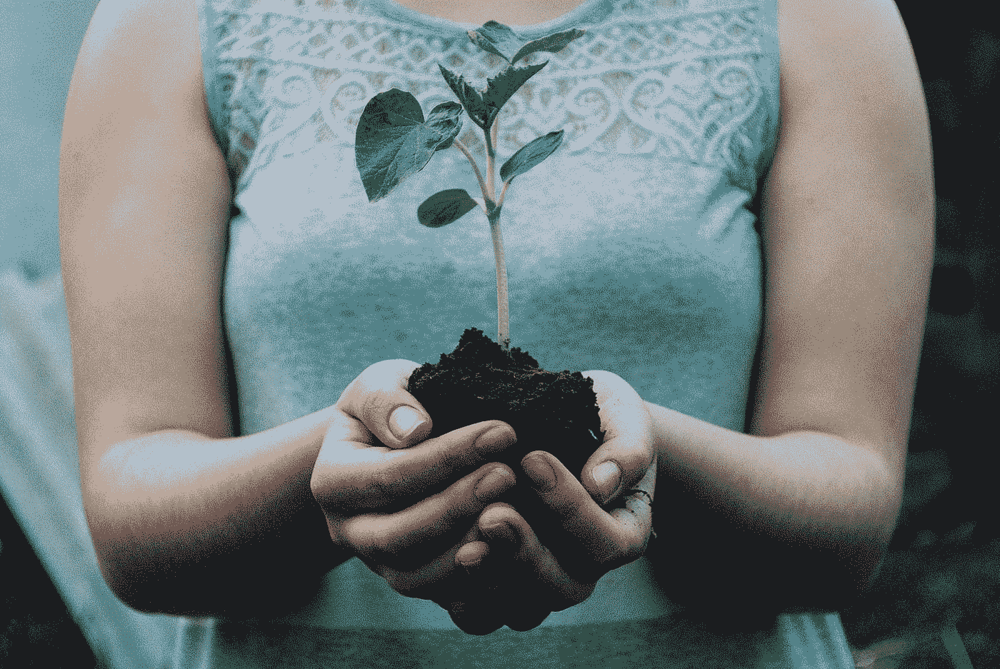

# 如何从零开始掌握种植成功的东西

> 原文：<https://medium.com/swlh/how-to-master-growing-something-successful-from-scratch-f8547edb067d>

Photo by [Nikola Jovanovic](https://unsplash.com/@danteov_seen?utm_source=medium&utm_medium=referral) on [Unsplash](https://unsplash.com?utm_source=medium&utm_medium=referral)

你有没有想过一个好主意？

当然有很多想法，但是很多时候它们来来去去。

但偶尔，你会得到一个坚持。你开始更多地思考这个问题。

你开始对你这个伟大的想法如何改变世界感到兴奋。