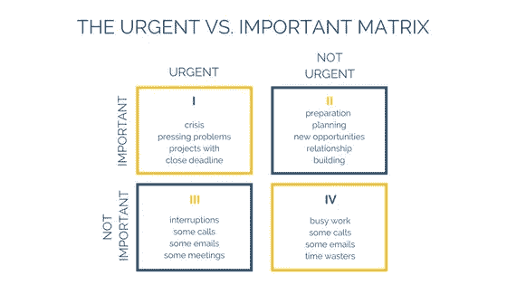
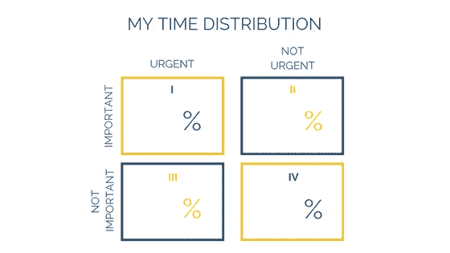
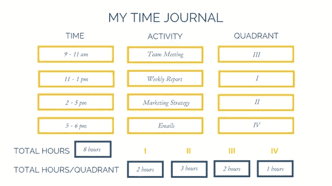

# 如何用紧急-重要矩阵掌握你的优先事项

> 原文：<https://medium.com/swlh/how-to-master-your-priorities-with-the-urgent-important-matrix-a7904de55266>

## 消除。委派。优化。

Photo by [STIL](https://unsplash.com/photos/ck0i9Dnjtj0?utm_source=unsplash&utm_medium=referral&utm_content=creditCopyText) on [Unsplash](https://unsplash.com/search/photos/list?utm_source=unsplash&utm_medium=referral&utm_content=creditCopyText)

你是否整天在会议和紧急邮件之间跳来跳去，却在下午 6 点才意识到你甚至还没有开始你应该着手的重要项目？还是为明天的推销做准备？或者最后想一个有效的策略来降低你的客户获取成本？是不是感觉时间飞逝，有时你甚至不知道它去了哪里？或者你觉得你一直在为别人的优先事项而努力，而不是为自己的目标而努力？

我去过那里。这就是所谓的*紧急与重要的困境*，它完全阻止了我多年来做任何有效的工作。直到我发现了改变*一切*的*矩阵*。下面是我用来解决*紧急与重要的两难*的一步一步的指南，夺回我的时间，最终专注于我商业&生活中的重要事情。

# 步骤 1:理解矩阵

*紧急与重要矩阵*是一个强大的生产力工具，可以将你的效率提高 10 倍。它由 4 个象限组成，根据两个参数对你的日常活动进行分类:紧急程度和重要程度。

以下是每个象限的典型工作:

## 象限 I:

紧迫的问题和危机，比如急于为你的初创公司筹集资金，在月底支付你的员工，处理运营部门的重大失误或公关风暴。临近截止日期的项目，比如按时提交你的硕士论文，发送 Y Combinator 应用程序或提交你的年度账目。

## 象限 II:

规划未来 3 个月的营销策略，在团队中分配新项目的职责，并为产品发布制定详细的项目计划。准备重要的投资者会议或推销。与潜在的合作伙伴和员工建立关系。寻找和研究新的机会，探索新的领域或战略，学习新的技能。

## 象限三:

同事因不相关的问题或闲聊而打断。来电、电子邮件和会议——如果它们与你无关。

## 象限四:

工作繁忙，对公司目标和/或你的目标没有明显影响。来电、电子邮件和会议——如果它们对你来说既不及时也不相关，或者对实现你的目标来说不必要。像社交媒体这样浪费时间的东西。

# 第二步:评估自己

为了提高你的生产力，你不仅需要理解矩阵的整体概念，还需要知道你现在处于什么位置。这将帮助你决定第 3 步中的哪些改变对你个人影响最大。

要评估你自己，看一看你典型的一周，估计你在每个象限花费的时间百分比:

如果你对这个练习有困难，记录下你一周内所做的一切。在下表中写下确切的时间和活动，并通过将每个象限的时间相加，然后除以总工作时间来计算最终的百分比。在本例中，百分比为:I — 25%，II — 37.5%，III — 25%，IV — 12.5%。

如果你很难根据紧急程度和重要性对你的活动进行分类，这里有更多的每个象限的指标:

*   **象限 I:** 你感觉自己在不停地灭火，并在应急模式下工作。由于紧迫的截止日期，你正在做的大多数项目都需要你立即关注。
*   **象限二:**你会觉得因为精心的计划、准备和预防，一切都在你的掌控之中。除了计划和准备，你还会把时间集中在高杠杆项目、新机会、学习和建立关系上。
*   **象限 III:** 你的大部分时间都花在需要你立即关注的活动上，但这些活动不一定与你的首要任务相关。你花很多时间在不重要的会议上，被打断，处理不重要的电话和邮件。你觉得自己好像一直在处理一些对别人来说很重要，但与自己的优先事项无关的问题。
*   象限四:你经常觉得自己在浪费时间。你在与你的目标没有直接关系的繁忙工作、社交媒体、视频、游戏和无意义的网上冲浪上花了很多时间。

# 第三步:优化

最有效率的人 80%的时间都花在紧急与重要矩阵的象限 II 中。这使他们能够积极主动地处理新的机会和高杠杆项目，而不是把所有时间都花在应对紧迫的问题和其他人的需求上。因此，他们能够朝着自己的目标取得重大进展，积极预防危机的发生，过上更加平衡、平静和专注的生活。

以下是您在象限 I、III 和 IV 活动中要做的事情，以便为象限 II 活动腾出更多时间:

# 象限四活动

象限 IV 的活动既不紧急，也不重要，因此根本不应该进行。以下是消除它们的方法:

## 消除时间浪费:

记录你一整周的时间(见第 2 步)，用 [Pyxsee](https://itunes.apple.com/us/app/pyxsee-social-media-manager/id1179342068?mt=8) 、 [QualityTime](https://play.google.com/store/apps/details?id=com.zerodesktop.appdetox.qualitytime&hl=en) 和 [AntiSocial](https://play.google.com/store/apps/details?id=com.goozix.antisocial_personal) 这样的应用程序跟踪你的手机屏幕时间，对于确定你的个人时间浪费者非常有帮助。一旦你知道自己的弱点是什么(YouTube，Instagram，Whatsapp 等。)，用这些有效的策略来应对:

*   将社交媒体的使用限制在一天中的特定时间(例如，你的通勤时间、午休时间或 5 分钟休息时间)
*   关闭手机和电脑上的通知
*   使用应用程序阻止某些网站和应用程序
*   和爱人在一起时，把手机留在家里

## 消除繁忙的工作:

用彼得·德鲁克的话来说:*最没用的事情莫过于高效地做那些根本不应该做的事情。无论你是在为你的老板做一个项目，还是作为一名企业家制定自己的时间表，都要问自己为什么要做某事。**最有效率的人会确保他们正在做的事情与他们的最高目标直接相关。**或者更好，这是对实现他们最高目标影响最大的任务。以下是消除无用功的方法:*

*   确保你的目标在任何时候都是明确的
*   在开始一个新项目之前，问自己“这真的是我现在应该做的吗？这有意义吗？”
*   学会对同事毫无意义的要求说不
*   如果你看不到做一项特定任务的意义，挑战你的老板

# 象限三活动:

象限 III 的活动在整体计划中并不重要，与你的首要目标也不相关，但对其他人来说却是紧急且重要的。因此，应该尽可能以最有效的方式进行。下面是如何做到这一点:

## 优化:

列出那些不直接影响你的首要任务，但仍然需要做的事情，比如回复邮件、参加会议，以及行政事务，比如订机票、安排会议、打扫卫生和购物。然后，找到最有效的方法去做。以下是一些建议:

*   将类似的任务分批完成，并为其分配特定的时间。例如，每天下午 2 点和 5 点回复邮件
*   利用技术提高流程效率。例如，在网上订购杂货，或者使用智能电子邮件收件箱和日程安排工具。
*   确保这些任务不会干扰你一天中最有效率的时间。例如:在你做深度工作的时候，把早上的会议空出来，关掉电子邮件通知。取而代之的是，在中午情绪低落的时候，在上下班的路上或者排队的时候做这些事情。

为了充分优化你的时间安排，我建议你建立一个每周默认时间表，为你所有的优先事项以及回复邮件等管理任务设定时间段。*你可以在这里下载我自己的* [***周计划模板***](http://bit.ly/defaultschedule)**给你一个大概的样子。**

## *委托或外包:*

*一旦你优化了流程，委派或外包这些任务可以帮助你节省更多的时间。为了确定这个策略对你是否有意义，做一个简单的练习:研究外包一个特定的任务会花费你多少钱——例如，雇佣一个清洁工每小时会花费你 10-20 美元。然后，确定你自己时间的价值——这可以基于你每小时的工资，你向客户收取的费用，或者你正在从事的高优先级项目的潜在收入。在某些情况下，在上面加上“情感”成本甚至是有意义的——例如:如果你非常讨厌清洁，这不仅会影响你清洁的时间，还会影响你一天中剩余时间的情绪和效率。最后，比较成本，以确定将特定任务外包给虚拟助理、项目助理或清洁工是否有意义。*

# *象限一活动:*

*象限 I 活动的问题是你无法绕过它们。它们是紧急而重要的，因此如果你不去做，将会有严重的后果。但是你可以做两件事来减少你处于紧急状态的时间:*

## *尽可能高效地完成任务:*

*   *把它委托给你信任的人，让他把工作做好*
*   *快速做出决策，并与所有相关人员有效沟通*
*   *排除一切干扰和力量——完成任务*
*   *早上第一件事就是把它解决掉，这样你就可以在剩下的时间里专注于其他事情*

## *开展更多象限 II 活动:*

*你越关注第二象限的活动，第一象限的活动就越少，因为你一开始就在积极地阻止它们发生。以下是如何将更多象限 II 活动纳入你的一周:*

*   *将它们安排到你的日历中:积极地为重要的任务留出时间，比如计划你的一周，制定你的营销策略，学习新技能，建立关系和发现新机会。每周选择相同的时间段对保持象限 II 活动的一致性非常有帮助。例如:划出周一早上的第一个小时来计划你的一周，定期召开月度战略会议，每周四晚上参加活动或晚餐，周五下午学习新技能，为即将到来的项目做研究。我再次建议为你所有的优先事项和管理任务设定一个每周默认时间表。*你可以在这里下载我自己的* [***周计划模板***](http://bit.ly/defaultschedule)**给你一个大概的样子。***
*   ****在你的精神高峰期做这些事情:**象限 II 的活动通常非常需要思考，因此需要你有一个专注和充满活力的精神状态。确保将你工作最好的时间保留在象限 II——无论是清晨、傍晚还是刚锻炼完。**

# **你准备好升级你的游戏了吗？**

**注册到我的电子邮件列表，就可以获得我的免费资源和我的最佳内容的每周摘要，与其他伟大的作家混在一起。我希望你能加入我的部落！**

****👉🏼** [**注册**](http://bit.ly/signup-lizhuber) **到我的邮箱列表****

****

**[http://bit.ly/signup-lizhuber](http://bit.ly/signup-lizhuber)**

****👉🏼** [**注册**](http://bit.ly/signup-lizhuber) **到我的邮箱列表****

## **更多来自 Liz Huber 的报道:**

** [## 今年让你的生活提升 10 倍的 8 种方法

### 这不是毫无意义的随机习惯的集合。

medium.com](/mind-cafe/8-meta-habits-to-make-2020-your-breakthrough-year-3dd00429cf3)  [## 在两个月内将我的教练业务从 0 美元增长到 6k+美元的 8 个残酷而诚实的教训

### 只要你相信，你想收多少就收多少

entrepreneurshandbook.co](https://entrepreneurshandbook.co/8-brutally-honest-lessons-from-growing-my-coaching-business-from-0-to-6k-in-2-months-8469abe98acd) 

## 这篇文章发表在 [The Startup](https://medium.com/swlh) 上，这是 Medium 最大的创业刊物，拥有 340，876+的读者。

## 在这里订阅接收[我们的头条新闻](http://growthsupply.com/the-startup-newsletter/)。

**