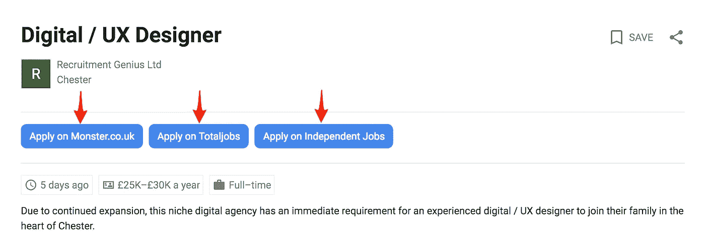
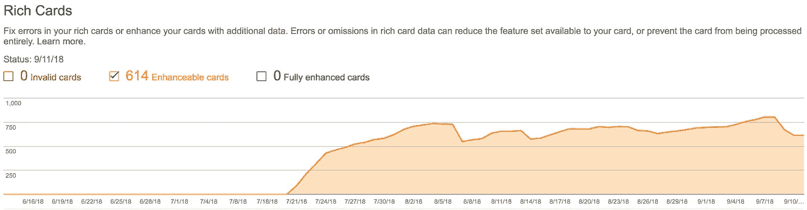

# 如何衡量你的 Google For Jobs 活动的成功

> 原文：<https://medium.com/swlh/how-to-measure-the-success-of-your-google-for-jobs-campaign-b3f6077df932>

已经有很多关于谷歌 For Jobs 的文章，这是搜索巨头在 2017 年 6 月发布的。

用户界面非常突出，因为蓝色的大框出现在搜索结果的顶部，它正在改变用户的行为，因为求职者不再向下滚动搜索结果页面，而是点击进入谷歌寻找工作。

我不想重蹈那些在网上随处可见的旧辙。因此，要想初步了解 Google For Jobs，你可以阅读这里的来了解如何验证你的网站是否能被列入 GFJ 用户界面，阅读这里的来了解它对你的求职页面有机流量的潜在影响。

所以，现在你已经了解了什么是 Google For Jobs，关于 Google 这个相对年轻的产品，有三件事你可能不知道。

# 你可以看到有多少工作被索引、浏览、点击和申请

当分析有多少工作申请来自 GFJ 时，你需要做的第一件事就是了解你有多少工作可以被谷歌索引。为此-

1.  登录你的[搜索控制台](https://www.google.com/webmasters/tools/home?hl=en)
2.  点击左侧栏中的“搜索外观”
3.  点击“富卡”
4.  点击“可增强卡片”，这将显示有多少工作有资格显示新功能(“可增强”和“完全可增强”都将在 Google For Jobs 中编入索引)

接下来你想知道的是有多少人在关注你的职位空缺。

**要查看这一点，请停留在搜索控制台并–**

1.  点击左侧栏中的“搜索流量”。
2.  点击“搜索分析”。
3.  点击“印象”并确保“点击”未被选中。
4.  单击“搜索外观”下面的“无过滤器”；这将为您提供“工作详细信息”和“工作列表”选项

*   “职位列表”显示有多少人浏览了你的职位列表，你可以在桌面上的谷歌招聘界面的左侧看到。
*   “职位详细信息”显示有多少人点击了职位列表并阅读了你的职位描述。

我很感激我上面给你提供的信息并没有给你最重要的信息，也就是看有多少人点击了职位描述并来到你的网站进行转换。为此，你现在需要[登录谷歌分析](https://marketingplatform.google.com/about/analytics/)。

**一旦您选择了想要查看的酒店—**

1.  点击左侧栏中的“采集”。
2.  点击“活动”。
3.  点击“所有活动”。
4.  将以下文本“google_jobs_apply”放入搜索栏，该搜索栏位于图表下方和表格上方。
5.  你现在可以看到有多少人点击了你的谷歌求职网站。
6.  在表格的最右边一栏，你现在可以通过转换进行过滤，设置你的首选转换点，并查看有多少人在你的网站上申请了一份工作。

现在你知道你的工作有多少有资格在 Google For Jobs 中列出，有多少人看过，有多少人在你的网站上点击和转化过。

# 你能减少在所有这些不同的工作板上发布你的工作的预算吗？

你经常在网站上发布你的工作，然后在许多不同的工作板上发布相同的工作，希望你能吸引潜在候选人的目光吗？

谷歌历来在其排名算法中优先考虑最成熟的职位委员会，但谷歌招聘关注的是什么角色最适合候选人，而不是哪个职位委员会拥有最大的权威。

**这是什么意思？**好吧，谷歌不再一遍又一遍地显示同一份工作，因为它已经被列在了无数的求职公告栏上([，过去是](https://www.venndigital.co.uk/blog/when-will-google-for-jobs-understand-the-difference-between-an-employer-recruitment-agency-and-job-board-105204/))，谷歌现在只显示一份清单(如下图所示)。这些选项让用户有机会点击任何为谷歌工作设置的网站，并通过他们选择的网站进行申请。

我没有证据支持这一点，但鉴于英语是从右向左阅读的，很容易认为左侧的链接会吃掉大部分点击。

作为一个企业主，当你在网站上的工作列表和更大的工作列表一样有机会被看到和点击时，你为什么还要为你的工作在那些工作列表上付费呢？

这一功能很可能是一些较小的求职板结束的开始，因为企业越来越不依赖于他们以前提供的曝光，新发布的营销预算可能会投资到用户界面中不可避免的 Google For Jobs 广告空间。

# 你在工作岗位上写的越多，你的排名就越有可能靠前

关于如何在新的用户界面中获得更高的排名，没有太多的指导，谷歌内部的许多搜索工程师似乎也不了解工作搜索引擎的复杂性。

约翰·穆勒是谷歌的网站管理员趋势分析师，他定期与 SEO 举行网络研讨会，耐心回答他们关于搜索的问题。然而，即使是组织中具有如此高水平搜索引擎知识的人也不能完全掌握 GFJ 排名算法的运行速度。

> *AFAIK 我们没有任何关于谷歌工作排名的信息。*
> 
> *—🍌约翰🍌(@ JohnMu)*[*2018 年 9 月 5 日*](https://twitter.com/JohnMu/status/1037371407796248576?ref_src=twsrc%5Etfw)

[云工作发现团队经理 Tarquin Clark](https://twitter.com/tarquinc) 给出了一个小建议，关于“内容的完整性有助于排名”

> *推荐从*[*https://t.co/9EaO2o2MWe*](https://t.co/9EaO2o2MWe)*开始，并遵循文档。有一些关于内容完整性的建议，有助于在应用按钮上排列无信息 AKAIK。*
> 
> *—塔尔坎·克拉克(@ tarquinc)*[*2018 年 9 月 5 日*](https://twitter.com/tarquinc/status/1037430455128088576?ref_src=twsrc%5Etfw)

这种内容的完整性是绝对有意义的，因为通过结构化数据和页面内容向谷歌提供尽可能多的信息，它不仅可以帮助搜索引擎充分理解它正在显示的角色/页面，还可以让它有信心将工作排名更高，确保相关的求职者看到它。

为了保证你向谷歌提供了实现这种“完整性”可能需要的所有信息，请确保你的工作符合你在下面的截图中看到的“完全增强的卡片”，你可以从谷歌搜索控制台(如前面所强调的)获得这些卡片。

注意:本例中的客户是招聘人员，他们不想泄露自己的角色位置，因此不能拥有完全增强的工作页面。然而，在提升内部职位时，没有理由不包括这些信息。

谷歌求职是招聘行业长期以来最重大的进步。大型招聘平台主宰行业的日子可能已经结束，因为新平台能够让所有的职位列表，无论它们来自哪里，都被置于一个公平的竞争环境中。这一进步意味着招聘公司网站在谷歌上被看到的机会和 Indeed 或 Monster 一样多。

*最初发表于*[*【www.semrush.com】*](https://www.semrush.com/blog/how-to-measure-success-of-your-google-for-jobs-campaign/)*。*

## 这篇文章发表在 [The Startup](https://medium.com/swlh) 上，这是 Medium 最大的创业刊物，拥有+ 375，367 名读者。

## 在这里订阅接收[我们的头条新闻](http://growthsupply.com/the-startup-newsletter/)。

