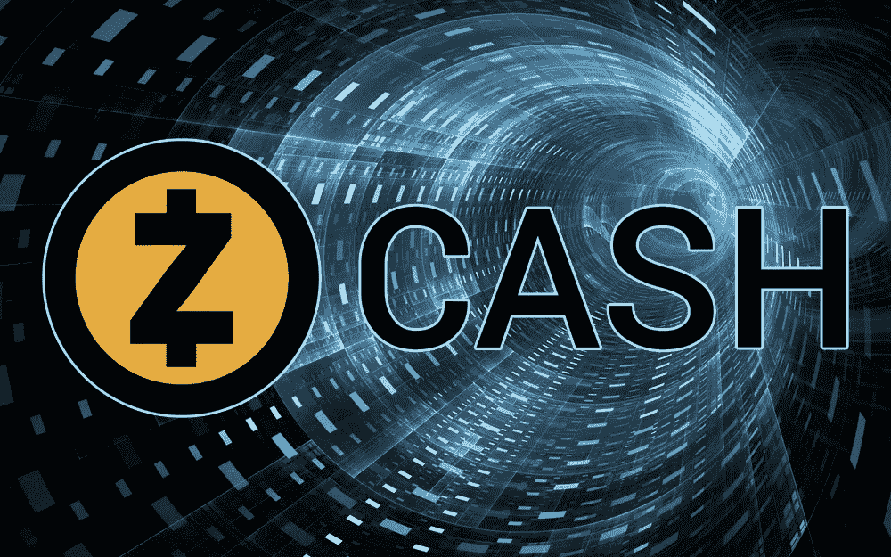
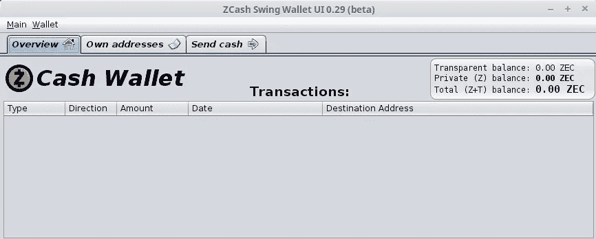
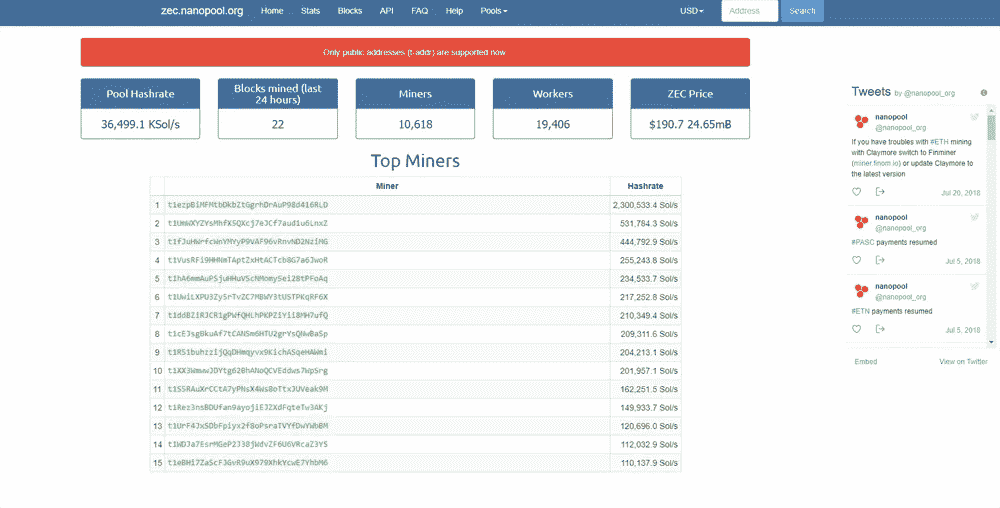

# 如何为 Zcash 采矿——一项对所有人都有利可图的业务

> 原文：<https://medium.com/swlh/how-to-mine-for-zcash-a-profitable-business-for-everyone-da32d42e2535>

随着 Zcash 成为 CoinBase 可能的新成员之一，以及总部位于纽约的交易所 Gemini 已经开始交易加密货币，现在可能是时候以传统方式——通过采矿——收购一些 ZEC 了。

开始采矿业务并不像人们想象的那么难，而且与其他类型的加密货币采矿相比，成本相对较低。因此，让我们来看看如何有人可以得到一个有利可图的采矿作业设置和运行。

你需要做的第一件事是下载 Zcash 钱包，有三种不同类型的钱包可以使用。互联网，硬件，本地钱包都有。为了本文的目的，我们将讨论打开本地钱包。您应该稍后尝试打开其他类型的钱包，以利用它们的独特属性。

每种加密货币都有自己的网站供你查看，通常会给你链接到他们的钱包和其他有用的资源。Zcash 也是这么做的，他们的主网站在 [https://z.cash](https://z.cash) ，钱包资源页面在【http://www.zcashcommunity.com/wallets/】T2。

转到钱包页面，向下滚动到“本地钱包”部分，并为您正在使用的操作系统下载客户端。出于写作的目的，我们将使用 windows 客户端。运行安装向导并安装 wallet。

当你得到它运行的程序将通过下载一个验证密钥的过程，一旦完成这个程序将下载 ZEC 区块链。以防你不知道，区块链是 Zcash 所有交易的分类账，它非常大，所以要准备好一个有点长的下载时间。

好消息是，您不必下载整个区块链就可以开始采矿。然而，如果你想从你的钱包里发送任何东西，你必须下载整个东西。一旦程序打开，你会在“自己的地址”标签下找到你的 Zcash 公共地址，这将是一个以 T1 开头的长字母数字串。这是你用来收集 ZEC 的地址。

如果您愿意，您可以让 Zcash 客户端保持打开，并允许区块链在后台下载，然后继续设置您的 miner。既然你的钱包已经设置好了，你也有了公共地址，你现在可以开始挖掘 ZEC 了。你将需要加入一个采矿池，在这个地方，许多像你一样的矿工将团结起来，分享你的计算能力，同时根据你对解决一个区块所做的贡献，平均分配采矿的奖励，这就是加密采矿的全部内容。

有许多不同的矿池可供选择，但出于写作的目的，我们将选择 Nanopool.org。在他们的主页上有一个他们支持采矿的所有硬币的列表，比如 Zcash。如果你愿意，你也可以直接进入位于[https://zec.nanopool.org](https://zec.nanopool.org)的 Zcash 页面，点击页面顶部的帮助按钮。

出现的页面将为您提供设置采矿软件所需的所有信息。在这里，我们将使用 EWBF 矿工，这是与 Invidia GPUs 一起使用的伟大。如果你使用 AMD GPUs，你可能要考虑使用 Claymore 或其他更适合你的硬件类型。如果你打算使用 CPU 进行挖掘，那么你也可以在列表中找到 CPU 挖掘程序。

一旦你解决了所有这些问题，下一步就是提取挖掘软件并开始设置你的挖掘脚本。(提示:您的防病毒软件可能会将您的采矿软件视为病毒，因此需要对其进行处理，以便允许该程序运行。这样做的原因是因为有病毒利用你的电脑来挖掘加密货币)

在您提取的文件夹中，很可能会有一个预先打包的 bat 文件。您可以编辑 BAT 文件，或者创建自己的文件。这是您将用来启动您的矿工的文件，如果您使用的是 EWBF 矿工，右键单击 ***start.bat*** ，然后单击编辑。Nanopool 将为您提供用于每个矿工的正确命令语法。请确保您有您的矿工将连接到的服务器的 Nanopool 地址。

在这个脚本中，您需要更新的信息是钱包地址(在脚本中已经有一个 ZEC 地址，是程序员作为示例放在那里的，并且需要进行更改，所以复制您的 Zcash 钱包地址并将其粘贴到那个地址上)、您的员工姓名(可以是您喜欢的任何名称，因为它在 Nanopool 中用作友好的参考)，以及您将使用的特定于您的采矿操作的电子邮件地址。

一旦你完成了这些，你需要保存你的文件。完成后，你就可以开始采矿了。准备就绪后，运行 ***start.bat*** ，这将启动采矿机，现在您的采矿操作已经启动并运行。您的散列率将取决于您运行的 GPU(或 CPU)的类型。

互联网上到处都是关于你的 CPU/GPU 性能指标评测的信息，这些信息会告诉你它们应该如何执行你已经开始的操作。一旦你的矿工解决了一些股份，你将能够在 Nanopool 上看到你的矿工统计。你所要做的就是进入 Nanopool Zcash 页面，在顶部显示“地址”的搜索中输入你的钱包地址然后只需点击“搜索”，出现的页面将显示您当前计算的散列率，您过去 6 小时的平均散列率，您的余额，以及您未确认的余额。

该图将显示您的散列率，SMA 和接受的份额。在底部，你可以看到关于你的员工，你的工资，股票和计算器的信息。你可以点击工人来查看他们的统计数据。

如果你想改变你的最低支付金额，请点击统计信息上方的设置按钮，输入你的电子邮件地址，将金额改为你想要的金额。绝对最小值为 0.01 ZEC，最大值为 10。当您获得第一笔支出并更新您的区块链时，您将在 Zcash 客户端看到您的所有交易。

最后一件事是确定并备份你的 Zcash 钱包文件，你可以在你用户的 app data 文件夹里找到。使用 Windows 资源管理器，点击操作系统所在的驱动器，然后点击您登录的用户文件夹。app data 文件夹是隐藏的，所以点击“查看”，然后点击“隐藏项目”框打开漫游文件夹，再打开 Zcash 文件夹，名为“wallet”的文件就是你要找的。这是一个保存您的私钥信息的 Dat 文件。这是一个文件，你需要保持安全，因为它是好的现金。将此文件备份到 USB 驱动器，并将其保存在安全的地方。

现在你已经了解了 Zcash 的所有采矿知识，只需一点时间和努力，你就可以开始采矿了。试一试吧，很快你就会成为用加密货币赚钱的采矿专家，而不必成为交易者。

—

了解正确的[加密货币交易策略](https://cryptoinvestinginsider.com/how-to-invest-in-cryptocurrency/?utm_source=su&utm_medium=article&utm_content=zcash)是你在这个行业取得成功的方法。

## 这个故事发表在[的创业](https://medium.com/swlh)上，这是 Medium 最大的创业刊物，有 351，974+人关注。

## 订阅接收[我们的头条新闻](http://growthsupply.com/the-startup-newsletter/)。

