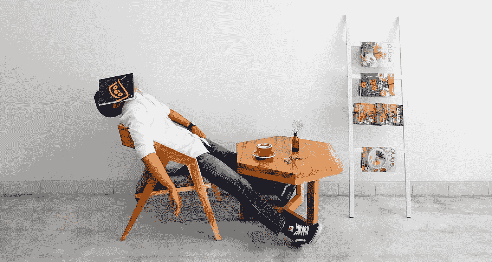

# 如何将懒惰与生产力结合起来，让你的成果提高 10 倍？

> 原文：<https://medium.com/swlh/how-to-mix-laziness-with-productivity-to-10x-your-results-78e6de7a5118>

Image Credit: Carlsberg Beer

有时候我特别懒。根据互联网，我应该是生产力专家。

这是一种新时代的困扰，想要榨干你一天中的每一分每一毫。我尝试过超高效率和极度懒惰。我发现有效的是两者的混合。

这是反直觉的，因为我们被引导去相信懒惰是不好的。

如果你想富有成效，你需要懒惰。

# 如果你从不偷懒，你的大脑会生你的气。

生产力会让大脑超负荷运转。

这就是为什么你会头痛，脑雾和感到疲倦。不断尝试充分利用你的一天，没有一刻的懒惰会弊大于利。

如果你不偶尔让它变得懒惰，你的大脑就不会给你“心流”和清醒的头脑。

> “社会认为的懒惰实际上是你精神的食粮”

懒惰让你的大脑暂时关闭或开启自动驾驶模式。

# 拖延激发创造力。

我依靠我的头脑来创造和生产大量的内容。

我时不时会遇到文思枯竭，我发现这是我不允许自己偷懒的时候。

扑向脸书和拖延是我想出新主意的方式。我最喜欢拖延的活动是在 Youtube 上看才艺展示视频。这些视频中有很多都很感人，然后我把我的感受写在博客上。

如果我不拖延，不在沙发上坐一会儿，我就不会有思考新想法所需的空闲空间。

Image Credit: [Pratap SEO](http://Pratap Seo)

当我满脑子都是为了达到社会的生产力标准而需要完成的习惯和任务时，我就没有时间思考了。

深刻的思考是我反思我的生活的地方，这一次的输出是更多的生活经验与你们分享。

在懒惰的时候，我的大脑会把我所有的经历和信息映射在一起，把这些点连接起来。

不要让网络告诉你懒惰是不好的。就我而言，懒惰带来了创造力。

# 生产力已经失去控制。

我看了很多自强的内容。

到每篇文章的结尾，我都觉得自己在遭受 FOMO 的折磨。我开始思考为什么我不能拥有像洗冷水澡这样令人惊奇的好习惯。

像*一样的想法掠过我的脑海:“如果你有更多的精力，你可以接触到更多的人。也许你应该每天花 30 分钟做绿色奶昔，吃有机蓝莓。”*

生产力已经失去控制。

# 生产力和懒惰并不重要——重要的是你的原因

我们现在如此渴望变得更有效率，但我们却忽略了为什么？

你今天做了更多的事情，但那又怎样。那是什么意思？

如果你不知道为什么要努力变得有效率，那么你会感到空虚。你会发现自己放弃了“成功习惯”,因为没有理由让它们继续下去。

> 我们现在用的不是“跟上琼斯一家”，而是“跟上琼斯一家的习惯”

现在在像 Quora 这样的网站上有无数的习惯清单，其中绝大多数不会让你更有效率。

帮助我变得更有效率的是忽略懒惰和效率，专注于我的为什么。

我花时间试图给我的生活增加更多的意义，而不是试图赚更多的钱，更有效率和避免懒惰。

我十倍于我的结果的方式是通过做让我感觉他们有意义的任务。

**意义增加了我的成果而不是生产力。**

# 懒惰会导致超高效率。

在我的职业生涯中，有一段时间我在努力完成我的关键绩效指标，并且有空闲时间。没有最后期限，我很轻松。在那一刻，我感到懒惰，我是。

然而，奇怪的是，我在这段时间比以往任何时候都更有效率。我写了更多的博客，做了更多的家务，答应结识更多的新朋友。

懒惰的时间让我反思我的职业生涯，并意识到我已经停止了成长。这是一个艰难的结论，需要很长时间才能接受。

Image Credit: Unsplash

一旦我发现了问题，我就用效率来尝试改变我的环境。

**我一天发出 10+份简历；冷打电话的招聘人员；招聘经理在 LinkedIn 上发消息说——我尽了一切努力让自己再次成长。成长的挑战在于，它通常会导致更多的拒绝。**

对我来说，拒绝成了每天的事情，这就是为什么我需要时间变得懒惰。在一周的某些时候变得懒惰让我从所有的拒绝中恢复过来，这些拒绝消耗了我的能量，在某些情况下让我变得懒惰。

> “这段时间我犯了生产力大神所说的终极之罪:看了一个叫《厨艺大师》的电视节目。你可能会认为懒惰和看电视不是解决问题的办法，但它确实是。”

它把我带入了一个陌生的世界，我对烹饪一无所知。学习烹饪不仅帮助我从所有的拒绝中恢复过来，还帮助我花时间和我的女朋友在一起。

# 生活就是平衡。

有些日子你会感到懒惰，而有些日子你会富有成效。

诀窍不是消除懒惰，而是利用懒惰。偶尔允许自己成为一个胖驴，一边看电视，一边吃蘸有鹰嘴豆泥的糙米饼干。

你不可能一直在线。有时候你必须离开。

平衡是你取胜的方法。

# 行动呼吁

如果你想提高你的工作效率，学习一些有价值的生活窍门，那就订阅我的私人邮件列表吧。你还将获得我的免费电子书，它将帮助你成为改变游戏规则的在线影响者。

[**点击这里立即订阅！**](http://timdenning.net/free-ebook)

## 这篇文章发表在《初创企业》杂志上，这是 Medium 最大的创业刊物，有 355，974 人关注。

## 订阅接收[我们的头条新闻](http://growthsupply.com/the-startup-newsletter/)。

