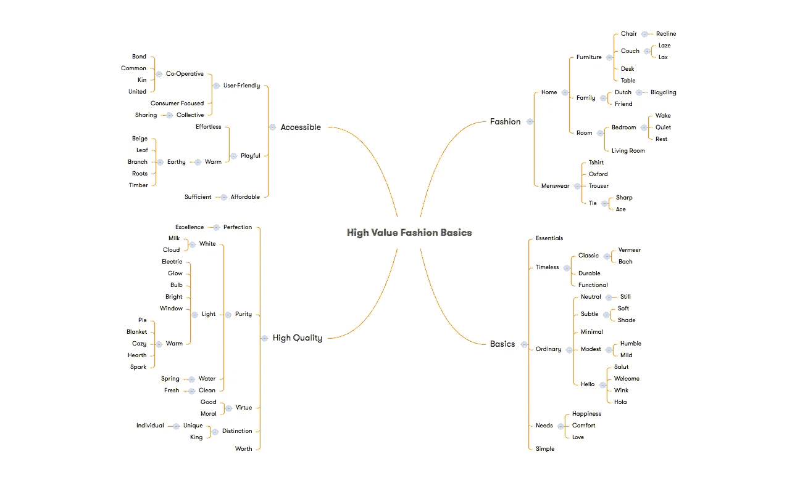
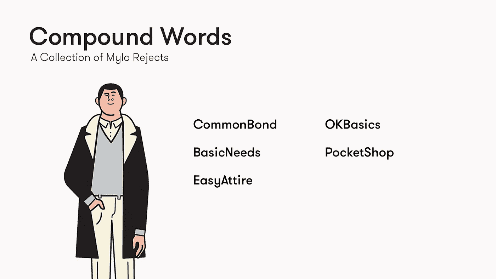
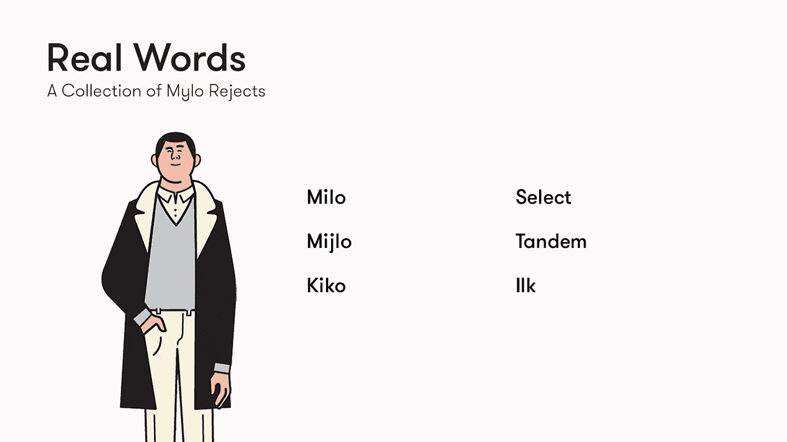
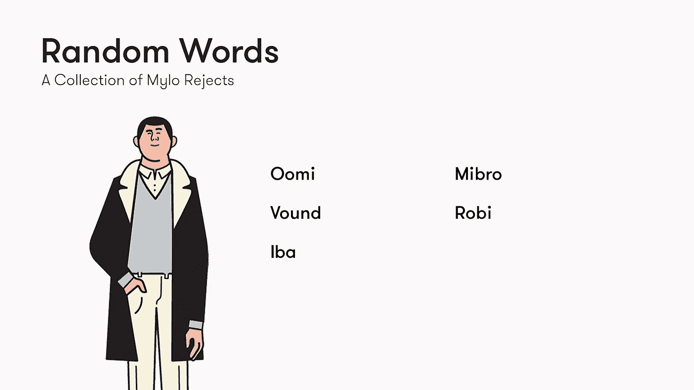
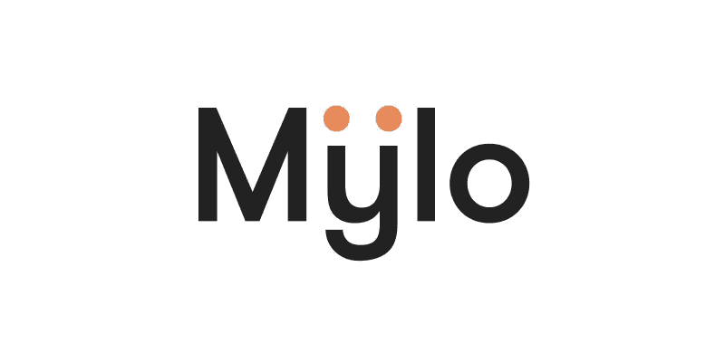

# 如何给独角兽起名:关于给十亿美元的初创公司起名，你需要知道什么

> 原文：<https://medium.com/swlh/how-to-name-a-unicorn-what-you-need-to-know-about-naming-a-billion-dollar-startup-e52b12cd7f77>

使用我们的公司 [Mylo](http://www.okmylo.com) 作为案例研究，以及一些独角兽和成熟的科技公司作为参考，我们将探索一个可靠的名字的要素，并确定给你的创业公司命名的最佳路径。

这里的建议是针对初创企业/域名的，所以如果你在寻找可能适用于非初创企业的广泛建议，有很多资源可供参考。 [*你好我的名字叫牛逼*](http://www.amazon.com/Hello-My-Name-Awesome-Create/dp/1626561869/ref=sr_1_1?ie=UTF8&qid=1441284809&sr=8-1&keywords=hello+my+name+is+awesome) 和[*word craft*](http://www.amazon.com/Wordcraft-Turning-Little-Words-Business-ebook/dp/B000FC1LRO/ref=sr_1_1?ie=UTF8&qid=1441284827&sr=8-1&keywords=wordcraft)*这两个头衔我绝对推荐给更传统的企业。*

# *什么是好名字？*

*考虑你名字的主要目标是很重要的。要考虑的两个最常见的方向是:*

*   *描述性的:一个能清楚表达你的服务的名字*
*   *摘要:作为品牌基础的名称*

*这两个方向之间可能会有一些重叠，但选择一条路径来锚定你的头脑风暴和决策过程是有帮助的。*

*考虑未来也很重要。*

*例如，Dollar Shave Club 是一个每月销售廉价剃须刀的品牌的令人难以置信的名字，但如果他们想扩展他们的产品线，他们的名字就会变得有点混乱，并可能产生误导。相比之下，他们的主要竞争对手 Harry's 正在打造一个高端浴室品牌，产品种类繁多，他们的名字不会造成任何问题。*

## *该做什么和不该做什么*

*以下品质是一个伟大名字的核心。没有必要拥有所有这些，但它们是明确的:*

*   *它简短、简单、朗朗上口。*
*   *它创造了一幅强烈的精神画面。*
*   *它的搜索引擎优化友好，以确保它会显示在谷歌的结果时，有人直接搜索它。*
*   *它很容易被“鞭笞”。例如，人们经常说他们“谷歌”了一些东西。*
*   *它解释了你的使命或庆祝你的好处。*
*   *它在某种程度上是有意义的，会引起他人的共鸣，其起源的故事也很有趣。人家要问了！*

*你的名字具有以下特征吗？如果有，就当是**不要**:*

*   *拼写问题:有人会在谷歌搜索你的名字时遇到麻烦吗？*
*   *抄袭:和竞争对手的名字太像了。*
*   *太随意，和你的品牌脱节。*
*   *您的域名不可用。*
*   *你的名字在另一种语言中是无礼的。*
*   *它有一个笨拙的字符序列。比如:Fashionnews(双 n 对他们没有任何好处)。*
*   *很难发音。*

**

# *如何想出一个名字*

*下面你会发现一个关于创业公司命名的想法和资源的详尽列表。不是每个方向都适用于每家公司，但是花几分钟考虑整个过程将有助于产生想法，并可能引导你走上一条你可能不会走的路。*

## *建立一个相关词汇的网络*

*设计一长串与你的公司相关的词:它的价值观；你正在开发的产品；你所在的行业；等等。要详尽。*

*一旦列表完成，梳理列表中的每一个条目，开始建立一个与每个单词相关的同义词网络。向一本辞典介绍你自己，它会成为你最好的朋友。它还会不时地帮助谷歌图片搜索，因为它可能会挖掘出一些你自己可能不会产生的非常规联想。*

**

*例如:如果你像 Mylo 一样，碰巧正在开发一个专注于高时尚价值基础的应用程序，你的列表可能由时尚(男装)、高品质(价值、卓越、美德、纯洁、完美)和可访问(用户友好、负担得起、好玩)等词或短语组成——同义词或关联词显然列在括号中。*

*当你继续开发一组同义词和相关单词时，明智的做法是建立一个单词图来帮助可视化你的进展。可以探索的几个途径是:*

*   *一个与基础相关的词汇网:必需品、永恒的、普通的、需要的、简单的*
*   *品质通常与永恒这个词联系在一起:经典、耐用、实用*
*   *与普通相关的典型短语:你好，敬礼，眨眼，欢迎，你好*
*   *基本需求引发的感觉:舒适、快乐、爱*

*关键是集思广益，形成一个详尽的同义词网，直到你发现自己被一些实质性的东西所吸引。理想情况下，你会有足够的材料，你可以挑选你最喜欢的。*

> *资源: [XMind](https://www.xmind.net/) 、 [Wordnik](https://www.wordnik.com/) 、[词库](http://www.thesaurus.com/)、[免费词典习语搜索](http://idioms.thefreedictionary.com/search)、[都市词典](http://www.urbandictionary.com/)、 [Pinterest](https://www.pinterest.com/) 、[谷歌图片](https://images.google.com/)*

## *通用工具*

*一旦你深入下面的某个特定方向，我们会推荐各种相应的工具。也就是说，我们还为一般的头脑风暴创建了一个简短的有价值的资源列表，包括:*

*[命名站](http://www.namestation.com/)*

*这是列表中唯一需要花钱的工具(30 天 12 美元)，但它非常值得。Namestation 可以完成几乎所有其他工具的任务，你不需要超过 30 天的时间就可以想出一个名字(所以 12 美元的费用是一次性的)。*

*如果你觉得特别懒，你可以让公众为你工作:Namestation 将在你的要求下组织一次命名比赛。对于那些不愿意为域名竞赛付费的人来说，另一个好工具是[商业名称生成器](https://gospaces.com/tools/business-name-generator/)。*

> *资源: [Bustaname](http://www.bustaname.com/) ， [Panabee](http://www.panabee.com/) ， [Namemesh，](http://www.namemesh.com/) [Domize](https://domize.com/) ，[域名大脑](http://domainnamebrain.com/)*

**

*复合词可能是最常见的创业公司名称，这是有原因的:它们是最令人满意的头脑风暴。这个过程相当简单:头脑风暴收集一些与你的公司相关的描述性或抽象的词语，将它们组合起来，并不断重复，直到有东西粘在一起。*

*一些著名的创业公司使用复合词的例子包括:脸书、Snapchat、EverNote、Firefox、Photobucket、Salesforce、Wordpress、YouTube、Flipboard、Paypal*

> *资源:[不可能](http://impossibility.org/)，[域名生成器](http://www.dotomator.com/)，[域名生成器](http://www.namestall.com/domain-name-generator)*

*短语&双关语*

*创业公司中的另一个普遍趋势是将两个常用词结合起来，否则它们将成为语法正确的句子的一部分。*

*我们推荐 [Ubersuggest](http://ubersuggest.org/) 和[免费字典](http://www.thefreedictionary.com)(使用其以函数开头和以函数结尾)来帮助你找到与你的单词表相关的常用短语。[双关语生成器](http://www.PunGenerator.org)将有助于改变常用短语。*

*众所周知，使用复合词的创业公司包括:DropBox、LinkedIn、MySpace、SecondLife、StumbleUpon、About。我，Kickstarter，Opentable*

*Mylo 拒绝:BacktoBasics，SoSimple，MyNeeds，EveryWear，ShopDrawer*

***押韵词***

*如果你是一家相对不知名的初创公司，口碑是有价值的，这意味着你的名字留下来很重要。如果你正在和某人谈论流媒体音乐服务，很容易就能想起一个押韵的名字，比如 Soundcloud。*

*你最不希望看到的是有人在谷歌上搜索“流媒体音乐”，而他们正在专门寻找你的产品。很有可能，你所在类别的品牌领导者会在他们发现你之前很久就出现了。简而言之，复合押韵的名字往往会粘在一起。*

*众所周知的使用复合词的例子包括:SoundCloud，GrubHub，SeatGeek，Fitbit，Sunrun*

*Mylo 拒绝:最佳着装，嗨！买，需要轮胎，他需要，DudsBud*

> *资源: [Wikirhymer](http://Wikirhymer.com) ， [Rhymezone](http://www.rhymezone.com)*

**

*没有大笔预算，很难打开字典，选择一个你喜欢的单词，并创建一个网络域名。原因？域名抢注者可能已经捷足先登了。幸运的是，如果你找到了一个你喜欢的单词，有很多创造性的方法来改变你潜在的名字，并确保一个稳固的域名。*

***公文包***

*组合词是单词的语言学混合，将它们各自的发音和意思结合起来，创造出一个全新的单词。*

*组合词是非常强有力的名字，因为它们有可能传达你公司的精神、目标和方向。如果你创造了一个坚实的组合词，它听起来会像一个一直存在的词。*

*众所周知的利用 portmanteaus 的创业公司包括:Pinterest、Zenefits、SpaceX、Yelp、Netscape、微软、Instagram、Epicurious*

*Mylo 拒绝:简单，精炼，需要，基本，重要*

> *资源: [WerdMerge](http://wwww.WerdMerge.com) ，[发明一个词](http://www.degraeve.com/invent-a-word/)*

***前缀+后缀***

*向首选单词添加前缀、后缀或数字是查找可用域名的简单方法。有时，这可能会产生一个伟大的名字，但你也有听起来做作和/或与其他公司相似的风险。*

*更保守的方向是在名字的前端或后端加上一个常用词，以保证域名的安全。www.mylo.com 是一个擅自占地者的 Mylo 领地，所以我们设计了一个简单、朗朗上口的词来赞美 Mylo，最终我们决定选择 okmylo.com。*

*利用后缀的创业公司的著名例子包括:Spotify、Cloudera、Friendster、Napster、Shopify、Visual.ly、Bit.ly*

*Mylo 拒绝:Simplete，Incommon，Eversimple，Commonwear，Basic.ly，Himylo，Heymylo，Seemylo，Myloshop，Mylogoods*

> *资源: [Wordoid](http://wordoid.com/) ， [Mixnomer](http://www.mixnomer.com/) ， [Namevine](http://namevine.com/) ，[精益域名搜索](http://www.leandomainsearch.com/)， [Domainr](https://domainr.com) ，[我要我的名字](https://iwantmyname.com/)*

***拼写错误***

*通过替换、添加或删除字母来拼错单词是域名获取中使用的另一种常见策略。以这种方式生成的名称可以是独特的、有意义的和简短的。不幸的是，它们听起来也可能不自然，所以用这种方式进行头脑风暴时要特别小心。*

*众所周知的拼写错误的初创公司包括:Flipkart、Lyft、Houzz、Flickr、Tumblr、Digg、Reddit*

*Mylo 拒绝:Basix，Grabbit，Simpl，Fownd，Sollo*

> *常见的拼写错误包括:er>r，i>y，le>l，z>x，ck>k，c>q，ph>f*

**

*不幸的是，重新定义的单词很难使用。如果它们是在描述性意义上使用的，它们就不是受保护的商标。有可能在间接或隐喻的意义上使用它们，但你需要大量的金钱来保护一个休眠的域名。*

*以下技巧考虑到了这一点，并反映了这些限制。*

***姓名***

*自贸易出现以来，企业就以真人命名。在科技界，最著名的例子是戴尔、惠普和 Craigslist。近年来，出现了一种趋势，即虚构的人物角色充当与公司同名的角色。*

*以不存在的人命名的创业公司的著名例子包括:奥斯卡、沃比·帕克、阿尔弗雷德*

*Mylo 拒绝:米洛，米基洛，纪子，海，一月*

***略微抽象的品牌描述性词语***

*有时候，一个随机的、稍微不相关的名字可能会让你大吃一惊——一个如此完美的名字，你都不敢相信自己以前没有想到过。这些场合让人感觉不可思议，但它们通常是数小时研究和头脑风暴的结果，并且经常在你有一秒钟放松的时候浮现出来。*

*以下名称可能是也可能不是“闪电”效应的结果，但他们在保持抽象距离的同时传达其品牌核心价值的卓越能力很有趣。*

*这些品牌包括:苹果、亚马逊、谷歌、Slack、Vice*

*Mylo 拒绝:筛选，保留，选择，独奏，捕捉*

***杂字***

*虽然前一批名字似乎是随机挑选的，但它们至少与自己的品牌有着关联——它们设法以一种象征性的方式传达了有关其业务的一些信息。*

*然而，还有其他一些品牌，它们的名字似乎是从天上掉下来的，与它们所经营的业务没有任何联系。有时，这些名字会起作用，但是很难提供一个强有力的原因。充其量是个主观领域。开始吧！*

*众所周知的创业公司使用杂词的例子包括:、Square、Stripe、Monster、Sun、Lotus、Wink*

*Mylo 拒绝:亲，标签，串联，之流，薄荷*

**

***编了话***

*时间在流逝，你的最后期限很快就要到了，你还没有找到一个词来表达你的品牌宗旨，更不用说它的精神了。你的词库已经枯竭，你已经用光了你父亲所有的复合双关语，而你还在原地踏步。*

*这可能是孤注一掷，但品牌为了抓住其本质而创造一个全新的词并不罕见。*

*发明全新词汇的创业公司的著名例子包括:Zynga、Zappos、Theranos*

*Mylo 拒绝:Oomi，Vound，Iba，Mibro，Robi*

> *资源: [Wordoid](http://wordoid.com/) ， [FakeWord](http://fakeword.com/) ，[域名漏洞生成器](http://www.domainhole.com/generator/)， [Namebird](http://shobia.com/namebird)*

***首字母缩略词***

*如果你的创业公司已经有了一个既定的名字，感觉有点过时、保守或乏味，你可能有一个简单的解决方案，尤其是如果你的名字恰好有三四个单词长。*

*对于以创始人名字为特色的企业来说，使用首字母缩略词也很常见。IBM(国际商业机器公司)是一个很好的例子，它是一个以前没有名字的公司。*

*其他知名的使用首字母缩写的创业公司包括:AirBNB、AOL、ICQ、AIM*

# *祝你好运*

**

*如果你已经进行了广泛的思维导图绘制，并且想出了一个令人印象深刻的单词列表，那么你就有机会对你的品牌价值以及它们之间的相互作用有一个坚实的理解。这里是你的潜意识将要发光的地方。*

*当我给一家公司命名时，我选择的名字通常会在安静的时候出现。这可能让人感到幸运和意外，但它总是大量有意识的工作、研究和调查的结果。*

*在对 Mylo 进行头脑风暴时，我们从哲学和美学角度受到了无印良品和宜家的启发。我们喜欢它们植根于各自国家身份的程度:分别是日本和瑞典。在发展我们的品牌时，很明显我们应该植根于我的荷兰传统。*

*荷兰体现了许多我们已经考虑过的价值观，我母亲的家族拥有一家著名的拍卖行，在阿姆斯特丹附近出售家具。基础似乎已经奠定，尤其是考虑到我们进军基本家居用品和家具的最终计划。*

*在寻找一个能抓住我们民族精神的荷兰语单词失败后，我想起我母亲原本打算叫我 Kiko，这个名字我从年轻时起就没怎么想过。*

*这个名字不太对，但它促使我研究荷兰最受欢迎的男性名字——其中包括米洛。这个名字引人注目——马上就感觉对了。它简短、朗朗上口、友好。为了避免与 Milo 混淆，Milo 是一种在东南亚非常受欢迎的巧克力牛奶饮料，我们把 I 换成了 y，于是 Mylo 诞生了。*

# *如何选择名字*

*你已经创建了思维导图，用尽了互联网上的每一个资源，头脑风暴出了一个你最喜欢的名字的列表，那么你最终是如何选择的呢？通常有一个名字“感觉对”。如果你没有一个明确的赢家，下面的提示可能会有所帮助。*

## *检查姓名是否可用*

*大多数上述工具会自动检查域名的可用性，理想情况下，你的列表中没有任何不可用的域名，但是如果你还没有检查，现在是时候了。 [GoDaddy](http://www.godaddy.com) 可以轻松做到这一点。*

*接下来，您需要验证您的名字在您打算使用的社交媒体平台上的可用性。在[姓名栏](http://www.namechk.com)和/或[姓名栏](http://www.knowem.com)中输入你的名字可以让你更容易做出艰难的决定。*

## *检查姓名的合法性*

*如果你的域名、社交网站和谷歌搜索都没有为你感兴趣的名字找到一个有竞争力的词，那么它很可能不存在。也就是说，最好仔细检查一下，确保没有其他人注册过这个名字。*

*为了确定你的名字是否会给你带来法律上的麻烦，检查一下竞争的名字，看看他们的商标是否仍然有效。研究他们的行业和地区总是明智的。在美国，这可以在美国专利商标局很快完成。如果你对以上任何一点都不确定，咨询律师是明智的。*

## *测试你的最终选择*

*与朋友和家人谈论你的公司。当你描述你的工作时，说出你最喜欢的名字选项。对话结束后，问他们是否记得公司的名称，如果记得，请他们拼写给你听。*

*如果他们很难记住你的名字或者怎么拼写，你可以考虑稍微修改一下，让它更简单。*

*在 [Survata](https://www.survata.com/) 测试你喜欢的名字也是一个好主意，它允许你创建多达 24 个选项的调查。Survata 很棒，因为你可以针对关键的人口统计数据，每次回复 1 美元。*

# *最后的想法*

*现在，你已经阅读了我们的建议，阅读了前面提到的资源，你离选择创业公司的名字又近了一步。如果你幸运的话，你会在阅读的时候梦到一个。*

*如果我错过了任何关键资源，请告诉我，我会将它们整合到文章中。如果你喜欢，请通过推特或脸书分享这篇文章！感谢阅读:)*

> *如果你喜欢读这篇文章，请点击页脚的♥按钮，这样更多的人可以欣赏伟大的设计！*

**

*大家好，我是[丹尼尔](http://www.danieleckler.com)。我创办了一些公司，包括 Piccsy (acq。2014)和 EveryGuyed (acq。2011).我目前对新的职业和咨询机会持开放态度。通过[电子邮件](mailto:hi@danieleckler.com)联系。*

*本文由[肖恩·朗肯](http://www.shaunroncken.com)合著。*

# *你可能也会喜欢:人性化设计*

*我写的一篇互动文章，探索了拟人化设计的过去、现在和未来。也可用作会议、活动等的演讲。*

* [## 人性化设计

### 1950 年，美国心理学家哈里·哈洛进行了一项实验，将幼猴从它们的…

medium.com](/swlh/the-future-of-design-is-emotional-5789ccde17aa)*