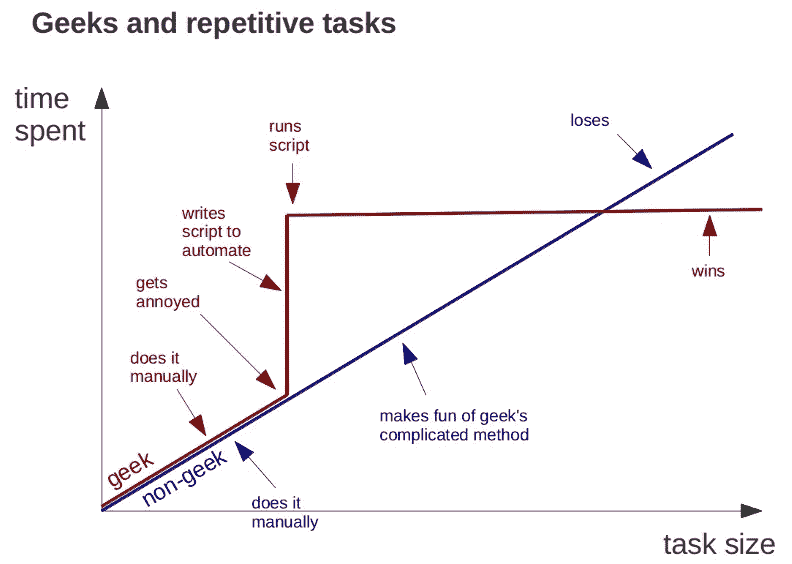
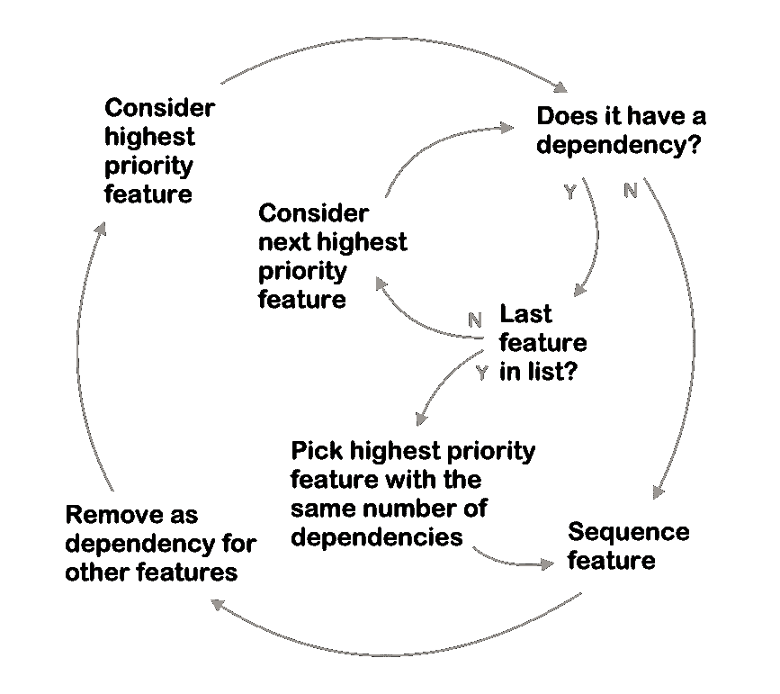
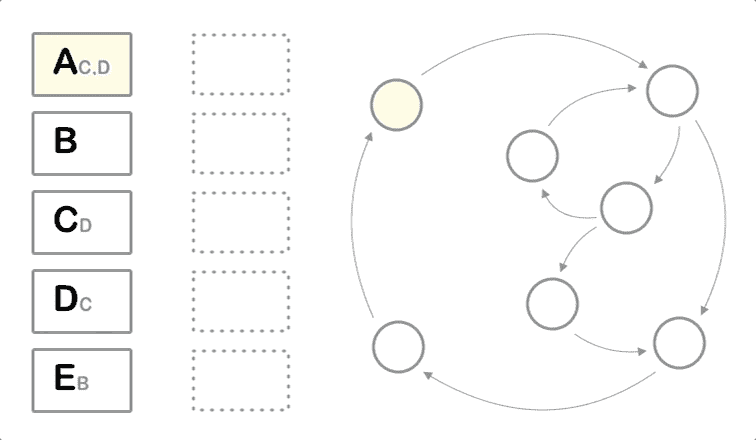

# 帮助您组织功能路线图的简单工具

> 原文：<https://medium.com/swlh/how-to-never-sequence-your-roadmap-manually-again-9766c057b8cf>

## 输入您的项目依赖项，让 python 找出解决它们的最有效方法

My last prioritization meeting

对产品创意进行优先排序从来都不容易。但是，对有如此多的相互联系和依赖的产品想法进行优先排序，以至于你的[实体关系模型](https://en.wikipedia.org/wiki/Entity%E2%80%93relationship_model)要困难得多。

尽管困难重重，但这是任何产品经理工作的关键部分。保持一套组织良好的优先级可以说是产品经理能做的最有效的事情。

为了使这个过程更容易管理，我通常建议将这个过程分成两个不同的步骤:排序和排序。

**排名答案:*“抛开所有限制，我们能做的最有价值的事情是什么？”***

**排序答案:*“考虑到我们的优先级和限制，我们接下来最有效的工作是什么？”***

将优先级划分为等级和顺序将问题的思考部分(等级)与问题的机械部分(顺序)分开。对于前半部分来说没有什么灵丹妙药——决定什么是最重要的总是很困难的。但幸运的是，测序是一个可预测的过程，遵循一套一致的规则。

如果您只需要做几次，手动执行这些步骤就可以了。但是，当优先级经常改变和/或出现新的依赖关系时，一遍又一遍地重新计算最佳特性顺序很快就会变成一件痛苦的事情。

在花了太多时间手动排序和重新排序特性列表之后，我决定用一个简单的 python 脚本来自动化这个过程。

This is your brain, this is your brain on Python

# 它是如何工作的

该脚本从读取 CSV 文件开始。该文件列出了特性、它们的相对优先级以及它们之间的任何依赖关系。这里有一个输入 CSV 的例子。

A sample input CSV

加载数据后，脚本开始遍历要素列表，并根据一组规则对它们进行排序。一般来说，脚本首先选择高优先级、低依赖性的特性，最后选择低优先级、高依赖性的特性。下面是一个流程图，更详细地描述了准确的特征选择逻辑。

The script’s sequencing logic

为了使流程图对像我这样的视觉学习者来说更容易理解，我在上面的示例 CSV 中一步一步地展示了这个过程。突出显示了脚本关注的位置以及脚本正在执行的操作。蓝色和红色下标分别显示打开的和已解析的依赖关系。

The sequencing algorithm in action

脚本完成后，它将结果打印到一个类似这样的表中。

A sample output CSV

您会注意到两个新列。鉴于这些特性的优先级和依赖性，这是处理这些特性的最佳顺序。`priority_change`追踪要素顺序的变化程度。

# 运行脚本

先决条件:

*   正在运行的 Python 3 安装
*   安装了`numpy`和`pandas`包
*   基本了解如何使用命令行在电脑中导航

如果这些项目对你来说是陌生的，那么你有两个选择。第一种选择是在这里停下来，下次你必须优先考虑工作时使用上面的方法和流程图。那是一个完全合理的决定，我不会责备你做了这个决定。

第二种选择(我希望您采纳)，是花一两个小时学习 Python 和命令行。不管你的角色是什么，从长远来看，拥有哪怕是基本的技术能力都会带来巨大的回报。在谷歌上快速搜索会找到大量的学习资源。看起来《姜戈女孩》有一本不错的入门书，但是还有很多其他的。随意挑选一个符合你学习风格的。

既然基础知识已经介绍完毕，下面是运行脚本的方法:

1.将下面的代码保存到一个文件名对你有意义的文件中(我选择了`prioritize.py`)。

2.使用上面输入的 CSV 格式，在与 python 脚本相同的文件夹中创建一个 CSV(我称之为 mine `source_features.csv`)。在该 CSV 中，列出您希望排序的功能、优先级和依赖项。

3.打开终端，使用`cd`导航到存放 python 脚本和输入 CSV 的文件夹。

4.使用`python3 YOUR_SCRIPT_FILENAME --source YOUR_INPUT_CSV_FILENAME`运行脚本

5.尽情享受吧！

默认情况下，脚本将结果打印回命令行。如果您想将输出打印到另一个 CSV 文件，请在命令中添加`--output`标志和目标文件名(例如:`python prioritize.py --source source_features.csv --output sequenced_features.csv`)

快乐优先！

# 剧本

> 注意:这是一个简化的模型！它没有考虑到一些困难，比如不同的开发时间和并行工作。如果输出与您知道的可能结果不太一致，那么就调整它！一如既往，做对自己有意义的事。
> 
> 如果你需要一个帮手来考虑你的情况，请在下面评论或者在 [twitter](http://www.twitter.com/mvwi) 上给我发一条消息。

## 这篇文章发表在 [The Startup](https://medium.com/swlh) 上，这是 Medium 最大的创业刊物，有+401，714 人关注。

## 订阅接收[我们的头条](http://growthsupply.com/the-startup-newsletter/)。

