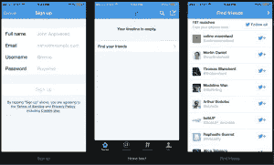
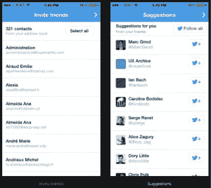
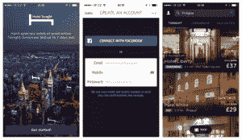
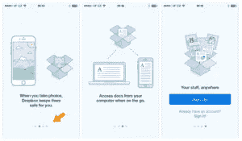
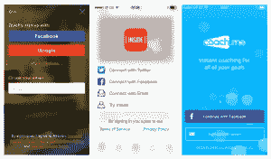
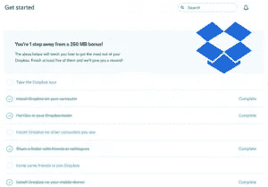
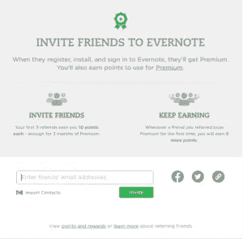
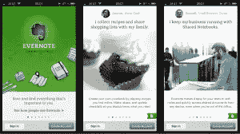
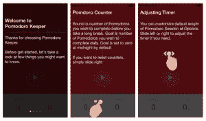
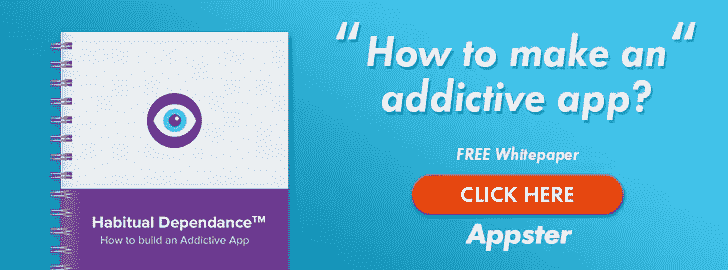

# 如何优化应用上线以最大化客户转化率

> 原文：<https://medium.com/swlh/how-to-optimize-app-onboarding-to-maximize-customer-conversions-c344b6625934>

目前谷歌的 Play Store 上有 280 万个[应用可供下载](https://www.statista.com/statistics/276623/number-of-apps-available-in-leading-app-stores/)，苹果的 App Store 上还有 220 万个。尽管有这些数字，研究表明，近 85%的智能手机使用量分配给了 5 个或更少的应用程序[；几乎五分之四的用户](https://techcrunch.com/2015/06/22/consumers-spend-85-of-time-on-smartphones-in-apps-but-only-5-apps-see-heavy-use/)[在第一次安装应用程序 72 小时后再也不会使用它。移动应用程序创作显然是一个竞争极其激烈的市场。如果你是一个希望设计下一个大应用的初创公司创始人，那么你必须在客户第一次体验你的产品后留住他们。在本文中，我将讨论 6 个应用程序入门最佳实践，以促进有效的客户转化和保留。](http://www.androidauthority.com/77-percent-users-dont-use-an-app-after-three-days-678107/)

# **什么是 App Onboarding？**

App Onboarding 可以理解为“用户 Onboarding”的一个关键组成部分。

appcues.com 的 Jackson Noel 为用户入职提供了以下有用的描述:

*“在软件领域，用户入职是用户对你的品牌、产品和人员的最初体验。它从有人开始注册你的产品开始，一直延续到他们意识到你的产品将如何改善他们的生活，[也就是]他们的“惊叹时刻”。用户入门的目标是帮助用户找到你的产品的核心价值，并定期从中受益。*

因此，用户入职就是将潜在客户转化为忠诚用户，或者更好地转化为 Pulkit Agrawal 所说的“[支持者用户](https://www.trychameleon.com/blog/what-is-user-onboarding)”，即愿意为你庆祝和推广你的产品的用户。

当我们特别谈到**应用加入**时，我们关注的是向用户介绍你的应用，让他们熟悉它的工作方式，并说服他们成为长期用户的整个过程(来源: [1](http://info.localytics.com/blog/app-onboarding-101) 、 [2](https://www.shopify.com/partners/blog/mobile-app-onboarding) 、 [3](http://www.elasticode.com/what-is-onboarding.php)

应用程序上线的主要目标是在使用你的应用程序的过程中温和地引导用户，直到他们最终“啊哈！“时刻”，即他们真正认识到你的应用为他们的生活提供的*价值*的时刻，然后他们成为忠实用户。

鉴于绝大多数用户会在安装后的 3 天内永久放弃最近下载的应用[，实践有效的应用上线对于建立你的用户基础和](http://www.androidauthority.com/77-percent-users-dont-use-an-app-after-three-days-678107/)[留住你的客户](https://www.ngdata.com/what-is-customer-retention/)至关重要。

App onboarding 是你的[客户获取成本](https://blog.kissmetrics.com/customer-acquisition-cost/) (CAC)的基本组成部分，即把潜在用户转化为付费客户的成本。

[正如我们过去在 Appster 指出的那样](http://www.appsterhq.com/blog/3-crucial-features-high-growth-startups),“对于初创公司来说，高 CAC 往往是致命的”。

以及 app onboarding 和 CAC 有什么联系？

在缺乏有效的入职流程的情况下，你的初创公司必须在不那么直接/互动的营销方法上花费更多的钱，以努力接触到你的关键用户群。

在低效的广告形式上花更多的钱是没有意义的，所以开发一个成功的应用程序上线过程显然是一条路要走。

幸运的是，作为一家在 2017 年运营的初创公司，你可以从你之前的其他公司所犯的错误中吸取教训。

例如，Dropbox、脸书和 Twitter 都发现，让新用户完成一项或多项特定任务是将他们转化为长期用户的关键:

*   Dropbox:用户将至少一个文件放入他/她的新 Dropbox 文件夹
*   脸书:用户在注册后的前 10 天内与至少 7 个人成为“朋友”
*   Twitter:用户在加入后不久就关注了 10 个人

因此，每个应用程序/平台都对其入职流程进行了更改，以促进这些活动(如 Twitter 实施个性化的“建议”，供人们在用户注册账户后立即遵循)。

Twitter onboarding，提供个性化的“关注”建议:

(图片[来源](http://uxarchive.com/apps/twitter)

有效的应用程序开发需要正确的组合，既要教育用户如何使用，又要向用户推销你的应用程序所提供的价值。

这里有 6 种方法可以优化你的应用程序，以最大化你的客户转化率和保留率。

# **1。减少摩擦**

通过消除注册过程中不必要的障碍，例如多余的副本、冗长的文本解释、不必要的表单字段，甚至产品本身的琐碎功能，你可以增加新用户完成注册并热情使用你的应用程序的可能性。

作为这一步骤的一部分，来自 Localytics 博客的 Megan Marrs 强调了 [3 个要点](http://info.localytics.com/blog/app-onboarding-101):

1.  坚持基本原则，不要强迫用户在最终使用你的应用之前一屏一屏地滑动
2.  避免过多的文字解释，选择应用程序截图和插图
3.  不要让你的用户不知所措:每个屏幕只展示一个功能解释

对此我要补充的是:尽量减少用户在最初下载你的应用程序和“啊哈！瞬间”。

酒店今晚简单的注册流程，根据当前位置提供个性化服务:

# **2。提供进度的清晰指示**

[研究表明](https://blog.kissmetrics.com/the-progress-bar/)人们喜欢使用进度指标，当被要求处理提供进度指标的任务时，特定技术用户体验到更高的满意度并表现出更高的参与度。

让用户清楚地知道完成一项任务需要多少步骤，可以大大减少用户的放弃，从而鼓励“啊哈！瞬间”。

这是我们在日常生活中都会遇到的事情。

无论是大学课程要求的考试次数，偿还债务必须支付的月付款额，还是从宜家制作一张桌子的步骤数量，如果我们确切知道完成一件事情需要多长时间，我们更有可能坚持到底。

移动应用程序中的进度指示器通常采用小圆圈或视差图的形式，代表任务已经完成了多少，还有多少工作要做。

Dropbox 在入职流程中使用的介绍/欢迎屏幕就是一个很好的例子:

# **3。使用社交注册**

简化入职流程的一个非常有效和简单的方法是合并社交网络注册(和登录)并使用它们来代替全面的注册(和登录)字段。

如今，一键式社交注册变得越来越受欢迎，用户无需填写任何个人信息，就可以极其轻松地注册你的应用或网站。

(就社交注册消除注册障碍而言，它们也是上述策略 1 的一个例子，即减少摩擦)。

除了提高速度，社交注册也很有价值，因为它让你的用户更容易联系到他们的社交联系人。

这增加了用户帮助他们的朋友/同事迁移到你的应用的机会。

根据你的应用程序的权限，社交注册也可以让你作为一个公司更容易地锁定用户的社交联系人并与之互动。

整合了社交注册选项的大型初创公司包括 Airbnb、Medium、Quora、优步和 Vimeo。

要了解更多关于在你的应用或网站上建立社交注册(或登录)的技术程序，请查看以下开发者链接:

*   [脸书](https://developers.facebook.com/docs/facebook-login)
*   [谷歌](https://developers.google.com/identity/sign-in/web/)
*   [推特](https://dev.twitter.com/web/sign-in)

各种提供社交注册作为入职流程一部分的应用示例:

# **4。提供激励**

将你的潜在客户转化为长期用户的另一个有效方法是在你的应用程序上线过程中加入激励措施，即免费赠品。

从本质上说，你通过免费提供一些有价值的东西来激励那些下载和安装你的应用程序的人继续定期使用它，仅仅是为了完成简单但重要的任务。

例如:

*   [Dropbox](https://www.dropbox.com/help/space/get-more-space) 允许免费用户通过完成其官方入门指南、推荐其他人注册该服务、在多台电脑上安装 Dropbox 等方式积累更多免费空间。
*   Evernote[运营着一个双边推荐系统，用户可以积累点数以获得额外的存储空间或免费的高级服务来推荐他人](https://help.evernote.com/hc/en-us/articles/208314268)
*   Lyft 和[优步](https://help.uber.com/h/03db9e2b-270b-4fdb-95a7-afce7c6b4b3b)都利用双重奖励推荐系统，鼓励当前用户让他们的朋友/同事注册服务

Dropbox 的 250mb 免费赠品既使用了激励措施(即完成特定任务的免费空间)，也使用了我们所谓的“[游戏化](https://www.researchgate.net/profile/Juho_Hamari/publication/259841647_Defining_Gamification_-_A_Service_Marketing_Perspective/links/0c96052e13e865be00000000/Defining-Gamification-A-Service-Marketing-Perspective.pdf)”(即在完成一组任务时融入类似游戏的元素，从而利用人类的动力来克服“障碍”，积累成就，并获得对我们“胜利”的认可):

Evernote 的推荐计划:

(图片[来源](https://www.referralsaasquatch.com/assets/20-evernote-referral.png)

# **5。提供用例**

成功引导新用户走向“啊哈！Moment”是创建和提供用例，即展示其他人使用该应用程序并从中受益的实例。

尝试将图片、视频教程，甚至简短的音频剪辑整合到您的应用程序上线过程中，以展示使用您的应用程序的基础知识以及与此相关的巨大价值。

你的用例是一个特别重要的媒介，通过它你可以令人信服地确立你的应用的价值，特别是因为这些例子代表了一个机会，让你清楚地展示*为什么*任何人都想长期使用你的应用。

正如来自 Localytics 博客[的 Megan Marrs 强调的](http://info.localytics.com/blog/app-onboarding-101):

*“许多应用犯了一个错误，告诉用户他们应用的花哨功能，而不是向用户展示他们的应用如何让用户的生活变得更好。…是的，令人兴奋的特性和令人印象深刻的功能很重要，但向用户展示他们可以用这些特性做什么，[即]* ***你的价值主张*** *，将会赢得他们的长期支持。*

下面是 Evernote 的一个简单而有效的用例示例:

(图片[来源](http://uxarchive.com/apps/evernote)

# 6。使用简短而有用的教程

最后，用户通常非常欣赏那些提供简单明了的教程的应用程序，这些教程可以很容易地向他们展示如何使用应用程序的核心功能。

可以找到这种技术的许多不同的例子。

例如，Gmail 提供交互式教程，当新用户在收件箱中移动并开始探索不同的功能时，这些教程会“立即行动”。

Dropbox 使用类似的系统来帮助新用户适应这个平台。

以下是[番茄守护者](https://www.producthunt.com/posts/pomodoro-keeper)提供给新用户的入门教程截图:

**如果您喜欢这篇文章，并想了解更多关于客户转化和保留的信息，请务必下载我们的免费白皮书**:

*最初发表于*[*Appsterhq*](http://www.appsterhq.com/blog/app-user-onboarding)*。*

## 这个故事发表在 [The Startup](https://medium.com/swlh) 上，这是 Medium 最大的企业家出版物，拥有 294，522+人。

## 在此订阅接收[我们的头条新闻](http://growthsupply.com/the-startup-newsletter/)。

