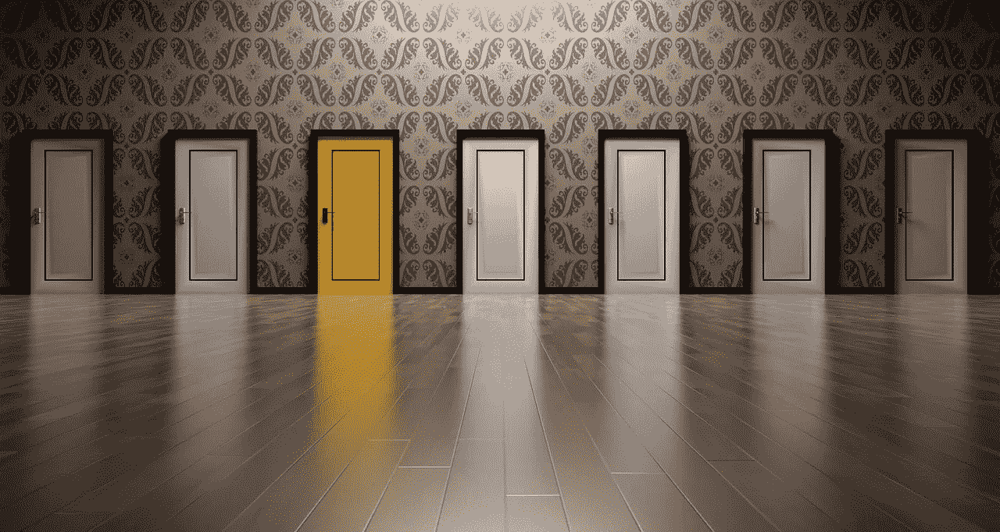

# 如何优化你的决策过程

> 原文：<https://medium.com/swlh/how-to-optimize-your-decision-making-process-c76f93c0cb5c>

[qimono/pixabay](https://pixabay.com/en/doors-choices-choose-open-decision-1767563/)

做决定是最累人的心理过程之一。做一系列的决定会耗尽你的大脑，结果，你的决定质量直线下降。这种现象被称为**决策疲劳**。

成功的生活需要大量高质量的决策，但我们做决策的能力有限。这是一个问题，这个问题可以通过优化我们的决策过程来解决。我将讨论几种优化决策过程的方法。如果你有其他方法或想法，请在评论中告诉我。

**(大多数时候)不做决定是最糟糕的决定。**

果断是成功人士的性格特征。成功的人做决定，执行决定，然后处理结果。

*   做个决定，
*   行动起来，
*   并处理结果。

你可能会认为这个顺序的反面是

*   不要做决定，
*   待在原地，
*   也不去处理结果。

第二个序列可能看起来对你更有吸引力，因为你不需要花心思去做决定。你不需要付出身体上的努力来采取行动。最重要的是，你不需要处理结果。这是一个[错觉](https://ideavisionaction.com/personal-development/you-are-delusional/)。

当你原地不动的时候，世界正在向各个方向发展。时间在流逝。你在这个世界上的时间是有限的。这意味着，不做决定本身就是一个决定。它有它的结果，你必须处理这些结果。

在一些罕见的情况下，不做决定可能是更好的决定。所谓的“等着瞧”的方法在一些混乱的情况下可能是更好的方法，但大多数时候，这是最糟糕的决定。

例如，考虑在两份工作中做出选择。如果你在两个工作机会之间犹豫太久，你最终会失去两个工作机会，因为它们可能会被其他候选人填满。如果你在两个假期选择之间犹豫太久，你最终会在家度过假期。

我的笔记本里有上百个想法。我每天挑一个，写一篇关于它的博文。如果我在不同的想法之间犹豫太久，我可能会在那天没有博客文章。

总之，不做决定是一个决定，而且大多数时候是最糟糕的决定。如果你不能做出决定，写下你的选择，剔除不太理想的，在剩下的中随机选择一个。你可以在我的文章《从犹豫不决到做决定的四个简单步骤》中找到更多信息。

**自动化您的决策**

你可能听说过马克·扎克伯格、史蒂夫·乔布斯和阿尔伯特·爱因斯坦每天都穿同样的衣服。他们这样做的原因是为了从日常生活中减少一个决定。记住，你所做的每一个决定都消耗了你在一天剩下的时间里有限的决策能力。

你可以自动做出一些简单的决定，比如你要穿什么，要吃什么。我不会每天都穿同样的衬衫，但我选择衬衫的过程相当简单。只穿衣柜里最左边的衬衫。

你可以通过建立日常生活来进一步自动化你的一天。我有一个日常计划，所有的活动如吃饭、写作、健身都有固定的时间和持续时间。我没有严格的时间表，但我或多或少知道我什么时候开始那个活动，在那个活动期间我要做什么，以及要花多长时间。

有一个每日的例行公事在工作中特别有用。你可以把不同的时间分配给不同的活动，每天重复同样的程序。这样你就永远不用考虑下一步要做什么。

我使用自动决策的另一个领域是储蓄和投资。我每个月都会存一笔固定金额的钱，然后投资于指数基金和比特币。这个[自动储蓄和投资系统](https://ideavisionaction.com/personal-development/miserable-or-peaceful-all-by-your-assumptions/)消除了投资过程中的所有情绪，防止我犯那些代价高昂的投资错误。

不必考虑下一步该做什么可以节省大量的决策能力，你可以在一天中做其他更重要的决定。

**自动化决策的负面影响**

制定日常计划的坏处是在它周围创造一个舒适区，并且永远不会改善它。即使有固定的日常生活可以节省大量的精神能量，你也可以根据生活中不断变化的情况来调整它。

您可能希望不时地更新您的流程。过于严格必然会导致失败，而[创新](https://ideavisionaction.com/personal-development/focus-or-innovate/)必须成为你工作、商业和生活的一部分。每日评估是我每日日志练习的一部分，它们帮助我做出必要的修正。

**如何提高你的决策能力**

有效利用你的决策能力是优化你的决策的关键部分。另一个关键部分是提高你的决策能力。

决策是一种肌肉。你可以通过训练你的决策肌肉来提高你的决策能力。只要列出要做的决定，并承诺每天至少做一个这样的决定。

记住，不做决定通常是最糟糕的决定。如果你不能在两个或更多选项之间做出决定，它们同样是好的或坏的。处理决定的后果比做出决定更重要。如果非要抛硬币就好了，这比根本不决定要好得多。

**正念**

决策是一块肌肉，可能会有很多想法、情绪和分心的事情压在这块肌肉上。当你头脑清醒时，你可以做出最好的决定。你可以通过[让](https://ideavisionaction.com/personal-development/how-long-does-it-take-to-let-go/)你的[无用的想法、情绪和杂念](https://ideavisionaction.com/personal-development/this-is-how-the-personal-development-industry-failed-us/)消失，从而实现头脑清晰。

**北极星，价值观，明确目标**

有一颗北极星，一个理想，一个明确的你正在努力的人生目标会让你的决策过程变得非常容易。拥有清晰的目标和价值观可以指导你的决策过程。

当你在做决定时有不止一个选择时，就评估每个选择如何服务于你的北极星、你的价值观和你的目标。一旦你做了这个练习，你对自己诚实了，选择就很明显了。

正确的选择显而易见是一回事，真正做出决定并付诸行动又是另一回事。如果你在这方面挣扎，你可能会想在你的[自律](https://ideavisionaction.com/personal-development/how-to-build-world-class-self-discipline-in-a-single-year/)和[勇气](https://ideavisionaction.com/personal-development/how-to-cultivate-world-class-courage-in-a-single-year/)上下功夫。

**总结**

你所做决定的质量和数量是你人生成功的关键因素。你可以用以下方法优化你的决策过程。

*   要知道没有一个决定是(大多数时候)最糟糕的决定，如果你不能下定决心，就做一个随机的决定。
*   通过创建日常事务来自动化你的决定。不要忘记根据需要更新你的日常作息，以免停滞不前。
*   通过使用和训练你的决策肌肉来提高你的决策能力。
*   用正念增加你的头脑清晰。
*   有北极星。有一套清晰的价值观和目标来指导你的决定。

**披露和免责声明**

*在写这篇文章的时候，我拥有一些间谍和 BTC。这篇文章仅供参考，并非投资建议。*

*阅读下一篇:* [*从犹豫不决到决策者的四个简单步骤*](https://ideavisionaction.com/personal-success/from-hesitant-to-decision-maker-in-four-simple-steps/) *或报名参加* [*每周简讯*](https://ideavisionaction.com/email-newsletter/) *。*

## 这个故事发表在 [The Startup](https://medium.com/swlh) 上，这是 Medium 最大的企业家出版物，拥有 298，432+人。

## 在这里订阅接收[我们的头条新闻](http://growthsupply.com/the-startup-newsletter/)。

