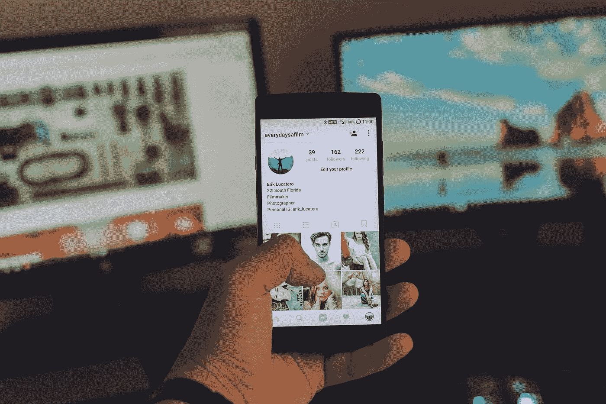
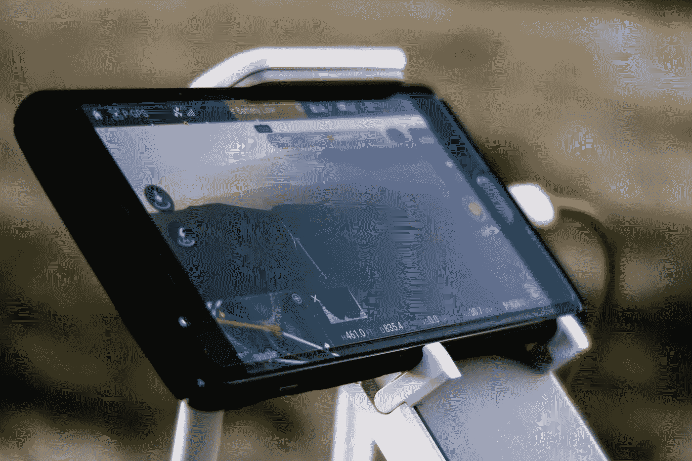

# 如何优化你的谷歌 Play 商店搜索列表

> 原文：<https://medium.com/swlh/how-to-optimize-your-google-play-store-listing-for-search-ad8b9b2ec2dd>

Originally published on [http://www.appsterhq.com](http://www.appsterhq.com/?utm_source=CP&utm_medium=Medium)/

应用商店优化(ASO)是优化移动应用程序的过程，以最大化其可见性，并在应用商店的搜索结果中排名更高。

随着应用程序商店搜索成为发现和下载应用程序最广泛使用的方法，Forrester [的一份报告](https://techcrunch.com/2013/04/17/forrester-app-discovery-report/)表明**63%的应用程序是通过应用程序商店搜索发现的**——如果创业公司和企业不实施 ASO 策略来提高他们的应用程序排名，他们就会忽略一个重要的渠道。

总体目标是增加你的应用页面的流量，这样搜索者就可以下载你的应用。

就像 SEO 一样，ASO 也有元数据上和元数据外的因素。

*   **非元数据因素**——如应用标题或描述——在发行商的控制之下。
*   **元数据外因素**无法控制，但可能会受到开发人员的影响。这些例子包括用户评论和评级，以及下载量。

在 Appster，我们不断寻求提升与我们合作的移动创业公司的应用营销策略。

我整理了一份屡试不爽的 ASO 技巧清单，希望对你有用:

# 1.市场调查

进行深入的市场调查是制定有效的 ASO 战略的第一步。

为了增加你的下载量，你需要清楚地了解你的客户，谁是你的竞争对手，他们采用的策略，以及你的目标用户对他们的看法。

从站在客户的角度出发。以下是指导您完成这一过程的一些问题:

*   他们使用什么语言和术语？
*   他们会如何描述我的应用程序？
*   他们会如何描述自己的需求？
*   促使用户开始搜索我的 app 的因素有哪些？

接下来，你需要了解你的应用在竞争环境中的表现。问自己这些问题:

*   我的竞争优势是什么？
*   我的竞争对手针对的关键词是什么？
*   我在相同的关键词上与其他应用竞争的机会有多大？

# 2.关键词优化

虽然[应用商店](https://www.appsterhq.com/blog/app-store-optimization/)有一个 100 个字符的关键词字段，但谷歌 Play 商店采用了一种更类似于 SEO 的方法——你的应用描述最多被分配**4000 个字符**，文本被扫描以寻找相关关键词。

关键是专注于为你的用户写作，而不是在你的描述中尽可能多地填充关键词。

当涉及到应用排名时，转化率也被考虑在内——一个写得不好的描述和不相关的关键词将无法吸引客户下载你的应用。

请记住，关键字优化是一个持续的过程。

每天都有大量的应用发布，你的应用排名会受到新评论、评级和下载的影响，所以你需要不断测试和尝试不同的关键词。

这也是一场长期的比赛，所以要慢慢来。

在一篇关于 TUNE 的[文章](https://www.tune.com/blog/app-store-optimization-win-google-play-app-store-search/)中，应用商店优化专家 Patrick Haig 建议:

> *“认识到并非所有的竞争对手都是平等的，这一点很重要，所以不要一开始就瞄准你最受欢迎的竞争对手。*
> 
> *采取循序渐进的方法进行关键词定位和优化，随着你的下载量和用户参与度的增加，你很可能会升级到更具竞争力(通常更高容量)的关键词。”*

# 3.评级和评论

评级和评论通常被视为帮助你的应用排名的基石。

但是 Apptentive [的联合创始人兼首席执行官 Robi Ganguly 建议](https://www.apptentive.com/blog/2011/10/09/better-ratings-for-your-applications/)不要这样做。评级需要与客户相关，应用程序开发人员可以通过以下问题来重新定义他们对评估流程的看法:

> *“我如何让客户评价我的应用，让他们的生活更美好？”*

Ganguly 认为评论是关于“给客户一个声音”，开发者应该以此为基础，倾听客户的意见，并将这些视为可以帮助他们改进应用程序的反馈。

他详细阐述了评级和评论作为学习工具的几种方式:

*   用户喜爱你的 app 的具体因素是什么？
*   用户对什么不满意？你能从他们的评论中学到什么？这些评论是来自对你没有意义的用户吗？
*   你的用户多久评价或评论你的应用一次？如果您看到评分或评论数量激增，请对照您最近实施的更改进行检查。

及时礼貌地回应很重要——尤其是当你与提供负面反馈的客户沟通时。

让他们知道你在倾听，并努力改进以回应他们的意见；在大多数情况下，对不高兴的顾客提供及时的回应足以减轻他们的挫折感。

利用您的社交媒体渠道，发布帖子来通知您的用户产品更新，并让他们知道他们的反馈有助于引发这些变化。

# 4.应用程序更新

在不断变化的移动环境中，应用开发不是一次性的任务，而是一个持续的过程，需要不断的测试、实验和变化。

这一过程与商业周期没有太大的不同，在商业周期中，由于竞争格局和季节性需求的变化，优先事项和战略会在一年中发生变化。

同样，一个应用程序需要更新，这样它才能与用户的需求保持关联。

那么一个应用应该多久更新一次呢？Apptentive 建议更新频率为 30 到 40 天[——这个数字是该团队在检查了 500 个排名靠前的应用程序以找出平均更新频率后得出的。](https://moz.com/blog/app-store-optimization-checklist)

一旦你发布了更新，你需要遵循鼓励用户下载更新的策略:更新你的应用描述，以及你的应用产品页面上的“新功能”部分，以突出客户可以期待的变化，并通过推送通知或应用内消息通知当前用户。

你如何传达应用程序更新将取决于变化的复杂性，以及你的应用程序所服务的用户需求类型。

在 Slack 和 BuzzFeed，一个编辑团队承担着将一系列技术特性和缺陷转化为引人入胜的发布说明的任务。

在 InVision，产品公告电子邮件包含清晰、简洁的文本和动画图像——这种视觉上有吸引力的格式引起了该应用程序熟悉设计的目标受众的共鸣。

对于其他应用程序，交流以更微妙的形式进行。音乐应用程序开发商 Smule 经常调整其应用程序图标，以向用户表明更新已经发布。

简妮杨，[Smule 的顾问说](https://developer.apple.com/app-store/app-updates/):

> “即使只是一点流行的东西，它也告诉用户有新的东西。”

这也是一种重新参与的策略，鼓励用户在看到新图标后启动和探索应用程序。

# 5.本土化

App Annie 最近的一份报告表明，Google Play 的下载增长主要是由新兴市场推动的。最大的贡献者是印度，而越南和印度尼西亚也是 Google Play 同比下载增长的主要来源。

这两个国家都有两位数的增长率，分别排名第四和第七。

另一方面，消费者在 Google Play 上的支出是由成熟市场推动的。

2017 年第三季度，韩国在绝对下载量和市场份额方面实现了最大的季度环比增长，其次是加拿大和德国。

[但中国移动市场拥有巨大的潜力](https://www.appannie.com/en/insights/market-data/app-annie-launches-china-android-metrics-top-chinese-apps/)——它拥有超过 10 亿台移动设备，每年在移动设备上的总支出接近 8000 亿美元。

所有这些数据都表明了本地化的重要性——如果你的应用只有英文版本，你就错过了很多机会。

以下是一些关于如何正确进行本地化的提示:

## 5.1.确定机会领域

谷歌移动出版商合作伙伴关系前负责人 Tuyen Nguyen 概述了在决定优先使用哪种语言时需要考虑的两个因素:在网络上使用最广泛的语言，以及在收入潜力最高的市场上使用的语言。

## 5.2.评估你的竞争格局

利用 Google Analytics 或 Mobile Action 等工具，找出竞争对手已经本地化的市场。这样，你就能更好地评估竞争不那么激烈的市场，以及你更有机会增长的市场。

## 5.3.注意视觉效果

除了翻译图形中包含的文本和使用本地化的屏幕截图之外，请记住更改内容的上下文，使其本地化以适应您的目标市场。

一种方法是对不同的版本使用名称、图片、位置和地址。

例如，为美国市场发布的应用程序将包括纽约等城市以及西方名称，而针对中国的版本将列出北京或上海等目的地以及当地名称。

# 6.A/B 测试

对于移动应用程序，即使是最小的变化——比如对图标进行调整——也会对转化率产生重大影响。

[《愤怒的小鸟 2》就是一个典型的例子](https://splitmetrics.com/blog/angry-birds-2-as-a-case-study-for-aso-and-ab-testing/):Rovio 娱乐团队表示，由于对图标、截图、应用程序描述、视频预览和封面的不同组合进行了严格的 A/B 测试，它获得了 250 万次以上的下载。

Rovio 的前 ASO 专家 Rajeev Girdhar 解释了 A/B 测试对于[用户获取](http://lp.appsterhq.com/user-aquisition-whitepaper)的重要性:

> *“拥有吸引人的截图、图标和描述非常重要。不管你的游戏有多棒，如果你的应用商店页面对用户没有吸引力，对想下载它的人也没有吸引力。”*

如果你是 A/B 测试的新手，每日健康的产品营销总监凯尔·汉弗莱斯有一个很有价值的建议:“[详细地规划你的漏斗。](https://blog.optimizely.com/2015/07/23/mobile-ab-testing-tips/)

由于移动应用程序中需要测试的元素数不胜数，因此确定哪些元素会产生最大的影响可能是一个挑战。

Humphries 解释说，大多数应用程序都有一个对实现其关键业务目标至关重要的漏斗或流程，如结账漏斗或注册流程。

一旦你清楚地规划了所有阶段，你就可以精确地确定每个阶段的转化率，这让你可以立即确定哪些阶段是最重要的关注点。有了这个，你就可以计划测试来优化整个流程。

最后，请记住 A/B 测试是一个持续的过程。当开发人员考虑 A/B 测试时，他们通常不会考虑季节性、竞争格局的变化或市场趋势的变化——然而，这些因素会对结果产生影响。

开发人员不应该把 A/B 测试看作一次性的措施，而应该把它看作一个持续的过程，在这个过程中你可以不断优化。

# 7.应用程序索引

总页面访问量和产品页面反向链接被认为是影响你搜索排名的因素。这意味着，你给你的列表带来的流量越多，它在搜索结果中的排名就越靠前。为了增加流量，你需要提高你的应用程序的在线表现。

一种方法是通过应用程序索引。它指的是使应用程序内容可以通过网络或移动网络搜索进行搜索的过程。在搜索结果中看到你的应用的用户可以访问你的产品页面，或者你的应用中的特定页面。

这里有一些让你的应用程序在搜索引擎结果中排名更靠前的技巧:

## 7.1.关注名词

用户通常使用名词来搜索应用程序，如“视频下载器”或“天气跟踪应用程序”，而不是像“下载视频”或“跟踪天气”这样的术语。

因此，当你计划优化关键词时，关注一个名词，而不是你的应用程序执行的活动或目的。

## 7.2.优化与应用相关的关键词

虽然通过谷歌 Play 商店搜索的用户不会在他们的搜索词中使用“app”或移动操作系统的名称，但当他们使用搜索引擎时，他们更倾向于这样做(可能的搜索查询示例是“Android music downloader app”)。

通过将这些术语包含在标题和应用程序描述中来优化它们。

## **总结一下……**

虽然为一个新应用获得曝光率并不容易，但我希望这些策略、专家见解和例子能帮助你制定出一个有效的 ASO 策略。我将用这篇文章的摘要来总结一下:

*   **市场调查**:这是制定有效 ASO 战略的起点。有两个方面需要关注:清楚地了解竞争格局，彻底了解你的用户。
*   **关键词优化**:专注于为你的用户写作，避免关键词填充。你的目标或理想的关键词集不太可能是你开始时的那一套，所以随着时间的推移，采取渐进的方法来获得更有竞争力的关键词。
*   **评分和评论**:重塑你对评分和评论的看法。问问你自己:“让客户给我的应用评分，我如何让他们的生活变得更好？"
*   **应用更新**:建议更新频率为 30 到 40 天，更新应用是一个持续的过程，需要反复测试和试验。继续向用户传达更新，并采取策略鼓励他们下载更新的应用程序。
*   **本地化**:为了正确地进行本地化，请确保您确定了机会领域，评估了您的竞争格局，并关注视觉效果。
*   **A/B 测试**:详细规划你的漏斗是一个很好的方式，可以让你清楚你的 A/B 测试策略需要优先考虑的元素。请记住，A/B 测试不是一次性的措施，而是一个持续的过程，在这个过程中你会不断优化。
*   **应用程序索引**:为了让你的应用程序被索引，优化你的应用程序相关关键词的内容，并关注名词。

*原载于*[*www.appsterhq.com*](https://www.appsterhq.com/blog/google-play-aso-tip/)*。*

//

## 感谢阅读！

# 如果你喜欢这篇文章，请随意点击下面的按钮👏去帮助别人找到它！

# 对应用程序有想法吗？[我们来聊聊](http://www.appsterhq.com/?utm_source=CP&utm_medium=Medium)。

在过去的几年里，我们已经帮助建立了超过 12 个数百万美元的创业公司。查看我们如何帮助您。

