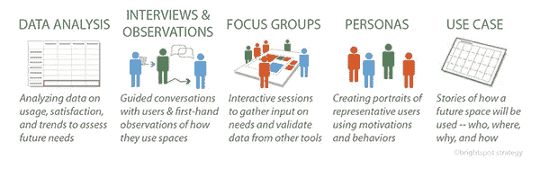
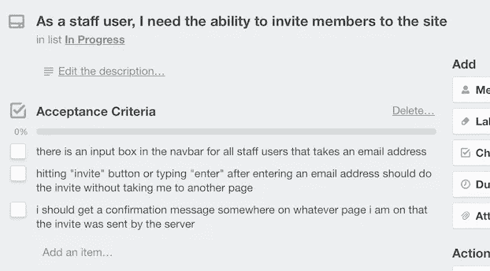

# 如何以正确的方式外包你的应用开发

> 原文：<https://medium.com/swlh/how-to-oursource-your-app-development-the-right-way-14fa3862a464>

Originally published on [http://www.appsterhq.com](http://www.appsterhq.com/?utm_source=CP&utm_medium=Medium)

雇佣自由程序员或外部开发公司来帮助你开发应用程序有很多潜在的优势。

其中包括成本节约、招聘专业人才的能力，以及与利用短期业务承诺相关的效率。

与此同时，如果你与不道德的或不合格的人员一起工作，你的创业公司将面临严重的风险。上周，我写了为什么你需要逃离那个 5 美元的商店。

危险包括…

*   ……[糟糕编码软件的潜力](http://www.appsterhq.com/blog/app-outsourcing-mistakes)，
*   …无法直接管理外包工作，
*   …以及与远程安排相关的各种其他困难(缺乏沟通、错过最后期限等)。)(来源: [1](https://blog.kissmetrics.com/in-house-or-outsource/) 、 [2](https://en.yeeply.com/blog/benefits-and-risks-of-hiring-a-freelance-developer-for-programming-apps/) 、 [3](http://www.huffingtonpost.com/young-entrepreneur-council/7-fatal-mistakes-to-avoid_b_8051048.html) )。

在我们讨论如何增加成功招聘顶尖应用程序开发人员的机会之前，让我们花点时间来了解一下基础知识。

# 采购；征求建议书

为了更好地理解最大化应用程序开发外包的有效性，让我们首先澄清两个定义术语，即“采购”和“提案请求”(RFP)。

这些术语听起来可能有点专业，所以请耐心听我说。

[采购](http://www.businessdictionary.com/definition/procurement.html)，作为一种一般的商业惯例，可以定义为:

> *“获得或购买商品和服务的行为。该流程包括准备和处理需求，以及最终接收和批准付款。它经常涉及:*
> 
> *-标准的确定；*
> 
> *-供应商研究和选择；*
> 
> *-价值分析；*
> 
> *-价格谈判；还有*
> 
> *-进行购买。”*

换句话说，采购是指从外部企业或顾问那里获得商品或服务的基本过程。

征求建议书，顾名思义，是邀请外部企业或顾问申请为贵公司提供特定的商品或服务。

[Investopedia.com](http://www.investopedia.com/terms/r/request-for-proposal.asp)用以下术语描述 RFP:

> *“征求建议书(RFP)是一种招标，在这种招标中，公司或组织宣布特定项目或计划的资金可用，并且公司可以对项目的完成进行投标。它概述了投标过程和合同条款，并就如何格式化和提交标书提供了指导。*
> 
> *特定项目的 RFP 要求公司审查标书，不仅检查其可行性，还检查投标公司的健康状况和投标人实际执行提议的能力。”*

此外，RFP 建立了描述公司正在寻求的特定解决方案的规范，以及评估建议书所依据的评估标准。

现在我们已经理解了这些关键术语，让我们来看看外包应用程序开发的一些最佳实践。

# 1.进行需求评估

为了有效，你的 RFP 必须针对你的创业公司的独特需求。

但是，您如何能够准确地识别您的业务的确切需求呢？

这就是“需求评估”的重要性发挥作用的地方。

[Businessdictionary.com](http://www.businessdictionary.com/definition/gap-analysis.html)将需求评估(也称为“差距分析”)定义为:

> *“一种技术，企业使用这种技术来确定需要采取哪些步骤，以便从当前状态转移到期望的未来状态。差距分析包括:*
> 
> *- (1)现状特征因素(如属性、能力、绩效水平)列表(“现状”)，*
> 
> *- (2)列出实现未来目标所需的因素(“应该是什么”)，然后*
> 
> *- (3)强调存在的差距和需要填补的差距。差距分析迫使一家公司反思自己目前是什么样的企业，并问自己未来想成为什么样的企业。”*

一个简单的事实是，在你能够有效地评估不同外部应用程序开发者的适用性之前，你必须首先清楚地了解你自己业务的具体需求。

只有这样，你才能深刻地将开发者提供的东西与你的创业公司需要的东西匹配起来。

实现这种契合需要你始终:

1.  设计和利用定制的 RFP，这些 RFP 是专门为贵公司的独特目标和贵公司特定项目的精确需求而定制的；和
2.  考虑只雇佣那些明确为你的确切业务需求准备定制建议书的开发人员。

换句话说，一定要远离那些不能准确反映你的创业公司具体需求的标准化 RFP，以及懒惰的开发人员可能会向数以吨计的不同公司购买的一般性提案。

确保您的需求评估考虑外部开发人员的行为如何影响您公司的每一个内部利益相关者也很重要，直到高级签署。

在 [Appster](http://www.appsterhq.com/?utm_source=CP&utm_medium=Medium) ，我们为客户提供[快速战略和想法验证](http://www.appsterhq.com/rapid-agile)流程，旨在帮助客户快速准确地评估他们的确切需求和应用交付。

这最终会提高您在需求、特性、技术细节、时间表和预算之间实现适当协调的能力。

# 2.决定你想从开发者那里得到什么

有很多名声不太好的应用程序开发者非常乐意主要通过价格竞争来保护你的业务。

选择一个[几乎专注于交付尽可能最便宜的产品的开发者](http://www.appsterhq.com/blog/hire-app-developers)实际上保证了你只能得到现成的“解决方案”。

因此，明确决定与哪类开发人员合作是至关重要的。

您是否希望从外包工作的供应商或更像是您自己团队的延伸、认真对待您的特定目标和价值观的开发公司获得快速、廉价、平均的结果？

顺便说一句，[这里有一个构建一个应用程序的成本的详细分类](http://www.appsterhq.com/blog/app-development-cost)。

# 3.在 RFP 中使用非常具体的标准

从外部开发人员那里吸引不相关的或者平淡无奇的提议的最简单的方法之一是忽略使你的 RFP 尽可能具体和详细的需求。

无论你是打算雇佣一个外部团体来帮助应用程序开发过程的每一个关键部分，还是只负责编码的某些技术部分，你都必须在你的 RFP 中准确地说明*你对未来开发者的期望。*

这可以是宏观的应用程序的不同闪屏的整体外观和功能，也可以是微观的特定序列中某些键被敲击时发生的事情。

以下是这种“验收标准”的一个例子:

此外，**，**确保你对*的期望非常清楚，开发公司的*将负责处理哪些特定类型的任务。例如:

*   公司或工作室整体的根本职责是什么？
*   为您服务的技术团队怎么样？它将被期望做什么？
*   个人团队成员和团队领导怎么样？
*   如果/当你的初创公司遇到问题 *x* 、 *y* 或 *z* 时，你希望能咨询谁？

你需要确定的其他问题包括与知识产权(IP)保护相关的各种事宜。

*   开发者有什么样的知识产权和保密保证和系统？
*   开发商过去是如何处理知识产权保护的？
*   其他创业公司在保证保密性方面有没有和开发者有过不愉快的经历？
*   开发人员获得了哪些认证？
*   公司将如何确保你的项目的安全性？

请确保您的 RFP 在知识产权保护方面非常详细:

相关:见[此处](http://www.appsterhq.com/blog/reasons-why-startups-dont-need-patents)深入探讨为什么新创公司不需要专利。

# 4.创建详细的开发人员档案

不可否认，尽可能多地了解那些你正在考虑将应用程序开发外包给他们的开发者，对你最有利。

让另一家公司负责你的应用程序开发是一件非常严肃的事情，不应该掉以轻心。

你必须履行你的尽职调查，以确保不仅外部开发商完全有资格做你的 RFP 中描述的工作，而且你的两家公司在专业和道德上是兼容的。

以下是一些整理开发人员详细资料的建议:

*   尽可能彻底地研究开发人员，特别是通过搜索互联网(包括社交媒体网站和工作场所评论网站，如 [co](https://clutch.co/) 、[glassdoor.com](https://www.indeed.com/)、[greatplacestowork.com](http://reviews.greatplacetowork.com/)和[indeed.com](https://www.indeed.com/))来深入了解公司的历史和成就；
*   要求并彻底验证每个开发人员至少 5 或 6 份参考资料(见标题 3 [此处](http://www.appsterhq.com/blog/hiring-business-executive-for-startups))；和
*   通过利用你的职业关系网深入挖掘，询问你的联系人是否与开发商有过接触。

你还应该考虑利用对话驱动的 RFP，即鼓励你的初创公司和你考虑雇佣的开发人员之间的交流。

实时的双向交流——尤其是在你淘汰了不合格的开发人员之后——对于培养一种熟悉感和与潜在开发人员一起工作的职业感觉是至关重要的。

事实上，实施 RFP 流程，为具体问题提供具体答案，并邀请提交方案的人员提供详细反馈，对于选择合适的开发商至关重要。

# 5.浏览你的候选名单

一旦你列出了最好的潜在开发人员名单，如果可能的话，亲自与他们见面是很重要的，这样可以与这些远程团队的潜在未来成员建立更亲密的关系。

当然，如果开发者身在海外，与他们面对面交流并不总是可行的。

在这种情况下，视频或音频 Skype 通话是下一个最好的选择。

确保安排和进行足够长的、详尽的采访，采访将参与您的项目的开发团队的关键成员。

认识到你有权利要求代码样本或代码走查来衡量他们工作的复杂程度。

在这种情况下，请记住，无论是虚拟地还是“在现实生活中”，与致力于您的项目的特定开发人员会面是至关重要的，而不是仅仅相信与一般销售或客户管理团队会面就“足够好了”。

# 6.澄清开发人员是否外包

了解外部开发人员自己外包(部分或全部)你雇佣他们完成的工作并不罕见。

这通常会对您的公司和应用程序的创建产生潜在的灾难性后果，包括:

*   对处理敏感知识产权或专有材料的威胁；
*   泄露您从第三方获得许可的信息或技术的法律后果；和
*   质量和完成时间不一致。

因此，您应该毫不掩饰地要求供应商绝对透明，特别是关于谁在做什么工作以及什么时候做。

这包括接收关于什么(如果有的话)将移交给分包商完成的未稀释信息。

# 7.对开发人员进行试点测试

尽管对于初创公司要求潜在新员工执行“免费”工作是否合适存在不同意见，但将一项简短但有意义且具有挑战性的试点任务分配给那些少数通过 RFP 流程的开发人员决赛选手可能会非常有用。

如果处理得当，试点项目可以让 1)开发人员证明他们的提议的价值，2)你的初创公司和外部开发人员在最终开始一个大型项目之前“消除”任何集成问题。

确保您分配给潜在新开发人员的试点项目与该公司被选中完成您的 RFP 中概述的项目时预期要做的工作完全相关。

//

## 感谢阅读！

# 如果你喜欢这篇文章，请随意点击下面的按钮👏去帮助别人找到它！

> 最初发表于[http://www.appsterhq.com](http://www.appsterhq.com/?utm_source=CP&utm_medium=Medium)

