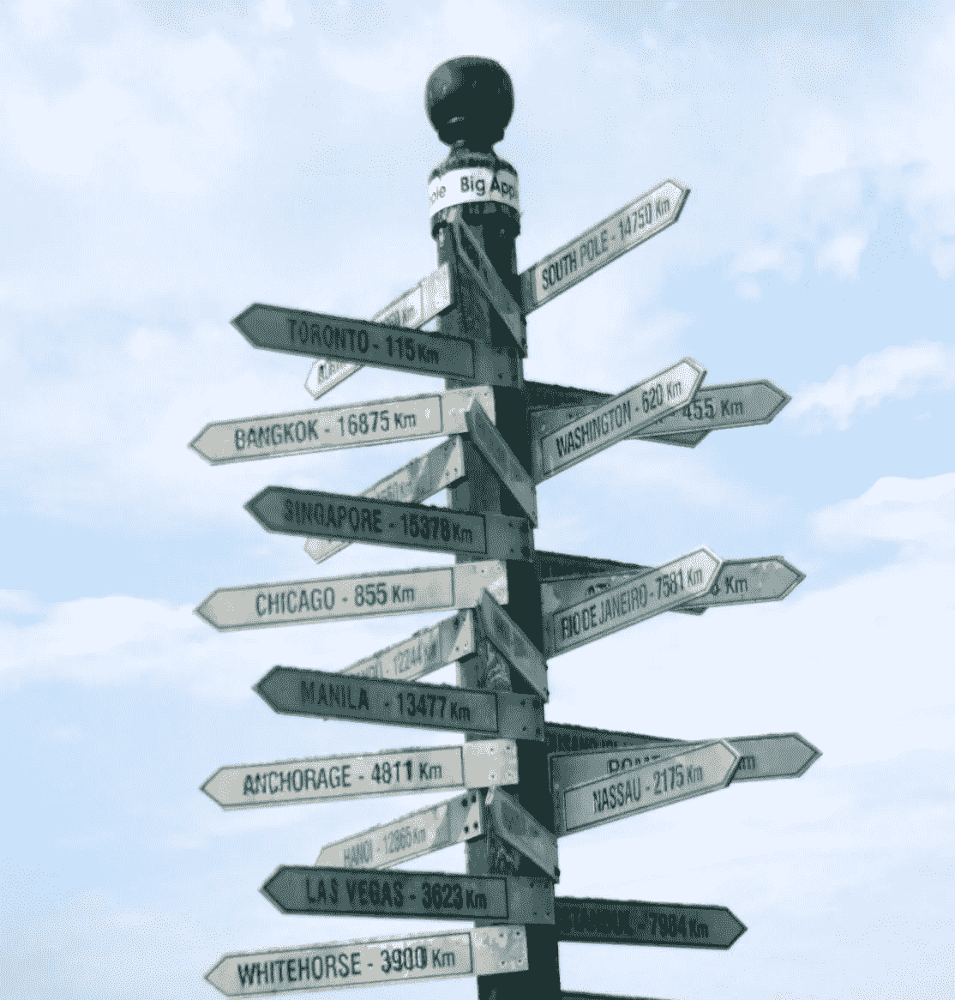

# 如何克服认知偏差，做出更好的决策

> 原文：<https://medium.com/swlh/how-to-overcome-cognitive-biases-and-make-better-decisions-daeecd38f910>

作为人类，我们醒着的大部分时间都在做决定。左边还是右边？鸡肉还是鱼？潮还是有美白力的潮？大声说还是保持沉默？接受这份工作还是放弃？新城市？新房子？就在这短短的列表中，我们可以看到，我们所做的一些决定是平凡的，而另一些决定可能是生死攸关的。

由于我在过去的 Wireboard 文章中一直关注工作效率，所以我想更深入地研究组织/业务环境中的决策制定。因为无论决策的实际重要性或结果如何，我们如何处理决策过程本身都会对我们的效率、时间甚至压力水平产生积极或消极的影响，所有这些都会影响我们的工作。

我们倾向于如何做决策的关键特征是通过一系列无意识的(通常)偏见。这是为什么呢？你有没有注意到做一些决定有多累？或者有时候我们会做出让自己后悔的仓促决定？上周末，我和妻子被一些好朋友邀请去参加一个假日聚会。我知道这将是一个大派对，所以在接下来的两天里，我花了不少于 15 分钟来决定我要穿什么。是西装、夹克和领带，还是一件引人发笑的节日毛衣？

现在，虽然我们的一些有时尚意识的读者可能会想知道我最终选择了什么(我会在文章结尾告诉你)，但关键是我对这个决定想多了。最后，这是对我时间的一个糟糕的利用，也不是一个好的决定。虽然这是一个轻松的例子，但长时间的决策耗费了我们本可以用于其他事情的时间和精力。我们甚至对此有一个术语:决策瘫痪。正如我最近写的，决策是拖延症可能出现的一个领域。决定越大，越有可能导致拖延。所以，让我们仔细看看在决策过程中我们都在做什么(认知偏差)，以及我们能做些什么。

# (通常)帮助我们的决策偏见

在 Rewire，我们花了很多时间研究蜥蜴的大脑，以及它如何影响人们的工作。不出所料，蜥蜴脑会对我们的决策过程产生巨大影响。我称之为“蜥蜴脑决策偏见”例如:

*   蜥蜴的大脑根据习惯为我们做决定:除了我们过去做出的决定，我们继续行动而不重新决定，还有什么是习惯？
*   蜥蜴大脑也根据感觉非常快地做出决定，而我们大脑的高级思维部分使用逻辑，需要更长时间才能做出决定。如果没有生命危险，通常会好一些。
*   我们选择我们熟悉的东西。我的同事史蒂夫·龙眼去年写了一篇关于这个的文章，用吃熟悉的和看起来不熟悉的浆果做比喻。选择熟悉的往往能确保生存。所以我们选择熟悉的事物，以避免投入太多的时间和精力。

蜥蜴的大脑工作非常迅速，以减少做决定所需的时间和精力。请注意，我并没有说这个决定是否正确，只是说它将是有效的。当我们做决定时，还有很多其他的偏见。围绕这些偏见有很多学术研究，我在研究中发现了 100 多个，但我选择了三个我认为在决策过程中最强大和最常见的偏见:

*   确认偏差。已定义的:倾向于确认你先前存在的信念的信息。例证:我们最近的选举证明了这一点。我们倾向于浏览我们的新闻提要，选择符合我们过去已经决定的信息。我们对决策也是如此:我们根据信息是否符合现有的信念来决定在做决策时要考虑哪些信息。
*   锚定偏差。已定义:将重点放在决策的一个方面，这个方面可能是也可能不是主要因素。例如:购买二手车基于里程表读数，而不是发动机、汽车安全性、品牌可靠性或其他特征。
*   自信偏差。定义:对自己回答问题的过度自信。例子:当你迷路时，确保你知道你要去哪里(也就是在蜥蜴的大脑中)。

所有这些偏见让我们陷入困境:它们帮助我们更快更容易地做出决定，但不一定更好。如果我们试图抛弃偏见，决策会变得更加费力和耗时。那么，我们该怎么办？我们怎样才能做出好的决策而不陷入决策瘫痪呢？

# 克服偏见并做出更好决策的 5 种方法

注意你的内部环境:我们在过去写过关于正念的力量，这种动力当然也适用于决策。如果你正纠结于一个决定，花一点时间呼吸并注意你自己的感觉。另一个有用的决策工具是“暂停”如果你饿了、生气了、孤独了或者累了，那么不要做关键的决定。如果可以的话，在你一天中状态最好的时候做决定(例如，不要在中午 12:30)。

关系影响:考虑谁会受到你的决策(或缺乏决策)的影响。有时候，看看别人会如何被一个给定的决定影响，会帮助你澄清这个决定。顺便说一下，这也是练习正念的另一种方式。

理性分析:回想一下，我列出的许多偏见很快就起作用了，并且依赖于直觉。虽然直觉也有用武之地，但为了做出更好的决定，看看你是否能做出任何实际的观察，或者这个决定的数据。你不需要写论文什么的，只需要给你的理性思维一些数据，你会惊讶地发现它是如何快速地为你重新构建和强化决策的。从那里，如果你仍然不能做出决定，你可以钻得更深以获得更多的数据或寻找任何其他关于你的决定的系统信息。

局外人的观点:有时，决策很难做出，因为我们没有足够的数据和/或经验。有时，决策很难，因为我们对决策的结果有冲突的价值观和优先级。这正是向可靠来源寻求信息的价值所在。他们可能有你缺乏的数据或经验。因为没有两个人是完全一样的，他们可能会以不同的眼光看待价值和优先权的冲突。即使(有时尤其是)这种外部视角挑战了你认为你看到的东西，它仍然是清晰的，有助于决策。

反思过去:回顾你的决策历史，问问你以前是否遇到过这样的情况。这种情况与目前的情况有什么相似之处？有什么不同？结果如何？你过去是如何做出这个决定的，是什么影响了你的选择？想想你过去是否匆忙下过判断。一旦我们对过去有了更好的了解，它可以帮助我们对现在的决策过程有更好的认识。

尽管这些实践最初可能需要一些时间来练习和掌握，但它们最终会节省你的时间和精力。

最后，我要再说一遍，只要我们活着，决定就会不断地向我们袭来。因此，我们将有很多很多新的机会来发展我们在决策中识别和管理情绪和偏见的能力。以及更多做出决策的机会，推动我们实现真正的增长。

而且，正如对那些读到这里的人所承诺的，我将告诉你“节日派对服装难题”是如何解决的。我最终穿上了布鲁克斯兄弟的西装和领带。其他人都穿得很休闲。几个朋友问我是刚参加完工作面试还是刚参加完葬礼。决策很重要，各位。

## 这个故事发表在 [The Startup](https://medium.com/swlh) 上，这里有 266，300 多人聚集在一起阅读 Medium 关于创业的主要故事。

## 订阅接收[我们的头条新闻](http://growthsupply.com/the-startup-newsletter/)。

