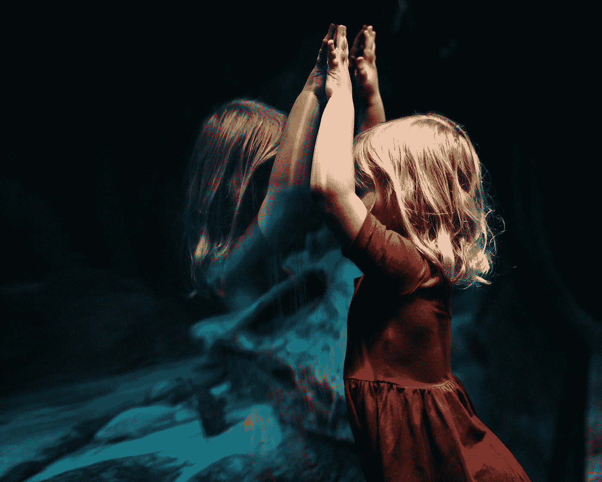

# 如何克服恐惧，更有创造力

> 原文：<https://medium.com/swlh/how-to-overcome-fear-and-be-more-creative-34786a210c93>

“girl leaning on glass fish tank raising her two hands” by [Bekah Russom](https://unsplash.com/@bekahrussom?utm_source=medium&utm_medium=referral) on [Unsplash](https://unsplash.com?utm_source=medium&utm_medium=referral)

随着机器人技术、机器学习和人工智能的兴起，创造力很快就会比智能更重要。在一个混乱的世界里，你提出新的原创想法的能力会给你带来竞争优势。为什么？

这是机器人可能永远做不到的一件事。

# 扰乱或被扰乱