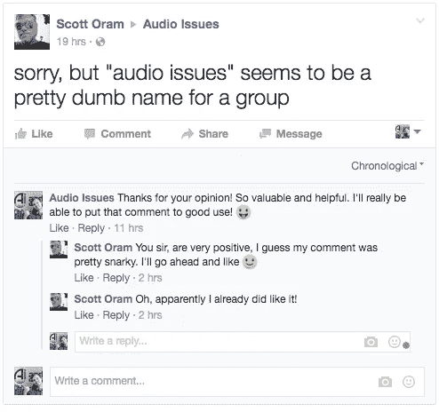

# 作为一名创意人员，如何克服令人疲惫的社交媒体环境

> 原文：<https://medium.com/swlh/how-to-overcome-the-exhausting-social-media-landscape-as-a-creative-2030bbb56b8>

## 成功社交媒体营销的 10 个快速技巧

如果你刚刚开始，社交媒体营销可能会感觉像一个永无止境的噪音坑。

有这么多的社交网络可以使用，有一百万种不同的营销策略可以尝试。

那么，如何从噪音中脱颖而出呢？

我主要关注脸书，并在[音频问题页面](https://www.facebook.com/audioissues)上拥有可接受的 3 万名粉丝。我在 Twitter 上不太活跃，但它是我发布所有有趣笑话的地方。这两个网络是我社交媒体工作的重点。

今天，我将分享一些可以帮助你在社交媒体营销中变得更加成功的事情，主要基于对我有效的事情。

# 1.找到适合你的社交网络

就像我说的，有这么多可供选择，所以你必须根据你的定位找到对你最有意义的一个。

让我们以几种不同类型的艺术家为例:

*   **视觉艺术家:** Instagram 可以充当视觉艺术家的数字艺术画廊。你可以在工作的时候给你的作品拍照，也可以通过在评论区添加到你的电子商务页面的链接来出售。这样做可以让你的粉丝通过滚动他们的 Instagram feed 来定期关注你的所有作品。
*   **视频艺术家——**如果你主要制作某种视频，Youtube 是最合理的活跃用户。如果你是动画师、摄像师或导演，你可以利用 Youtube 庞大的社交网络来传播你的艺术。
*   音乐家——作为一名音乐家，我主要关注脸书。这是一个一站式商店，你可以张贴你的乐队的图像，张贴新的歌词或歌曲名称的想法，上传音乐或张贴幕后视频。
*   作家——因为作家大多坚持书面文字，所以使用推特或脸书——当然还有媒体——是最符合逻辑的。脸书允许作者发表更长的文章，但 Twitter 更适合与其他作者和粉丝互动。此外，要让每条推特听起来像诗一样简洁是一个巨大的挑战。我并不认为这是社交网络中的中等水平，尽管它确实很接近！
*   **雕塑家、陶艺家和其他身体艺术家—** 根据你想展示艺术的方式，你会发现一些社交网络比其他的更适合你。一件实物艺术品，比如一座雕塑，可能无法用 Instagram 上的一张简单图片来充分欣赏。所以，你可能会认为 Youtube 是一个更好的选择。然而，如果你想做的只是展示雕塑的每一面，那么坚持使用 Instagram，只使用他们的短视频帖子而不是照片，可能仍然是最简单的方法。

无论你选择使用哪种社交网络，都要确保它与你所处的利基类型相关。

# 2.留出时间做计划

做社交媒体营销是工作。建立自己的形象需要时间，这需要你在工作周之外抽出时间。

但是，如果你提前计划，你可以经常批量和安排你的社交媒体任务，这样你就不用每天都想着它了。

一个好的遵循计划是:

*   **每周一小时的时间安排—** 这是你坐下来思考那一周你想发布的所有事情的时候。为推文、帖子、视频、要问的问题和要发送的图片制定一个时间表。然后使用类似于 [Hootsuite](http://www.hootsuite.com/) 的东西来尽可能多地安排它。当然，很多社交媒体互动发生在这个时刻，所以日常事务可以和这个时间表一起工作。
*   **每天 5-15 分钟—** 每天花一些时间，发布任何想到的东西，与他人互动，在 Twitter 上回答提到的问题，回复评论。这样你就可以在一周开始前完成大部分工作，并且可以专注于社交网络中更有趣、更互动的部分。

# 3.加入群组

如果你在脸书，你可以找到一堆与你的领域相关的团体。

我建议不仅加入关于你特定主题的小组，还要支持那些和你有着相同目标的人。

例如，我活跃在一些关于音乐制作的团体中，因为我帮助家庭录音室音乐家通过教他们如何制作自己的音乐来使他们的音乐听起来更好。所以很自然地，我会和这些人在一起。然而，我也在许多商业和创业团体中，向比我更有经验的人寻求帮助和见解。

这将帮助你实现两件事:

*   帮助你成为行业权威。
*   帮助您更好地运行项目。

例如，如果你真的想充分利用你的社交媒体营销，你可以加入脸书的一个关于这个主题的小组，开始提问并与其成员互动。

这将有助于你在尝试最新的社交媒体策略时保持警觉。

# 4.创建您的群

如果你已经有了一群粉丝，那么你可能想创建一个你自己的群组来与你的粉丝更紧密地互动。

如果你在你的团队中很活跃，并且经常与你的观众接触，你会对你和你的品牌产生更多的好感和信任。这也是与你的粉丝建立互动的更独特的方式，而不仅仅是希望他们看到你最新的《脸书邮报》。

# 5.与影响者互动

社交媒体的特点是名人和有影响力的人很容易接触到。他们可能不会总是回应，尤其是当你试图接触你所在领域的超级明星时，但你有机会与比你更成功的有影响力的人取得联系。

Twitter 让这变得很容易，有很多关于名人通过 Twitter 直接与粉丝互动的故事。

从关注你钦佩的人开始，然后浏览他们的订阅，并关注那些与他们互动的人。通过这种方式，你将开始建立一个不同成功水平的人脉网络。

名人曾经是无名小卒。随着时间的推移，这些人变得更加成功。诀窍在于与比你更成功但又没有成功到忽视你的人交往。互动是一条双行道，因此在你的领域找到志同道合的创意人员并对你做出回应是与其他有影响力的人建立互动的第一步。

# 6.研究和使用标签

找到这些初始影响者的一个好方法是研究你所在领域的相关标签。

例如，如果你是一个混合媒体艺术家，那么你可以很容易地在 Twitter 上搜索#mixedmedia，滚动浏览提要，直到你看到有趣的人发来的推文。

关注他们，回复他们的推文，开始对话。反复这样做，你很快就能和世界各地的人进行 140 个字符的艺术对话。

您可以保存这些搜索，以便以后使用。[每分钟有 350，000 条推文被发送](http://www.internetlivestats.com/twitter-statistics/)，所以总是有新人出现在你的搜索结果中。用更多与你的领域相关的标签来做这件事，你将会有一大群每天都可以接触的人。

# 7.互动，不播

当你开始的时候，你可能倾向于一遍又一遍地传播你的信息。如果你没有足够关心你的追随者，这只会让你看起来像个垃圾邮件制造者。

这就是在社交媒体上与他人互动如此重要的原因。如果你的 feed 看起来主要是你和一群其他人之间的对话，并有你工作的链接，那么你会被认为是一个真正的人。

甚至像 Taco Bell 这样的品牌也以半开玩笑的方式与客户互动，这使得他们的 Twitter feed 看起来更人性化，更有趣，而不是像一个枯燥的企业品牌。

我必须承认，我对发布自己的东西感到非常内疚，尤其是在脸书上。我有数百篇读者认为有价值的博文，所以我尽可能地让他们注意到我的博文，但我也尝试加入足够多的互动、问题和随机参与，让它不那么垃圾。

诀窍是要有一个健康的自我推销和观众参与的比例。

# 8.自动化你的社交媒体

节省时间的一个好方法是使用自动化工具将你的内容发布到社交媒体上，尤其是如果你想尽可能多地利用这些时间与有影响力的人在线聊天。

我使用 [Recurpost](http://www.recurpost.com/) 将我的博客帖子和一般参与度问题安排到脸书。这有助于减轻你社交媒体营销的最大负担。你可以将它连接到其他社交媒体网络，也可以将它发布到你的脸书群中，这一功能帮助我每周都保持我的社区参与。

只要记得监视发布的帖子，并在预定的帖子上回复评论和回答问题。即使大部分是自动化的，你仍然需要关注你的观众是如何与你的内容互动的。

# 9.忽略那些讨厌的人

我以前说过，现在再说一遍:

> 不管你的观点是什么，你都会因为你的观点而受到批评和憎恨。

但是只要你有喜欢和信任你的追随者，就可以放心地简单地**忽略那些讨厌你的人。**

或者仁慈地杀死他们，就像我有时做的那样:

如果他们充满仇恨和刻薄，删除他们的评论，继续你的生活。不要被他们喜欢扔在网上的垃圾所吸引。

就像乔治·卡林说的:

> *你的屎是屎，他们的屎也是屎。*

除此之外，在这种情况下，他们的狗屎没有带来任何有价值的东西，所以你可以放心地忽略它。

# 10.有行动号召

最后，你的社交媒体应该是引导你的追随者到你的网站或者成为某种类型的顾客。

确保你花一些时间在社交媒体上，试图让人们访问你的网站，以获得关于你的艺术或你提供的任何东西的更多信息。

你不应该把每件事都当成营销信息，但你应该花些时间推广你的产品或服务。最好的方法是给人们一个理由来查看你的网站，注册你的邮件列表，看更多你的作品，或者看看你能提供什么服务。

# 结论

我希望这篇文章能给你一些技巧来尝试增加你的社交媒体影响力。

## 让你的创意事业一飞冲天？

你是一个企业家还是艺术家，希望提高你的在线形象，以接触更多的客户、顾客和粉丝？

通过我多年的网上商业经验，我可以帮助你创建一个围绕你的业务战略，无论你是一个有抱负的作家，艺术家，还是企业家。

[点击此处获取我的在线展示蓝图，了解如何建立更有效的在线展示和社交媒体策略。](https://audioissues.lpages.co/bbenediktsson-sign-up/)

## 这篇文章发表在《创业公司》杂志上，这是 Medium 最大的创业刊物，有 330，853 人关注。

## 订阅接收[我们的头条新闻](http://growthsupply.com/the-startup-newsletter/)。

