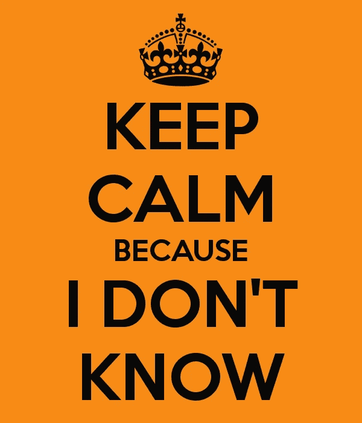

# 如何克服未知

> 原文：<https://medium.com/swlh/how-to-overcome-the-unknown-daa6ad2da2b4>

## 学会在不确定中茁壮成长是你成功的关键

Photo by [NASA](https://unsplash.com/@nasa?utm_source=medium&utm_medium=referral) on [Unsplash](https://unsplash.com?utm_source=medium&utm_medium=referral)

*我们比 2018 年更容易受到不确定性的束缚吗？我们是否读过如此之多的思考片，提出这样的问题:“当今世界发生了什么？?"比过去一年还多？如果你想知道如何在我们生活的这个疯狂的世界里成功，这篇文章是给你的。*

# 介绍混沌模型

> *“休斯顿，我们有一个问题。”*

美国国家航空航天局任务指挥官吉姆·洛威尔是危机中领导能力的典范。他对他的团队的冷静和不可动摇的信念对他来说意味着生与死的区别。自从洛弗尔和他的船员于 1970 年 4 月 17 日溅入印度洋以来，人们一直在研究阿波罗 13 号的灾难，以及在此期间所做的决定。他们的故事，以及无数像他们一样的人的故事，与我称之为混乱领导模式的特征产生了共鸣。

混沌领导是一系列七个相互关联的原则，我根据自己多年在军事领导领域的经验，以及对当今世界上一些最多样化和最复杂的组织的研究和学习制定的。这篇文章将概述这七条原则，如果你应用它们，将会改变你对混乱和不确定性的反应方式。

请注意，混乱领导不是一种制造混乱的领导风格，尽管名字如此。按照这个定义，世界上已经有太多混乱的领导者了。我用这个词作为一系列想法或原则的首字母缩写，这些想法或原则将使你能够领导*尽管*你周围不可避免的混乱。这些原则是:

*   控制你所能控制的
*   对自己和他人诚实
*   **一个** ct，不要随便反应
*   O**笔自己来帮**
*   掌握自己的命运
*   我发现了一个积极的差异
*   关注更大的图景

这些想法相互联系，并建立在彼此的基础上，形成了一个领导弹性系统。

在我们进一步研究这个模型之前，我想告诉你为什么。这个模型为什么会对你有帮助？为什么要坚持读下去？嗯，在上面，你可能已经注意到我说过混乱是不可避免的；无论你是自由职业者、初创企业创始人，还是大公司的经理，混乱和不确定性都会找上你。知道如何应对不可避免的混乱是确保你成功的关键技能。

**原则 1——控制你能控制的东西**

回到吉姆·洛威尔和阿波罗 13 号机组人员身上，我们看到了这一原理在起作用。他们对自己所处的情况无能为力，但在阅读故事和研究相关人员的反应时，无论是在太空舱里还是在地面上，一种每次专注于一个问题的模式出现了。这就是**控制你所能**的本质。

在天生混乱的情况下，你能控制什么？不管混乱或不确定的原因是什么，总会有一些事情在你的控制之内。首先，也是最基本的，始终在你掌控之中的是*你的态度和你对自己所处的不确定性的反应*。

对于控制你所能做的这整个想法来说，同样重要的是*保持参与*的想法。在我们结束之前，这个想法还会再出现几次，但这里值得一提的是:如果你发现自己被混乱和不确定性所包围，你不能让自己关闭，脱离你的工作或你自己。你不能让混乱关闭你，让你无能为力。你不能控制一切，但你也不能放下一切，听天由命于周围的混乱。

**原则 2——对自己和他人诚实**

source: [http://imgur.com/33MNBn9](http://imgur.com/33MNBn9)

没人想和骗子做生意。没有人愿意和从来没有评估过自己优缺点的人做生意。此外，没有人想和害怕说“我不知道”或“我需要帮助”的人做生意或为他们工作。这些人是定时炸弹，我们都知道。

在我参军之前，我在一家餐馆工作，由于管理层缺乏诚信，这家餐馆一直处于混乱状态。我指的不诚实并不是指他们会公然对员工撒谎。我的意思更多的是我上面描述的不愿意评估他们自己，市场，以及他们的优势和劣势。你可以在那些被新技术超越或被周围的变化搞得无关紧要的公司中经常看到这种情况(参见:情景混乱！).他们拒绝相信任何人可以挑战他们做事的方式。由于这种态度，当城市的市场发生变化，食客开始想要不同的东西时，我工作的餐馆失去了很多时间。它经历了所有权和管理的旋转门，直到现在，近十年后，才开始复苏。

最基本的诚实是一个领导者应该具备的最重要的品质之一。我们更倾向于追随那些我们认为诚实的人。那么，这个原则与工作中的不确定性和混乱有什么关系呢？

当你面对公司的不确定性时，你必须诚实地面对自己和公司的能力。想想看:如果有人在史蒂夫·乔布斯(Steve Jobs)的车库里制作一次性电脑时找到他，问他“你能在 3 个月内交付 10 万台电脑吗？”乔布斯说“当然，没问题！”这是诚实的吗？

**原则# 3——行动，不要反应**

混乱或不确定的情况使我们天生被动。我们无法预料会遇到的所有不确定性。如果可以，我们会采取措施确保我们不会遇到它！但是，它还是会在我们最意想不到的时候来找我们。也就是说，虽然我们可能会被迫对混乱本身做出反应，但我想关注的不是我们可以保持行动的一些方式，而是面对不确定性继续前进。本节的关键要点是:不要关机！关闭，等待不确定性的浪潮冲击你的头永远不会奏效！即使你只能采取微小的行动，坚持这种控制措施，即使是在小范围内，也会让你不断前进。更重要的是，它会保持你的心态，让你抵制完全关闭的冲动。

重要的是要注意，你永远不可能完全主动，而不是被动。当你周围的情况和环境发生变化时，你必须做出反应。不过，目标是让你成为(是的，每个人都喜欢的流行语)*积极主动的*。积极主动固然很好，但是这个原则不仅仅是积极主动。我希望你想一想你一天中做的所有与你的业务相关的事情。现在，想象一下你能想到的发生在你的生意上的最混乱的事情(但是请保持现实！)在你的心理清单上划掉那些因为这个假设的灾难而真正不可能的项目。还剩多少项？不管你的号码是多少，立即做那些事情。在经历了一段混乱和不确定的时期后，恢复正常感并重新站起来通常是战胜不确定性取得成功的第一步。这通常也意味着在 90%的时间里致力于那些看起来不重要的小事。

**原则 4——敞开心扉帮助他人**

我们有时都需要帮助。我们中的一些人有时需要很多帮助！做一名领导者需要一公吨的谦逊，当我们需要帮助时，我们都很难承认。我知道我有。然而，我们的工作越多(尤其是对你们这些企业家来说)，我们寻求帮助的次数就越少。

这是为什么呢？虽然有些人可能会说我们傲慢，但事实要复杂得多。对于大多数阅读这篇文章的人来说，我敢打赌，它更多地是围绕着这样一个事实:与大公司那些不露面、不知名的首席执行官不同，你是你自己的品牌。你是公司的形象代言人和灵魂人物！你依靠自己的热情来传达公司的愿景(稍后，在第七步中会有更多)，你的顾客和客户会和你在一起，因为他们信任*你*。所以，不可避免地，当混乱降临到你身上时，就像是世界末日。

拥有一个你可以寻求帮助的人的网络的重要性是显而易见的，但是你需要在你的网络中拥有的人的类型可能不是。我发现，在混乱时期，三种最好的人是:

*   长者:那些去过那里，做过那件事，和你在同一个行业或生意的人
*   同龄人:在生活和工作中与你处于大致相同位置的人
*   局外人:这是最怀念的群体。这些人了解你，投资你，但不在你的业务范围内工作。他们提供了一个视角，当我们被混乱诱导的隧道视野时，我们很多人都失去了这个视角。

**原则 5——掌控自己**

在我的军旅生涯中，我经历了许多机遇和挑战，这些机遇和挑战要求我先掌控自己，然后才能掌控他人并向前迈进。最能说明这一点的一个故事是这样的:2011 年，在我第一次海外部署时，我带领一小组人，负责确保离开这个国家的设备回到美国。我不知道我在做什么，我团队的其他人也不熟悉这种非常复杂的责任和文书流程，我们必须实施这种流程来让我们的老板满意。我们没有放弃，也没有花费大量的时间去学习整个过程，而是决定专注于我们自己的部分，尽我们所能去学习，并相信其他人也会这样做。这是第五个原则的最重要的方面之一:找到你负责的事情，100%地拥有它，然后相信其他人在他们的专业领域也会这样做！

有时候，你唯一能控制的就是你自己。如果你不能练习自律和自我导向，剩下的整个难题就会支离破碎。首先缺乏领导自己能力的领导者可能会“假装”一阵子，但他们的领导能力会耗尽。掌控自己意味着了解你自己、你的领导风格以及你的优势和劣势。掌控自己意味着能够向他人清晰地表达你能最好地帮助他们成功的方法。

**原则 6——激发积极的差异**

在混乱中，激发积极的改变是决定你成败的关键。无论你是企业家还是在公司担任领导职务的人，采取积极行动的能力都很重要。

在混乱时期，你会发现自己无法影响混乱的原因。尽管如此，创新仍然是必要的。在混乱时期这种创新能力的最伟大的例子之一是雷·戴维斯，Umpqua 银行的前首席执行官。在他的书*引领不确定性*中，雷概述了他和他的银行如何走出 2008 年金融危机，变得比开始时更加强大！雷的远见、战略和积极的观点是他的公司生存和持续成功的关键。

**原则 7——关注大局**

作为一名领导者，尤其是在初创公司，为自己和公司建立愿景是你的首要任务。正如西蒙·西内克所言，如果没有更广阔的前景，没有你所做的每个决定背后的根本“为什么”，你就会失去方向，你的公司就会失败。没有愿景，你的公司和你自己都不会准备好使用我们在本课程中讨论的其他六个原则。没有一个更大的图景来驱动你，没有你的为什么，就不会有动力去克服逆境，并从逆境中走出来，变得比你刚进来时更好。

有很多关于提高你远见卓识的领导力的书籍，所以我不会在这里深入探讨。相反，我会假设你已经理解了找到为什么的重要性，并把它作为衡量你所做的每一个决定的标尺。无论如何，这是最后一条原则的精髓:确保每一步，你的行动都以大局为重。如果你没有采取符合你对自己或团队愿景的步骤，你将无法走出混乱。这种愿景，就像一根指引你穿过黑暗房间的线，是你将整个混乱的领导模式整合并付诸实践所需要的！

# **结论**

就是这样。这就是你的整个混乱的领导模式。这七个想法中的每一个都可以是一个完整的帖子，但是正如我在开始时所说的，如果我这样把它们都分开，就会失去一些联系。我把这个模型设计成一个系统。如果你使用这个系统，它将帮助你战胜不确定性，更重要的是，随着时间的推移，它甚至能让你驾驭和利用混乱和不确定性，使你受益。我没有把这篇文章命名为“如何减少不确定性”是有原因的:不确定性和混乱可以成为企业家成长的工具！我不想让你学习如何减少不确定性，比如吃止痛药。相反，我希望你将工作中面临的不确定性和混乱转化为一些东西，使你和你的团队以及你的公司比你开始时更强大、更富有、更有力量！

## 这篇文章发表在 [The Startup](https://medium.com/swlh) 上，这是 Medium 最大的创业刊物，拥有+364，117 名读者。

## 订阅接收[我们的头条新闻](http://growthsupply.com/the-startup-newsletter/)。

