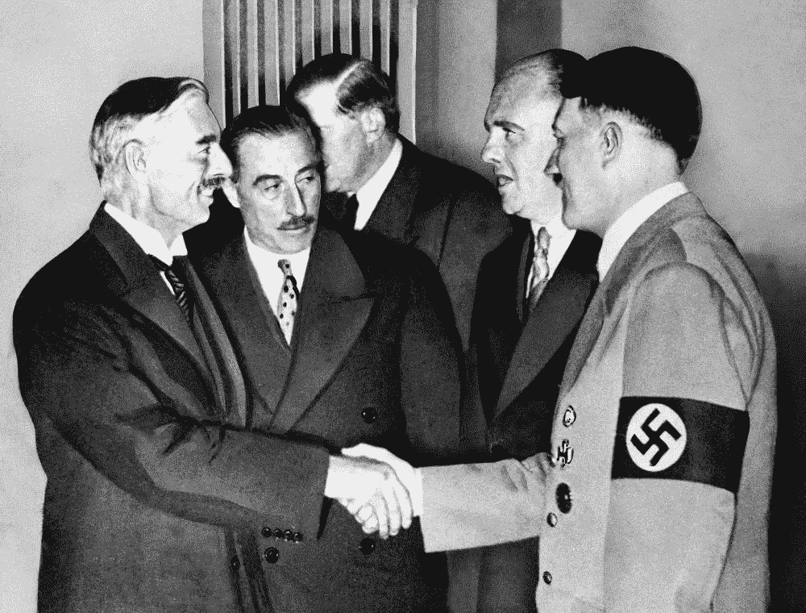

# 如何克服你对咄咄逼人的人的弄巧成拙的姑息

> 原文：<https://medium.com/swlh/how-to-overcome-your-self-defeating-appeasement-of-aggressive-people-200fdd499ace>

## 克服你对对抗的恐惧

Chamberlain and Hitler Shaking on it.

大约 80 年前，1938 年 9 月 30 日，英国首相尼维利·张伯伦和德国总理阿道夫·希特勒，以及意大利独裁者本尼托·墨索里尼和法国总理爱德华·达拉第在德国慕尼黑会面。