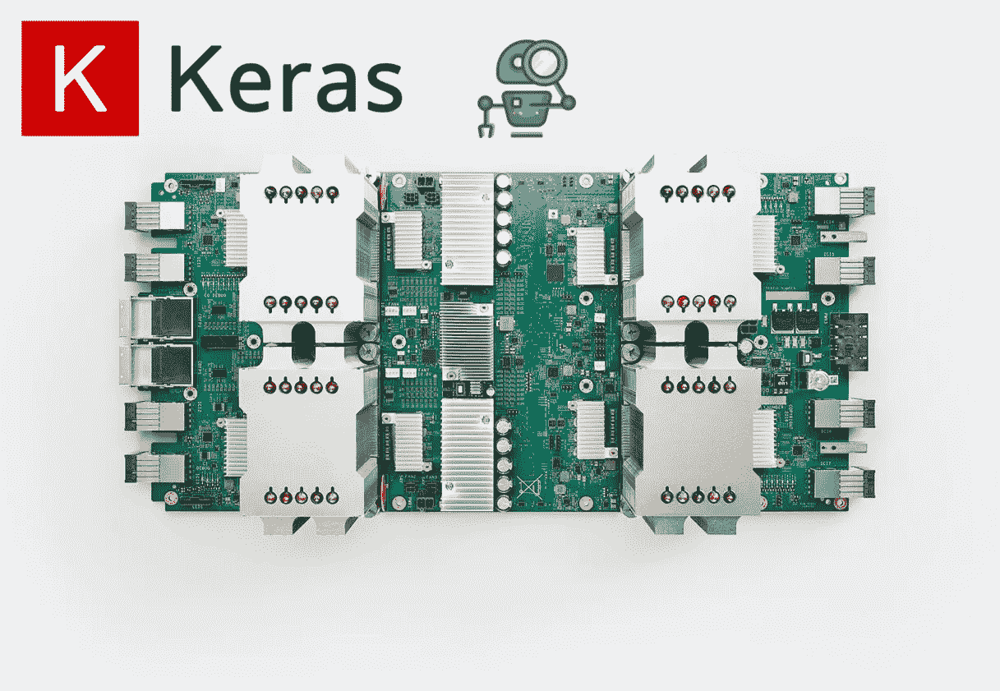
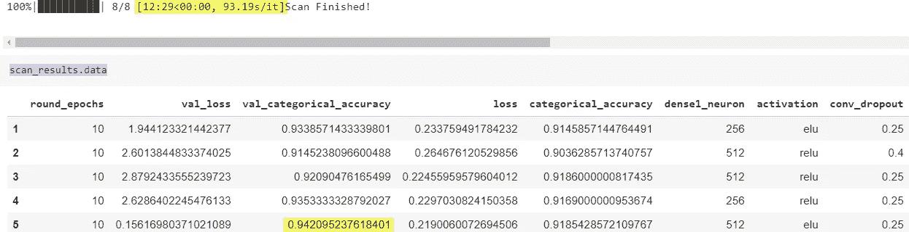
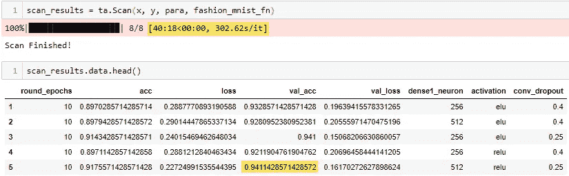

# 如何免费在 TPU 上更快地执行 Keras 超参数优化 x3

> 原文：<https://medium.com/swlh/how-to-perform-keras-hyperparameter-optimization-x3-faster-on-tpu-for-free-602b97812602>

你是一个数据驱动的科学家或数据工程师，想要完全控制你的 Keras 模型，并希望从盲目的参数跳跃和搜索中解脱出来吗？

超参数优化通常需要使用不同的配置多次训练模型，这意味着需要一台带有多个显卡的快速计算机，通过更快地训练模型来减少滞后时间。读完这篇文章后，与在我的单个 GTX1070 上运行相同的设置相比，您将能够更快地为超参数优化实验 x3 配置您的 Keras 模型，并免费在 TPU 上产生最先进的设置。

根据我在 Keras 支持下的几个开源超参数优化解决方案的经验， [Talos](https://github.com/autonomio/talos) 为重要的超参数优化功能提供了最直观、易学和许可的访问。让我们建立一个实验来搜索最佳的 CNN 模型参数，以使用 Talos 预测时尚 MNIST 数据集。

## 在我的单个 GTX1070 GPU 上运行超参数优化的基线笔记本和 TPU 版本都可以在我的 [GitHub](https://github.com/Tony607/Keras_auto) 上获得。

# 为超参数优化准备一个 Keras 模型

与其他一些神经架构搜索工具不同，如 [Auto-Keras](https://autokeras.com/) ，在超参数优化过程中没有黑盒，由您来指定参数搜索的选项。

考虑一个在 Keras 的候选 CNN 模特来完成你通常写的时尚 MNIST 分类任务。

要为最佳超参数的 Talos 扫描准备模型，只需将您想要包含在扫描中的参数替换为对您的参数字典的引用，如下所示:

当 Talos 扫描正在运行时，`params`的值将是在扫描期间动态传递给`fashion_mnist_fn`函数的字典。实现该函数将返回`model.fit()`的历史度量输出以及**模型**本身，以便 Talos scanner 可以在训练后评估模型的性能。

下面是定义超参数列表并开始搜索的方法。

Talos 支持几种常见的优化策略，对于最简单的网格搜索，参数组合将被插入到您之前为模型训练定义的`fashion_mnist_fn`中。

# 对 TPU 运行超参数扫描

如果您运行之前的扫描，它将仅在您的默认 TensorFlow 设备上运行，无论是 CPU 还是 GPU。

然而，要使用云 TPU 更快地运行整个过程，在构建模型并将模型转换为 TPU 模型之后，必须执行一些额外的步骤。

意识到差异发生在步骤 1、3 和 4 中。1024 的批量大小将被平均分割成 8 个 TPU 核心，每个核心在 128 个输入样本批量上进行训练。

扫描完成后，您可以恢复具有最高验证准确性或您选择的其他指标的最佳模型索引。

# 基准和结论

与在我的 GTX 1070 上的 **40:18** 训练相比，在 TPU 上用可变超参数完全训练 CNN 的 8 个变体需要 **12:29** 。

TPU searching

GPU searching

请务必查看本教程的可运行的 Colab [笔记本](https://colab.research.google.com/drive/1kpCDInclZHLOvb-9MOgQHUfJfsg8748Z#scrollTo=Nisl1TBijJFp)和我的 [GitHub](https://github.com/Tony607/Keras_auto) 上的 GPU/CPU 对等物 Jupyter 笔记本。

想用 TPU 训练一辆速度快 20 倍的 RNN Keras 吗？阅读我以前的帖子— [如何免费用 TPU 训练 Keras model x20 倍。](https://www.dlology.com/blog/how-to-train-keras-model-x20-times-faster-with-tpu-for-free/)

另外，在 Github 上阅读更多关于 [Talos 的内容。](https://github.com/autonomio/talos)

[在 Twitter 上分享](https://twitter.com/intent/tweet?url=https%3A//www.dlology.com/blog/how-to-perform-keras-hyperparameter-optimization-on-tpu-for-free/&text=How%20to%20perform%20Keras%20hyperparameter%20optimization%20x3%20faster%20on%20TPU%20for%20free) [在脸书分享](https://www.facebook.com/sharer/sharer.php?u=https://www.dlology.com/blog/how-to-perform-keras-hyperparameter-optimization-on-tpu-for-free/)

*原载于***。**

* [## Tony607/Keras_auto

### 如何在 TPU 上更快地执行 Keras 超参数优化 x3-免费 Tony607/Keras_auto

github.com](https://github.com/Tony607/Keras_auto) 

## 这篇文章发表在 [The Startup](https://medium.com/swlh) 上，这是 Medium 最大的创业刊物，拥有+393，714 名读者。

## 在这里订阅接收[我们的头条新闻](http://growthsupply.com/the-startup-newsletter/)。

*