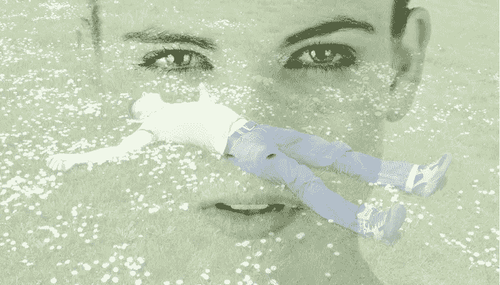

# 当你感到完全没有动力时，如何坚持下去

> 原文：<https://medium.com/swlh/how-to-persevere-when-you-feel-totally-unmotivated-8043e1b709c0>

墨守成规？做同样的工作却一事无成？你需要帮助。

我的前同事会告诉你，我总是有动力长时间工作。有些人可能会称我为“被驱动的”*(虽然我讨厌这样……到底是谁或什么在驱动我？我们要去哪里？！).*

努力工作对我来说感觉很棒——这就是为什么我决定成为一名自由职业者。我可以长时间保持专注。**有时候。**

但是我们都经历过那种“嗯”的感觉，这种感觉让我们拖拖拉拉，在浴室里多呆几分钟来推迟开始工作…

*但我现在在为自己工作，我应该不断地充满活力和渴望:’****当你在做你喜欢的事情时，你一生中一天都不会工作****’，对吗..？*

好吧，我不相信这个世界对我们 99.99999%的人真的是这样的。另外，当你处于创业模式或自由职业时，没有多少(如果有的话！)周围的人来踢你一脚，让你承担责任。

现在，我正在做我真正喜欢的事情:我在接受挑战，我在写作，我在做奇怪而精彩的营销项目，我在学习大量的主题，我有各种各样的东西。然而有些日子我觉得完全没有动力。

不，那是一个谎言——我是有动力的，我只是有动力呆在床上或看电视。我们总是被一些事情所激励，我们只需要确保它是正确的焦点。

“有动力”并不意味着面带微笑，或者在工作时吹口哨，或者不断地感受到*对一切都是多么美妙感到兴奋和热情……*世界上很少有人总是这样，坦率地说，他们让我们其余的人感到头疼。

> 动力意味着在你最不喜欢的时候坚持不懈。激励意味着继续 **尽管** *不喜欢。*

动力意味着当你工作的时候，因为你不能保持专注而沮丧地低声嘟囔，然后投入额外的时间，因为有更好的事情即将到来。

动力意味着意识到你已经筋疲力尽，咬紧牙关继续前进。

那么 **我们如何‘获得动力’？**

## **找到你的钩子**

无论如何，找到一些能让你回到高效的顶部空间的东西。对我来说，[看这个](http://bit.ly/MostInspirationalSpeeches-EVER)的前 10 分钟，是改变我态度的一个万无一失的方法。

## 将你的情绪与动机分开

你可能心情很差，但最终仍会朝着你的目标前进。同样，你可能心情很好，但却很难专注于你应该做的工作。找到帮助你摆脱情绪的方法*(巧克力？去游泳吗？)*或者有助于集中注意力*(也许做几次冥想式深呼吸，或者放一些集中注意力的音乐？).*

## **获得触发快乐:**

想出你为什么有这个目标。不是你想要什么，而是你的目的是什么，你来到这个星球是为了做什么。需要找到自己的激情？在这里阅读我关于如何找到激情的建议。

写下来。

换个地方再写一遍。

把它裱起来贴在墙上，让它成为你的桌面背景。当你分心的时候，把你的“为什么”放在你眼睛会游走的每一个地方。

## **把美好的感觉装瓶**

写下你在重要时刻的感受。当你被祝贺时，或者当你付出了额外的努力，这是值得的，或者当人们问“你是怎么做到的？”时，你是什么感觉？!'。当你熬到深夜，努力不让自己因焦虑而尖叫，然后赢得那个项目时，你有什么感觉？当你在奋斗时，捕捉伟大的感觉，让它们鞭策你。

## **装出来。**

你觉得没有动力？你不想坐下来完成一直拖着的工作吗？好了，系好安全带，你要完成它了。

站起来*(也许去一个隐蔽的地方——没必要让任何人感到不安……)*把手放在臀部。双脚分开与肩同宽，尽可能站高。抬起你的头，深呼吸。

回到你的办公桌前，坐直，睁大眼睛，假装你有动力完成工作。这听起来很荒谬，但我保证这很有效。

## **屏蔽噪音**

你知道社交媒体会在某个地方出现，但这是关于在大部分时间里摆脱电子邮件和短信。

如果我们有太多的输入，那么我们就不能专注于任何事情，它会变得完全压倒一切。

拿一张新的空白纸。把你的目标写在最上面(这样你每次看你的待办事项清单时都会看到它！)，然后把当天要做的事情都写下来。如果有必要，可以分成几个小时。坚持下去，设置闹钟，按时完成任务。你会如此专注于你正在做的事情，以至于你不会去想“我是否感到有动力”。

在一天结束的时候回头看看你已经完成了多少，尽管最初感觉很垃圾。跳一支庆祝舞。

## 是关于你的。

你的目标是你的目标。没有人能设定它们，如果你没有实现它们，你只是在欺骗你自己，所以拿你自己和你自己比较。虽然看起来很奇怪，但是每周给自己做一次检查，找出你已经取得的进步。对自己负责，记得为自己取得的进步奖励自己！

拿自己和别人比较可能是一个危险的游戏。我们都倾向于夸大自己做得有多好，并“摆出一副勇敢的面孔”，尤其是在社交媒体上。如果你遇到这样的人，祝贺他们，但是不要全信。这是关于你的。

## **吃青蛙！**

这意味着每天的第一件事就是处理你最讨厌的任务。你最讨厌的任务总是很难吃*(就像青蛙一样)*但是它们不会消失。推迟它们会让你有一种焦虑恐惧的感觉，并让你的其他任务变得灰暗。

吃青蛙，在你的任务清单上做些记号。

## 找到你的英雄

想象一下当你到了他们那里会是什么样子。未来的事情比已经实现的事情更能激励人！想象自己有所突破，或者赢得一个奖项，或者登上那座山的顶峰，或者在一家全国性的报纸上发表文章，或者做一次 TED 演讲(或者无论你的目标是什么！).你感觉如何？

想想你现在的速度——你能更努力一点到达那里吗..？(我打赌那会给你一点能量！)

## **改变背景**

让血液流动起来，走出去，获得不同的输入。改变你的物理位置也可以启动思维的转变。

不要只是搬到一个不同的房间。搬到一个可以换个位置坐着的地方，或者用纸笔代替打字，或者从笔记本切换到手机。做一些让你感觉不同的事情。

这不仅仅是关于你的环境，而是关于混合它并找到不同的输入。去看一场与你的“真正工作”完全无关的免费讲座，看看它能带来什么想法。

## **和自己说句话**

写下所有你以前用过的借口，或者你认为将来会用到的借口。你了解他们，因为他们是你的借口。写下你对这些借口的回应，就像你在自言自语一样。

消极动机和拖延症是一对有害的享乐主义组合——它们互相刺激，同时在你耳边说着诱人的甜言蜜语..捂住耳朵，不要听！

写下你的“不做”清单。奇怪的是，洗碗在我的拖延清单上。我讨厌洗碗，当我努力集中注意力的时候，我会被几个需要洗的杯子吸引…奇怪。

你的目标是什么并不重要。无论是攀登最高的山峰，学习一门语言，写一本书，成为你所在领域的专家还是找到一份新工作，我们的目标在开始*时都是令人生畏的大山(否则它们就不是目标，它们只是一个简单的待办事项清单)。*

> 要成为任何事情的专家，我们必须练习…
> 
> 然而，我们期望在不付出任何努力的情况下突然变得“有动力”？不会的。

追求目标的动力不会凭空出现，各位！我们必须为**找到**的动力，培育它，并不断地为它的火上浇油。

我们必须学会激励自己。你是负责你的目标的人。你是唯一对你负责的人。

# 获得动力。

## *如果你喜欢这篇文章…*

*…点击*👏*在下面传播爱，这样其他人就可以在这里阅读并找到他们的动力。*

## 这篇文章发表在《创业》[上，258，400 多人聚集在一起阅读 Medium 关于创业的主要报道。](https://medium.com/swlh)

## 点击订阅接收我们的头条新闻[。](http://growthsupply.com/the-startup-newsletter/)

