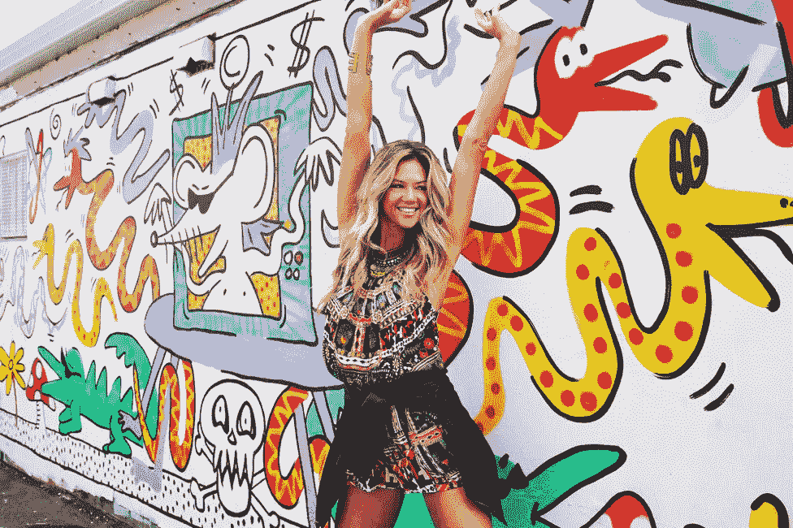

# 如何挑选合适的影响者

> 原文：<https://medium.com/swlh/how-to-pick-the-right-influencer-a8a99030fd1f>

## 为 Instagram 影响者营销活动寻找影响者并不容易。事实上，如果要记住一件事，那就是:*不是每个有影响力的人都适合你的品牌。*

**根据 Instagram 广告统计:**

*   *50%的 Instagram 用户*关注至少一家公司，
*   60%的 Instagram 用户表示，Instagram 是他们了解产品或服务的地方
*   75%的 Instagram 用户在看完帖子后会有所行动，通常是通过发邮件或访问公司网站

也就是说。这就是你和你的品牌需要出现的地方。

如果以上统计数据足够令人欣慰，我们希望 [**这个**](https://bit.ly/2Dv9ak4) 能改变你的想法。

我们都知道一个。Youtube 上的超级明星。Instagram 模特。时尚博主。影响者有各种形状和大小，随着数字可能性的增加；原生广告的这一分支在品牌中越来越受欢迎。

选择拥有最多追随者、产生最多赞、评论和分享的影响者来为你的品牌做影响者营销是很有诱惑力的。但是，除非他们的目标和品牌形象与你的一致，否则这不会是影响者营销天堂中的一对。

为了在牢记投资回报率的同时，为您的品牌找到合适的影响者，您可能需要考虑一些关键因素。

## **步骤一。确定你的目标**

在品牌和销售之间划清界限。

在选择影响者时，最容易犯的一个错误是将影响力作为成功和潜在销售额的唯一指标。是的，如果你需要帮助播种你的溢出，接触是必要的，但影响者对品牌的贡献远不止短期财务回报。他们是优秀的内容创作者，他们的成功来自创意，他们确切地知道什么吸引目标受众。

请记住，要获得知名度，你总是可以通过付费媒体扩大内容。

Photo by [Carlos Muza](https://unsplash.com/photos/hpjSkU2UYSU?utm_source=unsplash&utm_medium=referral&utm_content=creditCopyText) on [Unsplash](https://unsplash.com/search/photos/collaboration?utm_source=unsplash&utm_medium=referral&utm_content=creditCopyText)

当你考虑影响者营销时，不要局限于传统的数字 KPI，如 CPM、CPV、CPC 等。大多数有影响力的人将很难跟上你的数字基准——如果你不包括更多的定性测量，向大老板展示活动投资回报率的实际价值将是困难的。在开始之前确定您的活动目标，并包括关注影响者营销优势的考虑因素，如吸引观众、创造性地讲述故事和花费时间管理品牌内容。

现在，如果你正在将 Instagram 作为你销售战略的核心平台，或者在重塑你的企业品牌之前，或许正在寻找一个短暂的现金机会，那么你很幸运，不仅生活在“影响者营销”的时代，而且生活在“立即购买标签”的时代。

Instagram **SHOP NOW 标签**有哪些？

*   基本上，当 Instagram 用户查看一个品牌的帖子时，轻轻一点就会显示各种产品旁边的标签&它们的价格。
*   再次点击他们感兴趣的产品将会提供更多信息，这样他们就可以了解更多。
*   第三次点击 Instagram SHOP NOW 链接，他们将直接进入该公司网站上的商品，使他们更容易购物。

**Shop Now Tag**功能是一个非常好的窗口，可以让你了解影响者的销售转化，并在你的电子商务战略中利用社交档案。

在此了解如何启用产品标签[T5。](https://bit.ly/2u2DO0m)

## **第二步。影响者标准**

*影响者通常专注于特定主题或类别。*

为你的品牌描绘出相关的背景对于提高目标受众的相关性是至关重要的。标准类别，如时尚，木乃伊，食品，健身，旅游等。可能会有所帮助，但是为您的影响者定义其他标准将有助于您创建强有力的匹配。假设你有一个特定的厨房设备，比如你想让一个博主评论的披萨烤箱。最有可能是一个美食博主，但你也需要确保这个博主有一个相当大的厨房，以便在厨房里有足够的空间。或者说，你是一家时尚公司，正在寻找一位有影响力的人来为你的社交平台创作内容。在这种情况下，影响者的视觉外观符合你的品牌方针也很重要。提前设置所有标准将有助于您找到强有力的匹配，并自动减少寻找合适的影响者所花费的时间——您将确切知道要寻找什么。

## **第三步。讲故事**

*那么，我们是否只是将产品发送给选定的影响者，并期待最好的结果？当然不是！*

影响者营销最关键的部分是在获得$$$回报之前找到故事。大多数品牌都知道他们希望影响者说些什么，但创建可信推荐的关键是用博主自己的语言和方式讲述故事。告诉有影响力的人发布什么和创造一个鼓舞人心的品牌故事，为个人创造力留下足够的空间，这两者之间有一条细微的界限。第二种方法通常会产生最好的结果——尤其是当你使用不止一个影响者的时候。这一切都是为了找到品牌、受众(影响者)和话题的最佳结合点。

Photo of @pash_ owned by [http://www.camilla.com/au/](http://www.camilla.com/au/)

> 这样做的目的是创造出令人敬畏的图像来吸引你的观众的注意力，这样他们就可以对你的品牌赞不绝口。

## **第四步。研究**

*这是被你挖深了。*

现在我们到了这样一个阶段，你实际上找到了你的影响者，而对于那些做得好的人来说，这通常是影响者营销中最耗时的部分。这不仅仅是选择一个类别中的前三名影响者或偶然出现在你雷达上的影响者。你想更深入地挖掘，看看影响者的平台、内容主题、过去的品牌合作、语气等。如果你是一家牛肉干企业，你希望与一个有影响的人进行品牌合作，你不会希望选择一个有素食主义倾向的影响者。另一个例子是一家旅行社向一位有影响力的人提供滑雪旅行，这位有影响力的人过去曾提到她讨厌雪，并且只在赤道 100 公里以内旅行。我的观点是，花一些时间看看个人影响者过去的内容和故事——你甚至会发现他们已经通过自己的兴趣提到了你的品牌。

当你与有影响力的人合作时，要记住最重要的一点是，他们不是你用品牌信息购买的数字平台。

> 他们是人类，有一颗创造的心，有一个对成千上万的追随者很重要的观点。他们可以围绕你的品牌创造一个积极可信的故事，并有可能增加观众对品牌的偏好。
> 
> **不要剥削他们，要管理他们！**

# 我想做的是…

***……就是写值得你花时间，能给你带来价值的东西。如果你喜欢阅读，请点击💚这样其他人也会看到它(你最多可以点击 50 次)！！***

此外，如果你伸出手说“嘿！”那绝对会让我开心不已 via DM on[***insta gram***](https://www.instagram.com/iblamesid)***。真的很期待连接！*** 😊

## 西德尼

## 这个故事发表在 [The Startup](https://medium.com/swlh) 上，这是 Medium 最大的创业刊物，拥有 318，583+人关注。

## 在这里订阅接收[我们的头条新闻](http://growthsupply.com/the-startup-newsletter/)。

