# 如何向投资者推销你的应用

> 原文：<https://medium.com/swlh/how-to-pitch-your-app-to-investors-8fc6f93c31d>

Originally published on [http://www.appsterhq.com](http://www.appsterhq.com/?utm_source=CP&utm_medium=Medium)/

成功地向投资者推销你的应用想法，并说服他们为你的初创公司提供资金[不是一件容易的事情](http://www.angelblog.net/Startup_Fundings_Are_Not_Easy.html)。

尽管如此，有各种各样的策略可以极大地提高你的能力，创造一个成功的推销平台，并进行有说服力的现场推销，从而获得资金。

在这篇文章中，我将概述向投资者推销的所有三个阶段的最佳实践，并在 Appster 分享一些与初创公司[合作的实际案例。](https://www.appsterhq.com/)

# **投球的三个阶段**

将“[推销](http://study.com/academy/lesson/business-pitch-definition-types-importance.html)”概念化是很有帮助的，即向受众(通常由一个或多个投资者组成)传递或展示一个商业想法，涉及三个关键阶段或要素。

首先，有球场甲板。

“[推介平台](https://pitchdeck.improvepresentation.com/what-is-a-pitch-deck)”是一种简洁、易于理解、高度可视化的商业理念演示，通常使用类似 PowerPoint 的软件创建，并在面对面会议之前以电子方式交付给投资者。

接下来，尝试与投资者建立沟通，目的是说服投资者查看你的推介资料和/或同意进行实时会面。

在许多情况下，这种沟通是以“冷淡”开始的，也就是说，你试图通过发送一封不请自来的电子邮件(或者打一个冷淡的电话)与潜在投资者建立沟通渠道。

最后，还有面对面的推介演示，你可以实时展示你的推介，并与潜在投资者进行交流。

注意:并不是所有的推销都是面对面进行的:互联网上的推销(比如通过 Skype 进行视频会议)现在变得越来越受欢迎。

通常，推介流程会连续遵循以下步骤，即首先，您设计推介资料，然后您可以向投资者发送电子邮件并发送您的推介资料，最后，您安排并实际参与与投资者的实时会议。

然而，在特定的环境下，这些阶段有时可能会“乱序”发生。

我想详细检查一下这三个主要元素，以便概述一些最佳实践，让你最大限度地提高为你的应用程序获得资金的机会。

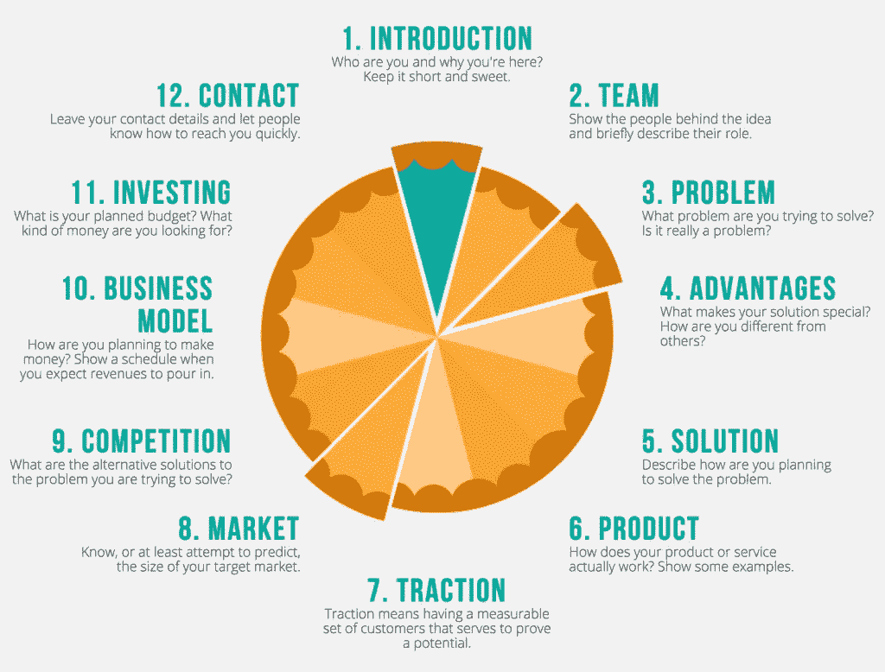

(infographic by: Improve Presentation, Inc.)

# **第一阶段:球场甲板**

2015 年，哈佛商学院教授汤姆·艾森曼(Tom Eisenmann)和 DocSend [的同事研究了 200 家初创公司在种子和 A 轮融资过程中的融资活动。](https://docsend.com/view/p8jxsqr)

这 200 家公司总共成功筹集了超过 3 . 6 亿美元的投资。

除了调查一些筹款问题，这项研究还明确审查了有关球场甲板的各种动态。

接受调查的许多初创公司都将自己的实际推介资料发送给了 DocSend。

该研究发现了四个值得注意的与球场甲板相关的发现。

首先，**平均推介层长度为 19.2 页**。

请记住，推介材料是高度可视化的文档，包含大量空白和少量文本，这份平均 19.2 页的材料证明，为了说服投资者为你的初创公司提供资金，你的材料必须简明扼要。

其次，**投资者平均只花了 3:44 来分析每一个摊位**。

换句话说，投资者将在几百秒的时间内决定是否值得与你安排一次面对面的会面(或实际投资你的公司)!

第三，**以下代表了所检查的**球场甲板的十个定义:

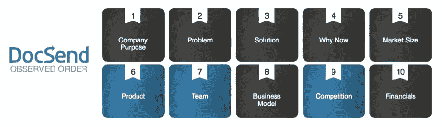

(infographic by: DocSend)

就具体数字而言，DocSend 发现了以下数据，这些数据显示了在推介材料中包含这十个类别的公司所占的百分比:

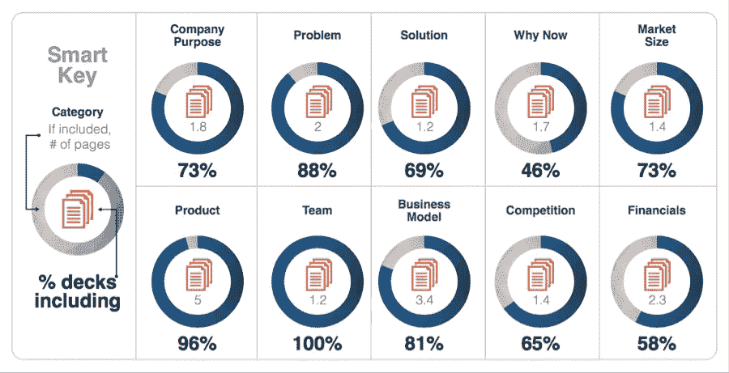

(infographic by: DocSend)

这些结果显示，尽管几乎所有的初创公司都有关于他们的团队、产品和问题的幻灯片，但只有大约一半的竞赛讨论了财务问题，不到三分之二的竞赛讨论了竞争问题。

然而，就这十个类别而言——目的、问题、解决方案、为什么是现在、市场规模、产品、团队、业务模式、竞争和财务——代表了任何给定推介材料中最重要的元素，因此，根据所有十个类别(如果适用)准备您的材料至关重要。

事实上，风险投资公司红杉资本(Sequoia Capital)也[建议](https://www.sequoiacap.com/article/writing-a-business-plan/)初创公司根据这十个定义要素来构建他们的推介平台。

最后，**投资者在不同的幻灯片上花费不同的时间**:

(image by: DocSend)

很明显，投资者花在财务、团队、竞争和为什么现在这样的类别上的时间比花在解决方案、问题和市场规模上的时间多。

现在让我们一次一个地探索这十个类别。

# **获胜的十大要素**

## **1。公司宗旨/使命宣言…**

…用一两句话令人信服地回答“你的公司为什么存在？”

你的推介材料应该从你的使命陈述开始，因为它明确地告诉你的投资者*为什么*他们应该关注你。

在你讨论你的团队或产品或收入模式或你业务的任何其他方面之前，你必须首先清楚、简明、有说服力地陈述你公司的本质:*你寻求完成什么，为什么？*

畅销书《从为什么开始:伟大的领导者如何激励每个人采取行动》的作者西蒙·西内克明确指出，卓越的领导者和组织通过优先回答为什么而不是什么和如何的问题来激励他人采取行动(来源: [1](https://www.ted.com/talks/simon_sinek_how_great_leaders_inspire_action) 、 [2](https://www.referralcandy.com/blog/stop-selling-product/) )。

[Larry Kim](https://www.inc.com/larry-kim/30-inspiring-billion-dollar-startup-company-mission-statements.html) 将你的公司目标/使命描述为“你的战略”。你的核心。你的视野。你的身份。你的文化。”

换句话说，就是*用一两句话表达的一切*。

[戴夫·史密斯](https://www.inc.com/ss/5-tips-on-developing-an-effective-mission-statement)建议有效的使命陈述是:

> “……现实主义和乐观主义的融合，这两个词通常是相互矛盾的，在这两者之间取得平衡是撰写伟大使命宣言的最终关键。
> 
> 你必须能够传达你的公司的价值或你的品牌存在的原因，激励和鼓励你的员工，听起来完全合理和可信，并尽可能具体和相关。
> 
> 你的使命宣言，在最好的情况下，应该可以兼做你的口号。所以没必要搞得过于复杂；只要陈述你的公司的目的，你开始创业的原因。"

你的推介材料必须尽快真正吸引住你的听众；实现这一目标的关键是从坚定的公司目标开始。

以下是一些当今最大公司背后的著名使命宣言的例子:

*   [**亚马逊**](https://www.thebalance.com/amazon-mission-statement-4068548) :“成为地球上最以客户为中心的公司；建立一个地方，让人们可以找到并发现他们可能想在网上购买的任何东西。”
*   [**蓝色围裙**](https://www.inc.com/larry-kim/30-inspiring-billion-dollar-startup-company-mission-statements.html) :“蓝色围裙让每个人都可以享受难以置信的家常菜。”
*   [**推特**](http://www.businessinsider.com/tech-company-mission-statements-2016-1/#netflix-doesnt-exactly-have-a-formal-mission-statement-but-in-october-2011-ceo-reed-hastings-outlined-four-bullet-points-for-what-he-wants-the-company-to-be-all-about-6) :“让每个人都有能力即时、无障碍地创造和分享想法和信息。”
*   **:“交通如流水，无处不在”**

**最后，一定要避免不必要的冗长、浮夸、混乱、自命不凡、含糊不清或泛泛而谈的使命陈述。**

## ****2。问题…****

**…清楚地回答“你想解决什么问题？”以及“你将为世界增加什么价值？”**

**正如我过去指出的:**

> **“任何成功产品或服务的本质，包括应用程序，都在于它解决特定问题的能力。如果你的应用不能以某种方式让人们的生活变得更好，也就是说，如果它不能为这个世界增加(哪怕是一点点)价值，那么没有人会使用它，也没有投资者会资助它。”**

**你的应用必须解决人们想要摆脱的特定问题，否则就会失败。**

**你可以从增加一些东西(例如，增加快乐、兴奋或人际关系)或减少一些东西(例如，减轻焦虑、孤独或自我怀疑)的角度来看待这件事。**

**无论哪种方式，你的推介材料都必须公开陈述你的应用程序将要回应的特定问题。**

**重要的是，这个问题需要成为*可货币化的客户难题*。**

**投资者想知道，通过关注你的资料中概述的问题，你真的有潜力创业。**

**我之前已经这样描述过这个概念:**

> **“成功地建立一个问题/解决方案契合需要发现一个客户痛苦所以意义重大说明数量充足**人不上下上下上**下上下上下或****

****在这里的 [Appster](http://www.appsterhq.com/) 上，我们已经写了多篇关于有效发现和测试你的货币化客户难题的方法的文章——见这里的[这里的](http://www.appsterhq.com/blog/mvp-app)、这里的[这里的](http://www.appsterhq.com/blog/avoid-pitfalls-premature-scaling)和这里的[这里的](http://www.appsterhq.com/blog/test-product-idea-real-world-feedback)。****

****同样重要的是，您的推介材料要明确指出，为什么您所确定的问题的当前“解决方案”是不充分的。****

****作为一个例子，这是 AirBnB 2011 年的原始问题幻灯片——注意它如何陈述问题*和*列出当前“解决方案”无效的原因:****

****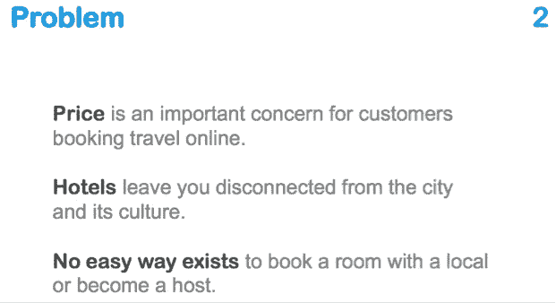****

****(image by: PitchDeckCoach)****

## ******3。解决方案…******

****…直接回答“你将如何解决这个问题？”以及“你将如何让人们的生活变得更好？”****

****这部分内容概述了您的“[独特价值主张](https://unbounce.com/conversion-glossary/definition/unique-value-proposition/)”，即“清晰陈述，描述您的产品优势、您如何解决客户需求以及您在竞争中的优势”。****

****你独特的价值主张被称为你的“秘方”,它概括了你提出的解决方案为何如此特别，以及它与同领域其他人的不同之处。****

****效率更高吗？在某些方面更有效？便宜？更易于采购和/或扩展？更人性化？等等。****

****文字是好的，但视觉用例更好:展示人们实际使用你的产品，并从中受益。****

****正如[梅根·马尔斯](http://info.localytics.com/blog/app-onboarding-101)指出的，“令人兴奋的功能和令人印象深刻的功能很重要，但展示用户可以用这些功能做什么，也就是你的价值主张，将会赢得人们的长期支持。”****

## ******4。为什么是现在？…******

****…对“为什么现在是推出该产品和公司的最佳时机？”这一问题的回答****

****说到创办成功的创业公司，时机就是一切。****

****正如我们之前在 Appster 博客上[讨论过的](http://www.appsterhq.com/blog/build-successful-mobile-app-startup)，Friendster、Myspace、Prius、Couchsurfing 和 Netscape 在脸书、Tesla、AirBnB 和 Google 成立之前就已经存在，但是前者现在几乎已经死亡，而后者是非常成功的行业领导者。****

****你的推介材料的这一部分需要让投资者相信，市场现在已经为你打算用你的应用创造的特定解决方案做好了准备。****

****通常，为了实现这一点，你必须提供和讨论关于你的市场和/或产品的各种重要数据和分析。****

****例如，这里有三张来自优步原始推介资料的幻灯片，它们共同指出了问题、解决方案和为什么是现在的类别。：****

****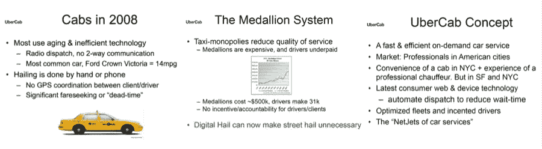****

****(image by: Pitch Deck Examples)****

## ******5。市场规模…******

****…对市场规模、形状、特征和趋势的简单描述。****

****在过去的几篇文章中，[我强调过](http://www.appsterhq.com/blog/build-successful-mobile-app-startup):****

> ****“问题的重要性(即价值)取决于其所属市场的规模和增长。为了取得成功，一个应用程序需要在一个大市场中解决一个大问题，在这个大市场中，消费者有很大的修复需求。”****

****因此，你的推介材料的这一部分必须向投资者展示，你的目标市场“渴望”得到你之前描述的问题的新解决方案。****

****市场必须很大和/或迅速扩大；消费者需求很少的利基市场无法支撑新企业，投资者明白这一点。****

****您应该提供以下方面的准确、可靠和最新的数据:****

*   ****你的特定利基所在的整个市场的规模；****
*   ****过去几年中你所在领域的发展；****
*   ****你期望通过你的营销努力能够接触到的人数；和****
*   ****最有可能购买你的产品的人数。****

****您可以使用以下资源来研究您的总可用市场、可用服务市场和目标市场的统计数据: [Forrester](https://www.forrester.com/marketing/about/about-us.html) 、 [Gartner](https://www.gartner.com/marketing/about) 、 [IBISWorld](https://www.ibisworld.com/) 、 [Ovum](https://ovum.informa.com/) ，以及 [SEC](http://www.sec.gov/edgar.shtml) 的备案。****

****这里有一个实用的建议:不要试图去追逐一个过于庞大的市场，也就是说，不要贪多嚼不烂。****

****请记住，脸书是从针对特定学校的大学生开始的，而优步是从在扩展到更大的领域之前只在选定的州运营开始的。****

****(**注**:尽管类别 1-5 的排序存在很小的可变性，但要素 6-10 的排序似乎确实存在一些可变性。我将关注 DocSend 研究的结果，这些结果是基于被调查的实际公司的习惯，但我建议看一看红杉资本略有不同的排序[这里](https://www.sequoiacap.com/article/writing-a-business-plan/)。****

## ******6。产品…******

****…从功能、架构、设计和开发方面清楚地概述您产品的细节。****

****您的推介材料的这一部分应该概述您的应用程序做什么以及如何做。****

****你应该指出你目前的开发阶段，你目前是在 alpha 测试还是 beta 测试，以及你计划何时向公众发布应用程序。****

****确保在适当的地方使用你的应用程序设计和界面的视觉效果。****

****然而，一个演示平台并不适合包含大量原理图、线框、模型等。****

****在看到你的这个组件之后，投资者不应该对你的应用程序的基本功能有任何疑问。****

****正如 AirBnB 的产品幻灯片所展示的，没有必要让你的这部分内容过于复杂或难以理解:****

****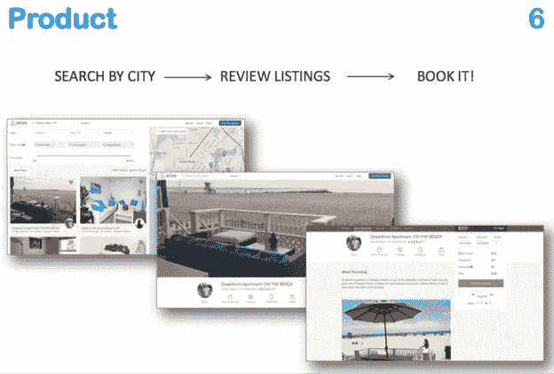****

****(image by: PitchDeckCoach)****

## ******7。团队…******

****…对您的团队成员、他们的资格和经验以及他们如何相互认识的简明、相关和直截了当的概述。****

****重要的是要记住，说到底，投资者投资的是*人*，即令人印象深刻的想法和收益背后的真实个体。****

****我[在](http://www.appsterhq.com/blog/recruit-investors-startup)之前已经指出这一点，强调:****

> ****“想法本身基本上是无用的；是执行想法的人，因此是允许伟大公司出现的人。****
> 
> ****向投资者展示你的创业团队是完全可靠的，也就是说，由努力工作、聪明、致力于成功和以行动为导向的成员组成，这一点很重要。****
> 
> ****通过讨论过去的成功和胜利来证明你的团队完成任务的能力。"****

****最后一个建议很重要:一定要简要概述每个团队成员的主要成就，包括任何在过去创立、收购和/或稳固的公司。****

****下面是 Shift 的团队部分(Shift 是上述 DocSend 研究中包括的公司之一):****

****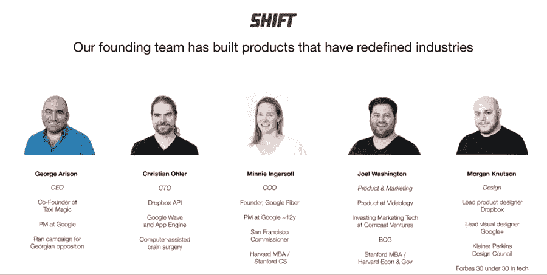****

****(image by: George Arison via DocSend)****

## ******8。商业模式…******

****…概述您将如何将您的产品货币化并建立可扩展的业务。****

****Steve Blank 对“商业模式”给出了如下颇为宽泛的定义:****

> ****“商业模式描述了你的公司如何创造、传递和获取价值(或者根据你的成功标准，获得用户、增加流量等)。).****
> 
> ****商业模型是一张显示公司不同部分之间所有流程的图，包括产品如何分配给客户以及资金如何回流到公司。****
> 
> ****它显示了你公司的成本结构，每个部门如何与其他部门互动，以及你的公司与其他公司或合作伙伴的契合点。"****

****现在，您当然不需要在推介材料中提供所有这些信息。的确，你不应该这样做。****

****这一部分的重点是向投资者直截了当地展示你将如何赚钱，也就是说，随着时间的推移，你的公司将如何生存和发展。****

****你应该讨论你的价格点，并提供具体数字的理由。****

****您可能希望在推介材料中包含的两个重要数据是*客户获取成本* ( [CACs](http://www.appsterhq.com/blog/3-crucial-features-high-growth-startups) )和*客户终身价值* ( [LTV](http://www.appsterhq.com/blog/track-5-mobile-app-marketing-metrics) )。****

****如果你还没有这些指标的值，如果你是一家早期创业公司，这是完全可能的，那么尝试收集你所在行业的类似公司的数据，以粗略估计你的数据最终会是什么样子。****

****这是 DocSend 自己的推介材料中的业务模式幻灯片:****

****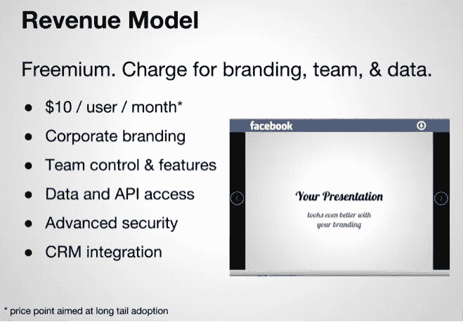****

****(image by: DocSend)****

## ******9。竞赛…******

****…概述您的竞争对手，同时陈述您的竞争优势。****

****LinkedIn 联合创始人雷德·霍夫曼明确指示创始人*不要回避在他们的演讲台上讨论他们的竞争对手:*****

> ****“有经验的投资者知道风险总是存在的。如果他们问你你的风险因素，而你不能回答，你就失去了可信度，因为他们认为你要么不诚实，要么愚蠢。****
> 
> ****企业家经常说他们没有竞争对手，假设这是一个令人印象深刻的说法。但是如果你声称你没有竞争，你要么相信市场是完全无效的，要么没有人认为你的空间是有价值的。两者都是愚蠢的。****
> 
> ****为了赢得投资者的信任，你要展示出你理解竞争风险，并展示出你为什么会赢。****
> 
> ****这样表达你的竞争优势:你为什么要突围而出？你的优势是什么？如果你不够清晰和果断，投资者不会相信你有成功的优势。"****

****根据霍夫曼的观点，在准备推介材料时，如果不公开承认在你打算推出的领域已经有其他人在运作(这很可能是真的)，几乎肯定会适得其反。****

****投资者希望看到你意识到你所在市场的“事态”。****

****解决牌组内竞争的最有效和最常见的方法之一是利用如下所示的 4 格网格:****

****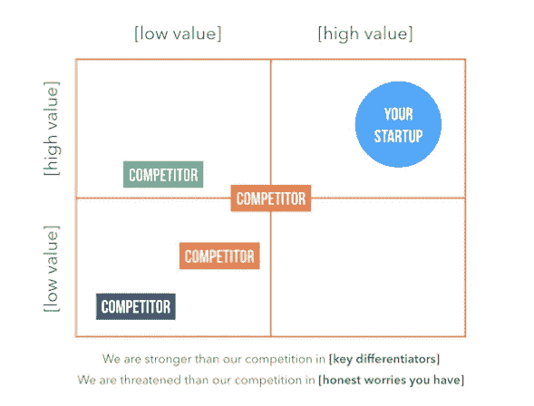****

****作为一个例子，这里是 DocSend 自己的竞争幻灯片:****

****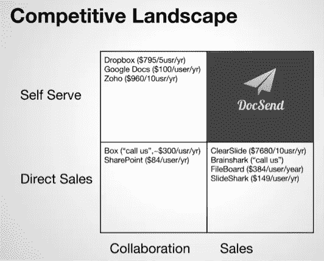****

****(image by: DocSend)****

## ****10。财务…****

****…您的预期收入和各种其他相关结果(例如，市场份额)的陈述。****

****推介材料的财务部分可能有点棘手/复杂，原因有二。****

****首先，如果你还是一家初创企业，准确提供你的公司或产品的财务信息可能非常困难。****

****事实上，许多投资者会对你的现金流预测持怀疑态度，不管你引用的金额是多少。****

****其次， [DocSend 对 200 家公司的推介资料进行了研究](https://docsend.com/view/p8jxsqr)，发现了以下情况:****

> ****“虽然就投资者在每个部分投入的时间而言，金融类别占据首位，但只有 57%的成功套牌拥有这一部分。****
> 
> ****几乎所有的种子层和许多 A 层都不包含任何值得讨论的重要财务信息。****
> 
> ****另一件需要注意的重要事情是，几乎没有一副牌列出了他们筹集的金额和资金筹集的条款。"****

****这表明，筹资的具体条款和寻求的金额应该被*留在* *之外*，而不是在晚些时候亲自与投资者沟通。****

****为了提供投资者希望看到的一些有价值的财务数据，熟悉并收集指标数据很重要，如*烧钱率*、*现金流*、*增长与利润*、*跑道*和*零现金日期*(参见我们最近的出版物: [1](http://www.appsterhq.com/blog/4-financial-metrics-startups-measure) 、 [2](http://www.appsterhq.com/blog/startup-burn-rate-guide) 、 [3](http://www.appsterhq.com/blog/ways-to-boost-startup-revenue) )。****

****以下是优步最初的财务数据:****

********

****(image by: Pitch Deck Examples)****

****现在，我们已经了解了推介资料准备的最佳实践，让我们转向推介的其余两个方面，即与投资者建立沟通和提供实时、面对面的推介。****

# ******第二阶段:建立沟通******

****推销你的应用程序的第二个主要阶段包括与投资者建立沟通，也就是说“让球滚动起来”。****

****在试图联系投资者之前，了解不同类型投资者的不同需求、愿望、期望和能力至关重要。****

****当然，并非所有的投资者都以同样的方式工作，或者想要同样的东西。****

****正如我之前指出的:****

> ****“不仅不同类型的投资者在你的初创企业生命周期的不同阶段是更多或更少的合适资金来源，而且前者能够提供的资金数量和类型以及他们对你公司的参与程度都将取决于投资者的具体兴趣、需求和能力。"****

****因此，在把你的推介材料发给投资者之前，一定要熟悉一下[默里·纽兰兹](https://murraynewlands.com/funding/)对现有的 6 种主要投资者类型的有益描述，即*朋友/家人、天使、超级天使、风投、投资银行家、*和*众筹者*。****

****让自己熟悉不同类型投资者的不同需求、能力和期望的另一个关键方面是，在联系投资者之前做好尽职调查。****

****正如我在之前[所强调的，“既然你是试图说服另一个人或公司投资你公司的人，那么在推销你的创业公司之前，你显然有责任尽可能多地了解那个人或公司。”](http://www.appsterhq.com/blog/recruit-investors-startup)****

****幸运的是，我整理了一份建议清单，创始人可以遵循，以便在接触或会见投资者之前，了解和收集有关他/她的有用信息。****

****请随意看看这些策略[这里](http://www.appsterhq.com/blog/recruit-investors-startup)，列在标题下，“**需要执行投资者尽职调查**”。****

****就像你的推介材料中的使命陈述一样，你与投资者的首次沟通包含一两句话对你公司本质的总结——也就是你的一句话推介——是至关重要的。****

****已经准备好了你的推介材料，你在与投资者的交流中提出(或仅仅重述)你的一句话推介应该没有问题。****

****然而，如果你仍然需要一点帮助，那么我建议让 [Adeo Ressi](https://fi.co/madlibs) 的模板来指导你:****

****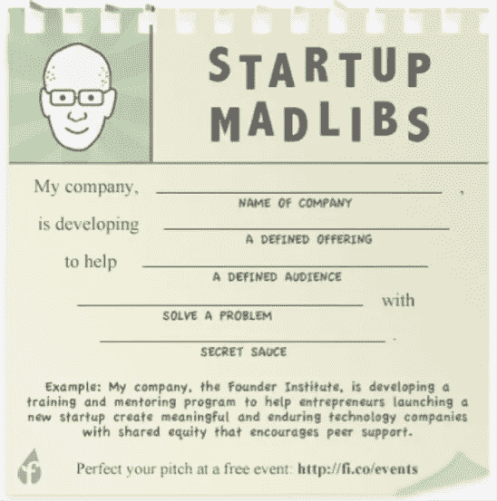****

****(image by: Founder Institute, Inc.)****

****现在，你已经准备好开始联系投资者并发送你的推介材料，你如何着手寻找可能为你的公司提供资金的合格个人呢？****

****[缪斯](https://www.forbes.com/sites/dailymuse/2013/02/13/5-steps-to-finding-investors-for-your-start-up/#13de237a5136)建议采用以下三种策略寻找和联系潜在投资者:****

****首先，通过以下方式在线追踪投资者:****

*   ****创建一个 [AngelList](https://angel.co/) 简介，描述你的公司、团队成员和产品，以便投资者可以找到并了解你；和****
*   ****使用 [Crunchbase](https://www.crunchbase.com/) 寻找在你的特定行业中与你相似的创业公司。Crunchbase 允许您查找特定的公司、个人或投资者，并查看谁投资了什么、何时投资了多少，从而让您深入了解您应该尝试联系的特定公司和个人。****

****其次，通过以下方式创建潜在投资者的战略名单:****

*   ****编制一份 30-50 名专业人士的名单，从投资的角度来看，这些人可能非常适合你的公司；****
*   ****在 AngelList 上研究投资你所在行业的公司的投资者；和****
*   ****在基本的电子表格或简单的客户关系管理(CRM)软件中存储姓名和联系方式(最好是电子邮件地址)。****

****第三，通过以下方式利用你的职业和个人关系网:****

*   ****逐一梳理你的投资者名单，确定你们是否有共同的熟人；和****
*   ****请一位共同的朋友或同事介绍你给投资者，当你最终与投资者见面时，一定要专业且令人信服地陈述你的想法。****

****参加聚会和行业活动，与潜在投资者面对面交谈，也会很有帮助。****

****在这种情况下，Meetup.com 是一个很好的资源，值得利用。****

****如果，不管出于什么原因，你无法通过在线社交网站、相互认识的人或面对面的聚会与潜在投资者联系，那么你很可能别无选择，只能尝试通过“[冷冰冰的电子邮件](https://pipetop.com/saas-glossary/sales-terms/cold-emailing/)”(或者，不太可能是“冷冰冰的电话”)来建立联系。****

****这里有一个[列表](http://www.appsterhq.com/blog/recruit-investors-startup)是经过时间考验的给投资者发电子邮件的注意事项，明确地说，这指的是在没有和他/她说过话的情况下联系他/她的过程:****

*   ****使用投资者的名字来个性化你的邮件，提及他/她的投资历史的一个或多个关键因素，并表明你已经考虑了他/她非常适合你、你的公司和你的主要目标的原因；****
*   ****一定要把你冰冷的邮件限制在 5-7 句话以内；****
*   ****尝试不同的主题标题和不同的一句话主题；确保使用分析软件来确定电子邮件打开率和/或回复率之间的差异(如果有)；****
*   ****如果在 7-10 天内没有收到投资者的回复，礼貌地跟进并寻求反馈；****
*   ****不要向许多不同的投资者发出笼统的推介，而不考虑这些特定的天使投资人、风险投资人等。可能非常适合您的企业；****
*   ****不要写极长、超详细的邮件；和****
*   ****不要通过发送大量跟进信息和/或乞求重新考虑来骚扰投资者。****

****如果你正在寻找更多可以用来联系投资者的冷冰冰的电子邮件策略，那么看看作者兼企业家杰森·卡拉卡尼斯的视频[。](https://youtu.be/cb-biNXxuvY)****

****现在让我们转到推销的最后一个要素，即实时向投资者做演示。****

# ******第三阶段:现场演示******

********

****推销你的应用程序的最后一个决定性阶段是向投资者提供一个关于你的产品和公司的实时演示。****

****大部分时间都是面对面进行，但通过电话会议和视频聊天进行现场推介正变得越来越普遍。****

****对非常清楚，是的，你应该总是根据你将要会见的特定投资者来定制你的推销，是的，你可能需要多次练习和修改你的现场推销，然后你才能完全适应并有效地进行推销。****

****总结我们到目前为止讨论的观点，[达伦·达尔](https://www.inc.com/guides/2010/08/how-to-find-willing-investors.html)建议，无论何时进行现场推介，创始人都应该尝试回答以下四个关键问题，因为投资者将等待听到对这些重要问题的回应:****

1.  ****公司的产品或服务能满足巨大且不断增长的市场需求吗？****
2.  ****该公司能否迅速扩大规模，充分利用这一市场机遇？****
3.  ****公司有可防御的竞争优势吗？****
4.  ****管理团队能否发挥前三个标准中概述的潜力？****

****在绝大多数情况下，您的推介资料应该作为现场推介的指南。****

****这并不意味着你只是展示和讨论你的潜在投资者(可能)已经看过的幻灯片，而是意味着你的幻灯片中的十个主要类别所捕捉到的基本思想应该位于你的实时推介的核心。****

****尽管也有例外，但推介材料本身通常不足以说服投资者为你的应用提供资金，这也是为什么会有现场推介的原因。****

****投资者在寻找比你的推介更多的信息；他们还希望有机会与你面对面交流，了解你在“现实生活”中的个性。****

****自信、果断、充满激情和热情，但不要自大、傲慢或放肆。****

****克制住对你可能认为是“愚蠢”的问题做出讽刺性回应的冲动，并不断告诉自己，提出这样的问题只是因为投资者想更多地了解你、你的公司和你的应用。****

****具体来说，在进行现场推介时，这里有七个你应该利用的最佳实践:****

## ****1.吸引你的观众****

****试着用吸引投资者注意力的东西来“钩”住他们，迫使他们听你的话，从而把他们从他们熟悉的套路中“摇”出来。例如:一个有趣的行业事实，一个即将到来的重要市场变化，或者一个独特的个人(但很短)故事。避免陈词滥调，如承诺万亿美元的市场或颠覆行业的技术。****

## ****2.描述问题****

****正如我们所讨论的，你需要让你的投资者真正理解并“感受”到你想要解决的客户难题。对于一个能够解决问题的公司来说，更大的问题意味着更大的成功。提供痛苦的例子，并明确解释不解决问题的含义。****

## ****3.强调你独特的价值主张****

****您需要清楚地展示您提出的解决方案与您刚刚发现的问题的所有其他当前可用的解决方案有何不同。要非常具体:你的“秘方”到底比你的竞争对手做得好到哪里去了？投资者为什么要关心？****

## ****4.强调市场动态****

****世界上最成功的企业家和投资者一次又一次地强调，特定市场的规模和需求对初创公司的成功机会至关重要。你需要让投资者相信，你的利基市场能够支撑你的业务。使用视觉材料，如统计数据和图表，来证明你的领域是巨大的和/或快速扩张的。再次强调，通过讨论你的目标客户的确切类型来关注细节(而不仅仅是说“25-40 岁的美国女性”)。****

## ****5.展示牵引力****

****吸引力——即证明你的公司正在赢得用户/客户，产生轰动效应，并带来收入——在筹集资金时非常重要。如果你有吸引力，那么你应该通过使用数据和图形来展示它；如果你还没有收集到足够的指标来证明你的吸引力，那么你必须说服投资者，你的运营是稳固的，并且以令人印象深刻的速度前进。打个比方，你的目标应该是让投资者相信，你的初创企业是一辆快速行驶的列车，他/她最好尽快跳上去。****

## ****6.支持你的团队****

****请记住，在一天结束时，投资者最终投资于“性感”想法和收益背后的现实生活中的人。尽你所能向投资者展示你的创业团队是稳固的，也就是说，充满了聪明、合格、有经验和敬业的人，他们热衷于对世界产生有意义的影响。具体说明团队成员过去的表现和成功。****

## ****7.完成交易；设置后续步骤****

****让 1992 年电影《格伦加里·格伦·罗斯》中著名的“ABC 法则”激励你。完成现场推介后，采取下一步行动，向交易靠近。交换名片，试着安排下一次会面的日期和时间，和/或安排后续的电话。换句话说，管理你的“管道”,保持动力。这里有一条至关重要的提示:*永远不要在没有事先确定下一个联系点的情况下自愿离开会议。*****

****如果你遵循这七个策略，那么你就能为你的应用提供一个令人难忘的、吸引人的、有效的现场推介。****

******//******

******如果你喜欢读这篇文章，那么一定要看看我们关于** [**为你的创业公司筹集资金的非常详细的专家白皮书。**](http://lp.appsterhq.com/how-do-i-raise-capital-for-my-app-il)****

*****原载于*[*www.appsterhq.com*](https://www.appsterhq.com/blog/app-idea-investor-pitch/)*。*****

****//****

## ****感谢阅读！****

# ****如果你喜欢这篇文章，请随意点击下面的按钮👏去帮助别人找到它！****

****************

# ****对应用程序有想法吗？让我们谈谈。****

****在过去的几年里，我们已经帮助建立了超过 12 个数百万美元的创业公司。查看我们如何为您提供帮助。****

********