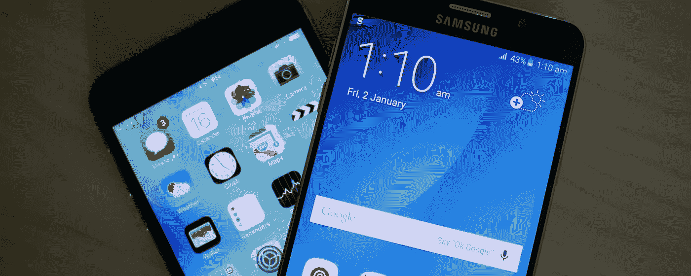

# 如何将自己的 iOS 应用成功移植到 Android？

> 原文：<https://medium.com/swlh/how-to-port-your-ios-app-to-android-ff7d61341e98>

How to Port your iOS App to Android

祝贺你，现在你的 iOS 应用在 App Store 中表现很好。现在，您想知道如何将您的 iOS 应用程序移植到 Android，但您不知道从哪里开始。

好的，首先是好消息——你的 iOS 团队已经做了很多艰苦的工作，一个有能力的 Android 开发者应该不会有问题将你的 iOS 应用移植到 Android，因为这比从头开始构建应用更容易。你的 iOS 应用让每个人都在同一页面上，因为他们知道你的最终产品应该是什么样的——你的 iOS 应用是你的设计和开发团队要遵循的蓝图。

现在，坏消息是——你的 [Android 开发者](http://www.cognitiveclouds.com/custom-software-development-services/android-app-development-company)需要编写新代码，因为 Android 应用程序是用 Java(而不是 Swift 或 Objective-C)编写的，你的设计师需要调整你的 iOS 应用程序的用户界面(UI)以遵循谷歌的材料设计语言。

# 你应该支持哪些 Android 设备？

你的开发者没有时间在每一个 Android 设备上测试你的应用，但是让我们严肃一点…没有人会这样做。根据 OpenSignal 的数据，2015 年市场上有超过 24，000 种不同的 Android 设备，所以永远不可能对你的 Android 应用程序进行完整的测试。

即使 iOS 应用程序需要较少的测试，您的 Android 开发人员仍然可以构建一个稳定的应用程序，在大多数 Android 设备上运行良好。在开发过程中，您的开发人员应该对大量配备高性能和低性能处理器的设备进行测试。他们应该在你的目标人群所在的国家最受欢迎的设备上进行测试，以确保你的用户有很好的体验。在您的 Android 应用程序启动后，您的分析和崩溃报告工具会告诉您将额外的测试工作集中在哪里。

# 设备碎片怎么办？

大多数 Android 开发者会在你的目标市场中三到五个最受欢迎的移动设备上进行测试。如果你有一个移动网站或[响应式网络应用](http://www.cognitiveclouds.com/custom-software-development-services/responsive-web-design-company)，使用来自谷歌分析的数据来确定你的客户使用的安卓设备。

确定你的目标市场使用的前 10 名 android 设备非常重要，因为一些 Android 设备在美国等发达国家非常受欢迎，而在印度等发展中国家则不太受欢迎。通常情况下，研究你的目标国家的顶级 Android 设备就足够了，但如果你正在为医疗保健等特定行业或青少年等年龄组开发产品，你可能需要做进一步的研究。

根据 AppBrain 的数据，目前美国十大最受欢迎的 Android 设备如下:

*   三星 Galaxy S5
*   三星 Galaxy S6
*   三星银河 S4
*   三星 Galaxy Core Prime
*   三星 Galaxy Note4
*   三星银河 S3
*   三星 Galaxy Note5
*   三星 Galaxy Grand Prime
*   三星 Galaxy Note3
*   LG G Stylo

# 应该支持哪些 Android OS 版本？

你决定支持的 Android 版本取决于你的目标市场在哪里。DeviceAtlas 提供了不同国家不同版本 Android 的市场份额的详细分析，这是一个研究你的市场的好工具。

对于那些生活在英国，澳大利亚和美国的人，你可以支持 Android 4.4+ (KitKat 及以上版本)。如果你是为印度、巴西这样的国家开发，目标 Android 4.1.X+(果冻豆及以上)。

你还需要记住，三星等一些设备制造商让他们的客户很难升级到最新的 Android 操作系统版本，所以你的一些客户可能会一直使用旧版本的 Android，直到他们购买新手机。

# 屏幕尺寸差异怎么办？

当你开发你的 Android 应用程序时，你需要支持多种屏幕尺寸，但好消息是谷歌提供了一个布局工具来帮助你的开发者创建一个在任何屏幕尺寸上都看起来很棒的应用程序。您的设计师将创建通用纵横比的视觉设计资产，然后您的移动开发人员将通过代码支持额外的屏幕尺寸。

# 你应该遵循材料设计语言吗？

谷歌强烈建议你参考和利用他们的设计和 UI 语言，称为“材料设计”。这里的通用 UI 元素可以减少工程师的时间，提高可用性。

为了确保你的 Android 用户界面设计可以容易地实现，当你的 iOS 用户界面适应 Android 时，你的设计师应该直接与你的开发者沟通。你的设计师可能可以通过遵循谷歌的材料设计语言轻松地复制你所有的 iOS UI，但可能会有一些情况需要为 Android 重新考虑一些功能和动画。

# 什么是密度桶？

因为 Android 上没有标准的屏幕分辨率，所以您的开发人员需要在将您的应用程序从 iOS 移植到 Android 时考虑不同的分辨率。您的资产应该分为五种大小，称为密度桶。以下每个人都应该有自己的文件夹:

*   **mdpi** —中等~160dpi
*   **hdpi** —高~240dpi
*   **xhdpi** —超高~320dpi
*   **xxhdpi** —超超高~480dpi
*   **xxxhdpi** —超超超高~640dpi

# 你如何衡量资产？

在 Android 上很容易将资产扩展到任何屏幕分辨率。记住，密度桶越高，资产应该越大。如果您的资产是在 Sketch、Illustrator 或类似程序中创建的，您可能需要从 1 倍扩大。使用 Photoshop 创建的位图资源需要按比例缩小，以防止质量下降。

# 你如何保存和命名资产？

与 iOS 相比，Android 有更严格的文件命名规则。文件的所有版本必须具有相同的文件名，并根据屏幕密度放在不同的文件夹中。

*   mdpi
*   hdpi
*   xhdpi
*   xxhdpi
*   xxxhdpi

重要的是，您的设计人员和开发人员在过程的早期讨论命名约定，以优化资产的保存、交付和更新。

# 资产是如何定位的？

因为 Android 支持如此广泛的屏幕尺寸和屏幕分辨率，所以 UI 元素和布局不是以像素定位的。相反，您的开发人员使用尺寸无关像素(SP)和设备无关像素(DP)来实现您的 Android 设计资产。以下是换算，供大家参考:

*   **字体** — 1sp = ~1pt
*   **其他一切** — 1 dp = ~1px

# 不同的长宽比会影响你的布局吗？

您的开发人员可以通过使用屏幕大小和密度来确定向最终用户显示的适当资产，从而支持不同的纵横比。这类似于您的 iOS 开发人员如何使用自动布局来确保您的应用程序在每个屏幕尺寸上都很棒。

# 从 iOS 移植到 Android 需要多长时间？

虽然移植通常相当简单，但从 iOS 移植到 Android 并不总是更快。典型的 iOS 应用程序从端到端的开发需要 12 到 18 周，但 Android 应用程序的开发时间通常要多 30-50%，因为测试和调试需要更多的时间。

由于你的手机设计师已经解决了大部分具有挑战性的 UI/UX 问题，他们花了大部分时间将 iOS 资产转化为遵循材料设计的视觉设计资产。您的 Android 开发人员可以使用相同的 API 将您的 iOS 应用程序连接到您的云数据库，因此您的 Android 应用程序不应该需要新的后端开发。

第一个版本的 Android 应用程序需要支持的设备和操作系统版本的数量会直接影响开发时间表。

# 外卖食品

如果你是一名设计师,“港口”这个词可能看起来像一个肮脏的词——就像钉子在黑板上划过一样。然而，对于那些有能力和见多识广的人来说，移植只是将应用程序从一个环境或操作系统迁移到另一个环境或操作系统。

当你把你的 iOS 应用移植到 Android 上的时候，你不能把它当成一个短暂的重新换肤项目。由于你的 Android 应用程序是用完全不同的语言(Java)编写的，所以创建一个你的用户喜爱的应用程序的过程是复杂的，并且需要你的设计者和开发者之间清晰的沟通。

如果你有时间或预算限制，你应该将你的 Android 移植项目外包给一家成熟的移动应用开发公司。拥有成功开发 Android 应用程序记录的公司可以帮助你将 Android 应用程序推向市场，同时你可以雇佣自己的 Android 开发团队。

*原载于产品洞察博客来自*[***cognitive clouds***](https://www.cognitiveclouds.com/)*:Top*[***手机应用开发机构***](https://www.cognitiveclouds.com/custom-software-development-services/mobile-app-development-company)

## 这个故事发表在 [The Startup](https://medium.com/swlh) 上，这是 Medium 最大的企业家出版物，拥有 301，336+人。

## 在这里订阅接收[我们的头条新闻](http://growthsupply.com/the-startup-newsletter/)。

