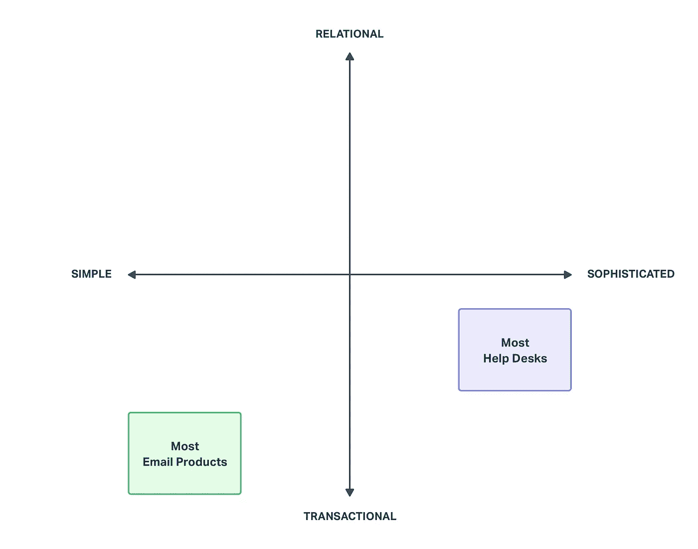
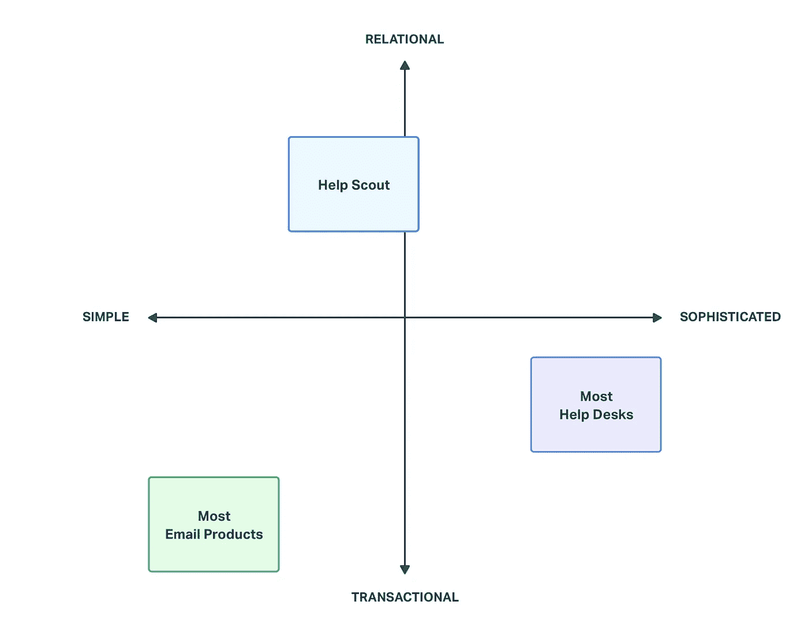

# 如何在拥挤的市场中给企业定位

> 原文：<https://medium.com/swlh/how-to-position-a-business-in-a-crowded-market-94a71842c474>

七年多前，当我们创立了 Help Scout 时，我们这样做并不是因为市场上缺乏好的客户服务产品——有好几种——而是因为没有一种产品反映了我们的价值观。

数以千计的成功企业，以及我个人最喜欢的企业，都是因为类似的挫折而成立的。这是一个在精彩的[我如何建立这个](https://www.npr.org/podcasts/510313/how-i-built-this)播客中常见的叙述。企业家进入了一个“红海”——一个拥挤的市场，尽管困难重重，但通常没有任何专有的、可申请专利的或特别独特的东西。

> 但是他们*所做的*是对市场中未得到充分服务的一部分的独特热情。

一家公司突破拥挤市场的一个很好的例子是 Timbuk2 的故事，该公司由自行车信使罗布·霍尼卡特于 1989 年在旧金山的米申区成立。虽然邮差包早在 50 年代就已经出现了，但霍尼卡特想要一个足够结实的包，适合他的兄弟姐妹，但也足够实用，适合那些希望在背包中交易的时髦都市人。

霍尼卡特辞去了工作，自学缝纫，并开始以每天[10–15 个](https://www.americanexpress.com/us/small-business/openforum/articles/building-an-empire-rob-honeycutt-of-timbuk2/)的速度手工制作包。几年之内，他就在大约 50 家当地自行车商店销售定制包。到 1994 年，Timbuk2 成为第一家开始直接向客户销售定制邮差包的公司，他们今天仍在这样做。走在任何繁忙的大都市的街道上，你一定会看到他们的签名包，所有这些包都包括终身保修。

从十几岁开始，我就一直带着 Timbuk2 的包包——它最初是一种时尚宣言，后来变成了对这个品牌、他们的价值观和产品质量长达 20 年的热爱。作为一名顾客，我感到非常自豪，因为在新员工入职的第一周，我们会给他们一个印有 Help Scout 标志的 Timbuk2 包。

几年前，当 Timbuk2 成为 Help Scout 的客户时，一切又回到了原点。这不仅对我个人来说是令人兴奋的，而且也验证了为什么我们跟随他们的脚步，决定在一个看似拥挤的市场中创造一种新产品。

那么是什么让一家小公司在拥挤的市场中脱颖而出并取得巨大成功呢？

多年来我一直在问这个问题，在每一个案例中，让我印象深刻的是公司定位其产品的能力。他们非常了解自己的市场，因此他们可以打造一个与众不同的品牌，并与“他们的人民”产生独特的共鸣。

# 我们如何与众不同

选择客户服务平台感觉很私人，因为客户是你生意中最重要的资产。你选择的平台是面向客户的，所以它至少对客户对你公司的体验负有部分责任。它应该是你的品牌、你的价值观和你的优先事项的反映。

回到 2011 年，我们的定位是拥有最佳客户体验。不是我们的客户，而是我们*客户的客户*。如果我们能为*他们*创造最好的体验，那么世界上最以客户为中心的公司肯定会想使用我们的产品。从那以后我们就一直专注于此。

虽然最终客户体验仍然是我们的主要关注点，但我们最近开始以不同的方式来看待这个问题，通过两个轴来可视化:关系轴和成熟度轴。这是我们对市场的看法。

关系轴描述了最终客户体验的质量，以及提供卓越体验通常需要的关系环境的级别。

“事务性”似乎是描述关系的负面方式，但我们都与企业有事务性关系，不需要任何更正式的东西。例如，当你点快餐，或者观看网飞电影时，双方都对交易关系感到满意。

不过，我最喜欢的品牌通过投资关系在拥挤的市场中脱颖而出。过去七年来，我一直在波士顿的[马拉松运动](https://www.marathonsports.com/)买跑鞋。我不再住在波士顿了，但是当我在城里的时候，我仍然在那里购买我的跑鞋。为什么？因为他们有我的资料存档，他们看过我跑步，他们知道我喜欢什么样的鞋子。我们有关系，通过这种关系，他们可以给我比任何人都好的建议。把我的钱给他们感觉很好。我们为以这种方式与客户合作的企业建立了 Help Scout，因此在关系轴上处于更高位置非常重要。

复杂度轴指的是产品及其功能。一个复杂的产品可以做你想让它做的任何事情，但这也带来了许多挑战和复杂性。

我把这个轴比作购买西装的过程。在“简单”的一面，你买现成的东西。也许会有一些轻微的改动，但一般来说，你买的西装是为长得像你的人批量生产的。在“复杂”的一面，你买一套定制西装，需要多次试衣，需要 6-12 周才能完成成品。每个细节都是为你量身打造的。这是独一无二的，付出的努力是有代价的。

值得注意的是，你可以在轴的任何一侧找到高质量和工艺。这种差异更具体地体现在采购和制造过程中。

客户服务市场充满了复杂的产品，这也是我们选择保持简单的原因之一。我们希望人们可以在几个小时或更短的时间内轻松启动并运行。采用“现成的”方法可以让我们将时间集中在功能的质量上，而不是数量上，提供更好的价格，并为每个人提供免费的支持和培训。

定义这些轴使我们能够确定在市场中追求什么样的位置是最重要的。

*Help Scout resides in the upper left quadrant, valuing a simple approach focused on building relationships.*

你选择定位你的企业的轴将根据你的市场而变化。在使用这些之前，我们尝试了很多不同的方法。有许多方法可以考虑定位，我鼓励你采用其中几种，但这种方法在我们的案例中非常有用。

定位总是一个挑战，但值得投资。

对定位的掌握有可能让你的企业在任何市场中脱颖而出，无论市场有多拥挤，并为长期成功铺平道路。

## 这篇文章发表在《初创企业》杂志上，这是 Medium 最大的创业刊物，有 356，974 人关注。

## 订阅接收[我们的头条](http://growthsupply.com/the-startup-newsletter/)。

