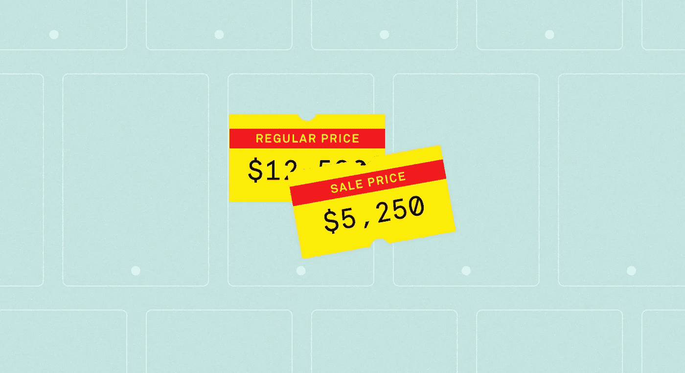

# 如何给任何东西定价

> 原文：<https://medium.com/swlh/how-to-price-anything-19c5f71e3847>

## 我们将要支付的价格背后的心理…

***“这个要收多少钱？”***

虽然在某些圈子里谈论金钱可能仍是禁忌，但你无法回避这样一个事实:你的生计依赖于你所做的工作和你所制造的产品的收费。

但是“价值”是一个复杂的术语，以如此简单的方式被抛出，但当你进入它时，它实际上是非常复杂的。

许多人陷入了遵循劳动价值论的陷阱，认为服务的价值是由投入生产的劳动量决定的。这就是为什么我们愿意花 12 美元买一罐果酱，因为它被贴上了“工匠”或“手艺人”的标签。我们假设“艺术家”比“制造商”投入更多的工作。

另一方面，有些人认为价值取决于购买者的眼光，如果有人愿意支付你的价格，那么这就是一个合理的价格。

*网上研讨会 500 美元？当然，为什么不呢？x 公司指控说。一个月 9.99 美元？听起来不错。那就像两杯昂贵的咖啡！*

但是，我们纸上谈兵的价值分析未能认识到的是，无论哪种方式，错过了定价的目标，你就可能会扼杀你的业务。

智能定价是经过深思熟虑的。它考虑了你为了解你的受众和建立你的业务所做的所有工作,并制作一份让人感觉诚实、可接受、最重要的是有价值的提议。

但是我们如何到达那里呢？虽然这在很大程度上取决于你的商业模式和研究，但有一些持久的研究可以帮助我们了解人们在看你的价格标签时看到了什么。

# 1.你看到的就是你想要的

多亏了一种叫做锚定的人类倾向，当显示价格时，你首先看到的就是你最终想要的。

[锚定或焦点主义是一种认知偏差，表示我们在做决定时过于依赖第一条信息](https://en.wikipedia.org/wiki/Anchoring)(“锚”)。如果你正在谈判或证明一笔交易，并首先看到 20 美元，你最终更有可能接近 20 美元，而不是 30 美元。

那么，如何利用这一点呢？

在一个看似违反直觉的例子中，麦肯锡(McKinsey)的一位分析师发现，当一家半导体制造商推出新产品时，他们没有降低旧产品的价格(像我们大多数人一样)，而是提高了价格。他们不仅从出售旧库存中获得额外利润，而且保持较高的锚定价格使得新买家更有可能支付新产品的要价。

当提高你的价格时，总会有片刻的犹豫，但是要知道，你开始的越高，结束的也就越高。

# 2.你的价格听起来(和看起来)非常重要

有大量的研究表明价格的呈现会影响我们对价格的感受。细微的差别可以改变人们是否相信你在为他们提供价值。

以下是我最喜欢的几个:

*   选择“奇数”号码。书中最古老的把戏之一，但它仍然有效。人们称之为“魅力定价”，这是当最左边的数字变化时产生的积极感觉[。我们的大脑用我们看到的第一个数字来编码价格，所以从 9.99 美元到 9.19 美元的变化不会真的有关系，但从 9.01 美元到 8.99 美元，突然之间就有了感知价值的变化。](https://files.nyu.edu/mt68/public/ThomasMorwitz2005.pdf)
*   **大声说出来。**在[发表在*消费者心理学杂志*](http://www.sciencedirect.com/science/article/pii/S1057740811001082) *上的一篇论文中，*研究人员发现，包含更多音节的价格对消费者来说似乎要高得多。这要归功于我们阅读数字的方式和它的“流畅性”。一个数字越难‘说’出来，我们对它的感觉就越糟糕。所以 1999.99 美元(一千九百九十九美分)感觉比 1999 美元(一九九九)贵。音节越多，我们认为成本越高。
*   人们喜欢体积小的数字。研究表明[把你的价格放在页面的底部而不是顶部会让人感觉价格更低](http://production.wordpress.uconn.edu/businessmarketing/wp-content/uploads/sites/724/2014/08/size-does-matter.pdf)。更疯狂的是，你的字体大小会影响人们对它的理解和感受。字体越小，价格越低。

> “由于处理流畅，如果你用较小的字体显示价格，人们会觉得你的价格更低。当你将自己的价格与较大的参考价格进行对比时，这种策略尤其有效。”

*   当你要去大减价时，尽可能准确。当康乃尔大学[的研究人员发现价格特定时，买家会支付更多的钱](http://webspace.pugetsound.edu/facultypages/gmilam/courses/econ291/readings/ssrn-id1011232.pdf)(例如，362，978 美元对 350，000 美元)。虽然你可能认为这有助于谈判，但研究人员发现，这实际上是由于我们如何看待数字。想想什么时候你最有可能使用一个精确的数字。最有可能的是当你处理较小的值时。即使你花了几十万美元甚至更多，这种感觉依然存在。

# 3.花钱伤身。减轻痛苦。

你有过买家反悔的感觉吗？购物后突然觉得自己犯了一个非常非常严重的错误？

购买商品和服务最终可能会感觉良好，但我们都会在交易时遭受一时的购买痛苦，因为我们现在已经决定做一些会影响我们未来可以做的事情(我们为某事支付了 20 美元，这意味着我们没有那 20 美元用于其他支出)。

在麻省理工学院和卡耐基梅隆大学的一项研究中，[研究人员发现这种疼痛来自两个因素](http://www.andrew.cmu.edu/user/gl20/GeorgeLoewenstein/Papers_files/pdf/redblack.pdf):

1.  支付的显著性(例如，如果我们看到钱离开我们的手，我们会感到更痛苦)
2.  付款的时间(例如，如果我们在消费后付款，我们会感到更痛苦)

那么你如何改变你的定价结构来减轻痛苦呢？想想优步。

在传统的出租车上，你看着计价器越来越高，然后在旅程结束时不得不亲自掏钱。优步没有计价器，也没有可见的交易。一切都是眼不见心不烦。

预付款是让买家对你的服务满意的有效方法。

# 4.无形中提高你的价格

我们都想尽最大努力，但是如果有一种方法可以提高你的价格而不让你的顾客注意到呢？

韦伯定律说[刺激的变化是可以察觉的，是原始刺激的恒定比率](http://www.cis.rit.edu/people/faculty/montag/vandplite/pages/chap_3/ch3p1.html)。那是什么意思？基本上所有的变化，包括价格，都是相对于起点的。最简单的例子是，在一个嘈杂的房间里，你必须大声喊叫才能被听到，但在一个安静的房间里，小声说话就可以了。

听起来很基础，对吧？但这也意味着原始刺激(比如你的原始价格)有一个阈值，在这个阈值上变化是不明显的。

营销人员对韦伯的发现深信不疑，虽然没有一个神奇的数字，但大多数人已经确定 10%是人们开始注意到的数量。这意味着你可能会在大多数人没有注意到的情况下将价格“悄悄”提高 2%、5%、8%。

这也意味着要让人们站起来注意到一笔交易，你需要下降 10%以上。

# 5.不要在最低价格上竞争(没有添加上下文)

以最低价格竞争的最坏情况是你赢了。第二糟糕的是你不知道。

虽然与竞争对手短兵相接意味着你可能会“赢得”市场，但斯坦福大学的研究发现，如果你不给人们一个足够好的理由来比较价格，那么[比较定价实际上会产生负面影响](http://www.gsb.stanford.edu/insights/asking-consumers-compare-may-have-unintended-results)。如果没有上下文，你是在要求你的客户对你的产品和竞争对手进行明确的比较，这反过来会导致他们对你所说的失去信任。

斯坦福大学的研究人员发现，在没有*为什么*你的价格是最低的[的背景下，仅仅是你让顾客做比较的事实就会让他们担心他们在某种程度上被欺骗了](https://www.helpscout.net/blog/pricing-strategies/)。

虽然这些研究可能有助于我们理解消费者对价格感受背后的 *why* 原因，但它们并没有否定任何产品的真正考验:真实世界。

正如 Basecamp 的 Jason Fried 解释的那样:

> “你不能问没有付钱的人他们愿意付多少钱。他们的回答无关紧要，因为说“是”“20 美元”“不”“100 美元”是没有成本的。它们的价格都一样——什么都不是。”
> 
> “唯一重要的答案是花了多少钱。人们在付钱的时候会回答。这是唯一真正重要的答案。”

*嘿！我是乔里。屡获殊荣的作家、编辑和内容策略师。如果你想一起工作，可以在* [*的博客*](http://blog.rescuetime.com) *或* [*上查看更多类似的帖子。*](http://jorymackay.com/)