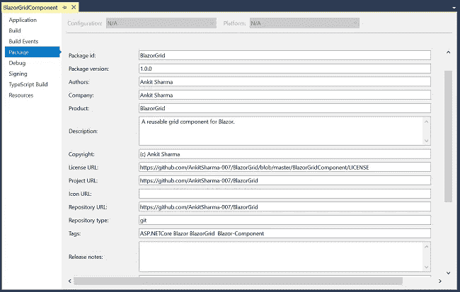
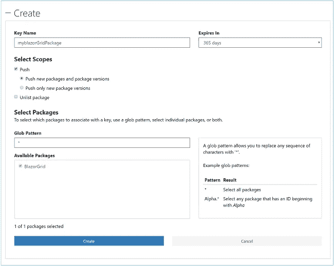
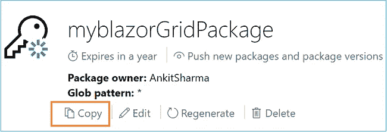

# 如何将 Blazor 组件发布到 Nuget Gallery

> 原文：<https://medium.com/swlh/how-to-publish-a-blazor-component-to-nuget-gallery-850d6d1dd37d>

# 介绍

在本文中，我们将学习如何将一个可重用的 Blazor 组件发布到 nuget gallery。我们将使用 Visual Studio 2017 来构建和创建 nuget 包。

# 先决条件

*   安装。NET Core 2.1 以上 SDK 从[这里](https://www.microsoft.com/net/learn/get-started-with-dotnet-tutorial#windowscmd)。
*   从[这里](https://www.visualstudio.com/downloads/)安装 Visual Studio 2017 v15.7 或以上版本。
*   从[这里](https://marketplace.visualstudio.com/items?itemName=aspnet.blazor)安装 ASP.NET 核心 Blazor 语言服务扩展。
*   一个新账户。点击在 nuget.org[创建您的免费账户。](https://www.nuget.org/)

请参考我之前的文章[BlazorGrid——Blazor 的可重用网格组件](https://ankitsharmablogs.com/blazorgrid-reusable-grid-component-for-blazor/)创建 Blazor Grid 组件，我们将在本教程中发布。

# 源代码

在 [GitHub](https://github.com/AnkitSharma-007/BlazorGrid) 获取 BlazorGrid 的源代码。

# 配置项目属性

在将组件打包成 nuget 包之前，我们需要指定某些信息作为组件的元数据。

右键单击 BlazorGridComponent 项目>>选择属性。它将为项目打开一个属性窗口。从左侧菜单中选择 Package，并提供如下所述的详细信息:

## 必填字段

*   **包 id** :给你的包起一个唯一的名字。这是一个不区分大小写的字段。它遵循。NET 命名空间命名约定，不允许使用空格。该名称是您的包裹在 nuget.org 的唯一标识符。
*   **包版本**:提供包初始发布的版本。每当您重新发布软件包时，都必须更新版本。
*   **作者**:提供作者姓名。如果有多个作者，请提供逗号分隔的列表。
*   **描述**:为您的包提供一个描述。包是关于什么的，它做什么和任何其他相关的细节。

## 可选字段

*   公司:提供你的组织名称。
*   **产品**:为您的产品提供一个名称。
*   版权信息:在这里输入版权信息。
*   **许可 URL** :许可文件的路径。这里我们提供了捆绑在软件包中的开源 MIT 许可文件的路径。
*   **项目 URL** :与该包相关的站点的 URL。它可以是任何 URL，如您公司的主页 URL、GitHub URL 等。
*   **图标 URL** :可显示为包图标的图像的 URL。允许的大小是 64×64。
*   **存储库 URL** :如果是公共存储库，请在此提供 URL。
*   **存储库类型**:我们正在使用的存储库的类型。
*   **标签**:为包装提供相关标签。它将帮助用户在 nuget.org 上找到你的包裹。
*   **发布说明**:包含了当前版本包中提供的更新。

为了更好的理解，请参考下图。



# 正在创建 Nuget 包

配置项目属性后，将项目配置从 Debug 更改为 Release。重建应用程序以更新 DLL 文件。

右键单击 BlazorGridComponent 项目>>选择 Pack。它将生成一个扩展名为. nupkg 的 nuget 包文件。包的名称将采用`Package id.Package version.nupkg`的格式。因此，在这种情况下，名称为`BlazorGrid.1.0.0.nupkg`。该文件将位于`\BlazorGridComponent\bin\Release`文件夹中。

下一步是将包发布到 nuget.org。我们需要一个 API 密钥来发布我们的包。

# 为 Nuget 生成 API 密钥

我们需要一个 nuget API 密钥，以便将包推送到 nuget.org。

要生成 API 密钥，请遵循以下步骤:

1.  登录您的 nuget.org 帐户。
2.  点击右上角的用户名并选择 API 密钥。
3.  点击创建。将打开一个表单，要求您提供一些值。
4.  输入密钥名称。它可以是您选择的任何名称。
5.  在选择范围下，选择推送。
6.  在全球模式下放入*
7.  点击创建按钮。

请参考下图:



它将创建您的新 API 密钥。发布 nuget 包需要此密钥。使用底部的复制按钮复制密钥。请参考下图:



> 确保此时使用 copy 按钮复制您的新 API 密钥。一旦离开此网页，您将无法复制密钥。

# 发布包

一旦获得 API 密钥，导航到`.nupkg`文件所在的文件夹，在本例中是`\BlazorGridComponent\bin\Release`。打开命令提示符或 PowerShell 窗口。运行以下命令发布包:

```
nuget push BlazorGrid.1.0.0.nupkg oy2klaw3g67amlbxp3qwkzr4exypy3bhxy6w6x6 -Source https://api.nuget.org/v3/index.json
```

这个命令将包名和 API 键值作为输入，并将包发布到 nuget.org。确保在执行这个命令之前输入您自己的包名和 API 键值。如果成功推送包，您将在窗口上看到一条成功消息。

Nuget.org 将需要几分钟来验证该包。成功验证后，该包将被编入网站索引，您将收到一封电子邮件确认。你可以在 nuget 账户名下的`Manage packages`部分找到你所有的 nuget 包。

我们在这里发布的 BlazorGrid 组件可以在 https://www.nuget.org/packages/BlazorGrid/[的 nuget gallery 上获得。](https://www.nuget.org/packages/BlazorGrid/)

# 发布错误疑难解答

如果您在程序包推送过程中遇到问题，并在控制台中得到错误，请尝试以下故障排除方法

1.  验证您的 API 密钥是否正确。如果您无法使用现有密钥，请创建一个新密钥，然后重试。
2.  如果您要重新发布软件包，请确保更新版本号。Nuget 不允许发布具有相同版本号的包。

# 安装和使用 BlazorGrid

要在 Blazor 项目中安装软件包，请在软件包管理器控制台中运行以下命令:

```
Install-Package BlazorGrid
```

安装完软件包后，在`_ViewImports.cshtml`文件中添加下面一行

```
@addTagHelper *,BlazorGridComponent
```

这将允许我们在我们的 Blazor 项目中使用 BlazorGrid 包。

`<BlazorGrid>`组件接受以下参数

*   **物品**:供应给 BlazorGrid 的物品清单。
*   **PageSize**:BlazorGrid 每页的大小。这是必填字段。
*   **grid Header**:blazor grid 的表头。
*   **grid row**:blazor grid 的行。

BlazorGrid 的语法如下所示:

```
<BlazorGrid Items="objectList" PageSize="a positive integer">
    <GridHeader>
        <th>header 1</th>
        <th>header 2</th>
    </GridHeader>
    <GridRow>
        <td>@context.objProperty1</td>
        <td>@context.objProperty2</td>
    </GridRow>
</BlazorGrid>
```

我们需要为网格提供对象列表和页面大小。网格的标题应在`<GridHeader>`参数中指定。我们将使用`<GridRow>`来指定网格的行项目。为了将值传递给`<GridRow>`，我们将使用 Blazor 框架提供的隐式参数“context”。

# 结论

我们学习了如何创建和发布一个可重用的 Blazor 组件作为 nuget 包。我们还对 nuget 包的一些常见推送错误进行了故障排除。BlazorGrid 可用于在网格中显示一组数据，并支持客户端分页。我们学习了如何在一个 Blazor 项目中安装和使用 BlazorGrid。

获取我的书 [Blazor 快速入门指南](https://www.amazon.com/Blazor-Quick-Start-Guide-applications-ebook/dp/B07K4PG9NY/ref=sr_1_1/130-5369337-3592069?ie=UTF8&qid=1544270769&sr=8-1&keywords=blazor+book)以了解更多关于 Blazor 的信息。

# 请参见

*   [了解服务器端 Blazor](https://ankitsharmablogs.com/understanding-server-side-blazor/)
*   [使用服务器端 Blazor 的单页面应用](https://ankitsharmablogs.com/single-page-application-using-server-side-blazor/)
*   [在 Azure 上部署 Blazor 应用](https://ankitsharmablogs.com/deploying-a-blazor-application-on-azure/)
*   [使用 Blazor 和 MongoDB 进行 CRUD】](https://ankitsharmablogs.com/crud-using-blazor-with-mongodb/)
*   [了解角度 6 动画](https://ankitsharmablogs.com/understanding-angular-6-animations/)
*   [ASP.NET 核心—使用 EF 核心和 Highcharts 的费用管理器](https://ankitsharmablogs.com/asp-net-core-expense-manager-using-ef-core-and-highcharts/)

最初发表于[https://ankitsharmablogs.com](https://ankitsharmablogs.com/)

[](https://medium.com/swlh)

## 这篇文章发表在 [The Startup](https://medium.com/swlh) 上，这是 Medium 最大的创业刊物，拥有+398，714 名读者。

## 在此订阅接收[我们的头条新闻](http://growthsupply.com/the-startup-newsletter/)。

[](https://medium.com/swlh)