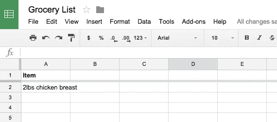
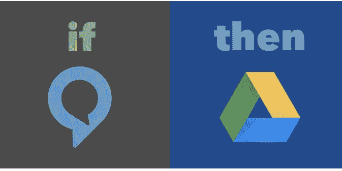

# 如何把你的杂货放在自动驾驶仪上:不需要订购或购物

> 原文：<https://medium.com/swlh/how-to-put-your-groceries-on-auto-pilot-no-ordering-or-shopping-necessary-fc8820983b41>

购物是一种巨大的痛苦。你必须:

*   把名单放在一起
*   开车去商店
*   走来走去寻找所有的一切
*   排队等候结账
*   把它都带回你的地方…

你可能会想“是的，但是纳特，这是生活中正常的一部分。”

去他妈的。

我想出了一种方法来完全自动化我的杂货店购物，这样我就再也不用处理它了，所以你也不用再处理它了。

这个系统会让你每周需要的所有杂货自动送到你家，你甚至不用去商店，甚至不用在送货服务上找到它们。

你所要做的就是记录下你所需要的，系统会处理剩下的事情。

有两种方法，基础版和专业版。专业版真他妈的棒，感觉就像你生活在未来，但基础版也可以(只是不太放手)。

**你需要什么(两个版本)**:

1.  Google Docs 帐户(好像你还没有一样…)
2.  [Instacart](http://inst.cr/t/E4ZBqm) 账号
3.  个人助理服务( [FancyHands](http://fhands.com/WsQZ7cu) 起作用，不过我用的是专用的 VA)
4.  [扎皮尔](http://www.zapier.com)账户

**专业版还需要什么**:

1.  [IFTTT](http://www.ifttt.com) 账户(不幸的是 Zapier 没有与 Echo 整合)
2.  [亚马逊回声](http://amzn.to/1NcuFmF)

# 第一步:做账

首先，如果你还没有进入介绍(或者你跳过了这里，你这个骗子)，你需要和 [Instacart](http://inst.cr/t/E4ZBqm) 、 [Zapier](http://www.zapier.com) 、 [IFTTT](http://www.ifttt.com) 和[做个账户，然后获得一个 VA](http://fhands.com/WsQZ7cu) 。

干得好，现在我们可以开始了。

# 第二步:列一份“购物清单”

这将是一个单一的谷歌电子表格，你每周重复使用。只需为“项目”或类似的东西创建一个列标题，然后继续前进。

现在，如果你是瘸子，做的是基础版…随着时间的推移，你必须在这里手动添加你的杂货。

但是如果你很酷并且在做专业版…

# 第三步:将 Alexa 连接到你的列表

亚马逊 Alexa 有一个“杂货清单”功能，我们将用它来填充我们的购物清单。

通常，Alexa 的列表存在于应用程序中，但我们可以使用 IFTTT 食谱将其导出到我们的电子表格[:](https://ifttt.com/recipes/284285-add-new-items-on-alexa-shopping-list-to-google-drive-spreadsheet)

只需将它设置为自动将购物清单中的每一个新项目添加到您制作的购物清单电子表格中。

现在，随着时间的推移，你可以告诉 Alexa 你需要什么，她会将其添加到电子表格中。

# 第四步:送货上门

当你想要你的杂货时，你所要做的就是将你的杂货清单电子表格发送给你的虚拟助理，让他们访问你的 Instacart 帐户，并要求他们在特定的时间框架内订购所有要交付的东西，然后将交付时间记录在你的日历上。

或者……我们也可以自动完成这一部分。

你所需要做的就是预先写一封电子邮件给你的 VA，附上说明和购物清单的链接。

例如:

> 嘿[姓名]，
> 
> 我需要一些杂货快递。以下是我需要的所有内容的链接:
> 
> [链接]
> 
> 你应该有权访问我的 Instacart 帐户，如果没有，这是我的凭据:
> 
> 【用户名】
> 【密码】
> 
> 请让他们在明天下午 6 点到 9 点之间送来，一旦你知道他们什么时候来，就把它加到我的日程表上。
> 
> 使用[商店偏好，如全食超市]购买所有商品。
> 
> 完成后，删除列表上的项目。如果出现任何问题或者你找不到什么，打电话给我。
> 
> 谢谢！
> Nat

你可以每次都使用这封邮件，你只需要一种发送方式。

以下是我最喜欢的(带有相应的 Zapier 或 IFTTT 食谱的链接):

*   [在空闲时发送一条消息(例如，嘿，Slackbot，我需要我的杂货快递)，让电子邮件自动发送](https://zapier.com/zapbook/slack/gmail/33090/slack-new-message-posted-to-gmail-send-email/)。
*   [让它每周](https://zapier.com/zapbook/zaps/1925/send-a-weekly-reminder-email-from-your-gmail-email/)(或其他时间段)自动熄灭
*   [询问您的 Echo“我的购物清单上有什么”,让它发送电子邮件](https://ifttt.com/recipes/284243-email-yourself-your-shopping-list-when-you-ask-alexa-s-what-s-on-your-shopping-list)
*   [按下按钮发送](https://ifttt.com/bttn)。

但实际上，你可以将几乎任何东西连接到你的 Gmail，让它自动发送。

现在你只要坐好，放松，让你的杂货自动送到你的手中！

那很简单:)

Nat 为 SumoMe 做市场营销。 [*从他这里得到更多的牛气*](http://nateliason.com/join) *。*

*发表于* **创业、旅游癖和生活黑客**

-