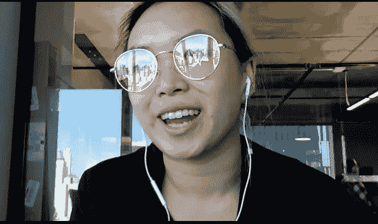

# 如何退出，穿越国家和风暴纽约。

> 原文：<https://medium.com/swlh/how-to-quit-cross-the-country-storm-nyc-655cf5e95234>

*了解咖啡聚会如何导致***等等。**

*Denise Chan 是那种让你对各种可能性感到兴奋的人——在你的职业生涯中，在你的生活中，以及在你如何能有所作为方面。她在她的个人项目**大胆尝试**和在 **Vaynermedia** 的工作中做出了贡献。*

*没有多少人有足够的勇气辞掉工作，搬到纽约市，只是为了找到新工作而和别人喝咖啡。丹尼斯照做了，并最终在韦内梅迪亚工作。*

> *我喜欢她自由地分享她在日常生活中采取的大胆、勇敢的步骤。所有这一切都通过讲故事联系在一起，使她成为播客第 27 集*与男人一起工作的女人*的惊人嘉宾。*

*她还分享了在之前的一家公司，当她对自己感到不确定的时候——她的同事告诉她——“如果不是你，那是谁？”。她选择每天这样生活。*

*作为 Vaynermedia 的一名数字战略师，她喜欢创造力，喜欢与那些非常关心自己工作的人合作。她还分享了一些让你脱颖而出的好方法，你可以将这些方法应用到你的职业生涯中。*

*丹尼斯分享了社交媒体如何让世界变得更小、更易接近。*

***TreadBoldy** ，陈丹妮的个人项目，一年一度的在不同媒体上分享&无畏讲故事的迭代。*

*2016 年的版本可以在 Tredbol.ly 上看到，标题是**种族差异对话&。**正如丹尼斯所描述的，“这是一本在种族和身份背景下探索他者故事的数字故事书。这个项目旨在揭示超越种族的共性主题。毕竟，我们比自己意识到的更像人类。”*

*我怎样才能找到陈丹妮丝*

*Instagram 上的 **TreadBoldy** 网站 www.treadbold.ly
上的
Twitter @iwantadenise*

***最新飞跃:***

*“我迈出的最后一步……我想可能是从我所在机构的亚裔美国人 ERG 小组开始的。我决定成立这个小组仅仅是在进入公司 4 个月的时候，那时我还没有真正见过很多人。但是，我知道该机构中肯定还有其他亚裔美国人有类似的感受(代表性不足，有时被边缘化)，所以我和我的共同创始人决定成立这个小组。这是一次非常有口碑的经历，但是到目前为止，这个团体已经有了 30 名成员，并且还在增长。我们一直在努力改变亚裔美国人在广告公司和广告公司工作中的形象。这是一个让我非常兴奋的项目，我很高兴自己迈出了一大步，让它成为了现实。”*

*[**订阅**](https://itunes.apple.com/us/podcast/women-who-work-with-men/id1183131280) **和男人一起工作的女人在 iTunes 上或者在这里听:***

*   *++++++++++++++++++++++++++++++++++*

**

## *这篇文章发表在 [The Startup](https://medium.com/swlh) 上，这是 Medium 最大的创业刊物，有 340，876 人关注。*

## *在这里订阅接收[我们的头条新闻](http://growthsupply.com/the-startup-newsletter/)。*

**