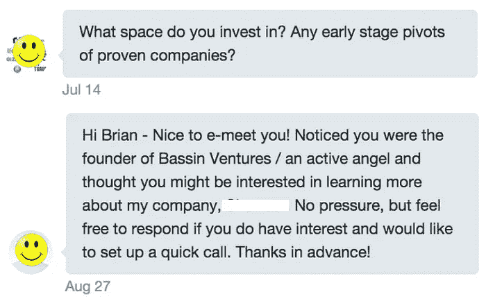
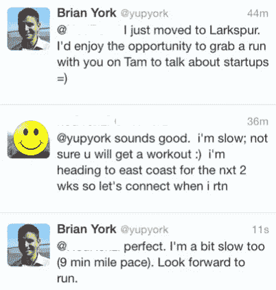
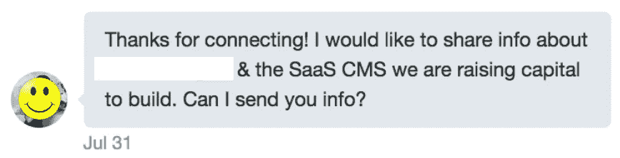

# 如何筹集你的第一笔 10 万美元(针对首次创业者)

> 原文：<https://medium.com/swlh/how-to-raise-your-first-100-000-for-first-time-founders-e9bef553b0e3>

## 解释当你以前从未筹集过资金时，如何筹集你的第一个 10 万美元。

为你的第一次创业筹集资金可能是一项艰巨的任务。

向素未谋面的投资者借钱的想法是一个可怕的提议。当你迈出创业的第一步时，向已经在这个行业待了几十年的投资者推销是可以理解的困难。

不过，请放心，凡事都有第一次，任何为初创公司筹集资金的人都有他们的“第一次”。因此，这是可以做到的，而且已经做到了，甚至在创业生态系统中几乎没有接触的情况下也是可能的。

# 平均来说，这将花费你 6 个月的时间和 25，000 美元

无论你怎么看，获得资金的过程都需要时间和金钱。这是无法回避的，但我想帮助你最大限度地利用时间，最大限度地减少花费！

当然有更快更便宜地筹集 10 万美元的方法——最简单的方法是快速构建 v1 产品并立即获得强大的牵引力。不过，这是一种罕见的场景，通常只留给那些能够自己构建原型的技术创始人。

对于我们其余的人(技术或非技术)，这将需要大量的时间投入，因为第一个可行的原型开始向投资者推销将经历多次迭代。

此外，由于你是第一次创办公司，你可能没有很多投资者关系，所以要抓住最初的兴趣和筹资势头需要很多努力。

# 如何会见投资者

与潜在投资者会面实际上比人们想象的要容易得多。通过一些深思熟虑的努力，你几乎可以见到任何人。大多数人忽略的是深思熟虑的部分。

## 什么没用？

Screenshot’s of recent DM’s I received on Twitter

在这些例子中，人们在伸手要钱之前花了大约 5 秒钟来了解我。他们在最初的外联活动中没有任何想法或努力，这使得我甚至不太可能对这条消息做出回应，更别提开会了。

只要简单地看一下我的 LinkedIn 或我的 AngleList 个人资料，就能让你确切地知道我对哪些市场/类型的初创公司感兴趣。

请解释一下为什么我会对贵公司感兴趣。把你的公司和我的另一项投资联系起来。这样做有两个好处:1)表明你在寻找投资者上投入了时间和精力，2)实际上通过增加投资机会节省了时间，因为你不会花时间向那些永远不会为你所在的空间开支票的投资者推销。

## 什么管用？

**我会 100%回复冷冰冰的信件(电子邮件、推特上的备忘录等)。)如果此人将消息个性化并保持简短。**

花必要的初始时间在网上了解投资者，并确定见面是否有意义。不是每个投资者都对你正在建立的企业有意义。

大多数第一次创业的人都会犯这样的错误——他们看到 LinkedIn 上有“天使投资人”的简介，马上就想和他们见面，因为这个人很有钱。

example of me reaching out cold via Twitter to an investor while fundraising for Bliss

找出他们感兴趣的东西，无论是职业上的还是个人的。然后，如果有合适的，以一种体贴的方式伸出手。

在这个例子中，我给一位投资者发了一条推特，问他在旧金山最喜欢的跑步地点(研究表明他喜欢跑步)。他回答了塔姆山地区的问题，然后我们定了一个时间去跑步和聊天。

我正在为布利斯的种子期筹款，第一次看到了他的资料。我看到他是一家风险投资公司的合伙人，该公司专注于早期的 SaaS B2B，这非常适合极乐世界。

我以前从未和他通信过。我所做的只是发现他对什么充满热情，这恰好是一个共同的兴趣，并从那里开始。一次自然的、有机的谈话导致了一次(非常规的、但更私人的)会面！

Twitter 和博客是两个很好的交流场所。这种[ [**分 5:33**](https://www.youtube.com/watch?v=CnDniYVwWCM) ]最好的例子之一来自[山姆·罗森](https://www.linkedin.com/in/samirosen)。罗森通过 Twitter 和 Suster 的博客**与 Mark Suster 通信并认识。然后，当 Rosen 创建 MakeSpace 时，Suster 成为了第一轮股权投资的主要投资者！**

*最后，如果可以的话，热情的介绍是最好的。所以，如果你足够幸运，和一个潜在投资者有共同的联系[请求介绍](/@brianyork/how-to-get-endless-intro-s-to-your-startup-e822b278e956)！*

# *成本明细(约 2.5 万美元)*

## *1.5 万美元建造一个原型*

**“如果你都懒得花 5000-10000 美元去做你想做的原型，那我为什么要认真对待你呢？”—* 杰森·卡拉卡尼斯[ **明** [**49:45**](http://www.youtube.com/watch?v=c-Y-LS5xtjg&t=49m45s)*

*如此真实！不要指望因为你有一个很酷的想法就能获得投资。你必须证明你可以在产品的 v1 版本上执行。*

*Jason 提到了 5k-10k 美元，但是如果你是一个非技术人员，你可能会在设计、前端和后端开发之间接近 15k 美元。*

** **提示**:不要说发展需要钱。这是新手的一个很大的(也是常见的)错误……没有人愿意投资给一个第一次创业的人，让他们的钱去开发第一个产品！*

**

*This is a No-No!*

## ***$10k 的加急费***

**“如果你在科技行业，你能为自己做的最好的事情就是搬到硅谷”——*Naval ravi Kant，[来源](http://fourhourworkweek.com/2015/08/18/the-evolutionary-angel-naval-ravikant/) [min 52]*

*总的来说，旧金山的事情进展最快。创业和风险生态系统是全国(或全世界)最强大的主要参与者。你遇到的大多数人都会有这种心态。*

*如果你有能力搬迁，那就去吧。如果不是，那就装！*

*每个月飞去旧金山一周。住在 Airbnb，参加聚会，在[的客人区工作，激励](http://www.galvanize.com/campuses/san-francisco-soma/#.VeD_yRNViko)和社交。多去旧金山，有效地安排会议，并有效地跟进。你出去和人们交谈的越多，你就会遇到越多有影响力的人。然后，依靠这些新的联系人来介绍他们的联系人(但是记得要求有实际意义的介绍！).*

*四个月应该足够完成了。因此，每次旅行的餐饮和娱乐费用为 2000 美元，加上一点点填充费用(四舍五入)等于 10000 美元。*

# *成功的秘诀！*

*筹款不是一个容易的过程。这需要时间。我花了 14 个月的时间完成了第一次创业的种子期(我的大多数会议都是低于标准的原型和事务型风格)。但是，我坚持下来了！*

*你将会得到一大堆的“不”，但是通过保持专注和遵循一个深思熟虑的方法去会见投资者，“是”就会随之而来！*

*记住— *对于初次创业者来说，忙碌、周到的服务和漂亮的原型是筹集 10 万美元初始投资的不二法门！**

**快乐提示*:如果获得第一个 10 万美元还不够刺激，你会很高兴地知道下一个 10 万美元要容易得多！你的投资者通常会将交易传递给他们的投资伙伴，你的势头可以带来更多的首次会面和投资美元！*

**

**发表于* **创业、旅游癖和生活黑客***

******

*-*