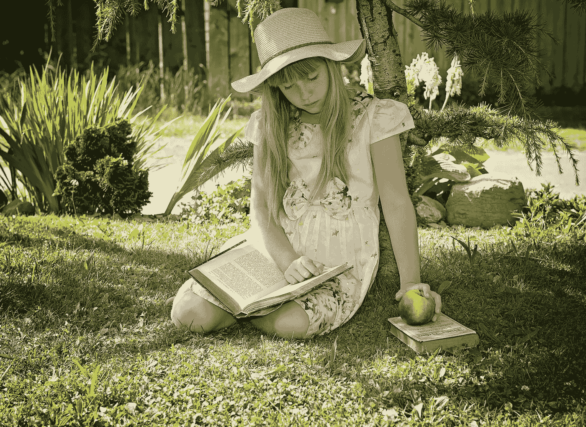

# 如何在更短的时间内阅读和享受更多的书籍(同时仍然拥有生活)

> 原文：<https://medium.com/swlh/how-to-read-and-enjoy-more-books-in-less-time-and-still-have-a-life-e313f1868214>

Photo from Pixabay

你喜欢书。你知道读书有多重要。事实上，你不能离开一个没有至少一个的书店。

但是最近有一个持续的问题。

你倾向于买书或借书，但并不真的去读。它们坐在你的架子上或床头柜上，默默地尖叫着让你打开它们。