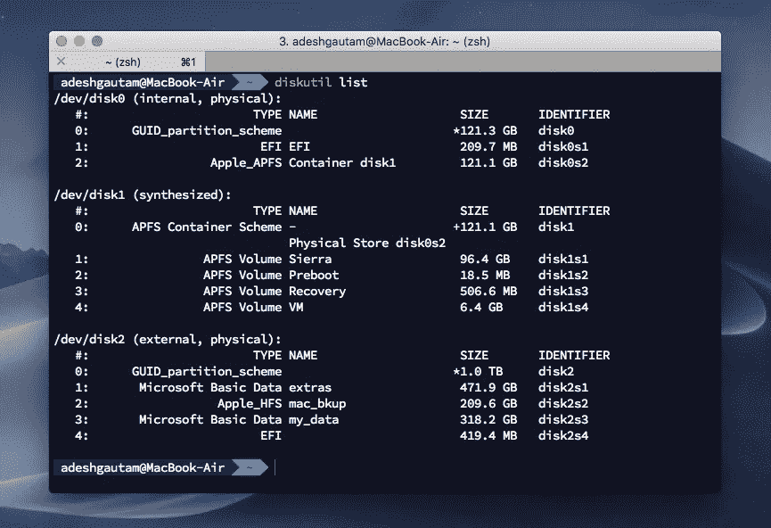

# 如何在 macOS 上使用 NTFS 分区读写外置硬盘

> 原文：<https://medium.com/swlh/how-to-read-write-on-external-hdd-with-ntfs-partition-on-macos-2aa2db1f8a5>


Photo by [Blake Connally](https://unsplash.com/photos/B3l0g6HLxr8?utm_source=unsplash&utm_medium=referral&utm_content=creditCopyText) on [Unsplash](https://unsplash.com/search/photos/mac-code?utm_source=unsplash&utm_medium=referral&utm_content=creditCopyText)

这是一个使用免费工具在 MacOS 上使用 **NTFS** 格式化的外部硬盘的**操作指南**。

默认情况下，MacOS 不提供 NTFS 格式的写权限。因此，要以读/写方式安装外部驱动器，请遵循以下步骤:

# **第一步**

从[这里](https://sourceforge.net/projects/osxfuse/files/latest/download)下载 macOS 的 **FUSE**

# 第二步

然后我们必须安装 xcode 命令行工具。打开终端并复制粘贴。

```
xcode-select --install
```

然后在对话框出现时点击**安装**。出现许可协议时，点击**同意**。完成后，继续第 3 步。

# **第三步**

现在我们必须安装**家酿**这是一个 macOS 的软件包管理器。将以下内容复制并粘贴到终端中。

```
ruby -e "$(curl -fsSL https://raw.githubusercontent.com/Homebrew/install/master/install)"
```

# 第四步

在“终端”中粘贴以下内容以安装 ntfs-3g for mac:

`brew install ntfs-3g`

# 第五步

现在连接您的外部硬盘系统，并遵循以下步骤:

a) `diskutil list`



diskutil list

这将列出所有连接到您的设备的驱动器。将会有诸如 disk2s1、disk2s1 等名称。这些是你外置硬盘的分区。

记下外置硬盘驱动器的名称。

b) `sudo mkdir /Volumes/NTFS1`

我们必须创建一个文件夹，为磁盘提供一个挂载点。该命令将创建 **NTFS1** 文件夹用于挂载。如果您试图安装硬盘的 2 个分区，则使用以下命令创建另一个文件夹:

`sudo mkdir /Volumes/NTFS2`

文件夹的数量取决于您要安装的驱动器的数量。

c) `sudo umount /dev/disk2s1`

该命令将卸载 macOS 系统已经挂载的磁盘，因为我们将在 RW 模式下通过 ntfs-3g 再次挂载它们。同样，如果安装了 2 个分区，则使用:

`sudo umount /dev/disk2s2`

**disk2s1** 和 **disk2s2** 是磁盘的名称。

d)在终端中运行以下命令，将名为`disk2s1`的磁盘安装到 RW 模式下预先创建的文件夹`NTFS1`中。

`sudo /usr/local/bin/ntfs-3g /dev/disk2s1 /Volumes/NTFS1 -olocal -oallow_other`

恭喜你完成了！

假设您的硬盘上有 2 个格式化为 NTFS 的分区，那么您将在终端上依次使用以下命令。

1.  `diskutil list`
2.  `sudo mkdir /Volumes/NTFS1`
3.  `sudo mkdir /Volumes/NTFS2`
4.  `sudo umount /dev/disk2s1`
5.  `sudo umount /dev/disk2s2`
6.  `sudo /usr/local/bin/ntfs-3g /dev/disk2s1 /Volumes/NTFS1 -olocal -oallow_other`
7.  `sudo /usr/local/bin/ntfs-3g /dev/disk2s2 /Volumes/NTFS2 -olocal -oallow_other`

之后，这两个驱动器将以 RW 模式安装在您的系统上。

这是一个手动过程，每次将外置硬盘连接到系统时都需要执行。

# 在 RW 模式下自动装入 NTFS 卷

> 不建议这样做，因为这将涉及替换苹果的 NTFS 挂载工具`/sbin/mount_ntfs`。这将给系统带来安全风险。

要用 Apple 的 ntfs 挂载工具替换 ntfs-3g 工具，请在终端中执行以下命令。以下命令需要在 ***恢复模式下*** 执行。要进入 ***恢复模式*** 在系统启动时按 *command+R* 。在恢复模式下，转到实用程序，然后单击终端并输入以下内容:

`sudo mv "/Volumes/Macintosh HD/sbin/mount_ntfs" "/Volumes/Macintosh HD/sbin/mount_ntfs.orig"`

`sudo ln -s /usr/local/sbin/mount_ntfs "/Volumes/Macintosh HD/sbin/mount_ntfs"`

# 卸载

要卸载 ntfs-3g，请在终端中执行以下命令:

`brew uninstall ntfs-3g`

要再次恢复苹果的 NTFS 挂载工具，请进入*恢复*，并在终端中输入以下内容:

`sudo mv "/Volumes/Macintosh HD/sbin/mount_ntfs.orig" "/Volumes/Macintosh HD/sbin/mount_ntfs"`

这是一个相当长的过程，但它涉及到免费工具，但如果你想使用一个简单的方法，然后使用 Paragon NTFS 软件，价格为 19.95 美元。

**命令列表在** [**库中提供，这里**](https://github.com/adesgautam/how_to_RW_on_external_hdd_on_macOS/tree/master) **。**

请点击👏按钮，如果你喜欢它，拿着它给更多的爱。

如果您希望连接:

[推特](https://twitter.com/gautamades)[insta gram](https://www.instagram.com/adeshgautam/)[LinkedIn](https://www.linkedin.com/in/adesh-gautam-518810127/)[Github](https://github.com/adesgautam)

[](https://medium.com/swlh)

## 这篇文章发表在《创业公司》杂志上，这是 Medium 最大的创业刊物，有 340，876 人关注。

## 订阅接收[我们的头条](http://growthsupply.com/the-startup-newsletter/)。

[](https://medium.com/swlh)