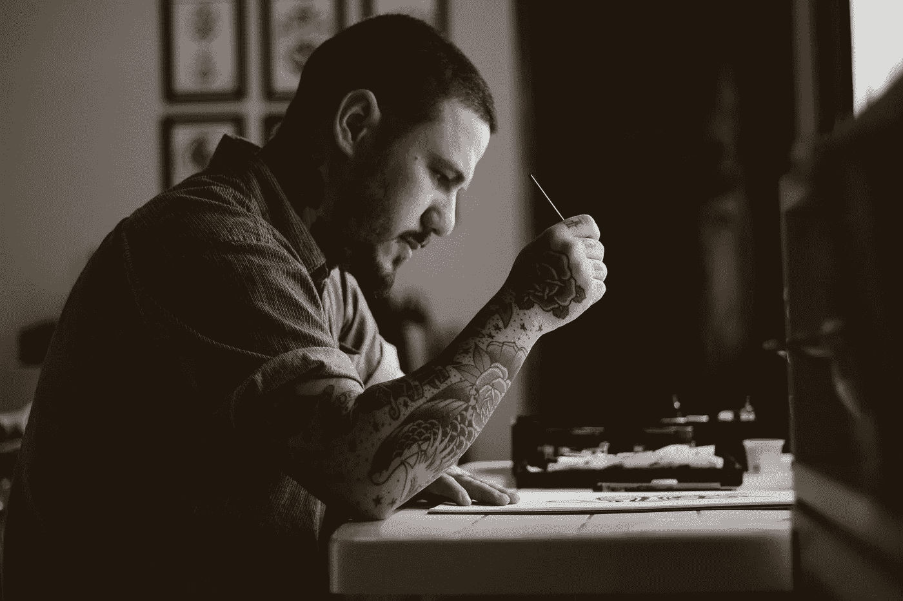

# 如何(真的)在每天的工作中变得更好

> 原文：<https://medium.com/swlh/how-to-really-become-better-at-what-you-do-every-single-day-d27a9dd8a48c>

Photo by [Allef Vinicius](https://unsplash.com/photos/P2BoE6tb8ig?utm_source=unsplash&utm_medium=referral&utm_content=creditCopyText) on [Unsplash](https://unsplash.com/search/photos/creativity?utm_source=unsplash&utm_medium=referral&utm_content=creditCopyText)

> 刻意练习已经成为那些时髦的术语之一。它的概念是，如果你真的想掌握一项技能，你需要每天有意识地锻炼你的技能。
> 
> 这必须以一种允许你自我纠正错误，提高你的优势，并以一种推动你前进的方式进行实验的方式发生。

但是你真的要怎么做呢？

作为一名作家，我将分享我是如何在自己的领域中应用刻意练习的原则的。您可以将它们应用到任何其他领域——尽管您必须相应地调整它们。

# 1.为自己建立尽可能好的反馈系统

在媒介上写作让我的写作生涯变得完全不同。与其说是因为我比以前获得了更多的读者，不如说是因为这是一个比我自己的平台好得多的反馈系统。

因为 Medium 上的每日统计是如此简单和即时，对于我发表的任何文章，我总是可以在第二天看到它的表现。

这让我很容易分析为什么某篇文章可能失败了，或者为什么另一篇文章成功吸引了观众。

我可以很容易地比较我发表过的不同文章，并根据不同的特点进行比较，在这个过程中更好地了解什么有效，什么无效。

这是唯一可能的，因为媒体是为作家准备的，有着非常好的反馈系统。

在反馈系统中应该寻找什么？

*   在最好的情况下，它允许你每天检查你的进展
*   它允许你以一种直接向你提供反馈的方式直接与观众互动
*   它为你提供了一种简单易懂的方式来比较你的成果，并从中吸取必要的教训

**最后一点**:获得反馈的能力也是我鼓励任何人从第一天开始分享他们的成果的原因，不管它有多糟糕。

# 2.在一定的时间范围内，放大你的手艺的某一方面

> 我不怕练过一万次踢腿的人，我怕的是练过一万次踢腿的人。——李小龙

重复练习你手艺的某一方面是真正提高的方法。

举例来说，我会花一个星期的时间，只试图在我的文章标题上花功夫。接下来的一周，我只是试图在我的文章中引入好的隐喻。在那之后，我会再花一个星期的时间，只在行动号召之间转换，看看哪一个得到了最好的回应。

同样，必须有某种方法来衡量什么可行，什么不可行。即使这种“测量”只是向你周围的人征求反馈，那也比什么都没有强。

**任何技能都由一系列子技能组成。**

你将不得不把你的手艺分解成这些子技能，然后学习一个接一个地提高它们。

例如，跨文化交流的更大技能包括以下子技能:

*   学习如何暂停对不同文化行为的判断
*   学会忽略自己对另一种文化的成见或假设
*   调整你的肢体语言以反映当地文化的行为
*   学习识别文化行为模式并模仿它们
*   等等。

如果你能明白你目前最弱的子技能是什么，然后一项一项地努力提高它们，那么这将会对你的表现产生显著的影响。

# 3.总是不断尝试

如果你想超越你目前的技能水平，那么你需要不断尝试新的方法来做你正在努力学习的事情的某些方面。

安德斯·埃里克森(Anders Ericsson)是刻意练习这一概念的发明者，他在自己的著作《[巅峰](https://www.amazon.com/Peak-Secrets-New-Science-Expertise-ebook/dp/B011H56MKS)》中写道:

> 当你停滞在某个技能水平上并试图前进时，“解决办法不是‘更加努力’，而是‘尝试不同的方法’”。

这种方法的问题是，在开始的时候，你的表现会下降。当你强迫自己不使用熟悉的工作模式时，你的工作结果会在一段时间内变得更糟。

你的自然反应将是停止实验，并立即回到你原来的行为模式。

这就是为什么我们停留在目前的技能水平上。

这是一种驱使我们的恐惧。害怕我们只会让我们的情况变得更糟，而不是做得更好。害怕我们会忘记旧的方式，养成不好的新习惯。

但这从来都不是真实发生的。

我们绝不会在已经学会的技能上变得“更差”。

当我们尝试一种新的做事方式时，我们要么看到它有效，要么看到它无效。如果成功了，我们就把它加入到我们现有的技能中。

如果它不起作用，那么我们可以随时停止实验。

> 实验可能会暂时降低你的表现。但它们是你做得更好的必要部分。

# 结论:

当你说你一直在练习你的手艺时，我相信你。但问题是——你真的是在刻意练习**吗？**

*   **你是否清楚地认识到提高你的技能所必需的不同的子技能？**
*   **在你的专业领域里，你知道你的优势在哪里吗？你的劣势在哪里吗？**
*   **你给自己设定了明确的学习目标吗？**
*   **你有明确的方法来衡量你的进展吗？**
*   **你在学习过程中融入反馈了吗？**
*   **你会通过实验来发现新的技术，并将其添加到你目前的做事方式中吗？**

**要真正变得更好，你需要不断地意识到你在做什么。你不能只是盲目地每天做你想变得更好的事情，并期望你会得到真正的结果。**

**学习是一个有意识的过程。**

**确保你始终积极参与学习过程。培养足够的自我意识，了解你最迫切需要在哪些领域做得更好。**

**设定明确的、可衡量的目标，让自己明白什么时候完成了自己想做的事情。在每一个时间点，专注于提高你技能的一个特定方面。**

**一直保持学习。**

**并且始终保持对过程的意识。**

**如果你觉得这篇文章有用，请👏并与你的朋友分享。记住，你最多可以鼓掌 50 次——这对我真的很重要。**

****您也可以通过** [**点击这里**](https://mailchi.mp/b0d1e1fba452/struggle-first-thrive-later) **免费订阅我们的时事通讯。****

****

## **这篇文章发表在 [The Startup](https://medium.com/swlh) 上，这是 Medium 最大的创业刊物，有 323，834+人关注。**

## **在此订阅接收[我们的头条新闻](http://growthsupply.com/the-startup-newsletter/)。**

****