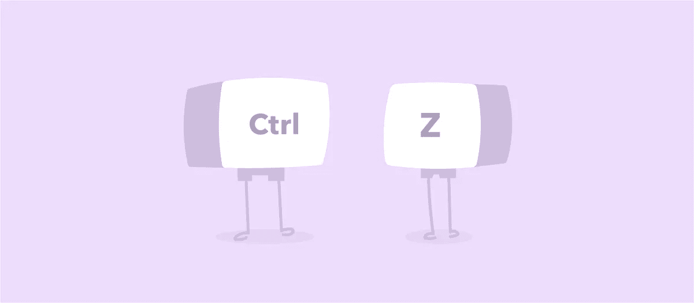
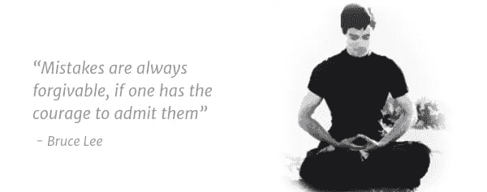

# 如何从错误中恢复

> 原文：<https://medium.com/swlh/how-to-recover-from-your-mistakes-5405e5f3abed>

Ctrl+Z Mistakes

如果我有超能力，你知道我会做什么吗？我会消除每一个错误，抹去让我看起来像个十足白痴的每一次尴尬的记忆。

说真的，有时候我回过头来想，我到底是怎么让这种事情发生的？我到底在想什么？

这种感觉很糟糕——你一直纠结于发生了什么，疼痛就像蛀牙暴露的神经一样严重！

它会耗尽你的自信，从内部吞噬你的内脏，让你觉得自己肩上扛着整个世界的重量。

你想做的就是要么穿上隐形斗篷，要么飞到一个遥远的星球去。

去过那里，在垃圾堆里打滚。

我相信你也会犯一些尴尬的错误。感觉自己是个十足的白痴只是其中的一部分。然而，人们可以做一些简单的事情来从这些错误中恢复过来

# 1.承认吧，全心全意

有两种接受——一种清楚地表明你感觉很糟糕，你后悔这么做了。

另一个是不真诚的道歉。比如“*如果我伤害了你，我很抱歉*”。或者著名的企业废话——“如果造成任何不便，我们很抱歉*”。或者用小心掩饰的 ***但*** 伴随着一大堆合理化来承认你犯了一个错误——“对不起，但是……”*

*没有意图。没有遗憾。好像你只是为了道歉而道歉。*

*相反，你应该真诚地道歉并承认错误。没有如果。没有但是。不要把它放在你的反乌托邦的另一个自我上，那会蒙蔽你的逻辑视野。*

*类似于——“*对不起，我搞砸了。*”或“*很抱歉，我对细节的不重视导致了这次失败*”。或者，任何直截了当的事情，让对方觉得你在为错误负责。真诚地。*

# *2.直面错误*

**

*我们有时不会正面纠正我们的错误。我们认为时间会自动让人们神奇地原谅和忘记我们的错误。这种想法比一开始就犯错误要糟糕得多，因为它显示出完全缺乏同理心。*

*我们必须与那些受我们错误影响的人沟通，关于我们如何确保它不会再次发生。然后采取及时的行动。如果行动计划很长，那么在每个重要的里程碑都要传达补救措施。*

*传达行动计划不仅给出了我们正在纠正错误的信号，还表明了我们的关心。人们通常会忘记错误或者你是如何道歉的，但是会记得你是如何处理的。这是唯一有助于重建信任的方法。句号。*

# *3.找到教训*

**

*太糟糕了，错误没有日志文件和堆栈跟踪。但它们确实带来了教训。重要的是不要失去这个教训。*

*如果偶尔出现一些小失误，它们很可能会很快被原谅——甚至被遗忘。世界上没有人有时间记录我们所有的错误。那是 [Chitragupta](https://en.wikipedia.org/wiki/Chitragupta) 的工作的一部分，*业力*记录者。*

*我知道，如果我们只犯一次错误，真诚地道歉，在没有任何人告诉我们的情况下改正错误，并承诺不再重复同样的错误，生活会变得简单得多。但现实是不同的。我们是习惯的动物。有时我们最终会犯类似的错误，尽管我们的初衷是好的。*

*那么底线是什么？我们被允许犯错误——毕竟，我们都需要# *的故事来夸大给我们的孩子听。**

*尽管如此，请记住你的错误是在引导你，而不是定义你。*

*喜欢你读的书吗？请点击👏下面这样别人就能找到了！*

*这是我们 [**周刊快讯**](http://blogs.quovantis.com/newsletter/) **的第 21 版。**这是我们的[档案](http://blogs.quovantis.com/newsletter/)，如果你想在下面的**注册前查看之前的版本。***

**

## *这个故事发表在 [The Startup](https://medium.com/swlh) 上，这是 Medium 最大的企业家出版物，拥有 311，185+人。*

## *在这里订阅接收[我们的头条新闻](http://growthsupply.com/the-startup-newsletter/)。*

**