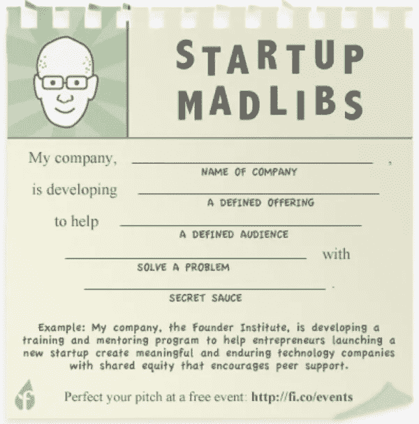

# 如何为你的创业公司招募投资者

> 原文：<https://medium.com/swlh/how-to-recruit-investors-for-your-startup-cd8aa8a4593f>

Originally published at [http://www.appsterhq.com](http://www.appsterhq.com/?utm_source=CP&utm_medium=Medium)

成功说服投资者投资你的创业公司并不容易。

尽管创业领域最近的某些发展已经消除了获得资金的障碍，但新企业在试图招募投资者时往往会面临巨大困难，这仍然是事实。

与此同时，Airbnbs、Facebooks、谷歌、Twitters 和 Ubers of the world(以及无数其他[高增长创业公司](http://www.appsterhq.com/blog/3-crucial-features-high-growth-startups))的成功清楚地表明，筹资绝非不可能。

在这篇文章中，我将讨论创始人可以使用的各种策略，以增加他们与愿意打开支票簿的投资者联系和合作的机会。

我还会分享一些我们在 [Appster](http://www.appsterhq.com/?utm_source=CP&utm_medium=Medium) 的一些创业公司如何招募投资者的实例。

# 一些准备工作

在了解和应用不同的方法为你的新公司招募投资者之前，确保你理解了以下重要的想法。

首先，在你开始考虑如何为你的创业公司成功吸引投资者之前，有大量的工作必须要做(特别是当你的目标是从家庭、朋友和同事之外的来源吸引投资时)。

在其他活动中，您必须定义和调查您的企业将提供解决方案的具体[可货币化客户难题](http://www.appsterhq.com/blog/early-stage-entrepreneurs-launch-profitable-startup)，确定您将运营、测试和[验证您的产品想法](http://www.appsterhq.com/blog/test-product-idea-real-world-feedback)的[市场利基](http://www.appsterhq.com/blog/build-successful-mobile-app-startup)的规模和独特需求，并构建[最低可行产品(MVP)](http://www.appsterhq.com/blog/mvp-app) 。

其次，你必须对经营一家初创企业所涉及的特定经济学有一个坚实的理解。

至少，这需要理解必须定期测量的[股权](http://www.appsterhq.com/blog/introduction-to-startup-equity)和关键财务[指标](http://www.appsterhq.com/blog/4-financial-metrics-startups-measure)的来龙去脉。

第三，理解不同类型投资者的不同需求、愿望、期望和能力是至关重要的。

M

[Darren Dahl](https://www.inc.com/guides/2010/08/how-to-find-willing-investors.html) 也讨论了这一重要问题，指出尽管风险投资通常寻求投资 300-500 万美元，私募股权集团有时寻求投资数千万美元，但天使投资者经常限制他们一次投资几千美元。

另一个例子是，Fred Wilson 指出，他的风险投资公司 Union Square Ventures (USV)只为已经创造出有形产品的初创公司提供资金:

> “我们喜欢种子投资，在这种投资中，团队已经开发并推出了一款产品。我们不喜欢投资一个概念，也不喜欢参与一轮将资金用于制造和推出产品的投资。这意味着绝大多数种子轮都不适合我们。我们错过了很多种子阶段的机会，因为这对我们来说‘太早了’。”

当我讨论在试图联系潜在投资者时进行尽职调查的重要性时，我会很快回到这一点。

# 完善你的一句话营销

我[最近讨论了](http://www.appsterhq.com/blog/public-relations-for-bootstrapped-startups)一句话营销在公关和接触媒体方面的重要性:

> *“在你做出任何具体的努力去接触媒体或任何其他公众，以努力为你的初创公司创造一些积极的公关或投资之前，你必须首先制定一个一句话的概述。*
> 
> 这个一句话的推销是故事的精髓，你可以用它来向你的推销对象“推销”你的公司。
> 
> 媒体成员和投资者，如天使投资人和风险投资人，每天都会收到来自各种各样的人和组织的大量推介。
> 
> 为了从你的竞争对手制造的所有“噪音”中脱颖而出，你必须以一种清晰、简洁、有意义和令人信服的方式展示你的推销。
> 
> *为了做到这一点，你必须能够用一句话总结出记者想要采访你或者投资者想要投资你的公司的主要原因。*
> 
> *避免使用流行词汇和不必要的技术术语，确保你的一句话产品价值主张清楚地陈述了你要回应的主要问题、你的目标人群(或部分市场)以及你提供的解决方案的独特价值。”*

你如何着手完善你的一句话营销？

来自创始人研究所的一位研究员收集了一个奇妙而简单的资源，让任何一位创始人都可以用一句话有效地表达他/她的创业精神。

我们在 Appster 的许多初创公司[使用 Ressi 的模板(或类似的方法)将他们公司的基本面提炼为 5 或 6 条清晰易懂的线:](http://www.appsterhq.com/?utm_source=CP&utm_medium=Medium)

一旦你按照这些思路用一句话写好了你的推介词，接下来就是制定与投资者沟通的策略的时候了。

# 寻找投资者的实际步骤

在《福布斯》的一篇客座博文中，[缪斯](https://www.forbes.com/sites/dailymuse/2013/02/13/5-steps-to-finding-investors-for-your-start-up/#13de237a5136)概述了创始人可以采取的各种实际步骤，以增加他们找到并联系潜在投资者的可能性。

这些策略中有三个特别值得讨论:

1.  首先，**利用关键的互联网资源研究和追踪投资者**:

*   创建一个 [AngelList](https://angel.co/) 简介，描述你的公司、团队成员和产品，这样投资者和其他创业公司就可以找到并了解你。
*   通过搜索 [Crunchbase](https://www.crunchbase.com/) 来研究你所在行业的类似创业公司；这个网站可以查找特定的公司、个人或投资者，并查看谁投资了什么、何时投资了多少(从而让你深入了解你应该尝试联系的特定公司和个人)。
*   一个类似于 Crunchbase 的网站是 [CapRally](http://www.caprally.com/investors) ，也值得一查。

2.其次，**创建潜在投资者的战略名单**:

*   从投资的角度来看，列出一份 30-50 名专业人士的名单，这些人可能非常适合你的公司。
*   一种方法是根据你公司所处的特定行业/领域在 AngelList 上研究投资者。
*   因为投资是一个数字游戏，所以在第一次编制清单时，广撒网是很重要的。然而，如果投资者的兴趣、专业领域、投资历史、期望和/或资本种类或数量明显不符合你公司的需求、目标和发展状况，那么把他们包括进来是没有意义的。
*   您可以将姓名和联系方式(最好是电子邮件地址)存储在基本的电子表格或简单的客户关系管理(CRM)软件中。

3.第三，**利用你的职业和个人关系网**:

*   “因为投资者会收到如此多的推介，他们通常会高度青睐由共同联系人介绍的公司。”
*   仔细列出你想会见的投资者名单后，逐个梳理名单，确定你们是否有共同的熟人。
*   在请一位共同的熟人给你介绍一位投资者之前，重要的是你先花些时间推销前者，也就是说，让他/她相信你的公司和愿景值得他/她和潜在投资者的时间、精力和考虑。
*   最后，请求引荐，并确保当引荐最终发生时，你能做到。

在这个清单上，我们可以添加第四个策略，即**参加聚会和行业活动，以便亲自会见潜在投资者。**

在这种情况下，Meetup.com 是一个值得考虑的绝佳资源。

请随意阅读默里·纽兰兹的这篇文章，这篇文章概述了创业公司可以用来寻找潜在投资者的其他实用技巧。

# 执行投资者尽职调查的需要

与商业的许多其他方面一样，充分的准备是创造成功的投资者会议的关键。

R 不管你是通过相互认识的人被介绍给投资者，还是依靠一封“[冷冰冰的电子邮件](https://pipetop.com/saas-glossary/sales-terms/cold-emailing/)”来接触任何类型的投资者，重要的是你要尽一切合理的努力来促进你、你的公司和投资者之间的紧密联系。

因为你是试图说服另一个人或公司投资你的公司的人，所以在推销你的创业公司之前，你有责任尽可能多地了解那个人或公司。

有两种基本方法来执行你的尽职调查。

首先，继续利用你的职业关系网，通过与你已经认识的人交谈，尽可能多地发现投资者的信息。

在当今日益互联和全球化的世界，很可能你个人认识一个或几个人，他们或多或少与你很快会遇到并推介的投资者有联系。

尝试收集尽可能多的第一手“内部”数据(例如，从之前直接与投资者共事的人那里)。

第二，在网上调查投资者或公司。

查阅在线文件夹和使命陈述。

整理一份他们过去投资过的公司的清单(一定要试着确定投资了多少钱，在[哪几轮融资](http://www.investopedia.com/articles/personal-finance/102015/series-b-c-funding-what-it-all-means-and-how-it-works.asp))。

阅读投资者/公司的博客文章，了解他们感兴趣的问题和他们参与的公司。

换句话说，永远不要“盲目地”参加会议或推销(无论是面对面还是通过电子邮件)。

当试图确定某个投资者是否适合你和你的创业公司时，从 3 个不同的角度思考这个问题会有所帮助:

*   **关系**:你预计你、你的公司和投资者之间会发展出什么样的关系？就投资者对所投资企业的参与程度而言，投资者的历史表明了什么？例如，他/她有可能充当某种导师或顾问吗？还是他/她的角色被期望更“不插手”？
*   **功能能力**:什么让你相信投资人有合适的经验、专业知识和专业关系来帮助你的创业公司取得成功？
*   **焦点**:有什么证据表明，一方面，你的创业公司的当前运营、你公司的需求和你当前运营的特定融资轮之间，另一方面，投资者或公司的能力、历史和融资焦点之间有很强的匹配？— s [来源](http://www.techworld.com/startups/how-do-startups-get-investors-tips-from-founders-3655412/)

# 如何发送完美的冰冷邮件

投资者通常每周都会收到数千封电子邮件，其中许多是主动发来的，即由投资者以前没有过互动的人发送的。

事实是，如此巨大的数量导致投资者删除或忽略他们收到的绝大多数未经请求的电子邮件。

然而，通过使用这种“[冷邮件](https://pipetop.com/saas-glossary/sales-terms/cold-emailing/)”技巧，还是有可能为你的公司有效地招募到一个新的投资者。

你如何着手完善你的冷冰冰的电子邮件方法？

首先，这是我在之前的一篇文章中列出的[主要应该做和不应该做的事情:](http://www.appsterhq.com/blog/public-relations-for-bootstrapped-startups)

*   **使用投资者的名字来个性化你的电子邮件，提及他/她的投资历史或当前职业参与的一个或多个关键因素，并表明你已经考虑了他/她非常适合你、你的公司和你的主要目标的原因；**
*   一定要把你的冷冰冰的邮件限制在大约 5-7 句话以内；
*   尝试不同的主题标题和不同的一句话语调；确保使用分析软件来确定电子邮件打开率和/或回复率之间的差异(如果有)；
*   **如果在合理的时间内(如 7-10 天)没有收到投资者的回复，礼貌地跟进并寻求反馈；**
*   **不要随意向许多不同的投资者发出一般性的推介，而不考虑为什么这些特定的天使投资人、风险投资人等。可能非常适合您的业务；**
*   **不要**写极长、超详细的电子邮件，充满毫无意义的背景数据和/或言过其实的语言；和
*   **不要通过发送大量主动跟进信息和/或请求重新考虑来骚扰投资者。**

其次，一定要看看 Jason Calacanis 的视频，他在视频中讨论了如何有效地写清楚、简洁、简短、给人深刻印象的冷冰冰的电子邮件，让人们真正回复不请自来的邮件。

杰森建议，想要吸引地位高的投资者的注意并获得投资的初创企业创始人应该提交冷冰冰的电子邮件，这些邮件应该:

*   毫不含糊地揭示和建立公司的吸引力(特别是通过使用信息图和图表等视觉手段)；
*   清晰，易于阅读和理解，没有技术问题，提炼出要点，而不是关注微小的细节；
*   明确要求接受者提供建议/指导，而不是金钱；和
*   有效地与投资者建立个人/真正的联系，特别是通过提及或评论与他/她自己的作品、行动、当前或过去的投资和/或兴趣直接相关的东西。

此外，Jason 概述了一个基本的冷电子邮件模板，我们 Appster 鼓励我们的客户接受并应用这个模板。

下面是 Appster 冷邮件结构的样子:

实质上，它包括:

*   1)一些语法正确、个性化、相关、易于掌握且陈述简单的句子，
*   2)产品线框、截图、视频或外部 URL，以及
*   3)礼貌地请求在对方方便的时候进行一次简短的会面。

# 完善你的推销

一旦你成功地说服了一个潜在的投资者与你会面，下一步就是准备好你的全部推介。

不仅推销本身必须是可靠的、有充分支持的，并且是为你要与之交谈的特定投资者量身定做的，而且你还必须培养以一种令人信服的、充满激情的和自信的方式进行推销的能力。

所以，是的，这意味着你必须一遍又一遍地练习你的演讲。尝试并积累尽可能多的反馈，并致力于根据收到的评论不断完善你的推销。

[达伦·达尔](https://www.inc.com/guides/2010/08/how-to-find-willing-investors.html)强调，投资者通常通过问自己 4 个关键问题来评估一家公司的成功和增长潜力:

1.  *“公司的产品或服务能满足巨大且不断增长的市场需求吗？*
2.  该公司能否快速扩张以利用这一市场机遇？
3.  公司有可防御的竞争优势吗？和
4.  *管理团队能否发挥前三个标准中概述的潜力？”*

那么，这些就是你在构建和传达你的推销时必须牢记的一些主要问题。

换句话说，你的推销必须对这些核心问题给出深刻的、明确的、有说服力的答案。

以下是强有力的推销的基本要素:

## **挂钩**:

*   **因为投资者几乎每天都会遇到推销**，你需要通过使用吸引他们注意力的东西来“吸引”他们，迫使他们听你说些什么，从而让他们“摆脱”他们熟悉的套路。
*   **你的钩可能是一个有趣的行业事实**，一个正在进行(或即将到来)的关键市场变化，或者一个独特的个人(但很短)故事，你有充分的理由相信它会与投资者联系起来。
*   确保避免陈词滥调，比如承诺万亿美元的市场或保证颠覆行业的技术。

## **问题**:

*   **确定主要问题**，即[可货币化的客户痛苦](http://www.appsterhq.com/blog/early-stage-entrepreneurs-launch-profitable-startup)，你的初创公司试图提供解决方案，这对投资者来说是绝对必要的。
*   **客户的痛苦越大或越强烈**，知道如何解决它的公司成功的机会就越高。
*   **让投资者真正理解并“感受到”痛苦**，例如，提供例子，并详细描述不解决问题的后果。

## **独特价值(秘制酱)**:

*   **如果问题真的值得解决**那么很可能市场上已经有很多“解决方案”了。
*   **因此，你需要展示**你提出的解决方案如何以有意义且值得注意的方式与所有其他解决方案不同。
*   效率更高吗？在某些方面更有效？便宜？更易于采购和/或扩展？更人性化？等等。

## **市场**:

*   许多投资者认为，一个给定市场的规模和需求(T21)代表了一家初创公司成功可能性的最关键的决定因素之一。
*   使用统计数据和图表向你的潜在投资者证明你的利基市场已经很大并且/或者正在迅速扩张。
*   **提供自上而下的分析很重要**:证明你在(非常)特定的目标市场子集中经营，而不是使用非常不精确的分类(比如美国 18-35 岁的男性)。

## **牵引力**:

*   谈到融资，吸引力才是王道，即证明你的公司正在赢得用户/客户，产生轰动效应，并带来收入。
*   **如果你有吸引力，那么**你绝对应该通过使用数据和图形来展示它；如果你还没有收集到足够的指标来证明你的吸引力，那么你必须说服投资者，你的运营是稳固的，并且以令人印象深刻的速度前进。
*   **打个比方，你的目标应该是**让投资者相信，你的初创企业是一辆快速行驶的列车，他/她最好尽快跳上去。

## **团队**:

*   **永远记住**，归根结底，投资者投资的是*人*，也就是令人印象深刻的想法和收益背后的现实生活中的个人。
*   **想法靠自己基本没用**；是人们[执行](http://www.appsterhq.com/blog/3-crucial-features-high-growth-startups)想法，因此是人们允许伟大的公司出现。
*   **向投资者**展示你的[创业团队是完全可靠的](http://www.appsterhq.com/blog/strategies-building-start-team)这很重要，也就是说，团队成员努力工作，聪明，致力于成功，并且以*行动*为导向。
*   **通过讨论过去的成功和胜利来证明你的团队完成任务的能力**。

## **关闭**:

*   永远记住 1992 年电影《格伦加里·格伦·罗斯》中著名的“ABC 法则”:[永远要结束](http://www.investopedia.com/terms/a/always-be-closing.asp)。
*   **一旦你完成了正式的推介，**采取下一步行动，向交易靠近。
*   伸出你的手，向他/她要名片；尝试安排下次会议的日期和时间；安排一次跟进电话。
*   **换句话说，管理你的“管道”**并保持动力。在没有事先确认下一个联系人的情况下，不要离开会议。

//

## 感谢阅读！

# 如果你喜欢这篇文章，请随意点击下面的按钮👏去帮助别人找到它！

# 对应用程序有想法吗？[我们来聊聊](http://www.appsterhq.com/?utm_source=CP&utm_medium=Medium)。

在过去的几年里，我们已经帮助建立了超过 12 个数百万美元的创业公司。查看我们如何帮助您。

> 最初发表于[http://www.appsterhq.com](http://www.appsterhq.com/?utm_source=CP&utm_medium=Medium)

