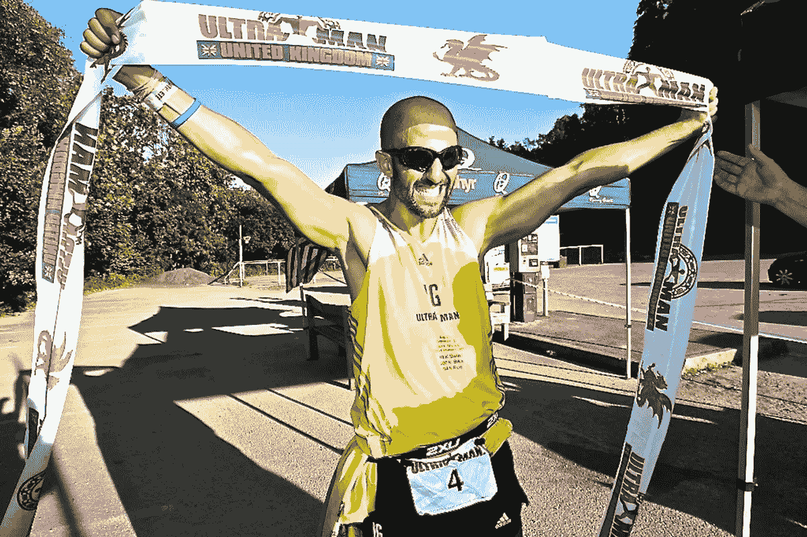
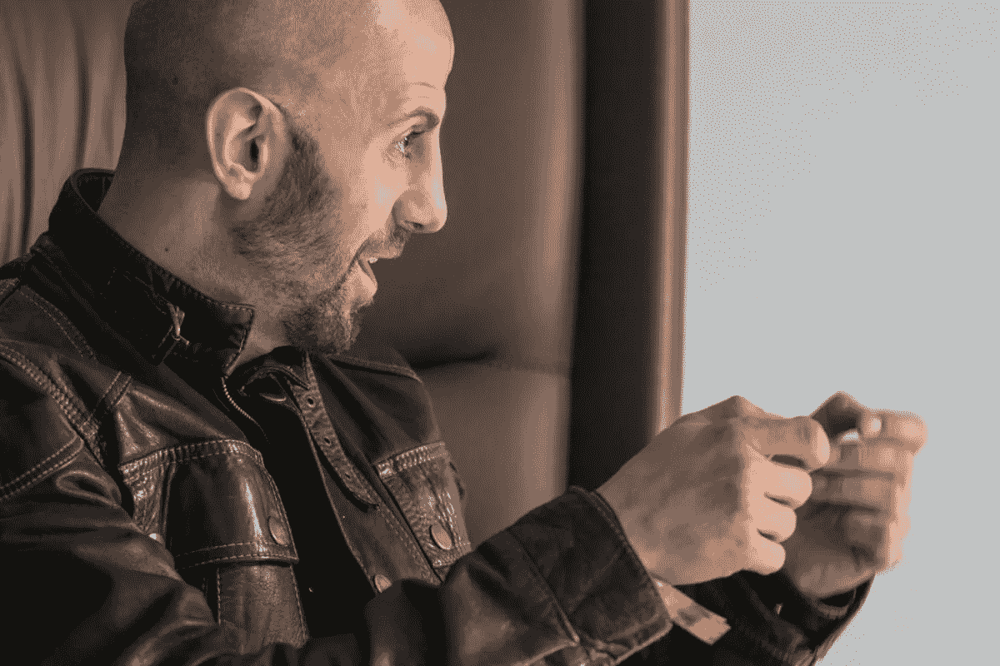

# 如何重新设计你的思维以克服逆境

> 原文：<https://medium.com/swlh/how-to-redesign-your-mind-for-overcoming-adversities-4dbf6c55aff7>

*Photo credit:* [*Rick Kent*](https://www.facebook.com/rickkentphoto)*.*

## 4 [高性能](/swlh/20-top-and-simple-practices-to-reach-your-daily-high-performance-ea81c5cdb300)技术，用于寻找任何问题的答案

这些年来，我一直致力于训练大脑克服逆境，每天都在进步。我设计了一个由四个关键因素组成的高性能系统。在这里我分享一下我的经验和成果:

# 克服逆境，重新设计你的思想

这是我多年来创造的高绩效系统，因此我可以克服逆境，解决挑战性问题，找到令人兴奋的答案。

# 1.挑战假设

是的，从不同的角度重新思考我的看法。不管你要面对什么样的情况，我很可能会陷入一套预先设定好的假设中。挑战这些基本假设让我扩展了我的概念，并意识到了我到现在还没有考虑到的可能性。我总是先问“如何”，然后问“为什么”，然后对每个答案再深入地问“如何”和“为什么”。使用这种技术，我总能找到新的更好的方法。

我就是这样决定拿 [**机动奥特曼挑战**](https://thisisig.com/projects/ultraman-uk/) 的。

# 2.重现问题

试着从更远的角度去接近它。大声表达问题有助于我识别它，并直呼其名。给它其他的形式，往往会让我产生解决问题的不同想法。我重新思考问题的方法是从不同的角度识别逆境:

*   为什么我需要解决这个问题？
*   真的是问题吗？
*   要解决这个问题，我需要克服哪些挑战和障碍？
*   不解决会有什么后果？
*   要解决这个问题，我需要付出什么代价？

问这些问题有助于我找到有用的见解。解决新问题有助于我对最初的问题产生想法。我就是这样开发出 [**人媒**](https://www.youtube.com/watch?v=ditHzlnUheg) 。

# 3.激发你训练心智

并把我的思想和行动发挥到极致。对我来说，这是教导心智的关键:投资于共同的惯例或考虑激进的替代方案。如果看起来我不能发现新的东西，那么我会试着改变。也就是说，我通常的做法是考虑如何制造同样的问题，降低销售额或损害我的产品或服务，而不是关注问题或背景，提高销售额或改善我的服务或产品。令人难以置信的是，我从恢复想法中获得了多少资源和想法，帮助训练头脑离开安全区。当我找到它们时，我会把它们作为原始情况下的可行解决方案重新考虑。

[**超高产**](https://isragarcia.com/books/ultraproductivity-book) 方法就是这样诞生的。

# 4.通过不同的方式表达自己

是的，发现塑造我想法的新的可能性。根据心理学家哈沃德·加德纳的说法，我们都有多元智能，而不是一般智能。然而，当面对复杂的挑战时，我们倾向于独特地表达自己，通过我们的语言推理能力。我们在那里失去了太多。

每次面对“不可能”的事情，我都会尝试用不同的方式来沟通自己的想法。从大声自言自语，写下这件事，与我的五个辅导员分享，在 Twitter 上询问这件事，看我得到什么答案。我还制作了一个视频，通过播客传播我的关注。我试着变得有创造力，520 天每天做一件新事情的实验让我受益匪浅。做这件事有许多方法。例如，我也使用彩色铅笔、油灰、乐高积木、音乐、文字或绘画的联想，甚至是性。

最重要的是，在这个表达阶段，我并不试图解决(或制造)问题。只是表达出来，并从中发现新的结果。我知道我的大脑在继续无意识地处理最初的问题(或者创造或者想法)。它通过尝试以不同的方式处理信息来做到这一点。通过这样做，它触发了新的思维模式，这将产生更多的创造性和破坏性的结果。

通过这个系统，我产生了创作 [**脱颖而出节目**](http://standout.es/en) 的想法。

# 行动，行动，行动，这就是你如何克服逆境

训练头脑是以下事情:训练、测试、错误、测试、错误。一致性，坚持，自律，自觉。

*注意*:当我谈到想法或问题时，它们可以被推断到项目、业务、产品、实验、超级习惯、系统、生产力和生活方式。

# 只有当你觉得值得的时候，才让这个故事震撼吧！如果你发现任何有价值的东西，请鼓掌。

> Isra Garcia = 53 个客户，48 家企业，400 次演讲，3.486 篇文章，24 个项目，6 本书，380 场讲座，6 家公司，17 次冒险，25 次实验，∞失败。到目前为止…
> 
> [营销人员](https://isragarcia.com/wp/marketer)。顾问。扬声器。作家。教育家。经理。在 [IG](http://thisisig.com) 的负责人。博主。企业家。颠覆性创新。数字化转型。高绩效者和生活方式实验者。

# 行动号召>>点击[此处](http://feeds.feedburner.com/isragarcia)订阅更多类似的文章！

## 这篇文章发表在《创业公司》杂志上，这是 Medium 最大的创业刊物，有 320，131+人关注。

## 订阅接收[我们的头条](http://growthsupply.com/the-startup-newsletter/)。

