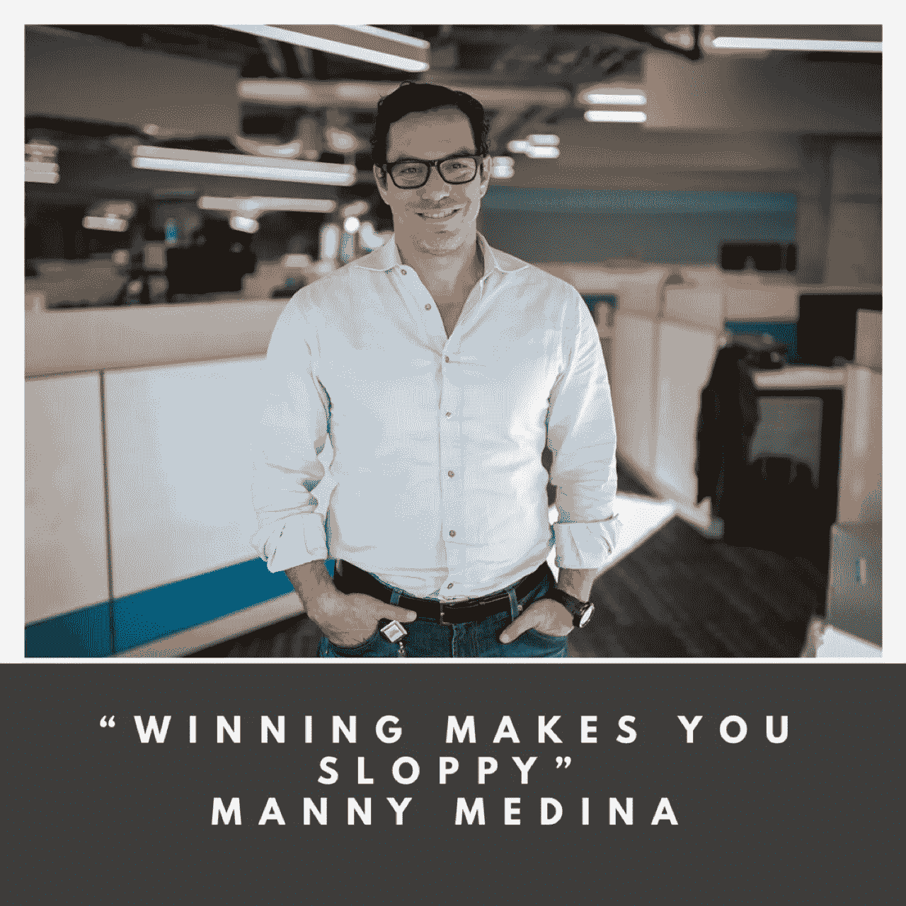

# 如何去除自我，找到你真正的动力，并作为一个团队赢得胜利

> 原文：<https://medium.com/swlh/how-to-remove-ego-find-your-true-motivation-and-win-as-a-team-f1c2ff3c869b>

他离开了微软，和他的三个朋友一起创业。

上线两年后，他们知道出了问题。他们非常努力地推销，但顾客就是对产品不感兴趣。

他们决定转向。

剩下 1 个月的现金，团队意识到他们需要至少 2 个月的编码来修复他们产品中的一个 bug。

他们找到了天使投资人，剩下的就是历史了。

这是 Manny Medina 和 Outreach.io 的(快速)故事，目前估值超过 5 亿美元

在 Outreach.io 之前，Manny 在微软领导销售工作，是亚马逊网络服务的第四号员工。他还拥有哈佛商学院的 MBA 学位和宾夕法尼亚大学的计算机科学硕士学位。

我非常喜欢和 Manny 谈论企业家、领导力和销售。

以下是我从与曼尼的谈话中学到的 5 件事:

# 来自杰夫·贝索斯的教训

曼尼在亚马逊的时候，贝佐斯有一句口头禅:“战略上耐心，战术上急躁。”这与加里·维纳查克的座右铭“微观速度，宏观耐心”非常相似。

这是关于每天全力以赴，但是要有耐心意识到伟大的事情需要时间。将此应用于商业。将此应用于生活。

# 动机的四个层次

我问曼尼，在他没有“感觉到”的日子里，是什么推动了他，或者他是否正在经历一段艰难的时期。他说你可以有四个连续的动机步骤:恐惧、贪婪、责任和爱。

爱是目标。爱你的顾客，爱你的员工，爱你的产品，因为你正在改变这个世界。这就是曼尼的感受，也是外联活动成功的主要原因。

# 协力

曼尼非常重视团队合作。这可能就是为什么他每天早上在办公室里第一次碰到每个员工(是的，你没看错)。

对大多数首席执行官来说，这似乎是一个糟糕的时机。但对曼尼来说，这是建立一种注重团队胜利和伟大友谊的文化的一部分。

# 自满

曼尼说，最好的销售代表(和企业家)可以抹去记分牌。在每个月、每个季度和每个年度之后，重点需要放在接下来的事情上。没人在乎你去年是否达到了配额。重要的是现在。他说“胜利让你变得懒散”，自满是一个杀手。

> “胜利让你变得草率。”

# 什么是销售？

> "销售是教育、移情、实验和增值."

我自己说得再好不过了。

# 关于作者

汤姆·阿莱莫 *是一名充满激情的 B2B 销售人员。他目前是* [*千禧一代动力播客*](https://soundcloud.com/ryan-warner-799706255) *的主持人，在这里他帮助千禧一代快速跟踪他们的个人发展。Tom 也是 TechTarget 的客户经理，住在旧金山。*

[网站](http://tomalaimo.com/) | [播客](https://soundcloud.com/ryan-warner-799706255) | [邮箱](mailto:thomasalaimo7@gmail.com) | [推特](https://twitter.com/TomAlaimo_TTGT)|[LinkedIn](https://www.linkedin.com/in/tom-alaimo-573a1878/)*|[脸书](https://www.facebook.com/thomas.alaimo.12) | [Instagram](http://instagram.com/talaimo7) | [媒体](/@TomAlaimo_TTGT) |*

**

## *这个故事发表在 [The Startup](https://medium.com/swlh) 上，这是 Medium 最大的企业家出版物，拥有 356，974+人。*

## *在这里订阅接收[我们的头条新闻](http://growthsupply.com/the-startup-newsletter/)。*

**