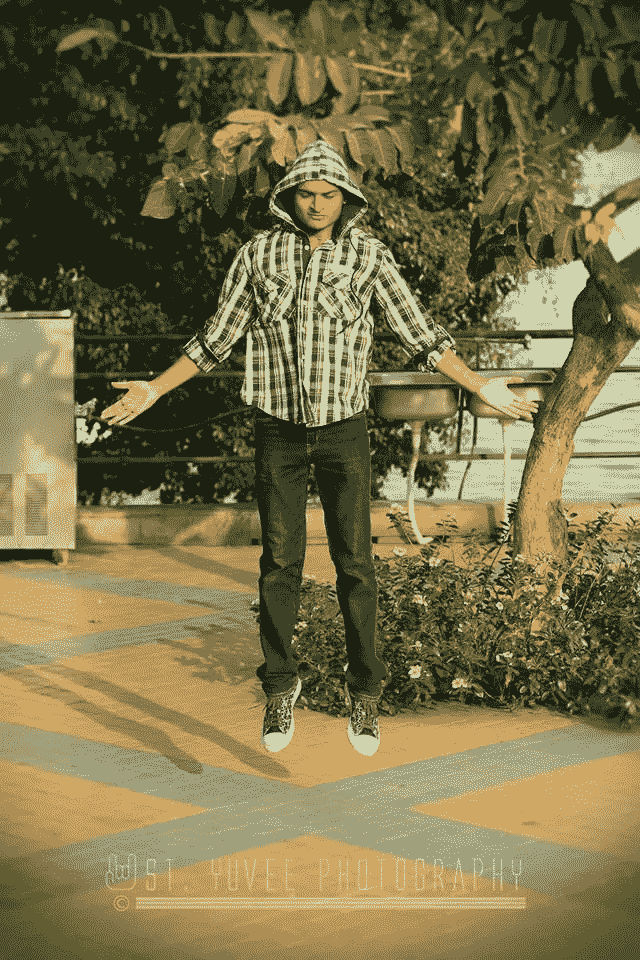

# 如何在巨大失败后重新开始你的生活

> 原文：<https://medium.com/swlh/how-to-restart-your-life-after-massive-failure-f98743cb9a50>

[Siddhant Kiishorre Instagram](http://instagram.com/kiishorre)

我 13 岁开始玩 DOTA 2(一款基于电脑的多人游戏)。当我 18 岁的时候，我是世界上排名最高的运动员之一。有些人和我处于同一水平，做着和我一样的事情，却挣着数百万美元。

我完全相信我的职业是游戏，直到我了解到在印度成为一名职业游戏玩家几乎是不可能的。这有两个主要原因——**游戏是一个禁忌，电子竞技世界很昂贵(至少在最初几年)。**

我心碎了。这是我人生中最糟糕的阶段之一。我已经为这个游戏付出了超过 10，000 个小时的生命，突然间我被告知所有这些小时的专注工作都是无用的，我必须从头再来。

老实说，接下来的几个月对我来说是最糟糕的。我觉得自己成了抑郁症的受害者。我过去一天只吃一次。我的信心被打破了，我的意志被粉碎了——我的内心已经死了。

一个晴朗的日子，我脑海里有个凄凉的声音在说——“你注定要做比这大得多的事情。”这个声音一天比一天大，越来越坚定。

*当我意识到我不能玩 Dota 2 这个游戏时，我决定让生活本身成为一个游戏*。现在英雄已经死了。**重启时间**。

我把那些负面情绪放在后座，开始变得有建设性。

有三件主要的事情帮助我重新开始了我的生活

## 结识新朋友

我是一个内向的人，认识新朋友的想法对我来说非常可怕。但是，我想无论如何都要试一试，就像《魅力无限》的查理要求我这样做一样。他不仅给了我一个解决方案，还告诉我如何去做。

令人惊讶的是，一个简单的遇见某人的行为可以让你的生活发生 180 度的转变。这发生在我参加沙发冲浪聚会的时候。这是我的第一次，令我惊讶的是，很多人也是第一次。我去那里喝了点饮料，吃了点小吃。

作为一个内向的人，我发现很难与他们交谈。谢天谢地，他们不像我一样害羞，正因为如此，他们设法与我进行了愉快的交谈。

> 与他们交谈后，我发现生活对几乎所有人都不公平。为了实现我不打算过的生活，他们做出了我不愿意的牺牲。

我把结识新朋友变成了一种习惯，就这样我遇到了一个很棒的人，并和他一起开始了我的新商业冒险——检查我的技术。

在人生的旅途中，我们会遇到很多人。每个人都有自己的人生目标。”

# 读书。读书。读书。

在我叔叔教了我阅读的 3 个原则后，我开始如饥似渴地看书。我从小说开始，但逐渐转向传记和自助书籍。当我读到**史蒂夫·乔布斯**T4【卡伦·布卢门撒尔】的《与众不同的人》时，我的生活发生了改变。乔布斯是被领养的，是个辍学生，没有钱，还是个嬉皮士。他从那里建立了一个价值十亿美元的公司。

> 自助书籍像砖块一样为我的生活添砖加瓦。我读的每一本书都让我变得更加坚强和稳定。

就在那时，我意识到过去最好留在它已经存在的地方——过去。

我继续前进，就像我之前提到的，我继续建立一个新的公司。

# 接受现实

这次故障之后，我就不再玩游戏了。甚至一个关于这个游戏的随意的 YouTube 视频都足以杀死我的整个感觉。我知道这是不对的，但不知何故我忍不住。

我认识了新的人，读了更多的书，然而我内心的某个地方受到了伤害。我的朋友告诉了我一件重要的事情，直到今天我还一直坚持着

> 他——你为什么不玩游戏了？
> 
> 我——再也做不下去了。需要关注更大的事情。
> 
> 他——你为什么要完全停下来？你在这方面很棒，你的头脑喜欢感受这种伟大的感觉。
> 
> 我——但是，未来没有范围！
> 
> 他——听说过“爱好”这个词吗？

**爱好**。我就是把 Dota 2 变成这样的。它不再是扼杀我共鸣的东西了。结果恰恰相反。

这就像在漫长的一天后喝杯啤酒。

我最大的挫折之一变成了我最好的动力之一。

在生活中，你会被打败、失望、破碎、伤害，甚至毁灭。这是你需要内心的冠军站出来走上舞台的时候。

**保持。搬家。向前。**

**感谢阅读。:)**

想成为更好版本的自己？

在这里给我写封邮件。

## 这个故事发表在 [The Startup](https://medium.com/swlh) 上，这是 Medium 最大的创业刊物，拥有 289，682+人关注。

## 在这里订阅接收[我们的头条新闻](http://growthsupply.com/the-startup-newsletter/)。

