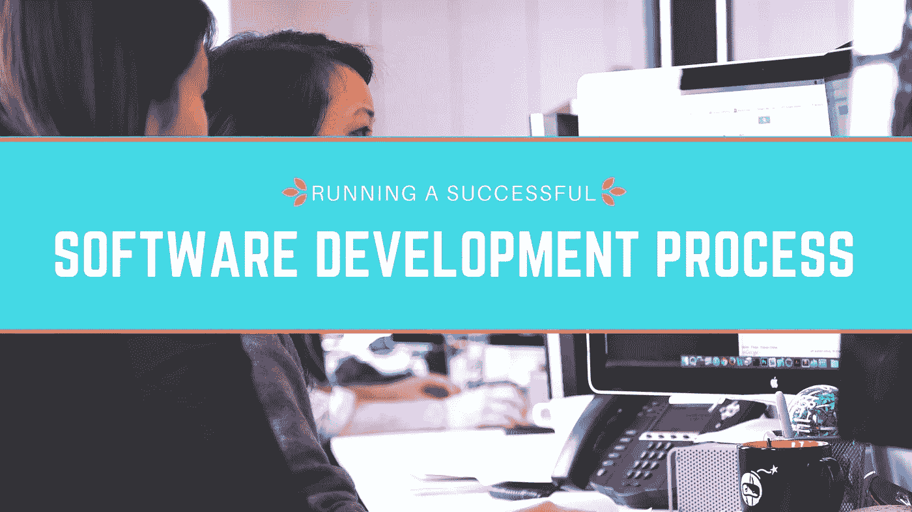

# 如何运行一个成功的软件开发过程

> 原文：<https://medium.com/swlh/how-to-run-a-successful-software-development-process-d0f417dc3514>

T 传统的[产品开发](https://www.cognitiveclouds.com/custom-software-development-services/web-application-development-company)通常以一种“正确”的方式进行，这使得可预测性和可复制性变得容易。然而，软件开发过程并不是一门精确的科学，只有一种正确的做事方法。软件开发过程很像艺术，有几种不同的方法来创造你的产品。

该领域的非技术领导者在[软件开发人员](https://www.cognitiveclouds.com/custom-software-development-services/saas-application-development-company)中名声不佳。但是你看，运行成功的软件发布的关键完全是非技术性的。关键是过程。这不是必须的，但是开发过程的某些部分确实受益于技术诀窍。将软件成功地发布到产品中不仅仅是代码或设计的问题，更是健壮的过程架构的问题。今天我们将讨论如何让产品从概念走向生产。

# 价值驱动的陈述

在我们开始之前，确保你的价值导向陈述如下所示:

***你的产品是 a:*** 说明你的产品是什么。

***有帮助:*** 你的目标受众是谁？

***解决:*** 你的目标受众体验到这款产品解决了哪些问题？

***By:*** 你的产品是如何解决的？

***搭配:*** 你的秘制酱是什么？

如果你基本上是为你的业务开发一个简单的附加组件，有些可能是多余的。但是当你尝试新事物时，这可以帮助你保持专注。

# 路线图

对于他们的代码，你的团队需要制定一个清晰的路线图。它必须包括一套示意图，每一个都有独立的用途。对于不同的应用，这些原理图是不同的。应用程序架构图、用户界面模型和业务流程模型是常见的。技术专家允许您更好地评估您团队的架构，并确保他们使用这些原理图走在正确的道路上。这些图表将是至关重要的，即使不考虑技术技能。当谈到产品完成时，你可以在他们的帮助下引导富有成效的对话。这样你就不必猜测开发团队的“完成百分比”了。为了弄清楚产品离完成还有多远，您可以跟踪图上每一项的状态。根据团队完成之前组件的速度，您可以预测未来的速度。

# 对文档要一丝不苟

过程文档是一种以新的方式编写团队行为脚本的方法。特别是如果你是一个分散的团队，有一个地方让你的团队可以找到他们需要的东西，而不需要等待不同时区的其他成员在线回答他们的问题，这是非常重要的。此外，有一个错误数量的预开发文档，没有，但没有正确的数量。在你的团队坐下来编码之前，和他们一起找出可行的路线图。在您的开发过程中，第一个检查点将是审查该文档，并确保他们符合该协议。

# 你不必重新发明轮子

您需要确保您的团队专注于他们实际需要构建的东西。从定义现有产品的关键区别点开始。您团队的大部分精力和时间必须用于支持这种差异。

图表在这里应该会派上用场。你的申请包括注册和登录过程吗？一个日志组件？关键是你的团队尽可能使用已经存在的东西。然后迅速把所有的脚手架都搭建好，这样你就可以测试你的产品了。然后迭代，不用担心延迟生产准备，改变任何有助于进一步区分你的产品的东西。

# DevOps

现在，下一个检查点是，一旦您审查了计划的架构，就要找出他们计划从头构建的部分。然后确定您将使用的预构建技术，并与生产支持团队一起完成这些技术。

运营准备将是下一个检查点。DevOps 提到的秘方的很大一部分是确保生产支持团队在早期就参与进来。DevOps 是一种信念，其中生产运营团队和软件开发团队为了共同的目标而合作。优点包括可靠的代码、更快的发布，以及自动化带来的更多开发时间。这些好处都很棒，但它们是强大的沟通过程的结果。请记住，自动化是一项协作工作。

# 实施和测试

在这里，领导力所需的软技能完全盖过了任何技术技能。与您的实施团队合作，提出他们之间的分工过程。总会有一堆开发人员想从事所有有趣的工作，而忽略任何苦力工作。他们可能会争辩说，他们是最聪明的人，因此应该得到他们选择的任务。有些人会抵制改变，只坚持他们以前做过的同一种工作。公平分配工作是你应该努力带领你的团队去做的。推动每个人适当成长，并进行合作和分享。

# 迭代交付

通常，在敏捷开发过程中，您会将实现过程分成几个检查点，而不是一个截止日期。它们被称为迭代。参考您定义的路线图。在开始新的组件之前，确保您已经开始的至少是开发完成的。这降低了风险，并给你一个开发速度的准确描述。

当您完成迭代时，将代码推到验收测试的环境中。这包括与部分产品交互的测试或试点用户。他们进行测试，以确保它符合设计预期，并就如何改进给出反馈。但是验收测试不能代替单元测试。一旦您积累了足够多的测试代码，就可以开始发布管理过程了。

# 代码审查

因此，现在您的团队确信代码已经完成，验收测试人员确信产品正在以它应该的方式工作。下一个检查点是验证你的代码已经准备好成为产品了。如果你没有技术知识，你可能不愿意自己审查团队的代码，这没关系。你不需要。您的流程应该。与您的团队合作，提出适合他们的代码评审过程。通过跨团队合作建立一个同行代码评审计划。使用您的原理图作为参考点，要求他们解释代码如何实现原理图中列出的目标。在代码审查过程结束时，审查者和开发人员必须对代码负责感到满意。

这个代码审查也是审查安全性和文档的最佳时机。安全审查必须在任何代码审查中占有一席之地。这通常包括再次查看代码，以确定黑客可以控制服务器或利用它泄露私人数据的薄弱环节。如果您的开发人员只是运行一个自动化的安全代码分析工具，他们就可以处理这个问题。

# 最后一个检查站

该代码已通过审查过程。它已经准备好成为一个产品。但是它可能还没有准备好投入生产。你必须清除最后一个检查点，部署就绪。您的代码易于部署到生产环境中吗？这必须包括尽可能少的手动步骤。如果代码不起作用，您必须有一个计划来按计划恢复到变更或回滚计划。您的操作团队应该检查部署和回滚文档，并让您知道它是否足够。这一步可以自己做。但是要确保部署产品的说明清晰简单。应该有很少的手动步骤，因为每个手动步骤都有可能导致人为错误。一旦通过了这个检查点，就可以将代码投入生产了。

# 发布后

重要的是，一旦你完成了，回头回顾一下这个过程是如何进行的，是成功还是失败。测试是否正确地模拟了生产场景？你的团队是否正确地估计了发布一个产品所需的工作量？通过重新访问实现和测试检查点来检查团队的表现。产品在生产中运行情况如何？或许拜访一下运营团队，收集他们的反馈。这将在两个团队之间建立信任，从而带来更多的 DevOps 优势。最重要的是，确保你对自己和你的团队负责。随着你的团队逐渐习惯于对这一过程中的每一步负责，他们会相应地调整自己的表现。

# 结论

> 一个成功的软件发布包括一个很好理解的，很好记录的过程，通过管道将软件从想法转移到产品。你不需要大量的技术知识。通常，技术知识可能是一个支柱。

确保你和你的团队在一起，同时堵住漏洞，建立一个对你们所有人都有用的可重复的过程。它不需要对每个人都完美，但必须被每个人理解。此外，确保对产品的需求与你的产品通过检查点的速度相匹配。和任何过程一样，迭代。就像代码一样，你的第一份未经测试的草稿可能并不完美。在每次运行时调整过程，你将最终拥有一个可预测的、平滑的软件发布路径。

*原载于* [*产品洞察博客*](https://www.cognitiveclouds.com/insights/) *来自 cognitive clouds:Top*[*SaaS 发展公司*](http://Originally published on Product Insights Blog from CognitiveClouds: Top Node JS Development Company)

## 这个故事发表在 [The Startup](https://medium.com/swlh) 上，这是 Medium 最大的创业刊物，拥有 295，232+人关注。

## 在此订阅接收[我们的头条新闻](http://growthsupply.com/the-startup-newsletter/)。

