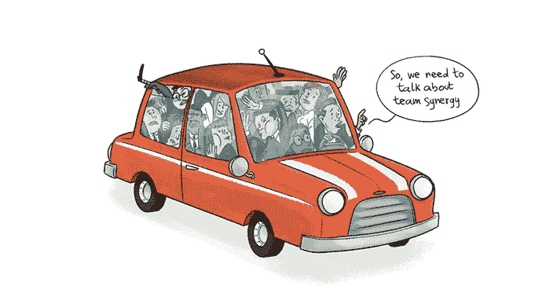
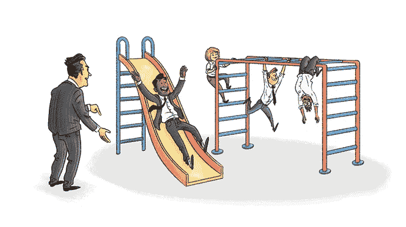
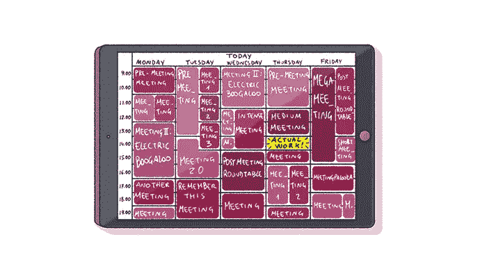

# 如何开一个糟糕的会议

> 原文：<https://medium.com/swlh/how-to-run-a-terrible-meeting-2a753dac99c8>

## 会议是我们不通灵的代价。以下是避免超支的方法。

计算浪费在会议上的工作时间是一件可悲的事情。在一个典型的职业生涯中，我们大多数人都经历了比好会议多得多的坏会议。

自从加入[Help Scout](https://www.helpscout.net/)以来，我对会议的期望有了很大提高，但即使在这里的时间也不足以提高我的终身平均赤字。我和你一样，更熟悉糟糕会议的蛛丝马迹，而不是那些运行良好的会议。

幸运的是，我至少获得了足够的经验来发现会议什么时候出错了。这里列出了一些你可能会无意中破坏下一次会议的善意方式。

# 邀请比你需要的更多的人

首先:把你队友的小丑车风格塞进你选择的会议室或 Google Hangout。

像所有这些例子一样，这个错误来自一个好地方。我们接受了两个脑袋比一个脑袋好的观点，所以额外的脑力肯定会带来更好、更多样化的头脑风暴。

在某种程度上是对的，但是有一个上限。我从未参加过违反杰夫·贝索斯[双披萨规则](http://www.fastcompany.com/3037542/productivity-hack-of-the-week-the-two-pizza-approach-to-productive-teamwork)的富有成效的会议，该规则本身就是为了保护亚马逊的会议规模而制定的。有既定的和[令人信服的文献](https://hbr.org/2012/08/why-less-is-more-in-teams/)表明，当与会者人数增长到两位数时，决策效率急剧下降。

我能想到三个原因:

1.  过多的意见不可避免地会导致对琐事的激烈争论。一般来说，增加团队的规模会降低团队的平均专业水平。
2.  更多的流动需要更多的组织，这滋生了更多的官僚主义。太多的人会迫使你依靠沉重的“过程”来维持会议。
3.  增加的产出并不能弥补社会闲散造成的产出损失。

一个常见的原因是不愿意派一个代表而不是整个团队。你听说过一个笑话，在另一个可能是电子邮件的会议中幸存下来，对吗？代表以类似的方式节省时间，将讨论的内容传递给不需要出席的人。

# 在会上做综合工作

会议对做决定或计划项目很有用。作为对比，每个文案都会告诉你最差的材料是由委员会制作的；团队更擅长将事物拼凑在一起，而不是创造出一个个的碎片。

尽管如此，我还是多次犯这种错误。所有这些“决定”都是令人鼓舞的，而“行动”也应该立即跟进，这似乎是很自然的。

我痛苦地认识到，虽然会议对于概述可以做什么很有用，但是对于在画布上画画却非常糟糕。当事情成形时，反馈就变得有意义了——即使它只是最终结果的一部分。

[合作是有限度的](http://www.economist.com/news/business/21688872-fashion-making-employees-collaborate-has-gone-too-far-collaboration-curse)。利用会议来规划路线，获得沿途的本能反应，并冲过终点线。不要用它们当场合成。独自创造，共同决定。

# 不要设定规则或硬性规定

没有人喜欢做一个规则传播者。你觉得自己像是合作中的坏脾气者，被派去监督所有不守规矩的孩子的保姆。

最重要的是，我们大多数人喜欢同事的陪伴，所以很容易让会议变得太不正式。轻松的心情会很快变成“无忧无虑”，然后变成“粗心大意”当会议没有被认真对待时，一大堆问题就会出现:

*   没有结构的表象，所以会议很快就变成了“代课老师的休息”
*   开始时间几乎被认为是可选的，这奖励了迟到者，惩罚了守时者。
*   没有任何东西被写下来或者给出一个截止日期。这导致了“会议宿醉”——后来意识到所有讨论的事情都将*而不是*由一个神奇的任务精灵完成。这是没有佳得乐疗法的。
*   时间是不被尊重的，所以没有人能够集中他们的思想或者有所准备的出现。这进一步浪费了时间，如循环提问、无线电静默和“让我检查一下”的时间。

所有这些都导致令人沮丧的会议，这些会议从来没有按照他们的既定议程进行，也很少达到他们想要的结果。

另一方面，当会议得到应有的严肃对待时，每个人都准备好充分利用它们。为了让人们保持诚实，你可以用“[结尾回合](/@ev/how-to-end-every-meeting-a0b7bc1eb86f#.nwg0dxck9)”来结束，其中包括简短、不间断的关于讨论进展的反馈。

# 坚持寻找一致意见

在一篇关于会议的文章中提出这样的建议似乎很奇怪，但这是真的。会议不是为了达成一致，而是为了达成一致——这两者之间存在着真正的差异。

结盟意味着你可以有所保留，甚至怀疑，但你选择了承诺和促进最终的决定。对齐总是必要的；[约定不是](https://www.helpscout.net/blog/candor-in-workplace/)。

你可能会笑，但我亲眼目睹了怀尔. e .那种郊狼般的固执，那是因为对方不投降就无法放手。这就是[会议主持人](http://jeffnielsen.com/what-every-meeting-needs/)变得特别有价值的地方。他们确保意见被听到，对提出的问题给予真诚的承认，然后打电话并推动每个人前进。

# 向你妥协

会议是工作场所的出气筒。当我们被繁忙的日历“棱镜监狱”弄得沮丧时，我们会对他们进行拍摄(我更喜欢用有趣和喜庆的色调来标记会议，比如“时间流逝”的蓝色和“哪里出错了”的红色)。

> *更严重的是，会议是我们为不通灵而支付的小额税款。*

我们可以少用一些，但我们永远也摆脱不了它们。除非人类决定整个“ [hivemind](https://aeon.co/essays/do-we-really-want-to-fuse-our-brains-together) ”的事情听起来很好，毕竟，我们总是需要召开会议，以便交流，合作，集思广益，提出，辩论，并共同建立我们的想法。会议对此有好处，所以我们最好充分利用它们。

[**格雷戈里·奇奥蒂**](https://medium.com/u/515997e8c7e3?source=post_page-----2a753dac99c8--------------------------------) *是一名作家兼内容营销经理，在 GregoryCiotti.com***出版每周时事通讯。*这个帖子的早期版本最初发表在* [**帮童军博客**](https://www.helpscout.net/blog/bad-meetings/) *上。***