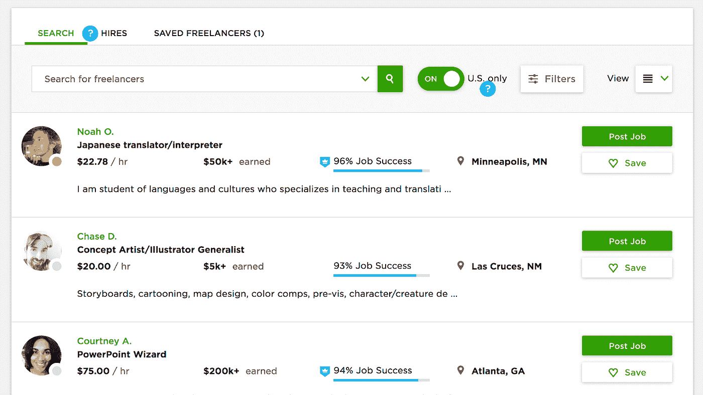
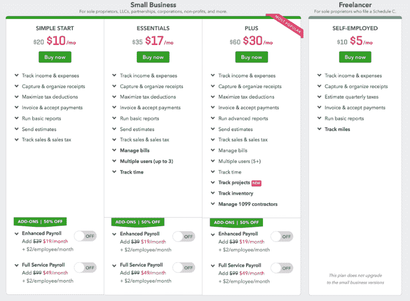
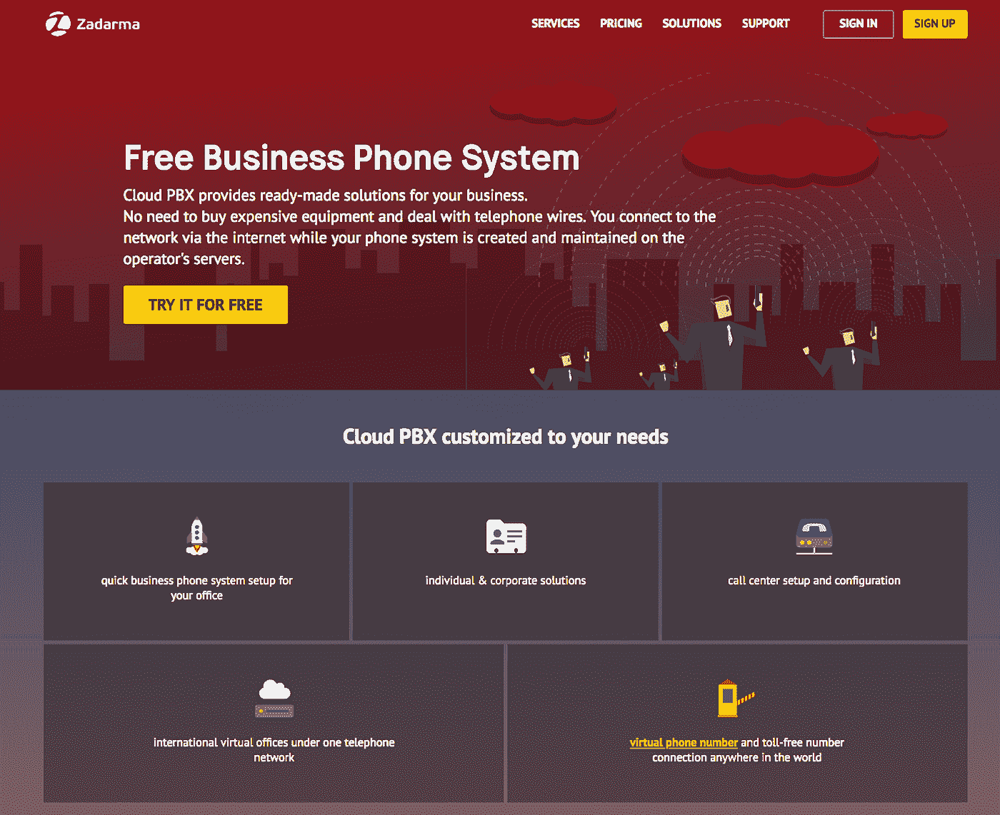

# 如何在创业过程中省钱:四种实用方法

> 原文：<https://medium.com/swlh/how-to-save-money-while-bootstrapping-a-startup-four-practical-ways-37882a6f204c>

*Image credit:* [*Unsplash*](https://unsplash.com/photos/QckxruozjRg)

风险投资、ICO 和众筹是创业公司获得资本的伟大工具，但不是每个年轻的公司都能成功使用它们。对于风险资本家或私人投资者来说，有成千上万的小企业或只是不够令人兴奋，无法投入资金，或让银行批准信贷额度。

这类公司的创始人必须自助，即在没有外部资金的情况下独立开发项目。这需要专注，不断寻找新的机会，并在业务发展上投入大量的努力。今天，我们将考虑几种在启动一家初创公司时保存现金的实用方法。

# 你不需要一间大办公室

当你马上开始创业时，你不太可能需要一间“真正的”办公室。有很多成功的公司都是从车库(苹果)或合作空间(Instagram 和优步)起步的。如今，甚至像微软这样的巨头也给他们的员工提供远程工作的机会[。根据盖洛普的一项 T4 调查，31%的美国雇员 80%到 100%的时间都在远程工作。这是因为他们的雇主明白远程工作有助于降低成本。](https://www.businessinsider.com/microsoft-new-york-workers-wework-2016-11)

WeWork co-working space | Image credit: [Unsplash](https://unsplash.com/photos/VGvRb8TQ7-k)

有很多合作空间，最著名的是 [WeWork](https://www.wework.com/) 和 [Regus](https://www.regus.com/) 。有可能你会很快在一个好地方找到一个体面的同事。这将有助于降低运营成本——这通常很难做到。您不仅可以节省租金，还可以节省整个办公基础设施，如电脑、咖啡和小吃以及维护服务。所有这些每月都要花费数千美元——每个人在共同工作空间的花费不会超过几百美元。显著差异。

# **雇佣承包商**

劳动力是任何企业的另一大开支来源。雇用全职员工有其明显的好处——在这种情况下，员工会感到与企业有更深的联系，获得增加动力的好处。但是 bootstrapped startup 就是负担不起这些。在新企业的最初几天，自由职业者或合同工可能是更好的选择。

首先，你会根据这些员工的表现来支付报酬，而不是在办公室的时间。第二，你将节省福利，在许多国家，光是医疗保险每月就要花费数百美元，而且雇主还要支付多种税。合同工和自由职业者自己负责他们的税收、保险和其他费用，这对创业公司来说要方便得多。

*Freelancer search on Upwork*

像 [Upwork](http://upwork.com/) 或 [Fiverr](https://www.fiverr.com/) 这样的网站为雇主提供了一个接触数千名专业从事多个领域的自由职业者和承包商的机会。

# **软件上的节省**

作为一名白手起家的初创企业创始人，你应该不断寻找拯救机会。这是一个好主意，研究你的业务的每个方面，试图找到改进的空间。在你通过合作和雇佣承包商来降低成本后，下一步可能是优化你使用的软件的成本。

比如会计。任何公司都需要软件来管理发票、工资单等。你可以去购买这种软件的许可证，然后你需要自己花时间或者雇佣一个会计来管理你在这个程序中的账目。

*Quickbooks plans*

这似乎是合乎逻辑的，但是像 Quickbooks 这样的软件供应商经常为他们可以提供给客户的一些解决方案提供会计免费许可证。这对这类公司来说是好事，因为这有助于他们最大限度地扩大覆盖面并获得新用户。对于创业公司来说，这是一件好事，因为你只需支付一次会计服务的费用，这种费用通常低于软件许可的费用。你将得到全面的保障并降低成本——这是每个初创公司创始人都应该追求的。

**降低沟通成本**

沟通对每个企业都至关重要，公司和客户之间的大量互动仍通过电话进行。建立自己的电信基础设施对一个初创公司来说可能是昂贵的，因为你要么必须获得一个放置设备的物理位置，购买硬件，设置它，提供备用连接通道，并找人来维护它。

*Zadarma Free PBX System*

如果你需要一个自己的呼叫中心打陌生电话，成百上千的现有和潜在客户给你回电，总成本对一个自举策略来说可能太高了。然而，有免费的解决方案，如 [Zadarma](https://zadarma.com/en/) 专用小交换机(PBX)系统。它有多种功能，包括 IVR，呼叫转移和转移或语音记录，将涵盖任何创业公司的 100%的需求。使用这种服务可以为你的企业节省高达 90%的安装电话费用。

# **最终想法**

任何一家新公司的早期总是很艰难。创业公司的创始人同时坐在几把椅子上开发产品，建立销售流程，同时优化他们看到的一切。使用上面描述的实用策略将帮助你成功地引导。

## 这篇文章发表在[《创业](https://medium.com/swlh)》上，这是 Medium 最大的创业刊物，有+ 371，663 人关注。

## 订阅接收[我们的头条新闻](http://growthsupply.com/the-startup-newsletter/)。

