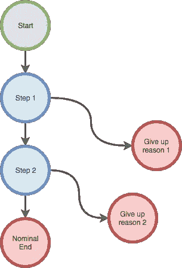
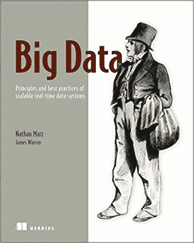
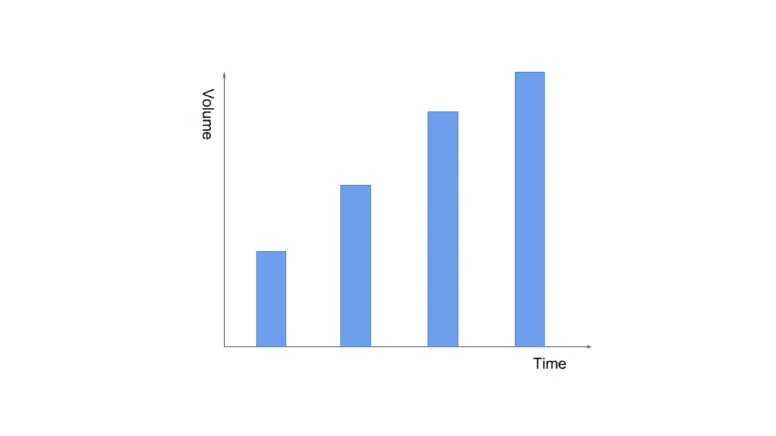
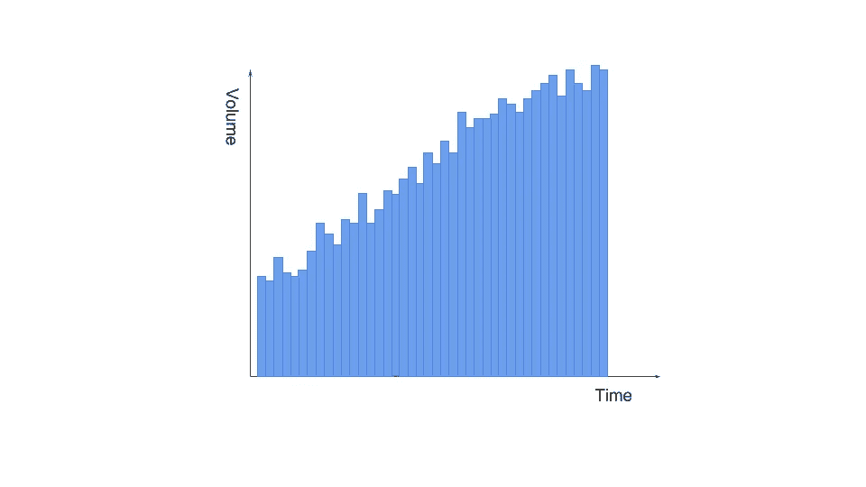
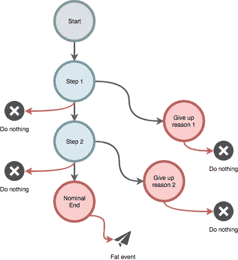
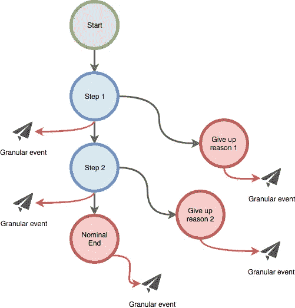
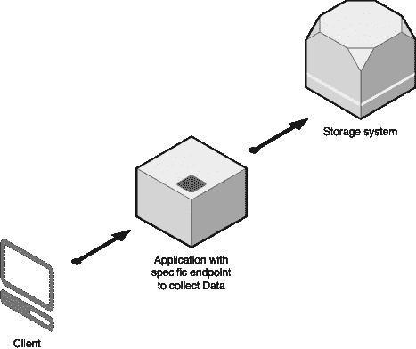
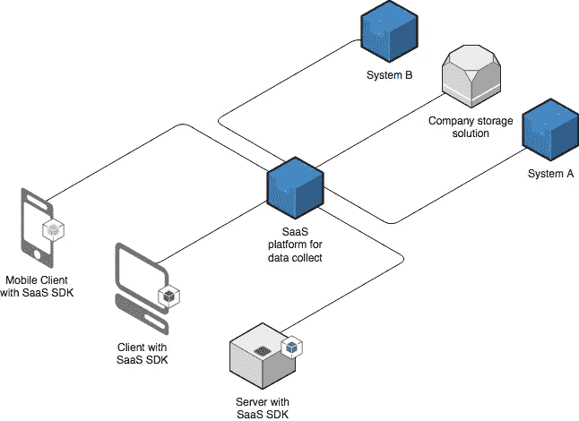
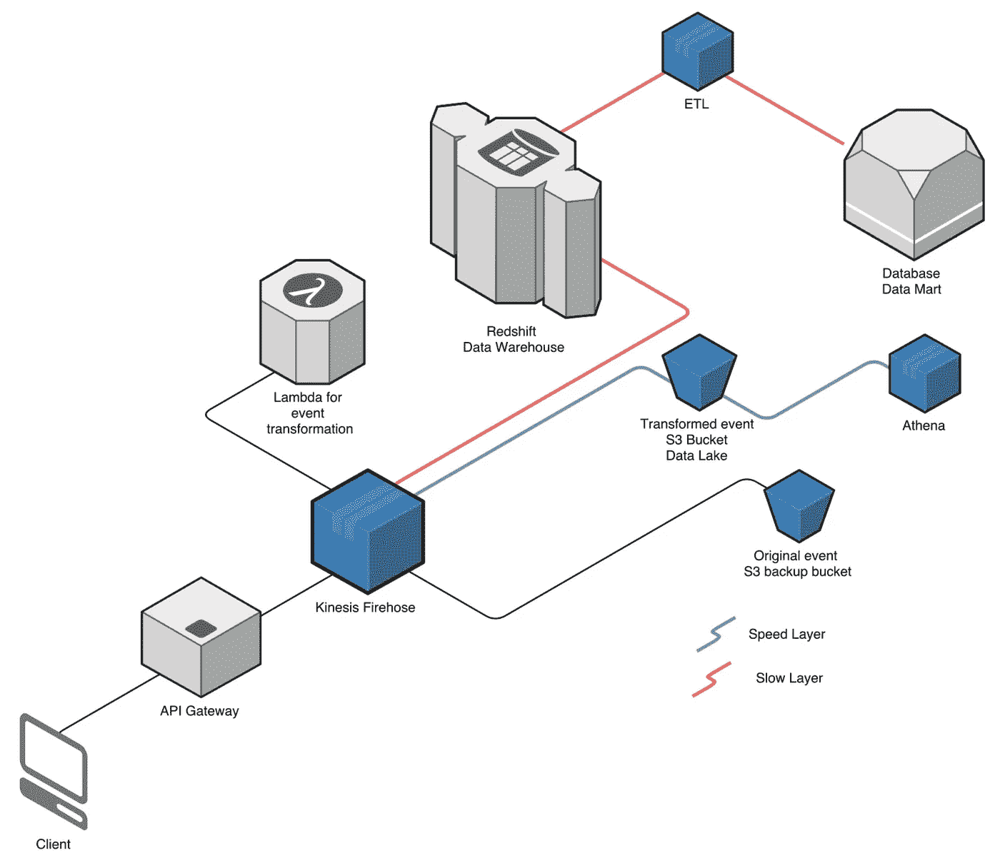

# 如何扩展数据管理？

> 原文：<https://medium.com/swlh/how-to-scale-data-management-5bad3f5f26b5>

Collecting data is serious matter — with no data, no good decisions — Courtesy of [Quotefancy](https://quotefancy.com/quote/1163033/Philip-K-Dick-Don-t-try-to-solve-serious-matters-in-the-middle-of-the-night)

当开始一项商业冒险时，你可能收集的数据是非常重要的，因为它将引导你对你的产品和业务的看法。数据给你间接的反馈，告诉你人们如何使用你的平台，如何消费它。当在数据团队中成长时，您将面临从原始数据和基本分析到构建全球治理仪表板的新挑战。

很容易获得一些免费的分析工具，并在您的不同客户端实现它，并对用户浏览路径或数量进行基本分析。

管理所有这些数据会有困难:

*   从这些免费工具中收集数据:这将是昂贵的或有限的；
*   **标准化**一切:你需要编写转换宏或任何东西来丰富和修正你的数据；
*   处理**几个数据源**，因为所有这些免费工具都是专门针对特定数据收集的(仅限移动设备，仅限广告等)。);
*   处理**几个目的地**一旦你收集了数据；
*   处理**数据的可用性、一致性和新鲜度**；

在这篇文章中，我描述了为什么根据贵公司的需求、技能和成熟度将**重点放在**正确的数据级别上是很重要的。我们还将讨论**解决方案**以及如何实施，这可能会让您很好地了解目前有哪些**选项**可以解决所有这些问题。

# 大数据的大计划

执行委员会会议记录:

> 我们有一个大数据的大计划，我们将入侵市场，为我们的用户提供最好的产品，并实现收入最大化。
> 
> 我们将收集一切信息，从 FB Connect 到强大的个人数据，并实时利用这些信息从我们的平台获得反馈，这样用户就可以更积极地参与，转化率将提高到 80%。
> 
> 过去 5 年的报告显示，我们的表现非常出色。我们可以计算任何指标，因为我们知道数据的语义。我们用这些数据来预测明年的趋势。

这或多或少是数字创业者/ C 级在数据视角上的信仰之举。我们知道我们想要什么，现在我们必须明白如何得到它。

有些人可能认为，当你在一个小公司时，数据驱动的方式太多了，这是完全错误的。数据是你汽车的轮子，没有它你不能开车，你只能去你的汽车决定的地方。

在接下来的部分中，我给出了理解数据驱动方法的要点，以及您在公司处理数据的过程中可能遇到的所有问题。

## 公司重要约束

首先，您必须了解公司中数据项目的隐含约束，这是数据管理的第一个刹车:

*   **成本**:要花钱，不免费:不是因为实现简单才免费。您必须考虑开发/运营人员实施和设计解决方案的时间；
*   **可用性**:解决方案必须是可用的，并且应该在适当的时间框架内产生数据分析，否则是无用的；
*   **可扩展性**:解决方案要处理大量大量的数据；

数据不是一个可以放在一边处理的课题，它是*严重的*、*笨重的*和有些时候*棘手的*。因此，它真的应该与所有利益相关者讨论，并作为一个真正的项目开始(而不是 Android 新版本的一个功能)。

## 产品和业务数据驱动的方法

第二步是了解谁将消费平台用户生成的数据。根据我的经验，有两种方法:

*   **产品团队**:我想知道**我的用户如何消费**他的产品，为什么他们在第 2 步停止，为什么另一个人完成了行动的完整路径；我想知道如何让更多的用户使用我的产品；
*   **业务团队**:我想知道如何**最大化总市值**，了解哪些商业行为可以用在用户身上**更有效地转化**；

那些团队基本上是试图用那些度量来证明他们的存在。摄入量不一定是一致的，但收集的数据应考虑两个方面。整合这两种方法的一种方式是从*消费路径*设计数据生成，这非常类似于经典的电子商务漏斗，但应用于你产品的每个功能。

Consumption path for a feature

通过这种方式，你可以对你的消费进行细分，找出成功的原因(*名义路径*)和放弃的原因(*放弃路径*)，最终得到既让用户热情又让客户满意的核心产品。

## 大数据的最新发展水平

有很多关于这个主题的文献，但是有一位作者， [Nathan Marz](http://nathanmarz.com/) ，他的书[Big Data:Principles and best practices of scalable real-time Data systems](https://www.amazon.com/Big-Data-Principles-practices-scalable/dp/1617290343/ref=sr_1_1?ie=UTF8&qid=1511360864&sr=8-1&keywords=Principles+and+Best+Practices+of+Scalable+Real-time+Data+Systems)已经达到了先驱的地位。

公司不断发展，大数据自动化给数据消费带来了一些安慰。数据新鲜度分为两类，*热*和*冷*数据。**热**数据被认为是刚出炉的。另一方面，冷数据是你放在冰箱里以备后用的东西。这一区别很重要，因为数据收集可能没有区别，但数据汇总、丰富和合成应该有区别。

内森·马兹区分两个*层*:

*   **慢**层，是过去几十年的经典数据管理(商业智能、批处理等)；
*   **速度**层，这是一种数据管理的流方法，允许在数据摄取期间直接访问数据(想想 Google Analytics 中的实时组件)；

对公司的**数据核心流程**也有影响。

**慢层**处理核心业务数据，与资金、用户、收购相关，所有指标都是一个正派投资者在投资前应该考虑的。这是真实的东西，它必须是严格和不可改变的。实施起来*慢*。

**速度层**，*相反*，是建立新指标或观察特定行为以确定趋势或证实直觉的完美领域。

然后，我们考虑数据的三个阶段:

*   **数据湖**:原始(和*野生*)数据，可以在那里钓鱼，得到一条野生鱼；

*   **数据仓库**:数据已经被工业收集和处理，但仍然是从语义的低层次，你可以从冰箱里拿出一条冷冻鱼；

*   **数据集市**:数据被品牌化并伴随着它的故事和额外的内容，你拿一包[伊格洛船长的](https://www.nomadfoodseurope.com/brands/iglo)。

数据湖是**引用**并且收集纯数据，没有改变。其他阶段是完全可扩展的。

## 全球平台注意事项

最后，架构师读者会同意这样一个事实，即全球平台带来了新的数据量和新鲜度，使数据解决方案变得更加复杂。

**数据隔离事宜**

从技术的角度来看，我们应该考虑两种技术数据:对产品有用的数据，没有这些数据产品就无法工作，例如*用户评价*；以及为**分析和统计**目的构建或复制的数据。

关键是要持久地将这些数据分开，这样从产品和数据消费中摄取的数据就不会相互干扰。例如，数据管理团队的一个人要求更改产品，因为产品中显示的数据不是应该在数据端使用的数据。

这就是为什么用于分析目的的数据应该被**复制和隔离**。

**转变范式**

最后但同样重要的是，数据管理已经从**离散**方法演变为**连续**方法。我为我亲爱的数学家读者们在语义上的不准确性道歉，我没有更好的术语来表达这个意思。

以前，工程师拍摄数据源(SQL 转储、静态文件等)中数据的快照，以整合某一时刻的数据状态。如果 1/您没有大量的数据，2/您没有很多来源，3/您不需要对数据进行复杂的请求，这是非常有效的。

Discrete approach on data consolidation

但是，如果您考虑数据的生命周期，您会注意到这些快照并不真正代表您的数据的生命周期，而只是该数据给定时刻的**即时图片**。您的分析将填补两个快照之间的空白。如果你的快照很遥远，你可能会丢失关于趋势的重要信息。

这就是为什么出现了全事件驱动模型，以便您的数据系统可以依赖于一种更连续的方法。因为最重要的不是知道数据的状态(即指标= 42)，而主要是它的趋势(指标快速增长+25%)。事件驱动模型为您提供了**粒度**和**松耦合**以达到**模块化细化数据**。通过这种方式，它也很好地设计了业务和产品团队的消费路径。

Continuous (aka more discrete with higher granularity) approach for data collection

在设计活动时，你越精确、越通用，你就能获得越多的信息用于以后的分析。

这种方法完全符合上面描述的消费路径，并且对要标记的内容赋予了更多的语义权重。

On classic tagging, events are collected at the end and not along the user journey which results to fat event

On extreme tagging, events are sent along the user journey and you should recreate the previous fat event from collected data

在这一节中，我将介绍一些常见数据架构的解决方案。这里的目的是介绍解决方案的选择，该解决方案与 IT 和业务团队所需的**技能**或实施该解决方案的**努力**有关。

## 无法估量的事物

我们可以考虑对数据收集有实际限制的一些方面:

*   标签计划和事件实现是公司的真正成本，而且**开发者讨厌这样做**；
*   测试和证明一切设置正确需要很长时间；
*   **客户端技术**，特别是在不总是在 wifi 上的移动设备上，可能**难以收集数据**，因此尽早考虑使用特定的 SDK 或[标签管理器](https://www.google.com/analytics/tag-manager/)。

## 自己做

创建一个小的标签系统很容易，你需要:

*   客户端库；
*   接收数据的端点；
*   可查询的良好存储解决方案；

Tag is simple — just need an API and a DB

客户端库将被加载并连接到你想听的内容，例如用户点击一个按钮。当用户这样做时，您收集关于它的信息(哪个用户，哪个按钮)并构建一个事件对象。

该库将向端点发送事件，端点就像 REST API 端点一样简单，并将数据存储在数据库或 nosql 系统中。

**优点**

*   易于实施和维护；
*   不贵；
*   不需要特定的技能，一个网站开发者就可以做到；

**缺点**

*   不太适合高可用性:当太多的请求到达端点时，写下所有内容需要时间，客户端将不得不等待来自该服务的响应；
*   随着事件数量的增加，你的存储系统将会快速增长，如果你想维持一个有效的系统，你将不得不*忘记*一些数据；
*   如果你添加一些源，你将不得不在你的系统中编码特定的集成并处理来自不同提供者的几种格式，这也将有助于使你的存储不断增长；
*   它对于一个由业务和产品人员组成的小团队来说也是完美的，超过两个人和复杂的请求会使这个解决方案失败；

这对于想要开始收集数据但没有资源的初创公司来说是完美的。

## 使用 SaaS 解决方案

该解决方案依赖于 SaaS 解决方案的使用，该解决方案有助于以多种方式处理数据收集，并提供:

*   SDK 在您的产品中快速实现他们的解决方案；
*   平台访问和托管，因此您可以依赖高效的基础架构；
*   开箱即用的集成，可插入其他系统

您的客户端使用 SDK 在已经设计好的事件中输入数据。SDK 无缝地向平台发送事件。平台在源和目的地之间分发数据。

**优点**

*   为您处理复杂的基础设施；
*   节省你自己做整合的时间；
*   确保您不丢失数据；
*   以某种方式为你的事件提供了一个统一的格式；
*   仍然需要你有一套基本的工程技能来实现它；
*   帮助你测试很多基于数据的营销/广告解决方案，而没有真正整合它们；

**缺点**

*   这些系统上的集成有时并不总是完整的，因此您必须观察您的源/目标系统是否完全受支持或兼容；
*   在投入生产之前很难进行测试；
*   它很贵，而且价格会随着你的用户或你的独立账户而变化(例如一个账户=一个国家)；
*   它没有解决数据膨胀的问题；

这对于一个开始有真正的数据管理和生命周期的公司来说是完美的。不处理数据会导致公司做出错误的决策，这一点非常重要。然而，这很复杂，我们没有时间做这个，所以我们需要尽快收集昨天的数据。

## 集成云平台

最后一个解决方案是完全集成云平台，我在这里给出了一个在 AWS 上可以做什么的例子，因为这是我所知道的最多的，但你肯定可以在其他平台上找到等效的解决方案。

[API 网关](http://docs.aws.amazon.com/apigateway/latest/developerguide/getting-started.html)被配置为从您的客户端接收特定事件。 [Kinesis Firehose](http://docs.aws.amazon.com/firehose/latest/dev/what-is-this-service.html) 被设置为将事件流一分为二:一个用于 [S3](http://docs.aws.amazon.com/AmazonS3/latest/gsg/GetStartedWithS3.html) 上的冷数据(慢速层)，另一个用于名为 Redshift 的关系数据库。转换逻辑在[λ](http://docs.aws.amazon.com/lambda/latest/dg/welcome.html)函数中完成。

**优点**

*   软收集层和慢收集层由无服务器的 API Gateway、Firehose 和 lambda 处理；
*   这个解决方案是全球性的；
*   S3 是数据湖，所以它存储一切，而红移是数据仓库，它只收集最近 *x* 个月的数据(例如)。这解决了数据扩展问题；
*   完全弹性的系统，为您提供容错、高可用性、高性能、耐用性；
*   你大部分是为计算部分付费，你可以在预计的预算内处理慢速层和快速层；
*   一旦数据收集到你的红移内部，你可以将它再次调度到其他外部解决方案，你肯定会得到最新鲜的数据；

**缺点**

*   您需要云技术和强大的数据管理团队来设计和实现数据集市中的数据分析；

该解决方案适用于已经掌握数据的成熟公司。

# 结论

如果您不关注您真正需要的东西，数据管理可能会很复杂。这里的主要陷阱是*想要现在的每个数据*。这导致了对数据多样性的关注，而没有考虑解决方案是否被设计为在越来越高的收集量上承担负载。从小处着手，经常改变。

摄入矛盾可能是另一个问题，因为你将不得不处理业务和生产范围的战争。数据隔离和事件方法应该让每个人都参与进来。

工业提炼不同阶段的数据摄取是另一个严重的问题，因为您将花费大量时间来处理和撤销数据。数据仓库是数据的基础，无论如何，你都应该以此为起点，因为所有其他阶段都是由收集的数据生成的。

考虑免费工装，DIY，SaaS 或者云解决方案，根据你的需求和成熟度，你要考虑两个方面:*安全性*和*可用性*。

随着您的业务团队在您的数据仓库之上连接大量数据营销和分析工具，大量数据开始超出公司的范围。这是一个主要问题，因为你可能整天听到数据泄露和破坏。

另一点，可用性，也可能是该公司的一个难题。托管大数据解决方案是一项真正的工作，而不是应该在桌角上完成的事情。

云提供商已经认识到这一点，并提供越来越多的 PaaS 解决方案来简化这种托管，在您自己的基础设施中，通过这种方式保证最佳的安全性。你越早开始，就越好。

请随意评论并开始关于数据管理的讨论。

## 这个故事发表在 [The Startup](https://medium.com/swlh) 上，这是 Medium 最大的企业家出版物，拥有 270，416+人。

## 在此订阅接收[我们的头条新闻](http://growthsupply.com/the-startup-newsletter/)。

