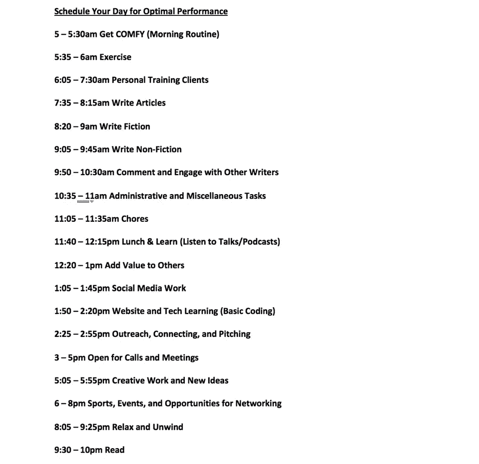

# 如何安排你的一天以获得最大的效率

> 原文：<https://medium.com/swlh/how-to-schedule-your-day-for-maximum-productivity-1b23b7f6a769>

## 最佳每日日历

“man playing laptop” by [Nathan Dumlao](https://unsplash.com/@nate_dumlao?utm_source=medium&utm_medium=referral) on [Unsplash](https://unsplash.com?utm_source=medium&utm_medium=referral)

对于创业者，尤其是第一次创业的创业者来说，最主要的挑战之一是在一个**你**创造投入和产出的环境中维持秩序。

*你自己创造* ***小时*** *。*

*你创造自己的* ***职业道德*** *。*

*你自己创建* ***输出*** *。*

*你自己创建* ***日程*** *。*

勇敢的创业让你超越世俗社会的传统规范，做一些点燃你内心绝对激情的事情。

*令人兴奋的是* ***。***

*是* ***肾上腺素。***

**但是**

*简直可以* ***让人望而生畏。***

*可以是* ***极度无组织。***

许多人冒险创业，是为了能够创造自己的时间，而不是被传统的朝九晚五的社会所束缚，这种社会一直在努力实现和坚持。这可能是开始时的主要吸引力，但很快这种自由变得低效。

## 比尔·盖茨和埃隆·马斯克计划着他们一天中的每一秒钟

世界上最成功的两位企业家都是深思熟虑的，一丝不苟地充分利用他们的时间。由于要经营多个公司和慈善机构，这两个人必须对他们选择参加的会议、选择进行的谈话和选择要见的人极其小心！

他们的日历被划分为 5 分钟的时间段，每个时间段有不同的行动。这导致了最强烈的关注，精确度和生产力。

## 理查德·布兰森把他的日程表安排得像一张待办事项清单

你不一定要成为一个科技企业家才会有繁忙的日程安排！亿万富翁首席执行官理查德·布兰森以待办事项清单的形式为自己创建任务。一旦他完成了清单上的任务，他的一天就结束了。这创造了结构，帮助我们确保实现我们的需求、愿望、目标和梦想。

# 企业家控制的混乱

我的一天被分成 19 个“时间段”, 19 个不同的“主题”,从 25 分钟到 90 分钟不等。我允许自己在每个类别之间有 5 分钟的休息时间，这对于避免过度劳累或压力过大是至关重要的。

我把时间花在身体健康、个人成长和发展、边学习边吃饭、放松、休息、人际关系和娱乐上。

这些都是我高中时期最活跃的时候的特征。我留出个人时间用于创造力和思想创造，为我提供了控制和自由的正确结合。

这是关键的方法论，是为什么，是让计划植物生长的种子。

> 根据你觉得最有效率、最投入和最成功的时间来安排你作为企业家的一天。

一旦你发现了这一点，剩下的就变得简单多了。

我每天花 12 个小时做与“工作”相关的事情，并且一周做 6 天，所以一周工作 72 个小时。

*我比以往更******富有成效*** *。***

***我比以往更有效率***。****

***我是* ***比以往更有创造力的*** *。***

***我是* ***比以往更有活力的*** *。***

***我正在* ***为我的事业创造比以往更多的机会*** *。***

***我比以往任何时候都***快乐。****

**我发现在构建你的一天时，不管它需要什么或看起来像什么，最重要的三个属性是强度、一致性和灵活性。**

## **强度**

**这些是 19 个不同类别的短爆发或冲刺。无论你分配给一项任务的时间是 5 分钟还是 500 分钟，你最好确保它是不间断的，专注于手头的主题。**

**安排大块的时间让你分心，比如看电视或玩电子游戏，但是不要偏离你必须做的事情和完成你必须完成的事情的时间。**

**这是你的生计，所以让我们珍惜时间。**

## **一致性**

**这不是一劳永逸的事情。这需要几天甚至几周的时间去适应，去适应，去养成习惯。这将需要纪律，承诺和重复，让你在几周内记住这一点。**

**坚持这个计划将会让你获得你渴望和应得的成功。开始的时候试着去做，找出什么是适合你的，但是一旦实验期结束，把这个时间表牢牢记在你的脑子里。**

## **灵活性(轻度灵活性)**

**蒂姆·费里斯是这部电影的超级粉丝。**

**古老的格言是正确的，作为一名企业家，没有特定的一天。但是，我们可以接近，这是这样做的方式。**

**电话可能会在不同的时间出现，会议可能会被安排，机会可能会出现在他们分配的区域之外，但请确保相应地调整。**

**要明白你的最佳时间表并不是一成不变的。**

**但是你偏离得越远，你就越接近那个无组织、过度工作、压力过大的企业家，他不能解释你生活中一天的内在运作。**

# **我的创业开端**

**我在 23 岁这个成熟的年龄开始创业。我写并出版了一本书,内容是关于如何克服压力和焦虑，以及如何从进门的那一刻起成为教室里最有效率的学生或办公室里最有效率的员工。**

**我在一家著名的餐饮集团做了 4 个月的管理工作，每天早上 6 点到晚上 8 点工作。**

**与我习惯的令人厌倦的时间相比，我作为企业家的最初几个月是辉煌的。我仍然醒得很早，因为我是一个早起的人，我四处乱逛了一会儿，在中午左右达到了我的创意高潮，产生了一些好的内容，建立了一些很酷的联系，开发了一些很酷的机会，然后又四处乱逛了一些。**

**我只是做做样子，但我并没有真正地*做任何事情。***

**前几天，一位有抱负的企业家兼作家问我，**

> **"对你来说，生活中典型的一天是什么样的？"**

**我用普通的企业家用语回应，**

> **“真的没有时间表，我戴着这么多帽子，每天每个小时都在变化。”**

**然后我突然想到。**

**这是我的问题。我对结构没有丝毫感觉。我每天都让它引导和控制我，而不是我引导和控制它。**

**高效的每日计划的基础是了解你在生活中什么时候最成功、最高效，什么时候表现最佳。对我来说，这是高中，所以我的 19 个周期的时间表模仿了我在那个年龄的成功。**

**这对于每个人来说都是不同的，但这是我对我如何以及何时最好地发挥作用的分析和解释，如果你和我有相似之处，如果你是一个企业家，需要在不确定的世界里多一点稳定性，**使用这种方法，和这个指南，或者至少是它的一些变体。****

# **增压你的日常工作！**

***想了解更多关于发现有创意、独特、有趣、让你更有效率、更有活力的日常事务的信息，请查看* [*这个*](http://getting-comfy.com/) *吧！***

****

## **这篇文章发表在 [The Startup](https://medium.com/swlh) 上，这是 Medium 最大的创业刊物，拥有+ 373，446 名读者。**

## **在这里订阅接收[我们的头条新闻](http://growthsupply.com/the-startup-newsletter/)。**

****